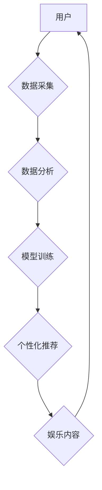

                 

## 数字化休闲：AI重塑娱乐方式

> 关键词：人工智能、娱乐、游戏、个性化推荐、虚拟现实、增强现实、机器学习、自然语言处理

### 1. 背景介绍

随着科技的飞速发展，人工智能（AI）正在深刻地改变着我们生活的方方面面，娱乐行业也不例外。传统娱乐方式逐渐被数字化休闲所取代，而AI技术的融入则赋予了数字化休闲全新的活力和可能性。

从智能推荐系统到沉浸式虚拟现实体验，从个性化游戏剧情到AI驱动的虚拟陪伴，AI正在重塑我们娱乐的方式，创造出更加丰富、互动和个性化的体验。

### 2. 核心概念与联系

**2.1 核心概念**

* **数字化休闲:** 指利用数字技术进行娱乐休闲活动，包括但不限于在线游戏、视频点播、音乐流媒体、社交娱乐等。
* **人工智能 (AI):**  模拟人类智能的计算机系统，能够学习、推理、决策和解决问题。

**2.2 AI与数字化休闲的联系**

AI技术为数字化休闲带来了革命性的改变，主要体现在以下几个方面：

* **个性化推荐:** AI算法能够分析用户的喜好和行为模式，精准推荐符合用户需求的娱乐内容，提升用户体验。
* **智能内容创作:** AI可以辅助创作游戏剧情、音乐、视频等娱乐内容，降低创作门槛，激发创意。
* **沉浸式体验:** AI技术可以增强虚拟现实和增强现实体验，创造更加逼真、互动和沉浸式的娱乐环境。
* **虚拟陪伴:** AI驱动的虚拟角色可以提供陪伴、聊天和互动等服务，满足用户社交和情感需求。

**2.3 AI在数字化休闲中的应用架构**



### 3. 核心算法原理 & 具体操作步骤

**3.1 算法原理概述**

在数字化休闲领域，AI算法主要包括：

* **机器学习 (ML):**  通过训练数据，让算法自动学习并改进其性能。
* **深度学习 (DL):**  一种更高级的机器学习方法，利用多层神经网络模拟人类大脑的学习过程。
* **自然语言处理 (NLP):**  使计算机能够理解和处理人类语言。

**3.2 算法步骤详解**

以个性化推荐为例，其算法步骤如下：

1. **数据采集:** 收集用户的娱乐行为数据，例如观看记录、游戏时长、评分等。
2. **数据预处理:** 清洗、转换和格式化数据，使其适合算法训练。
3. **特征提取:** 从数据中提取用户特征，例如喜好类型、观看习惯、游戏风格等。
4. **模型训练:** 利用机器学习算法，训练一个推荐模型，将用户特征与娱乐内容进行匹配。
5. **预测和推荐:**  根据用户的最新行为数据，模型预测用户可能感兴趣的内容，并进行推荐。

**3.3 算法优缺点**

* **优点:** 能够精准推荐用户感兴趣的内容，提升用户体验，提高用户粘性。
* **缺点:** 需要大量数据进行训练，算法模型可能存在偏差，推荐结果可能不够准确。

**3.4 算法应用领域**

* **在线视频平台:**  推荐影视剧、综艺节目、纪录片等。
* **音乐流媒体平台:**  推荐歌曲、专辑、音乐人等。
* **游戏平台:**  推荐游戏类型、游戏角色、游戏道具等。
* **社交媒体平台:**  推荐好友、话题、群组等。

### 4. 数学模型和公式 & 详细讲解 & 举例说明

**4.1 数学模型构建**

在个性化推荐系统中，常用的数学模型包括协同过滤和内容过滤。

* **协同过滤:**  基于用户的行为相似性进行推荐。假设用户A和用户B都喜欢电影X，那么用户A可能也喜欢电影Y，而用户B也喜欢电影Y。

* **内容过滤:**  基于娱乐内容的特征进行推荐。例如，如果用户喜欢动作片，那么系统会推荐其他动作片。

**4.2 公式推导过程**

协同过滤算法中，常用的公式是用户-物品评分矩阵的预测公式：

$$
\hat{r}_{ui} = \bar{r}_u + \frac{\sum_{j \in N(u)} (r_{uj} - \bar{r}_u) \cdot s_{ij}}{\sum_{j \in N(u)} s_{ij}}
$$

其中：

* $\hat{r}_{ui}$:  预测用户u对物品i的评分。
* $\bar{r}_u$:  用户u的平均评分。
* $r_{uj}$:  用户u对物品j的实际评分。
* $N(u)$:  用户u评分过的物品集合。
* $s_{ij}$:  物品i和物品j之间的相似度。

**4.3 案例分析与讲解**

假设用户A和用户B都评分过电影X和电影Y，并且用户A对电影X的评分为5，用户B对电影X的评分为4，用户A对电影Y的评分为3，用户B对电影Y的评分为4。

根据协同过滤算法，我们可以计算出用户A对电影Y的预测评分：

$$
\hat{r}_{A,Y} = \bar{r}_A + \frac{(r_{A,X} - \bar{r}_A) \cdot s_{X,Y}}{(r_{A,X} - \bar{r}_A) + (r_{B,X} - \bar{r}_B)}
$$

其中，$s_{X,Y}$是电影X和电影Y之间的相似度。

### 5. 项目实践：代码实例和详细解释说明

**5.1 开发环境搭建**

* 操作系统: Ubuntu 20.04
* Python 版本: 3.8
* 必要的库: numpy, pandas, scikit-learn

**5.2 源代码详细实现**

```python
import pandas as pd
from sklearn.metrics.pairwise import cosine_similarity

# 加载用户-物品评分数据
ratings_data = pd.read_csv('ratings.csv')

# 计算用户-物品评分矩阵
user_item_matrix = ratings_data.pivot_table(index='user_id', columns='item_id', values='rating')

# 计算用户-用户相似度矩阵
user_similarity = cosine_similarity(user_item_matrix)

# 预测用户对物品的评分
def predict_rating(user_id, item_id):
    # 获取用户评分过的物品
    rated_items = user_item_matrix.loc[user_id].nonzero()[0]
    # 计算用户与其他用户的相似度
    user_similarities = user_similarity[user_id]
    # 计算预测评分
    predicted_rating = (user_similarities * user_item_matrix.loc[rated_items, item_id]).sum() / user_similarities.sum()
    return predicted_rating

# 预测用户1对物品2的评分
predicted_rating = predict_rating(1, 2)
print(f'预测用户1对物品2的评分: {predicted_rating}')
```

**5.3 代码解读与分析**

* 代码首先加载用户-物品评分数据，并构建用户-物品评分矩阵。
* 然后，使用余弦相似度计算用户之间的相似度矩阵。
* 预测评分函数 `predict_rating` 根据用户评分过的物品和用户相似度，计算用户对目标物品的预测评分。

**5.4 运行结果展示**

运行代码后，会输出用户1对物品2的预测评分。

### 6. 实际应用场景

**6.1 在线视频平台**

* **个性化推荐:**  根据用户的观看历史、评分和偏好，推荐符合用户口味的影视剧、综艺节目、纪录片等。
* **内容分类:**  利用机器学习算法，自动对视频内容进行分类，方便用户查找和浏览。
* **智能字幕:**  利用自然语言处理技术，自动生成视频字幕，提升用户体验。

**6.2 音乐流媒体平台**

* **个性化推荐:**  根据用户的音乐喜好、播放历史和评分，推荐符合用户口味的歌曲、专辑、音乐人等。
* **音乐分类:**  利用机器学习算法，自动对音乐进行分类，方便用户查找和浏览。
* **音乐创作辅助:**  利用AI技术，辅助音乐人创作音乐，例如生成旋律、伴奏等。

**6.3 游戏平台**

* **个性化游戏推荐:**  根据用户的游戏喜好、玩游戏时长和评分，推荐符合用户口味的游戏类型、游戏角色、游戏道具等。
* **游戏剧情生成:**  利用AI技术，辅助游戏开发者生成游戏剧情，提升游戏趣味性和可玩性。
* **AI驱动的游戏角色:**  利用AI技术，创造更加智能、逼真和互动性的游戏角色，提升游戏体验。

**6.4 未来应用展望**

随着AI技术的不断发展，其在数字化休闲领域的应用将更加广泛和深入。

* **沉浸式娱乐体验:**  AI将推动虚拟现实和增强现实技术的进步，创造更加逼真、互动和沉浸式的娱乐体验。
* **个性化内容创作:**  AI将更加辅助用户创作个性化娱乐内容，例如视频剪辑、音乐制作、游戏设计等。
* **虚拟陪伴:**  AI驱动的虚拟角色将更加智能和人性化，能够提供更加贴心的陪伴和互动服务。

### 7. 工具和资源推荐

**7.1 学习资源推荐**

* **在线课程:**  Coursera, edX, Udacity 等平台提供丰富的AI相关课程。
* **书籍:**  《深度学习》、《机器学习实战》、《自然语言处理》等书籍。
* **开源项目:**  TensorFlow, PyTorch, scikit-learn 等开源项目。

**7.2 开发工具推荐**

* **Python:**  人工智能开发的常用语言。
* **Jupyter Notebook:**  交互式编程环境，方便进行数据分析和模型开发。
* **TensorFlow:**  开源深度学习框架。
* **PyTorch:**  开源深度学习框架。

**7.3 相关论文推荐**

* **Attention Is All You Need:**  Transformer模型的论文。
* **BERT: Pre-training of Deep Bidirectional Transformers for Language Understanding:**  BERT模型的论文。
* **Generative Adversarial Networks:**  生成对抗网络的论文。

### 8. 总结：未来发展趋势与挑战

**8.1 研究成果总结**

AI技术在数字化休闲领域的应用取得了显著成果，例如精准推荐、智能内容创作、沉浸式体验等。

**8.2 未来发展趋势**

* **更个性化、更智能的体验:**  AI将更加深入地理解用户的需求和喜好，提供更加个性化和智能化的娱乐体验。
* **跨平台、跨设备的娱乐体验:**  AI将打破平台和设备的限制，提供更加无缝的娱乐体验。
* **增强现实和虚拟现实的融合:**  AI将推动AR和VR技术的融合，创造更加逼真、互动和沉浸式的娱乐体验。

**8.3 面临的挑战**

* **数据隐私和安全:**  AI算法需要大量数据进行训练，如何保护用户数据隐私和安全是一个重要的挑战。
* **算法偏见:**  AI算法可能存在偏见，导致推荐结果不公平或不准确。
* **伦理问题:**  AI驱动的虚拟角色可能会引发伦理问题，例如虚拟陪伴是否会让人产生依赖或情感困扰。

**8.4 研究展望**

未来，AI技术在数字化休闲领域的应用将更加广泛和深入，需要进一步研究以下问题：

* 如何开发更加公平、透明和可解释的AI算法。
* 如何更好地保护用户数据隐私和安全。
* 如何解决AI驱动的虚拟角色带来的伦理问题。


### 9. 附录：常见问题与解答

**9.1 如何选择合适的AI算法？**

选择合适的AI算法取决于具体的应用场景和数据特点。例如，对于个性化推荐，协同过滤和内容过滤都是常用的算法。

**9.2 如何评估AI算法的性能？**

常用的评估指标包括准确率、召回率、F1-score等。

**9.3 如何解决AI算法的偏见问题？**

可以通过数据预处理、算法设计和模型调优等方法来解决AI算法的偏见问题。

作者：禅与计算机程序设计艺术 / Zen and the Art of Computer Programming 


<end_of_turn>

