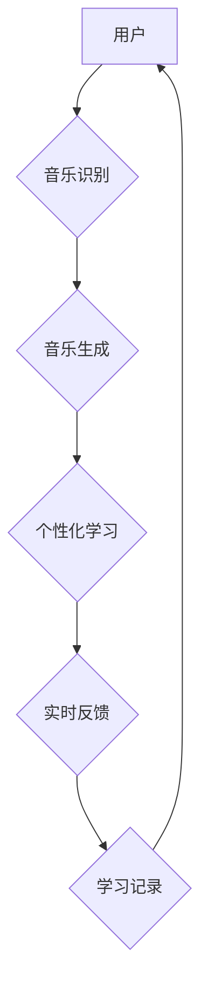

                 

## 数字化音乐教育创业：AI辅助的乐器学习

> 关键词：人工智能、音乐教育、乐器学习、AI辅助、深度学习、音乐生成、个性化学习

## 1. 背景介绍

音乐教育一直是人类文明的重要组成部分，它不仅能培养艺术素养，还能促进情感发展和认知能力提升。然而，传统音乐教育模式面临着诸多挑战：

* **门槛高：** 学习乐器需要专业的指导和大量的练习时间，对于许多人来说，门槛较高。
* **资源有限：** 优质的音乐教师和学习资源往往分布不均，许多地区缺乏专业的音乐教育机构。
* **学习效率低：** 传统教学模式难以针对每个学生的个性化需求进行定制化教学，学习效率相对较低。

随着人工智能技术的快速发展，AI辅助的音乐教育模式逐渐成为一种新的趋势。AI技术能够提供个性化学习方案、实时反馈和智能辅助，有效降低音乐学习的门槛，提高学习效率。

## 2. 核心概念与联系

AI辅助的乐器学习的核心概念包括：

* **音乐识别：** 利用深度学习算法识别乐器音符、节奏和旋律等音乐要素。
* **音乐生成：** 基于音乐识别结果，生成符合特定风格和要求的音乐片段。
* **个性化学习：** 根据学生的学习进度、能力和喜好，定制化学习方案和练习内容。
* **实时反馈：** 通过语音、文字或视觉方式，实时反馈学生的演奏情况，帮助学生及时纠正错误。

**AI辅助乐器学习架构**



## 3. 核心算法原理 & 具体操作步骤

### 3.1  算法原理概述

AI辅助乐器学习的核心算法主要包括：

* **卷积神经网络 (CNN)：** 用于识别乐器音符、节奏和旋律等音乐要素。CNN能够自动学习音乐特征，并将其转化为可理解的数字表示。
* **循环神经网络 (RNN)：** 用于处理音乐序列数据，例如旋律、节奏和和声。RNN能够捕捉音乐序列中的时间依赖关系，理解音乐的结构和情感。
* **生成对抗网络 (GAN)：** 用于生成符合特定风格和要求的音乐片段。GAN由两个网络组成：生成器和鉴别器，它们相互竞争，最终生成逼真的音乐。

### 3.2  算法步骤详解

**音乐识别算法步骤：**

1. **音频预处理：** 将音频信号进行采样、滤波和归一化等处理，去除噪声和干扰。
2. **特征提取：** 使用CNN提取音频信号的时频特征，例如梅尔频率倒谱系数 (MFCC) 和音调特征。
3. **分类识别：** 将提取的特征输入到分类器中，例如支持向量机 (SVM) 或随机森林 (RF)，识别乐器音符、节奏和旋律等音乐要素。

**音乐生成算法步骤：**

1. **音乐风格分析：** 分析目标音乐风格的特征，例如节奏、旋律、和声和音色。
2. **音乐片段生成：** 使用RNN或GAN生成符合目标风格的音乐片段。
3. **音乐片段拼接：** 将多个音乐片段拼接在一起，形成完整的音乐作品。

**个性化学习算法步骤：**

1. **学生能力评估：** 通过测试和分析学生的演奏水平，评估学生的学习能力和进度。
2. **学习方案定制：** 根据学生的学习能力和喜好，定制化学习方案和练习内容。
3. **学习进度跟踪：** 跟踪学生的学习进度，并根据学生的表现调整学习方案。

### 3.3  算法优缺点

**优点：**

* **个性化学习：** AI算法能够根据学生的个性化需求进行定制化教学，提高学习效率。
* **实时反馈：** AI系统能够实时反馈学生的演奏情况，帮助学生及时纠正错误。
* **降低门槛：** AI辅助的音乐教育模式能够降低音乐学习的门槛，让更多人有机会接触音乐。

**缺点：**

* **数据依赖：** AI算法需要大量的音乐数据进行训练，数据质量直接影响算法性能。
* **算法复杂度：** 一些AI算法的复杂度较高，需要强大的计算能力进行训练和推理。
* **缺乏情感理解：** AI系统目前还无法完全理解音乐的情感表达，难以提供情感上的指导。

### 3.4  算法应用领域

AI辅助的乐器学习算法在以下领域具有广泛的应用前景：

* **在线音乐教育平台：** 为学生提供个性化音乐学习方案和练习内容。
* **音乐游戏：** 提升音乐游戏的趣味性和互动性。
* **音乐创作工具：** 帮助音乐人创作新的音乐作品。
* **音乐治疗：** 用于辅助音乐治疗，帮助患者缓解压力和焦虑。

## 4. 数学模型和公式 & 详细讲解 & 举例说明

### 4.1  数学模型构建

音乐识别和生成算法通常基于深度学习模型，例如CNN和RNN。这些模型的数学基础是神经网络，其核心是权重和激活函数。

**神经网络模型**

神经网络模型由多个层组成，每层包含多个神经元。每个神经元接收来自上一层的输入信号，并通过权重进行加权求和，然后应用激活函数进行非线性变换，输出到下一层。

**激活函数**

激活函数的作用是引入非线性，使神经网络能够学习复杂的模式。常用的激活函数包括 sigmoid 函数、ReLU 函数和 tanh 函数。

**损失函数**

损失函数用于衡量模型预测结果与真实值的差异。常用的损失函数包括均方误差 (MSE) 和交叉熵损失 (CE)。

### 4.2  公式推导过程

**CNN中的卷积操作**

卷积操作是CNN的核心操作，用于提取图像特征。卷积操作的数学公式如下：

$$
y(i,j) = \sum_{m=0}^{M-1} \sum_{n=0}^{N-1} x(i+m,j+n) * w(m,n)
$$

其中：

* $y(i,j)$ 是卷积核输出的像素值。
* $x(i+m,j+n)$ 是输入图像的像素值。
* $w(m,n)$ 是卷积核的权重值。
* $M$ 和 $N$ 是卷积核的大小。

**RNN中的循环操作**

循环操作是RNN的核心操作，用于处理序列数据。循环操作的数学公式如下：

$$
h_t = f(W_{hh}h_{t-1} + W_{xh}x_t + b_h)
$$

其中：

* $h_t$ 是当前时间步的隐藏状态。
* $h_{t-1}$ 是前一个时间步的隐藏状态。
* $x_t$ 是当前时间步的输入。
* $W_{hh}$ 和 $W_{xh}$ 是权重矩阵。
* $b_h$ 是偏置项。
* $f$ 是激活函数。

### 4.3  案例分析与讲解

**音乐识别案例：**

使用CNN识别钢琴音符。训练数据包括钢琴音符的音频片段和对应的标签。模型训练完成后，可以将新的音频片段输入到模型中，识别出对应的音符。

**音乐生成案例：**

使用GAN生成符合古典音乐风格的音乐片段。训练数据包括大量的古典音乐作品。模型训练完成后，可以生成新的音乐片段，其风格与训练数据相似。

## 5. 项目实践：代码实例和详细解释说明

### 5.1  开发环境搭建

* **操作系统：** Ubuntu 18.04 或更高版本
* **编程语言：** Python 3.6 或更高版本
* **深度学习框架：** TensorFlow 或 PyTorch
* **音频处理库：** Librosa 或 PyDub

### 5.2  源代码详细实现

以下是一个使用 TensorFlow 实现音乐识别的简单代码示例：

```python
import tensorflow as tf

# 定义模型结构
model = tf.keras.models.Sequential([
    tf.keras.layers.Conv1D(filters=32, kernel_size=3, activation='relu', input_shape=(1024, 1)),
    tf.keras.layers.MaxPooling1D(pool_size=2),
    tf.keras.layers.Flatten(),
    tf.keras.layers.Dense(10, activation='softmax')
])

# 编译模型
model.compile(optimizer='adam',
              loss='sparse_categorical_crossentropy',
              metrics=['accuracy'])

# 训练模型
model.fit(x_train, y_train, epochs=10)

# 评估模型
loss, accuracy = model.evaluate(x_test, y_test)
print('Loss:', loss)
print('Accuracy:', accuracy)
```

### 5.3  代码解读与分析

* **模型结构：** 该模型是一个简单的 CNN 模型，包含一个卷积层、一个最大池化层、一个 Flatten 层和一个全连接层。
* **激活函数：** 使用 ReLU 激活函数，可以提高模型的学习能力。
* **损失函数：** 使用稀疏类别交叉熵损失函数，适合多分类问题。
* **优化器：** 使用 Adam 优化器，可以快速收敛。

### 5.4  运行结果展示

训练完成后，可以将模型应用于新的音频数据，识别出对应的音符。

## 6. 实际应用场景

AI辅助的乐器学习已经开始在一些实际场景中得到应用：

* **在线音乐教育平台：** 例如 Yousician 和 Simply Piano，提供个性化学习方案和实时反馈。
* **音乐游戏：** 例如 Guitar Hero 和 Rock Band，利用 AI 技术生成音乐和挑战玩家的演奏技巧。
* **音乐创作工具：** 例如 Amper Music 和 Jukebox，帮助音乐人创作新的音乐作品。

### 6.4  未来应用展望

AI辅助的乐器学习技术未来将朝着以下方向发展：

* **更精准的音乐识别：** 利用更先进的深度学习算法，识别出更细粒度的音乐要素，例如音色、力度和表情。
* **更逼真的音乐生成：** 利用 GAN 等生成模型，生成更逼真、更具情感表达力的音乐作品。
* **更个性化的学习体验：** 利用 AI 技术分析学生的学习风格和喜好，提供更个性化的学习方案和练习内容。
* **更丰富的交互方式：** 利用 VR/AR 技术，创造更沉浸式的音乐学习体验。

## 7. 工具和资源推荐

### 7.1  学习资源推荐

* **Coursera：** 提供深度学习和音乐信息处理相关的课程。
* **Udacity：** 提供 AI 和机器学习相关的课程。
* **Kaggle：** 提供音乐数据和竞赛平台。

### 7.2  开发工具推荐

* **TensorFlow：** 开源深度学习框架。
* **PyTorch：** 开源深度学习框架。
* **Librosa：** 音频处理库。
* **PyDub：** 音频处理库。

### 7.3  相关论文推荐

* **Deep Learning for Music Generation**
* **Music Information Retrieval: A Review**
* **Convolutional Neural Networks for Audio Classification**

## 8. 总结：未来发展趋势与挑战

### 8.1  研究成果总结

AI辅助的乐器学习技术取得了显著的进展，能够提供个性化学习方案、实时反馈和智能辅助，有效降低音乐学习的门槛，提高学习效率。

### 8.2  未来发展趋势

未来，AI辅助的乐器学习技术将朝着更精准的音乐识别、更逼真的音乐生成、更个性化的学习体验和更丰富的交互方式发展。

### 8.3  面临的挑战

AI辅助的乐器学习技术还面临着一些挑战：

* **数据质量：** AI算法需要大量的音乐数据进行训练，数据质量直接影响算法性能。
* **算法复杂度：** 一些AI算法的复杂度较高，需要强大的计算能力进行训练和推理。
* **缺乏情感理解：** AI系统目前还无法完全理解音乐的情感表达，难以提供情感上的指导。

### 8.4  研究展望

未来，需要进一步研究以下问题：

* 如何提高音乐数据的质量和多样性？
* 如何设计更有效的AI算法，降低算法复杂度？
* 如何让AI系统更好地理解和表达音乐的情感？


## 9. 附录：常见问题与解答

**Q1：AI辅助的乐器学习是否会取代传统音乐教育？**

A1：AI辅助的乐器学习可以作为一种补充方式，帮助学生更好地理解和掌握音乐知识，但它并不会完全取代传统音乐教育。传统音乐教育注重音乐理论、演奏技巧和艺术表达，而 AI辅助的乐器学习更侧重于技术和个性化学习。

**Q2：AI辅助的乐器学习需要哪些硬件设备？**

A2：AI辅助的乐器学习可以利用普通电脑或手机进行，不需要特殊的硬件设备。

**Q3：AI辅助的乐器学习适合哪些人？**

A3：AI辅助的乐器学习适合所有想学习乐器的人，无论年龄、经验或学习能力。

**作者：禅与计算机程序设计艺术 / Zen and the Art of Computer Programming**<end_of_turn>

