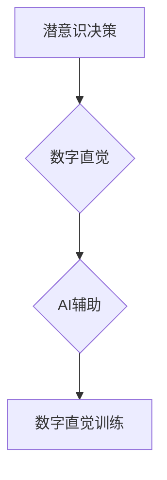

                 

## 数字直觉训练法：AI辅助的潜意识决策强化

> 关键词：人工智能、潜意识决策、直觉训练、神经网络、强化学习、决策优化、数字直觉

## 1. 背景介绍

在当今数据爆炸的时代，人类面临着前所未有的信息量和决策复杂度。传统的理性决策模型，依赖于逻辑推理和分析，在面对海量数据和瞬息万变的复杂环境时显得力不从心。越来越多的研究表明，潜意识决策在许多情况下能够比理性决策更快速、更准确地做出判断。然而，潜意识决策往往难以被理解和控制，其背后的机制也尚不明确。

数字直觉训练法试图通过人工智能技术，帮助人们训练和强化潜意识决策能力，从而提升决策效率和准确性。该方法的核心思想是利用人工智能算法，分析大量数据，识别潜在的决策模式和规律，并通过反馈机制，引导用户潜意识的学习和调整。

## 2. 核心概念与联系

### 2.1  潜意识决策

潜意识决策是指在个体意识不到的情况下，由潜意识进行的快速、自动的决策过程。它不受逻辑推理和理性分析的限制，往往基于直觉、经验和情感等非理性因素。

### 2.2  数字直觉

数字直觉是指在处理数字信息时，基于潜意识的快速、准确的判断和决策能力。它类似于人类在面对非数字信息时的直觉，但更侧重于对数字数据的理解和分析。

### 2.3  AI辅助

人工智能技术可以帮助我们分析海量数据，识别潜意识决策的模式和规律，并通过反馈机制，引导用户潜意识的学习和调整。

**核心概念与联系流程图**



## 3. 核心算法原理 & 具体操作步骤

### 3.1  算法原理概述

数字直觉训练法的核心算法基于强化学习和神经网络技术。强化学习算法通过奖励机制，引导智能体在环境中学习最优的行为策略。神经网络则模拟人类大脑的结构和功能，能够学习复杂的非线性关系。

结合这两个技术，数字直觉训练法可以构建一个闭环系统：

1. **数据收集:** 收集用户在处理数字信息时的决策数据，包括决策结果、时间、上下文等信息。
2. **模型训练:** 利用强化学习算法和神经网络模型，训练一个能够预测用户潜意识决策的模型。
3. **反馈机制:** 根据模型预测结果，向用户提供反馈信息，引导用户调整决策策略。
4. **迭代优化:** 通过不断收集数据、训练模型和提供反馈，逐步优化用户潜意识决策能力。

### 3.2  算法步骤详解

1. **数据预处理:** 对收集到的用户决策数据进行清洗、转换和特征提取，以便于模型训练。
2. **神经网络模型构建:** 选择合适的网络架构，例如卷积神经网络或循环神经网络，构建一个能够学习用户决策模式的模型。
3. **强化学习算法训练:** 利用强化学习算法，例如Q学习或深度Q网络，训练神经网络模型，使其能够预测用户潜意识决策的最佳选择。
4. **反馈机制设计:** 设计一个有效的反馈机制，根据模型预测结果，向用户提供个性化的建议和提示，引导用户调整决策策略。
5. **用户交互:** 用户在处理数字信息时，系统会根据模型预测结果，提供相应的反馈信息，帮助用户做出更准确的决策。
6. **模型更新:** 收集用户交互数据，并更新神经网络模型，使其能够更好地适应用户的决策模式。

### 3.3  算法优缺点

**优点:**

* **高效性:** 潜意识决策往往比理性决策更快，数字直觉训练法可以帮助用户提升决策效率。
* **准确性:** 潜意识决策往往能够识别出理性决策难以察觉的模式，数字直觉训练法可以帮助用户提高决策准确性。
* **个性化:** 数字直觉训练法可以根据用户的决策数据，提供个性化的反馈和建议，帮助用户找到最适合自己的决策策略。

**缺点:**

* **数据依赖:** 数字直觉训练法需要大量的用户决策数据进行训练，数据质量和数量直接影响模型的性能。
* **黑盒问题:** 神经网络模型的决策过程往往难以解释，难以理解模型是如何得出预测结果的。
* **伦理问题:** 数字直觉训练法可能会影响用户的自主决策能力，需要谨慎考虑其伦理 implications。

### 3.4  算法应用领域

数字直觉训练法在以下领域具有广泛的应用前景:

* **金融投资:** 帮助投资者识别市场趋势，做出更准确的投资决策。
* **医疗诊断:** 帮助医生更快、更准确地诊断疾病。
* **风险管理:** 帮助企业识别和应对潜在的风险。
* **营销决策:** 帮助企业更好地理解消费者需求，制定更有效的营销策略。

## 4. 数学模型和公式 & 详细讲解 & 举例说明

### 4.1  数学模型构建

数字直觉训练法的核心数学模型是基于强化学习的深度神经网络。该模型可以表示为一个状态-动作-奖励 (State-Action-Reward) 系统。

* **状态 (State):** 用户在处理数字信息时的上下文信息，例如数据类型、数据规模、时间限制等。
* **动作 (Action):** 用户在处理数字信息时的决策选择，例如选择哪种算法、设置哪些参数等。
* **奖励 (Reward):** 用户决策结果的反馈信息，例如决策是否正确、决策效率如何等。

### 4.2  公式推导过程

强化学习算法的目标是找到一个最优的策略，使得在给定的状态下，选择最优的动作能够获得最大的累积奖励。常用的强化学习算法包括 Q 学习和深度 Q 网络。

**Q 学习算法:**

$$Q(s,a) = Q(s,a) + \alpha [r + \gamma \max_{a'} Q(s',a') - Q(s,a)]$$

其中:

* $Q(s,a)$ 表示在状态 $s$ 下执行动作 $a$ 的价值函数。
* $\alpha$ 是学习率，控制着学习速度。
* $r$ 是当前状态下的奖励。
* $\gamma$ 是折扣因子，控制着未来奖励的权重。
* $s'$ 是执行动作 $a$ 后进入的下一个状态。
* $\max_{a'} Q(s',a')$ 是在下一个状态 $s'$ 下执行所有动作的价值函数的最大值。

**深度 Q 网络:**

深度 Q 网络将 Q 函数表示为一个深度神经网络，利用神经网络的非线性拟合能力，能够学习更复杂的决策策略。

### 4.3  案例分析与讲解

假设我们训练一个数字直觉训练模型，帮助用户识别股票价格的涨跌趋势。

1. **状态:** 用户输入股票代码、历史价格数据、市场新闻等信息。
2. **动作:** 用户选择买入、卖出或持有的决策。
3. **奖励:** 用户决策结果的收益率，例如股票价格上涨获得正收益，下跌获得负收益。

通过训练深度 Q 网络模型，我们可以学习到用户在不同状态下选择不同动作的价值函数。最终，模型能够预测用户潜意识决策的最佳选择，帮助用户做出更准确的股票投资决策。

## 5. 项目实践：代码实例和详细解释说明

### 5.1  开发环境搭建

数字直觉训练法的开发环境需要包含以下软件：

* Python 编程语言
* TensorFlow 或 PyTorch 深度学习框架
* Jupyter Notebook 或 VS Code 代码编辑器

### 5.2  源代码详细实现

以下是一个使用 TensorFlow 实现数字直觉训练法的简单代码示例：

```python
import tensorflow as tf

# 定义神经网络模型
model = tf.keras.models.Sequential([
    tf.keras.layers.Dense(64, activation='relu', input_shape=(input_dim,)),
    tf.keras.layers.Dense(32, activation='relu'),
    tf.keras.layers.Dense(num_actions)
])

# 定义损失函数和优化器
loss_fn = tf.keras.losses.CategoricalCrossentropy()
optimizer = tf.keras.optimizers.Adam()

# 训练模型
for epoch in range(num_epochs):
    for batch in dataset:
        with tf.GradientTape() as tape:
            predictions = model(batch['state'])
            loss = loss_fn(batch['action'], predictions)
        gradients = tape.gradient(loss, model.trainable_variables)
        optimizer.apply_gradients(zip(gradients, model.trainable_variables))

# 评估模型
accuracy = model.evaluate(test_dataset)
print('Accuracy:', accuracy)
```

### 5.3  代码解读与分析

这段代码定义了一个简单的深度神经网络模型，用于训练数字直觉。

* `input_dim` 表示输入数据的维度。
* `num_actions` 表示决策动作的数量。
* `num_epochs` 表示训练的轮数。
* `dataset` 表示训练数据。
* `test_dataset` 表示测试数据。

模型使用 `relu` 激活函数，并使用 `Adam` 优化器进行训练。损失函数使用 `CategoricalCrossentropy`，用于多分类问题。

### 5.4  运行结果展示

训练完成后，模型可以用来预测用户在不同状态下选择不同动作的价值函数。

## 6. 实际应用场景

数字直觉训练法在以下实际应用场景中展现出巨大的潜力:

### 6.1  金融投资

数字直觉训练模型可以帮助投资者识别股票、期货、外汇等金融资产的涨跌趋势，并做出更准确的投资决策。

### 6.2  医疗诊断

数字直觉训练模型可以帮助医生分析患者的病历、检查结果等信息，识别潜在的疾病风险，并做出更精准的诊断。

### 6.3  风险管理

数字直觉训练模型可以帮助企业识别和评估潜在的风险，制定更有效的风险管理策略。

### 6.4  未来应用展望

随着人工智能技术的不断发展，数字直觉训练法的应用场景将会更加广泛，例如：

* **自动驾驶:** 帮助自动驾驶系统识别道路状况，做出更安全、更智能的决策。
* **个性化教育:** 帮助教育系统根据学生的学习特点，提供个性化的学习方案。
* **智能客服:** 帮助客服系统更准确地理解用户的需求，提供更有效的服务。

## 7. 工具和资源推荐

### 7.1  学习资源推荐

* **书籍:**
    * 《深度学习》 by Ian Goodfellow, Yoshua Bengio, and Aaron Courville
    * 《强化学习：原理、算法和应用》 by Richard S. Sutton and Andrew G. Barto
* **在线课程:**
    * Coursera: Deep Learning Specialization
    * Udacity: Deep Learning Nanodegree
* **博客和论坛:**
    * TensorFlow Blog
    * PyTorch Blog
    * Reddit: r/MachineLearning

### 7.2  开发工具推荐

* **TensorFlow:** 开源深度学习框架，提供丰富的 API 和工具。
* **PyTorch:** 开源深度学习框架，以其灵活性和易用性而闻名。
* **Jupyter Notebook:** 用于交互式编程和数据可视化的工具。
* **VS Code:** 代码编辑器，支持多种编程语言和深度学习框架。

### 7.3  相关论文推荐

* **Deep Reinforcement Learning with Double Q-learning** by Hasselt, Guez, and Silver (2015)
* **Human-level control through deep reinforcement learning** by Mnih et al. (2015)
* **AlphaGo: Mastering the game of Go with deep neural networks and tree search** by Silver et al. (2016)

## 8. 总结：未来发展趋势与挑战

### 8.1  研究成果总结

数字直觉训练法是一个新兴的领域，近年来取得了显著的进展。研究人员已经开发出多种有效的算法和模型，并在多个应用场景中取得了成功。

### 8.2  未来发展趋势

未来，数字直觉训练法的研究将朝着以下几个方向发展:

* **更强大的模型:** 开发更深、更复杂的深度神经网络模型，能够学习更复杂的决策策略。
* **更有效的算法:** 研究更有效的强化学习算法，提高模型的训练效率和决策准确性。
* **更广泛的应用:** 将数字直觉训练法应用到更多领域，例如自动驾驶、个性化教育、智能客服等。

### 8.3  面临的挑战

数字直觉训练法也面临着一些挑战:

* **数据依赖:** 数字直觉训练法需要大量的用户决策数据进行训练，数据质量和数量直接影响模型的性能。
* **黑盒问题:** 深度神经网络模型的决策过程往往难以解释，难以理解模型是如何得出预测结果的。
* **伦理问题:** 数字直觉训练法可能会影响用户的自主决策能力，需要谨慎考虑其伦理 implications。

### 8.4  研究展望

尽管面临挑战，但数字直觉训练法仍然是一个充满希望的领域。随着人工智能技术的不断发展，相信数字直觉训练法将在未来发挥越来越重要的作用，帮助人类更高效、更智能地做出决策。

## 9. 附录：常见问题与解答

**Q1: 数字直觉训练法真的可以提高决策能力吗？**

A1: 理论上，数字直觉训练法可以通过强化学习和神经网络技术，帮助用户识别潜意识决策的模式和规律，从而提高决策能力。然而，实际效果还需要通过大量的实验和研究来验证。

**Q2: 数字直觉训练法会取代人类的决策能力吗？**

A2: 不，数字直觉训练法旨在辅助人类决策，而不是取代人类的决策能力。人类的决策能力仍然是不可替代的，因为它包含了丰富的经验、情感和伦理判断。

**Q3: 数字直觉训练法的伦理问题是什么？**

A3: 数字直觉训练法可能会影响用户的自主决策能力，例如，模型可能会引导用户做出与自身利益不符的决策。因此，我们需要谨慎考虑数字直觉训练法的伦理 implications，并制定相应的规范和制度。


作者：禅与计算机程序设计艺术 / Zen and the Art of Computer Programming<end_of_turn>

