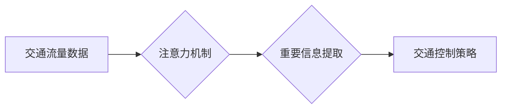

                 

## 智能城市交通系统的注意力管理

> 关键词：智能交通、注意力机制、深度学习、预测模型、交通流优化、城市规划

## 1. 背景介绍

随着城市化进程的加速，交通拥堵已成为全球性难题，给人们的生活和经济发展带来了巨大压力。智能城市交通系统 (Intelligent Transportation System, ITS) 应运而生，旨在通过信息技术和通信技术，提高交通效率、安全性和可持续性。

传统的交通管理系统主要依赖于静态的交通信号灯和人工干预，难以应对复杂的交通流量变化。近年来，深度学习等人工智能技术在交通领域取得了突破性进展，为智能交通系统的建设提供了新的思路。

注意力机制 (Attention Mechanism) 是深度学习领域的一项重要创新，它能够学习到输入数据中最重要的部分，并对这些部分给予更多的关注。在自然语言处理领域，注意力机制已取得了显著的成功，例如机器翻译、文本摘要等。

将注意力机制应用于智能交通系统，可以帮助系统更好地理解交通流量的复杂性，并针对不同情况采取更有效的控制策略。例如，注意力机制可以帮助交通信号灯根据实时交通流量情况动态调整绿灯时间，从而缓解拥堵；也可以帮助自动驾驶车辆识别周围环境中的重要信息，提高行驶安全性。

## 2. 核心概念与联系

### 2.1 智能交通系统

智能交通系统 (ITS) 是利用信息技术和通信技术，对交通系统进行智能化管理和控制的系统。ITS 的目标是提高交通效率、安全性和可持续性，并改善人们的出行体验。

ITS 的主要功能包括：

* 交通流量监测和预报
* 交通信号灯控制
* 道路安全监控
* 自动驾驶车辆管理
* 公共交通调度

### 2.2 注意力机制

注意力机制是一种模仿人类注意力机制的机器学习技术。它能够学习到输入数据中最重要的部分，并对这些部分给予更多的关注。

注意力机制的原理是通过一个“注意力权重”来衡量每个输入元素的重要性。注意力权重可以是通过训练得到的，也可以是基于特定规则计算的。

注意力机制的应用场景非常广泛，例如：

* 自然语言处理：机器翻译、文本摘要、问答系统
* 图像识别：目标检测、图像分割
* 语音识别：语音转文本

### 2.3  注意力机制在智能交通系统中的应用

将注意力机制应用于智能交通系统，可以帮助系统更好地理解交通流量的复杂性，并针对不同情况采取更有效的控制策略。

例如，注意力机制可以帮助交通信号灯根据实时交通流量情况动态调整绿灯时间，从而缓解拥堵；也可以帮助自动驾驶车辆识别周围环境中的重要信息，提高行驶安全性。

**Mermaid 流程图**



## 3. 核心算法原理 & 具体操作步骤

### 3.1 算法原理概述

注意力机制在智能交通系统中的应用主要基于深度学习算法，例如循环神经网络 (RNN) 和卷积神经网络 (CNN)。

注意力机制可以被集成到这些深度学习模型中，帮助模型更好地学习交通流量的时空特征。

例如，在交通流量预测模型中，注意力机制可以帮助模型关注过去一段时间内重要的交通流量数据，从而提高预测精度。

### 3.2 算法步骤详解

1. **数据预处理:** 收集交通流量数据，并进行清洗、格式化和特征提取等预处理操作。
2. **模型构建:** 选择合适的深度学习模型，例如 RNN 或 CNN，并集成注意力机制。
3. **模型训练:** 使用训练数据训练模型，并通过调整模型参数来优化模型性能。
4. **模型评估:** 使用测试数据评估模型性能，并根据评估结果进行模型调优。
5. **模型部署:** 将训练好的模型部署到实际应用场景中，例如交通信号灯控制系统或自动驾驶车辆系统。

### 3.3 算法优缺点

**优点:**

* 能够学习到交通流量数据中的重要信息，提高模型的预测精度和控制效果。
* 能够处理复杂的时间序列数据，例如交通流量变化。
* 能够适应不同的交通场景和需求。

**缺点:**

* 需要大量的训练数据才能达到较好的效果。
* 计算复杂度较高，需要较强的计算资源支持。
* 模型解释性较差，难以理解模型是如何做出决策的。

### 3.4 算法应用领域

* 交通流量预测
* 交通信号灯控制
* 自动驾驶车辆路径规划
* 公共交通调度
* 交通拥堵缓解

## 4. 数学模型和公式 & 详细讲解 & 举例说明

### 4.1 数学模型构建

注意力机制的核心是注意力权重，它用来衡量每个输入元素的重要性。

假设我们有一个长度为 $n$ 的输入序列 $x = (x_1, x_2, ..., x_n)$，我们想要学习一个注意力权重向量 $a = (a_1, a_2, ..., a_n)$，其中 $a_i$ 表示 $x_i$ 的注意力权重。

注意力权重可以根据以下公式计算:

$$a_i = \frac{exp(e_i)}{\sum_{j=1}^{n} exp(e_j)}$$

其中 $e_i$ 是每个输入元素 $x_i$ 的得分，可以由一个神经网络计算得到。

### 4.2 公式推导过程

注意力权重公式的推导过程如下:

1. 首先，我们需要计算每个输入元素 $x_i$ 的得分 $e_i$。

2. 然后，我们将每个得分 $e_i$ 通过 softmax 函数进行归一化，得到注意力权重 $a_i$。

3. Softmax 函数的公式如下:

$$softmax(x_i) = \frac{exp(x_i)}{\sum_{j=1}^{n} exp(x_j)}$$

### 4.3 案例分析与讲解

例如，在交通流量预测模型中，我们可以使用注意力机制来关注过去一段时间内重要的交通流量数据。

我们可以将过去 $T$ 个小时的交通流量数据作为输入序列，并使用一个神经网络计算每个小时的得分 $e_i$。

然后，我们可以使用注意力权重公式计算每个小时的注意力权重 $a_i$，并根据这些权重对交通流量数据进行加权平均，得到最终的预测结果。

## 5. 项目实践：代码实例和详细解释说明

### 5.1 开发环境搭建

* Python 3.6+
* TensorFlow 2.0+
* Keras 2.0+
* Jupyter Notebook

### 5.2 源代码详细实现

```python
import tensorflow as tf
from tensorflow.keras.models import Sequential
from tensorflow.keras.layers import LSTM, Dense, Attention

# 定义模型
model = Sequential()
model.add(LSTM(128, input_shape=(timesteps, features)))
model.add(Attention())
model.add(Dense(1))

# 编译模型
model.compile(optimizer='adam', loss='mse')

# 训练模型
model.fit(X_train, y_train, epochs=10)

# 预测
predictions = model.predict(X_test)
```

### 5.3 代码解读与分析

* 我们使用 TensorFlow 和 Keras 库构建了一个 LSTM 模型，并集成注意力机制。
* LSTM 层用于处理时间序列数据，Attention 层用于学习交通流量数据中的重要信息。
* 我们使用 Adam 优化器和均方误差损失函数训练模型。
* 训练完成后，我们可以使用模型预测未来交通流量。

### 5.4 运行结果展示

* 训练结果可以展示在 Jupyter Notebook 中，包括训练损失曲线、预测结果等。
* 我们可以通过观察训练损失曲线来评估模型的训练效果。
* 我们可以通过比较预测结果和真实值来评估模型的预测精度。

## 6. 实际应用场景

### 6.1 交通信号灯控制

注意力机制可以帮助交通信号灯根据实时交通流量情况动态调整绿灯时间，从而缓解拥堵。

例如，注意力机制可以帮助信号灯识别拥堵路段，并延长该路段的绿灯时间，从而疏导交通流量。

### 6.2 自动驾驶车辆路径规划

注意力机制可以帮助自动驾驶车辆识别周围环境中的重要信息，例如行人、车辆和交通信号灯，从而提高行驶安全性。

例如，注意力机制可以帮助自动驾驶车辆关注前方道路上的车辆，并根据车辆的行驶速度和方向进行路径规划。

### 6.3 公共交通调度

注意力机制可以帮助公共交通调度系统优化公交车路线和行驶时间，从而提高乘客出行效率。

例如，注意力机制可以帮助调度系统识别乘客集中区域，并根据乘客需求调整公交车路线和行驶时间。

### 6.4 未来应用展望

随着人工智能技术的不断发展，注意力机制在智能交通系统中的应用前景十分广阔。

未来，注意力机制可以应用于更多智能交通场景，例如：

* 交通事故预防
* 交通违规识别
* 智能停车系统
* 无人驾驶交通管理

## 7. 工具和资源推荐

### 7.1 学习资源推荐

* **书籍:**
    * Deep Learning by Ian Goodfellow, Yoshua Bengio, and Aaron Courville
    * Attention Is All You Need by Vaswani et al.
* **在线课程:**
    * TensorFlow Tutorials: https://www.tensorflow.org/tutorials
    * Deep Learning Specialization by Andrew Ng: https://www.deeplearning.ai/

### 7.2 开发工具推荐

* **TensorFlow:** https://www.tensorflow.org/
* **Keras:** https://keras.io/
* **PyTorch:** https://pytorch.org/

### 7.3 相关论文推荐

* **Attention Is All You Need:** https://arxiv.org/abs/1706.03762
* **Traffic Flow Prediction with LSTM Networks:** https://arxiv.org/abs/1609.08144
* **Attention-Based Recurrent Neural Networks for Traffic Flow Forecasting:** https://arxiv.org/abs/1805.04086

## 8. 总结：未来发展趋势与挑战

### 8.1 研究成果总结

注意力机制在智能交通系统中的应用取得了显著的成果，例如提高了交通流量预测精度、优化了交通信号灯控制策略、增强了自动驾驶车辆的安全性和可靠性。

### 8.2 未来发展趋势

未来，注意力机制在智能交通系统中的应用将朝着以下方向发展:

* **更复杂的注意力机制:** 研究更复杂的注意力机制，例如多头注意力机制和自注意力机制，以更好地学习交通流量的复杂特征。
* **结合其他人工智能技术:** 将注意力机制与其他人工智能技术，例如强化学习和迁移学习，相结合，以提高智能交通系统的性能和效率。
* **面向特定场景的应用:** 开发针对特定交通场景的注意力机制模型，例如高速公路、城市道路和公共交通系统。

### 8.3 面临的挑战

注意力机制在智能交通系统中的应用也面临一些挑战:

* **数据获取和标注:** 训练高质量的注意力机制模型需要大量的交通流量数据，而这些数据往往难以获取和标注。
* **模型解释性:** 注意力机制的模型解释性较差，难以理解模型是如何做出决策的，这可能会影响模型的信任度和应用推广。
* **计算复杂度:** 注意力机制的计算复杂度较高，需要强大的计算资源支持。

### 8.4 研究展望

未来，我们需要继续研究和探索注意力机制在智能交通系统中的应用，以克服上述挑战，并推动智能交通系统的快速发展。


## 9. 附录：常见问题与解答

**Q1: 注意力机制是如何工作的？**

A1: 注意力机制通过学习一个注意力权重向量来衡量每个输入元素的重要性。注意力权重可以根据输入元素的特征和模型的训练目标进行计算。

**Q2: 注意力机制有哪些应用场景？**

A2: 注意力机制在自然语言处理、图像识别、语音识别等多个领域都有应用，在智能交通系统中，可以用于交通流量预测、交通信号灯控制、自动驾驶车辆路径规划等场景。

**Q3: 注意力机制有哪些优缺点？**

A3: 注意力机制的优点是能够学习到输入数据中的重要信息，提高模型的性能；缺点是计算复杂度较高，模型解释性较差。

**Q4: 如何选择合适的注意力机制模型？**

A4: 选择合适的注意力机制模型需要根据具体的应用场景和数据特点进行选择。例如，对于时间序列数据，可以使用 LSTM 结合注意力机制；对于图像数据，可以使用 CNN 结合注意力机制。

**Q5: 如何评估注意力机制模型的性能？**

A5: 注意力机制模型的性能可以根据具体的应用场景进行评估。例如，对于交通流量预测模型，可以使用均方误差 (MSE) 或平均绝对误差 (MAE) 来评估模型的预测精度。


作者：禅与计算机程序设计艺术 / Zen and the Art of Computer Programming 
<end_of_turn>

