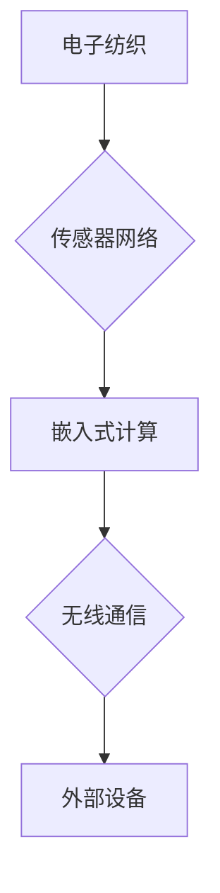

                 

## 智能织物技术：将计算能力整合到日常服装中

> 关键词：智能织物、可穿戴技术、嵌入式计算、传感器网络、物联网、人机交互、纺织材料、电子纺织

### 1. 背景介绍

随着物联网、人工智能和可穿戴技术的蓬勃发展，智能织物技术逐渐成为一个备受关注的领域。智能织物是指将电子元件、传感器、执行器等嵌入到纺织材料中，赋予服装感知、计算、通信和执行功能的智能材料。它将传统服装与先进技术相结合，为人们的生活带来全新的体验和可能性。

智能织物技术的应用前景广阔，涵盖医疗保健、运动健身、时尚设计、安全防护等多个领域。例如，智能运动服可以监测用户的运动状态，提供个性化的训练建议；智能医疗服可以实时监测患者的生理指标，帮助医生及时发现异常；智能安全服可以感知周围环境，提醒用户潜在的危险。

### 2. 核心概念与联系

智能织物技术的核心概念包括：

* **电子纺织：** 将电子元件、传感器、执行器等嵌入到纺织材料中，使其具有电子功能。
* **传感器网络：** 在智能织物中部署多个传感器，形成一个网络，可以实时采集环境信息和人体数据。
* **嵌入式计算：** 在智能织物中集成微控制器或其他嵌入式计算设备，进行数据处理和控制。
* **无线通信：** 利用蓝牙、Wi-Fi等无线通信技术，使智能织物能够与外部设备进行数据传输和交互。

**核心概念架构：**



### 3. 核心算法原理 & 具体操作步骤

#### 3.1  算法原理概述

智能织物技术的核心算法主要包括数据采集、数据处理、数据传输和数据分析等环节。

* **数据采集：** 利用嵌入式传感器采集环境信息和人体数据，例如温度、湿度、心率、呼吸频率等。
* **数据处理：** 将采集到的原始数据进行预处理、过滤和分析，提取有用的信息。
* **数据传输：** 利用无线通信技术将处理后的数据传输到外部设备，例如智能手机、电脑或云服务器。
* **数据分析：** 在外部设备上对数据进行更深入的分析，例如识别模式、预测趋势或提供个性化建议。

#### 3.2  算法步骤详解

1. **传感器数据采集：** 嵌入式传感器实时采集环境信息和人体数据。
2. **数据预处理：** 对采集到的原始数据进行滤波、去噪等处理，去除干扰信号。
3. **特征提取：** 利用算法提取数据中的关键特征，例如心率变化、体温波动等。
4. **数据传输：** 将处理后的数据通过无线通信协议传输到外部设备。
5. **数据分析：** 在外部设备上利用机器学习、数据挖掘等算法对数据进行分析，识别模式、预测趋势或提供个性化建议。

#### 3.3  算法优缺点

**优点：**

* **实时性强：** 嵌入式传感器可以实时采集数据，实现对人体状态的实时监测。
* **数据丰富：** 可以采集多种类型的传感器数据，例如温度、湿度、心率、呼吸频率等，为数据分析提供更丰富的素材。
* **个性化定制：** 可以根据用户的需求和数据分析结果，提供个性化的建议和服务。

**缺点：**

* **功耗问题：** 嵌入式传感器和计算设备的功耗较高，需要考虑电池续航时间。
* **数据安全问题：** 智能织物收集的用户数据需要进行安全保护，防止泄露和滥用。
* **成本问题：** 智能织物技术的研发和生产成本较高，需要进一步降低成本才能实现大规模应用。

#### 3.4  算法应用领域

智能织物技术的核心算法可以应用于以下领域：

* **医疗保健：** 用于监测患者的生理指标，辅助诊断疾病，提供个性化的治疗方案。
* **运动健身：** 用于监测用户的运动状态，提供个性化的训练建议，帮助用户提高运动效果。
* **时尚设计：** 用于开发具有智能功能的服装，例如可变颜色、可调节温度、可感知环境等。
* **安全防护：** 用于开发具有安全功能的服装，例如可感知危险、可发出警报、可提供紧急救援等。

### 4. 数学模型和公式 & 详细讲解 & 举例说明

#### 4.1  数学模型构建

智能织物技术的数学模型主要用于描述传感器数据采集、信号处理、数据传输和数据分析等环节。

* **传感器模型：** 描述传感器对物理量测量的关系，例如温度传感器输出电压与温度之间的关系。
* **信号处理模型：** 描述对传感器数据进行滤波、去噪等处理的算法，例如移动平均滤波、傅里叶变换等。
* **数据传输模型：** 描述数据在无线网络中的传输过程，例如数据速率、传输延迟、信道质量等。
* **数据分析模型：** 描述对数据进行分析的算法，例如机器学习、数据挖掘等。

#### 4.2  公式推导过程

例如，温度传感器输出电压与温度之间的关系可以用以下公式描述：

$$V = kT + b$$

其中：

* $V$ 是传感器输出电压
* $T$ 是温度
* $k$ 是传感器灵敏度
* $b$ 是传感器偏移量

#### 4.3  案例分析与讲解

假设一个温度传感器具有灵敏度 $k = 0.1V/℃$ 和偏移量 $b = 0.2V$，当温度为 $25℃$ 时，传感器输出电压为：

$$V = 0.1 \times 25 + 0.2 = 2.7V$$

### 5. 项目实践：代码实例和详细解释说明

#### 5.1  开发环境搭建

智能织物项目开发环境通常包括：

* **硬件平台：** 例如Arduino、Raspberry Pi等微控制器平台。
* **软件开发工具：** 例如Arduino IDE、Eclipse等集成开发环境。
* **传感器和执行器：** 例如温度传感器、湿度传感器、LED灯等。
* **无线通信模块：** 例如蓝牙模块、Wi-Fi模块等。

#### 5.2  源代码详细实现

以下是一个简单的智能织物项目代码示例，用于监测温度并通过蓝牙传输数据：

```cpp
#include <Wire.h>
#include <Adafruit_Sensor.h>
#include <Adafruit_BMP085.h>

// BMP085传感器对象
Adafruit_BMP085 bmp;

void setup() {
  Serial.begin(9600);
  if (!bmp.begin()) {
    Serial.println("BMP085传感器初始化失败!");
    while (1);
  }
}

void loop() {
  // 读取温度数据
  float temperature = bmp.readTemperature();

  // 打印温度数据
  Serial.print("温度: ");
  Serial.print(temperature);
  Serial.println("℃");

  // 通过蓝牙传输数据
  // ...
}
```

#### 5.3  代码解读与分析

* 该代码首先包含了必要的库文件，例如Wire库用于I2C通信，Adafruit_Sensor库用于传感器管理，Adafruit_BMP085库用于BMP085温度传感器。
* 在setup函数中，初始化串口通信和BMP085传感器。
* 在loop函数中，读取BMP085传感器的温度数据，并通过串口打印出来。
* 注释掉的蓝牙传输部分需要根据实际情况进行实现。

#### 5.4  运行结果展示

当代码运行成功时，串口会打印出实时温度数据。

### 6. 实际应用场景

#### 6.1  医疗保健

* **远程心率监测：** 智能织物可以嵌入心率传感器，实时监测患者的心率，并通过无线网络传输到医生手机或云服务器，方便医生远程诊断和治疗。
* **伤口监测：** 智能织物可以嵌入传感器，监测伤口温度、湿度、pH值等参数，及时发现感染迹象，帮助医生进行更有效的治疗。
* **康复训练：** 智能织物可以嵌入传感器，监测患者的运动状态，提供个性化的康复训练方案，帮助患者更快恢复健康。

#### 6.2  运动健身

* **运动状态监测：** 智能运动服可以监测用户的运动状态，例如心率、呼吸频率、步数、距离等，提供个性化的训练建议，帮助用户提高运动效果。
* **运动安全保障：** 智能运动服可以感知用户的运动轨迹和环境信息，提醒用户潜在的危险，保障运动安全。
* **运动数据分析：** 智能运动服可以收集用户的运动数据，并通过云平台进行分析，提供用户的运动习惯、运动强度、运动效果等数据报告，帮助用户更好地了解自己的运动情况。

#### 6.3  时尚设计

* **可变颜色服装：** 智能织物可以嵌入电控元件，实现服装颜色的变化，满足用户的个性化需求。
* **可调节温度服装：** 智能织物可以嵌入加热元件或温度调节器，根据用户的需求调节服装温度，提供舒适的穿着体验。
* **智能交互服装：** 智能织物可以嵌入传感器和执行器，实现服装与用户的交互，例如通过触摸控制服装颜色或灯光。

#### 6.4  未来应用展望

智能织物技术的未来应用前景广阔，例如：

* **智能医疗服：** 可以实时监测患者的生理指标，并根据患者的状态自动调节药物释放量，实现精准医疗。
* **智能家居服：** 可以与智能家居系统进行交互，控制灯光、温度、音乐等设备，实现更加智能化的家居体验。
* **智能机器人服：** 可以为机器人提供更加灵活和舒适的穿着体验，提高机器人的运动能力和感知能力。

### 7. 工具和资源推荐

#### 7.1  学习资源推荐

* **书籍：**
    * 《智能织物技术》
    * 《嵌入式系统设计》
    * 《物联网技术》
* **在线课程：**
    * Coursera: 嵌入式系统
    * edX: 物联网
    * Udemy: 智能织物开发

#### 7.2  开发工具推荐

* **硬件平台：** Arduino, Raspberry Pi
* **软件开发工具：** Arduino IDE, Eclipse, Visual Studio Code
* **传感器和执行器：** Adafruit, SparkFun, Seeed Studio

#### 7.3  相关论文推荐

* **智能织物传感器网络：**
    * "A Survey on Wearable Sensor Networks for Healthcare Applications"
    * "Design and Implementation of a Wireless Sensor Network for Smart Clothing"
* **智能织物数据分析：**
    * "Machine Learning for Smart Clothing Applications"
    * "Data Mining Techniques for Wearable Sensor Data Analysis"

### 8. 总结：未来发展趋势与挑战

#### 8.1  研究成果总结

智能织物技术近年来取得了显著进展，在传感器、计算、通信、材料等方面都取得了突破。

#### 8.2  未来发展趋势

* **更加智能化：** 智能织物将更加智能化，能够更准确地感知环境信息和人体数据，并提供更加个性化的服务。
* **更加融合化：** 智能织物将更加融合化，与其他技术，例如人工智能、云计算、大数据等相结合，形成更加强大的应用生态。
* **更加普及化：** 智能织物将更加普及化，价格更加亲民，应用场景更加广泛。

#### 8.3  面临的挑战

* **功耗问题：** 智能织物设备的功耗仍然是一个挑战，需要开发更加节能的传感器和计算设备。
* **数据安全问题：** 智能织物收集的用户数据需要进行安全保护，防止泄露和滥用。
* **成本问题：** 智能织物技术的研发和生产成本仍然较高，需要进一步降低成本才能实现大规模应用。

#### 8.4  研究展望

未来，智能织物技术将继续朝着更加智能化、融合化、普及化的方向发展，为人们的生活带来更加便捷、舒适、安全和健康体验。

### 9. 附录：常见问题与解答

* **智能织物如何充电？**

智能织物可以采用无线充电、太阳能充电等方式进行充电。

* **智能织物是否会影响人体健康？**

目前，智能织物使用的材料和技术都是安全的，不会对人体健康造成危害。

* **智能织物的价格是多少？**

智能织物的价格取决于其功能、材料和品牌等因素，目前价格范围从几十元到几千元不等。


作者：禅与计算机程序设计艺术 / Zen and the Art of Computer Programming 
<end_of_turn>

