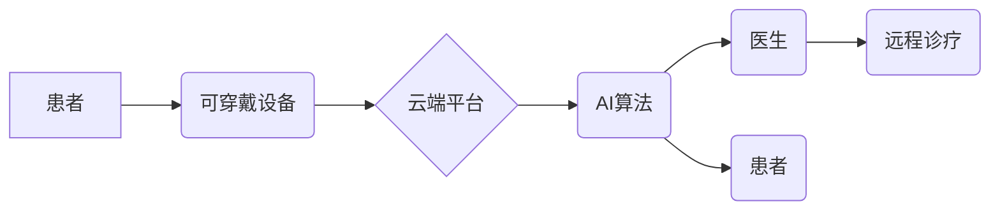

                 

## 未来的智慧医疗：2050年的可穿戴医疗设备与远程诊疗

> 关键词：可穿戴医疗设备、远程诊疗、人工智能、机器学习、生物传感器、云计算、区块链、数据安全、医疗保健

### 1. 背景介绍

医疗保健领域正在经历一场前所未有的变革，人工智能、物联网和云计算等技术的融合正在重塑医疗服务模式。未来，智慧医疗将以可穿戴医疗设备和远程诊疗为核心，为患者提供更便捷、更个性化、更精准的医疗服务。

可穿戴医疗设备，如智能手表、智能戒指、智能衣物等，能够持续监测患者的生理数据，例如心率、血压、血糖、体温、睡眠质量等。这些数据将被传输到云端平台，由人工智能算法进行分析和处理，及时发现潜在的健康风险，并提供个性化的健康建议。

远程诊疗是指利用信息技术，让医生和患者在不同地理位置进行医疗咨询、诊断和治疗。未来，远程诊疗将更加普及，医生可以通过视频、语音、文字等方式与患者进行远程互动，提供更便捷的医疗服务。

### 2. 核心概念与联系

**2.1 核心概念**

* **可穿戴医疗设备:**  佩戴在人体上的电子设备，能够收集和传输患者的生理数据。
* **远程诊疗:** 利用信息技术，让医生和患者在不同地理位置进行医疗咨询、诊断和治疗。
* **人工智能 (AI):**  模拟人类智能的计算机系统，能够学习、推理和决策。
* **机器学习 (ML):**  人工智能的一种子领域，通过算法从数据中学习，不断提高预测和决策能力。
* **云计算:**  一种基于互联网的计算模式，能够提供弹性、可扩展的计算资源。
* **区块链:**  一种分布式账本技术，能够确保数据安全和透明。

**2.2 架构图**



**2.3 联系**

可穿戴医疗设备收集患者的生理数据，通过云平台传输到AI算法进行分析和处理。AI算法可以识别潜在的健康风险，并向医生和患者提供个性化的建议。医生可以通过远程诊疗平台与患者进行互动，提供更便捷的医疗服务。

### 3. 核心算法原理 & 具体操作步骤

**3.1 算法原理概述**

未来智慧医疗的核心算法主要包括机器学习算法、深度学习算法和自然语言处理算法。

* **机器学习算法:**  用于从患者的生理数据中识别潜在的健康风险，例如预测心血管疾病、糖尿病等。常见的机器学习算法包括支持向量机、决策树、随机森林等。
* **深度学习算法:**  用于更复杂的医疗诊断和治疗，例如图像识别、语音识别、文本分析等。深度学习算法能够学习更复杂的特征，提高诊断和治疗的准确性。
* **自然语言处理算法:**  用于处理医生和患者之间的文本对话，例如理解患者的症状、提供医疗建议等。自然语言处理算法能够帮助医生更快速、更准确地理解患者的需求。

**3.2 算法步骤详解**

以机器学习算法为例，其具体操作步骤如下：

1. **数据收集:** 收集患者的生理数据、病历、影像等数据。
2. **数据预处理:** 对收集到的数据进行清洗、转换、归一化等处理，使其适合机器学习算法的训练。
3. **模型选择:** 选择合适的机器学习算法，例如支持向量机、决策树等。
4. **模型训练:** 使用训练数据训练机器学习模型，使其能够识别潜在的健康风险。
5. **模型评估:** 使用测试数据评估模型的性能，例如准确率、召回率等。
6. **模型部署:** 将训练好的模型部署到云平台，用于实时分析患者的生理数据。

**3.3 算法优缺点**

**优点:**

* 能够识别潜在的健康风险，及时进行干预。
* 提供个性化的健康建议，帮助患者更好地管理自己的健康。
* 提高医疗诊断和治疗的准确性。
* 降低医疗成本，提高医疗效率。

**缺点:**

* 需要大量的数据进行训练，数据质量对算法性能有很大影响。
* 算法的解释性较差，难以理解算法的决策过程。
* 存在数据安全和隐私泄露的风险。

**3.4 算法应用领域**

* **疾病预测和预防:**  预测心血管疾病、糖尿病、癌症等疾病的风险，并提供个性化的预防建议。
* **远程诊断和治疗:**  帮助医生远程诊断和治疗患者，提高医疗服务的可及性。
* **个性化医疗:**  根据患者的基因、生活方式等信息，提供个性化的医疗方案。
* **药物研发:**  加速药物研发过程，提高药物开发效率。

### 4. 数学模型和公式 & 详细讲解 & 举例说明

**4.1 数学模型构建**

在智慧医疗领域，常用的数学模型包括回归模型、分类模型和聚类模型。

* **回归模型:** 用于预测连续变量，例如患者的血压、血糖等。
* **分类模型:** 用于分类数据，例如预测患者是否患有某种疾病。
* **聚类模型:** 用于将数据分组，例如将患者根据他们的健康状况进行分组。

**4.2 公式推导过程**

以线性回归模型为例，其目标是找到一条直线，使得预测值与实际值之间的误差最小。

线性回归模型的公式如下：

$$y = mx + c$$

其中：

* $y$ 是预测值
* $x$ 是输入变量
* $m$ 是斜率
* $c$ 是截距

为了找到最佳的 $m$ 和 $c$ 值，可以使用最小二乘法。最小二乘法的目标是找到一条直线，使得所有数据点到直线的距离之和最小。

**4.3 案例分析与讲解**

假设我们想要预测患者的血压值，我们可以使用线性回归模型。

我们可以收集患者的血压值和年龄数据，然后使用最小二乘法训练线性回归模型。

训练完成后，我们可以使用模型预测新的患者的血压值。

**举例说明:**

假设我们收集了以下数据：

| 年龄 | 血压 |
|---|---|
| 25 | 120 |
| 30 | 130 |
| 35 | 140 |
| 40 | 150 |

我们可以使用最小二乘法训练线性回归模型，得到以下模型：

$$y = 3x + 110$$

其中：

* $y$ 是预测的血压值
* $x$ 是患者的年龄

如果我们想要预测 45 岁患者的血压值，我们可以将 $x$ 代入模型中：

$$y = 3 * 45 + 110 = 225$$

因此，我们预测 45 岁患者的血压值为 225 mmHg。

### 5. 项目实践：代码实例和详细解释说明

**5.1 开发环境搭建**

* **操作系统:**  Linux, macOS, Windows
* **编程语言:**  Python
* **深度学习框架:**  TensorFlow, PyTorch
* **云平台:**  AWS, Azure, GCP

**5.2 源代码详细实现**

```python
# 导入必要的库
import tensorflow as tf

# 定义模型结构
model = tf.keras.models.Sequential([
  tf.keras.layers.Dense(64, activation='relu', input_shape=(784,)),
  tf.keras.layers.Dense(10, activation='softmax')
])

# 编译模型
model.compile(optimizer='adam',
              loss='sparse_categorical_crossentropy',
              metrics=['accuracy'])

# 训练模型
model.fit(x_train, y_train, epochs=10)

# 评估模型
loss, accuracy = model.evaluate(x_test, y_test)
print('Loss:', loss)
print('Accuracy:', accuracy)
```

**5.3 代码解读与分析**

这段代码实现了简单的深度学习模型训练。

* 首先，我们导入必要的库，包括 TensorFlow 库。
* 然后，我们定义模型结构，包括两个全连接层。
* 接着，我们编译模型，指定优化器、损失函数和评价指标。
* 接下来，我们训练模型，使用训练数据进行训练。
* 最后，我们评估模型，使用测试数据计算模型的损失和准确率。

**5.4 运行结果展示**

训练完成后，我们可以查看模型的损失和准确率。

如果模型训练成功，损失值应该会随着训练轮数的增加而降低，准确率应该会随着训练轮数的增加而提高。

### 6. 实际应用场景

**6.1 心血管疾病预测**

可穿戴设备可以持续监测患者的心率、血压、睡眠质量等数据，AI算法可以分析这些数据，预测患者患心血管疾病的风险。

**6.2 糖尿病管理**

可穿戴设备可以监测患者的血糖水平，AI算法可以分析血糖数据，提供个性化的饮食和运动建议，帮助患者更好地管理糖尿病。

**6.3 远程精神健康咨询**

远程诊疗平台可以连接患者和心理医生，患者可以通过视频、语音等方式与心理医生进行咨询，获得心理支持和治疗。

**6.4 癌症早期筛查**

可穿戴设备可以监测患者的体温、呼吸频率等数据，AI算法可以分析这些数据，识别潜在的癌症早期症状。

**6.5 未来应用展望**

未来，智慧医疗将更加智能化、个性化和便捷化。

* **更精准的诊断:**  AI算法将能够识别更细微的健康变化，提高诊断的准确性。
* **更个性化的治疗:**  AI算法将能够根据患者的基因、生活方式等信息，提供更个性化的治疗方案。
* **更便捷的医疗服务:**  远程诊疗将更加普及，患者能够随时随地获得医疗服务。
* **更低的医疗成本:**  智慧医疗将提高医疗效率，降低医疗成本。

### 7. 工具和资源推荐

**7.1 学习资源推荐**

* **在线课程:**  Coursera, edX, Udacity
* **书籍:**  《深度学习》、《机器学习》、《人工智能》
* **博客:**  Towards Data Science, Machine Learning Mastery

**7.2 开发工具推荐**

* **编程语言:**  Python
* **深度学习框架:**  TensorFlow, PyTorch
* **云平台:**  AWS, Azure, GCP

**7.3 相关论文推荐**

* **Nature:**  https://www.nature.com/
* **Science:**  https://www.science.org/
* **arXiv:**  https://arxiv.org/

### 8. 总结：未来发展趋势与挑战

**8.1 研究成果总结**

智慧医疗领域取得了显著的进展，AI算法、可穿戴设备和云计算等技术的融合，为医疗服务带来了革命性的变革。

**8.2 未来发展趋势**

* **更精准的诊断:**  AI算法将能够识别更细微的健康变化，提高诊断的准确性。
* **更个性化的治疗:**  AI算法将能够根据患者的基因、生活方式等信息，提供更个性化的治疗方案。
* **更便捷的医疗服务:**  远程诊疗将更加普及，患者能够随时随地获得医疗服务。
* **更低的医疗成本:**  智慧医疗将提高医疗效率，降低医疗成本。

**8.3 面临的挑战**

* **数据安全和隐私保护:**  智慧医疗需要处理大量敏感的医疗数据，数据安全和隐私保护是一个重要的挑战。
* **算法解释性和可信度:**  许多AI算法的决策过程难以解释，这可能会导致患者对算法的信任度降低。
* **医疗伦理问题:**  智慧医疗的应用可能会引发一些伦理问题，例如算法偏见、人工智能的责任等。

**8.4 研究展望**

未来，智慧医疗领域的研究将继续深入，解决上述挑战，推动智慧医疗的健康发展。


### 9. 附录：常见问题与解答

**9.1  可穿戴医疗设备的数据安全问题如何解决？**

可穿戴医疗设备的数据安全可以通过以下措施来解决：

* 使用加密技术保护数据传输和存储。
* 采用身份验证和授权机制，确保只有授权用户才能访问数据。
* 定期更新设备的软件和固件，修复安全漏洞。
* 遵守相关的医疗数据隐私法规。

**9.2  AI算法的决策过程如何解释？**

AI算法的决策过程可以通过以下方式进行解释：

* 使用可解释机器学习模型，例如决策树、规则模型等。
* 使用特征重要性分析，识别影响算法决策的关键特征。
* 使用模型可视化技术，直观地展示算法的决策过程。

**9.3  智慧医疗的伦理问题如何解决？**

智慧医疗的伦理问题可以通过以下方式来解决：

* 制定相关的伦理规范和政策。
* 加强公众对智慧医疗伦理问题的教育和宣传。
* 建立伦理审查机制，对智慧医疗应用进行伦理评估。

作者：禅与计算机程序设计艺术 / Zen and the Art of Computer Programming 


<end_of_turn>

