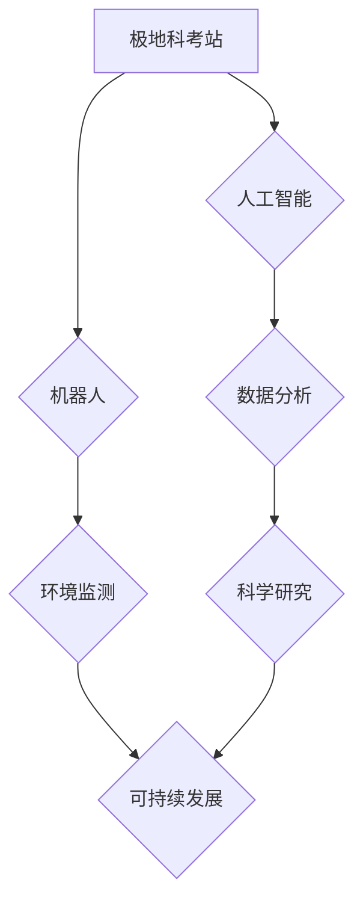

                 

## 未来的极地探索：2050年的极地科考站与冰下城市

> 关键词：极地探索、科考站、冰下城市、人工智能、机器人、数据分析、可持续发展、气候变化

### 1. 背景介绍

极地地区作为地球上最具挑战性的环境之一，蕴藏着丰富的科学价值和资源潜力。随着全球气候变化的加剧，极地地区的冰川融化、海平面上升等现象日益严重，对人类社会和生态系统构成重大威胁。同时，极地地区也蕴藏着丰富的资源，如石油、天然气、矿产等，其开发利用也面临着严峻的挑战。

为了更好地了解极地环境变化、保护极地生态系统、探索极地资源，人类需要建立更加先进、智能化的极地科考站和冰下城市。这些设施将成为极地科学研究、资源开发和环境监测的重要基地，为人类应对气候变化、探索宇宙奥秘提供重要的支撑。

### 2. 核心概念与联系

**2.1 极地科考站与冰下城市**

极地科考站是专门用于进行极地科学研究的设施，通常位于冰川、海冰或海岸线上。冰下城市则是位于冰层或海冰之下的城市，可以利用冰层本身的特性进行建筑和能源利用。

**2.2 人工智能与机器人**

人工智能（AI）和机器人技术将成为未来极地科考站和冰下城市的核心驱动力。AI可以帮助科学家分析海量数据，预测极地环境变化，优化资源利用。机器人可以替代人类进行危险、重复性工作，例如冰层钻探、样品采集、环境监测等。

**2.3 数据分析与可持续发展**

数据分析技术将帮助科学家更好地理解极地环境变化，预测未来趋势，制定应对措施。同时，可持续发展理念将指导极地科考站和冰下城市的建设和运营，最大限度地减少对环境的影响。

**2.4  核心概念架构**



### 3. 核心算法原理 & 具体操作步骤

**3.1 算法原理概述**

未来极地科考站和冰下城市将采用多种先进算法，例如机器学习、深度学习、强化学习等，来实现智能化管理、环境监测、资源开发等功能。

**3.2 算法步骤详解**

* **机器学习算法:**

    1. 数据采集：从环境传感器、仪器设备等收集极地环境数据，例如温度、湿度、气压、海冰厚度等。
    2. 数据预处理：对采集到的数据进行清洗、转换、特征提取等处理，使其适合机器学习算法的训练。
    3. 模型训练：使用机器学习算法，例如支持向量机、决策树、神经网络等，对预处理后的数据进行训练，建立预测模型。
    4. 模型评估：使用测试数据对训练好的模型进行评估，验证模型的准确性和泛化能力。
    5. 模型部署：将训练好的模型部署到极地科考站或冰下城市，用于实时预测和决策。

* **深度学习算法:**

    1. 数据采集：与机器学习算法相同，从环境传感器、仪器设备等收集极地环境数据。
    2. 数据预处理：对采集到的数据进行清洗、转换、特征提取等处理。
    3. 网络结构设计：设计深度神经网络的结构，例如卷积神经网络、循环神经网络等，根据具体应用场景选择合适的网络结构。
    4. 模型训练：使用深度学习算法，例如反向传播算法，对预处理后的数据进行训练，学习复杂的特征表示。
    5. 模型评估：使用测试数据对训练好的模型进行评估，验证模型的准确性和泛化能力。
    6. 模型部署：将训练好的模型部署到极地科考站或冰下城市，用于更复杂的预测和决策，例如冰川融化预测、海洋生物识别等。

* **强化学习算法:**

    1. 环境建模：建立极地环境的数学模型，模拟环境变化和系统行为。
    2. 智能体设计：设计智能体，例如机器人、无人机等，使其能够感知环境、做出决策并与环境交互。
    3. 奖励机制设计：设计奖励机制，根据智能体的行为和环境状态给予奖励或惩罚，引导智能体学习最优策略。
    4. 训练过程：让智能体在模拟环境中进行训练，通过不断尝试和学习，找到最优策略以最大化奖励。
    5. 模型部署：将训练好的智能体部署到真实环境中，用于自动完成任务，例如资源探测、环境监测、灾害救援等。

**3.3 算法优缺点**

* **机器学习算法:**

    优点：易于实现，训练速度快，适用于数据量较小的场景。
    缺点：对数据质量要求高，难以处理复杂非线性关系。

* **深度学习算法:**

    优点：能够学习复杂的特征表示，适用于数据量大、特征复杂场景。
    缺点：训练时间长，对计算资源要求高，容易过拟合。

* **强化学习算法:**

    优点：能够学习最优策略，适用于动态环境和决策问题。
    缺点：训练过程复杂，需要设计合适的奖励机制，容易陷入局部最优。

**3.4 算法应用领域**

* **极地环境监测:** 预测冰川融化、海平面上升、极地天气变化等。
* **极地资源开发:** 探测石油、天然气、矿产等资源，优化资源利用。
* **极地生物多样性研究:** 识别和监测极地动植物，保护极地生态系统。
* **极地灾害救援:** 预测和应对极地灾害，例如冰川崩塌、海啸等。

### 4. 数学模型和公式 & 详细讲解 & 举例说明

**4.1 数学模型构建**

为了预测极地环境变化，可以构建数学模型，例如冰川融化模型、海冰厚度模型等。这些模型通常基于物理定律和经验数据，可以模拟极地环境的复杂变化过程。

**4.2 公式推导过程**

例如，冰川融化模型可以基于能量守恒定律推导公式，计算冰川融化速度。公式中包含冰川厚度、温度、太阳辐射等参数。

**4.3 案例分析与讲解**

通过将实际观测数据代入模型，可以预测未来冰川融化趋势，为应对气候变化提供科学依据。

### 5. 项目实践：代码实例和详细解释说明

**5.1 开发环境搭建**

* 操作系统：Linux
* 编程语言：Python
* 库依赖：NumPy、Pandas、Scikit-learn、TensorFlow等

**5.2 源代码详细实现**

```python
# 导入必要的库
import numpy as np
from sklearn.linear_model import LinearRegression

# 加载数据
data = np.loadtxt('ice_thickness_data.csv', delimiter=',')

# 分割数据
X = data[:, :-1]
y = data[:, -1]

# 创建线性回归模型
model = LinearRegression()

# 训练模型
model.fit(X, y)

# 预测未来海冰厚度
future_data = np.array([[2025, 10, 0.5]])
predicted_thickness = model.predict(future_data)

# 打印预测结果
print(f'预测的未来海冰厚度: {predicted_thickness}')
```

**5.3 代码解读与分析**

这段代码演示了如何使用线性回归模型预测未来海冰厚度。

* 首先，导入必要的库，例如NumPy用于数值计算、Scikit-learn用于机器学习。
* 然后，加载海冰厚度数据，并将其分割为特征数据X和目标数据y。
* 创建线性回归模型，并使用训练数据训练模型。
* 最后，使用训练好的模型预测未来海冰厚度，并打印预测结果。

**5.4 运行结果展示**

运行结果将显示预测的未来海冰厚度值。

### 6. 实际应用场景

**6.1 极地科考站建设**

* 利用人工智能和机器人技术，自动完成极地科考站的建设和维护，例如搭建帐篷、安装设备、采集样品等。
* 利用数据分析技术，优化极地科考站的能源利用、资源管理、人员调度等，提高效率和安全性。

**6.2 冰下城市开发**

* 利用冰层本身的特性，建造坚固、节能的冰下城市，例如利用冰层作为建筑材料、利用冰层进行热交换等。
* 利用人工智能和机器人技术，实现冰下城市的智能化管理，例如自动控制照明、温度、通风等。

**6.3 极地环境监测**

* 利用传感器网络和数据分析技术，实时监测极地环境变化，例如冰川融化、海冰厚度、气温、湿度等。
* 利用人工智能技术，预测极地环境变化趋势，为应对气候变化提供科学依据。

**6.4 未来应用展望**

* 极地科考站和冰下城市将成为未来极地探索的重要基地，推动极地科学研究、资源开发和环境保护。
* 人工智能、机器人、数据分析等技术将进一步发展，为极地探索提供更强大的支撑。
* 极地探索将更加注重可持续发展，最大限度地减少对极地环境的影响。

### 7. 工具和资源推荐

**7.1 学习资源推荐**

* 极地科学相关书籍和期刊
* 在线课程和培训平台
* 极地研究机构的网站和报告

**7.2 开发工具推荐**

* Python编程语言和相关库
* 数据分析工具，例如Tableau、Power BI
* 机器学习框架，例如TensorFlow、PyTorch

**7.3 相关论文推荐**

* 极地环境变化和气候变化的论文
* 极地资源开发和利用的论文
* 极地科考站和冰下城市的设计和建设的论文

### 8. 总结：未来发展趋势与挑战

**8.1 研究成果总结**

未来极地探索将更加智能化、自动化、可持续化。人工智能、机器人、数据分析等技术将发挥越来越重要的作用，推动极地科学研究、资源开发和环境保护。

**8.2 未来发展趋势**

* 极地科考站和冰下城市将更加智能化，能够自动完成任务、实时监测环境、优化资源利用。
* 极地环境监测将更加精准、及时，能够更好地预测极地环境变化趋势。
* 极地资源开发将更加可持续，最大限度地减少对环境的影响。

**8.3 面临的挑战**

* 极地环境恶劣，对技术和设备提出了高要求。
* 极地资源开发需要克服技术和经济挑战。
* 极地环境变化对人类社会构成重大威胁，需要加强国际合作应对。

**8.4 研究展望**

未来极地探索将面临更多挑战和机遇，需要不断创新技术、加强国际合作，为人类更好地理解和保护极地环境做出贡献。

### 9. 附录：常见问题与解答

* **Q1: 极地科考站和冰下城市建设的成本高吗？**

    A1: 确实，极地科考站和冰下城市建设成本较高，需要投入大量资金和技术。但随着技术的进步和规模化建设，成本将逐渐降低。

* **Q2: 极地环境对人类健康有哪些影响？**

    A2: 极地环境恶劣，温度低、光照时间短、辐射强，容易导致冻伤、维生素缺乏、精神压力等问题。

* **Q3: 极地资源开发对环境有什么影响？**

    A3: 极地资源开发可能会对极地生态系统造成破坏，例如污染、栖息地破坏等。因此，需要采取措施最大限度地减少对环境的影响。


作者：禅与计算机程序设计艺术 / Zen and the Art of Computer Programming 
<end_of_turn>

