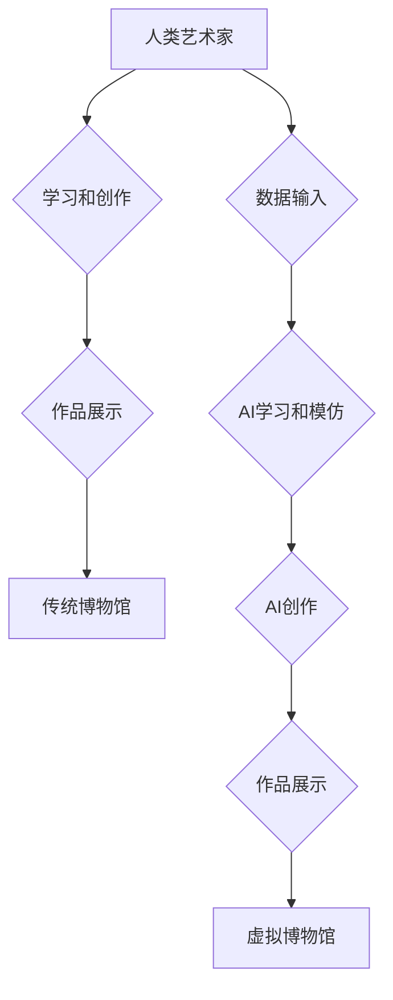

                 

## 未来的艺术创作：2050年的AI艺术家与虚拟博物馆

> 关键词：人工智能、艺术创作、虚拟博物馆、深度学习、生成模型、创意算法、数字艺术、沉浸式体验

## 1. 背景介绍

艺术创作一直是人类文明的重要组成部分，它反映了人类对世界的理解、情感和精神追求。随着人工智能技术的飞速发展，AI已经开始在艺术创作领域崭露头角，并展现出巨大的潜力。从绘画、音乐到文学，AI已经能够生成出令人惊叹的作品，引发人们对艺术本质和创造力的深刻思考。

2050年，我们或许会看到一个全新的艺术世界。AI艺术家将不再是概念性的幻想，而是与人类艺术家共同创作、协作、演进的伙伴。虚拟博物馆将不再是静态的展示空间，而是充满互动性和沉浸感的体验平台，让观众能够深度参与艺术创作的过程。

## 2. 核心概念与联系

**2.1 核心概念**

* **人工智能 (AI):**  指能够模拟人类智能行为的计算机系统，包括学习、推理、决策、感知和语言理解等能力。
* **艺术创作:**  指人类通过各种媒介和技巧，表达情感、思想和审美意趣的过程。
* **虚拟博物馆:**  利用虚拟现实 (VR) 和增强现实 (AR) 技术，构建一个数字化、沉浸式的博物馆环境，提供虚拟展览、互动体验和远程访问等功能。

**2.2 核心概念联系**

AI艺术家与虚拟博物馆的结合，将为艺术创作和欣赏带来革命性的改变。

* **AI艺术家:**  利用深度学习、生成模型等算法，学习和模仿人类艺术家的创作风格，并生成全新的艺术作品。
* **虚拟博物馆:**  为AI艺术家提供展示平台，让观众能够欣赏、互动和体验AI创作的艺术作品。同时，虚拟博物馆还可以提供丰富的艺术知识和背景信息，帮助观众更好地理解和欣赏艺术作品。

**2.3 Mermaid 流程图**



## 3. 核心算法原理 & 具体操作步骤

**3.1 算法原理概述**

AI艺术创作的核心算法主要包括：

* **生成对抗网络 (GAN):**  由两个神经网络组成，一个是生成器，负责生成艺术作品；另一个是鉴别器，负责判断作品是否为AI生成。两者相互竞争，生成器不断改进生成的作品，直到达到与人类艺术家作品相似的水平。
* **变分自编码器 (VAE):**  通过学习数据的潜在表示，生成新的数据点，可以用于生成新的艺术作品。
* **强化学习 (RL):**  通过奖励机制，训练AI模型生成符合特定风格或主题的艺术作品。

**3.2 算法步骤详解**

以GAN为例，其具体操作步骤如下：

1. **初始化生成器和鉴别器:**  随机初始化两个神经网络的权重。
2. **生成器生成样本:**  生成器根据随机噪声输入，生成一个新的艺术作品样本。
3. **鉴别器判断样本:**  鉴别器接收生成器生成的样本和真实样本，判断样本的真实性。
4. **更新生成器和鉴别器:**  根据鉴别器的判断结果，更新生成器的权重，使其生成更真实的样本。同时，更新鉴别器的权重，使其更好地区分真实样本和生成样本。
5. **重复步骤2-4:**  重复上述步骤，直到生成器生成的样本能够欺骗鉴别器，达到预期的艺术效果。

**3.3 算法优缺点**

* **优点:**  能够生成逼真的艺术作品，并学习和模仿不同艺术家的风格。
* **缺点:**  训练过程复杂，需要大量的训练数据，生成的艺术作品可能缺乏原创性和情感表达。

**3.4 算法应用领域**

* **艺术创作:**  生成绘画、音乐、文学作品等。
* **游戏开发:**  生成游戏场景、角色、道具等。
* **电影制作:**  生成特效、动画等。
* **设计领域:**  生成产品设计、建筑设计等。

## 4. 数学模型和公式 & 详细讲解 & 举例说明

**4.1 数学模型构建**

GAN的数学模型主要基于以下概念：

* **生成器 (G):**  一个神经网络，输入随机噪声，输出生成样本。
* **鉴别器 (D):**  另一个神经网络，输入样本，输出判断样本真实性的概率。

**4.2 公式推导过程**

* **生成器损失函数:**  最小化鉴别器对生成样本的判断概率。
* **鉴别器损失函数:**  最小化鉴别器对真实样本和生成样本的判断误差。

**4.3 案例分析与讲解**

例如，在生成图像的GAN中，生成器会学习将随机噪声映射到图像空间，而鉴别器会学习区分真实图像和生成图像。训练过程中，生成器不断改进其生成图像的质量，使其能够欺骗鉴别器，而鉴别器也会不断提高其区分能力。最终，生成器能够生成逼真的图像，并学习不同的艺术风格。

## 5. 项目实践：代码实例和详细解释说明

**5.1 开发环境搭建**

* **操作系统:**  Linux/macOS/Windows
* **编程语言:**  Python
* **深度学习框架:**  TensorFlow/PyTorch
* **其他工具:**  Git、Jupyter Notebook

**5.2 源代码详细实现**

```python
# 生成器网络结构
class Generator(nn.Module):
    def __init__(self):
        super(Generator, self).__init__()
        # ...

    def forward(self, z):
        # ...

# 鉴别器网络结构
class Discriminator(nn.Module):
    def __init__(self):
        super(Discriminator, self).__init__()
        # ...

    def forward(self, x):
        # ...

# 训练循环
for epoch in range(num_epochs):
    # ...
    # 更新生成器和鉴别器
    # ...

```

**5.3 代码解读与分析**

* **生成器网络:**  负责将随机噪声映射到图像空间，生成新的图像样本。
* **鉴别器网络:**  负责判断图像样本的真实性，区分真实图像和生成图像。
* **训练循环:**  迭代训练生成器和鉴别器，直到生成器能够生成逼真的图像。

**5.4 运行结果展示**

训练完成后，可以利用生成器生成新的图像样本，并展示其效果。

## 6. 实际应用场景

**6.1 艺术创作辅助工具**

AI艺术家可以作为人类艺术家的辅助工具，帮助他们快速生成草图、探索不同的创作方向，并突破创作瓶颈。

**6.2 个性化艺术作品定制**

用户可以根据自己的喜好和需求，利用AI艺术家定制个性化的艺术作品，例如生成带有特定主题、风格或元素的绘画、音乐或文学作品。

**6.3 数字艺术品收藏和交易**

AI生成的艺术作品可以作为数字艺术品进行收藏和交易，为艺术家和收藏家提供新的创作和投资机会。

**6.4 虚拟博物馆体验**

虚拟博物馆可以利用AI艺术家生成丰富的艺术作品，并提供沉浸式的互动体验，让观众能够深度参与艺术创作的过程。

**6.5 未来应用展望**

未来，AI艺术家将更加智能化、个性化和交互式，与人类艺术家形成更加紧密的合作关系，共同推动艺术创作的创新和发展。

## 7. 工具和资源推荐

**7.1 学习资源推荐**

* **书籍:**  《深度学习》、《生成对抗网络》
* **在线课程:**  Coursera、edX、Udacity
* **开源项目:**  TensorFlow、PyTorch、OpenAI

**7.2 开发工具推荐**

* **深度学习框架:**  TensorFlow、PyTorch
* **图像处理库:**  OpenCV、Pillow
* **数据可视化工具:**  Matplotlib、Seaborn

**7.3 相关论文推荐**

* **Generative Adversarial Networks** (Goodfellow et al., 2014)
* **Deep Convolutional Generative Adversarial Networks** (Radford et al., 2015)
* **Progressive Growing of GANs for Improved Quality, Stability, and Variation** (Karras et al., 2017)

## 8. 总结：未来发展趋势与挑战

**8.1 研究成果总结**

近年来，AI艺术创作取得了显著进展，能够生成逼真的艺术作品，并学习和模仿不同艺术家的风格。

**8.2 未来发展趋势**

* **更加智能化和个性化:**  AI艺术家将更加智能化，能够理解和响应用户的需求，生成更加个性化的艺术作品。
* **更加交互式和沉浸式:**  AI艺术家将与用户进行更加交互式的创作，并提供更加沉浸式的体验。
* **跨界融合:**  AI艺术创作将与其他领域融合，例如游戏、电影、设计等，创造更加丰富的艺术体验。

**8.3 面临的挑战**

* **原创性和情感表达:**  AI生成的艺术作品可能缺乏原创性和情感表达，难以与人类艺术家的作品相媲美。
* **伦理和版权问题:**  AI艺术创作引发了伦理和版权问题，例如谁拥有AI生成的艺术作品的版权？
* **技术瓶颈:**  AI艺术创作的技术仍然存在瓶颈，例如如何让AI更好地理解和表达人类的情感？

**8.4 研究展望**

未来，需要进一步研究如何提升AI艺术创作的原创性和情感表达能力，并解决伦理和版权问题，推动AI艺术创作朝着更加智能化、个性化和融合的方向发展。

## 9. 附录：常见问题与解答

**9.1 如何训练一个AI艺术家？**

训练一个AI艺术家需要大量的艺术数据、强大的计算资源和专业的机器学习知识。

**9.2 AI生成的艺术作品是否具有价值？**

AI生成的艺术作品是否具有价值是一个复杂的问题，需要从艺术、伦理和经济等多个角度进行探讨。

**9.3 AI艺术家会取代人类艺术家吗？**

AI艺术家和人类艺术家将共同推动艺术创作的发展，AI艺术家可以作为人类艺术家的辅助工具，帮助他们突破创作瓶颈，而人类艺术家仍然是艺术创作的核心力量。


作者：禅与计算机程序设计艺术 / Zen and the Art of Computer Programming 
<end_of_turn>

