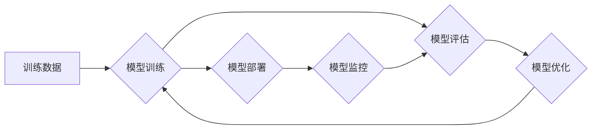

                 

## 机器学习模型部署：从训练到生产

> 关键词：机器学习、模型部署、生产环境、容器化、微服务、监控、优化

### 1. 背景介绍

机器学习（Machine Learning，ML）近年来发展迅速，在各个领域取得了令人瞩目的成就。从图像识别到自然语言处理，从推荐系统到医疗诊断，机器学习模型正在改变着我们的生活。然而，训练出一个优秀的机器学习模型仅仅是第一步，将这个模型部署到生产环境中，使其能够真正发挥价值，才是实现机器学习应用的关键。

传统的软件开发流程与机器学习模型部署存在显著差异。软件开发通常遵循“构建-测试-部署”的流程，而机器学习模型部署则需要考虑模型的训练数据、模型结构、模型性能、资源消耗等多方面因素。此外，机器学习模型通常需要持续更新和迭代，以适应不断变化的数据环境。因此，构建一个高效、可靠、可扩展的机器学习模型部署流程至关重要。

### 2. 核心概念与联系

机器学习模型部署的核心概念包括：

* **模型训练:** 利用训练数据训练机器学习模型，使其能够学习数据中的模式和规律。
* **模型评估:** 使用测试数据评估模型的性能，例如准确率、召回率、F1-score等指标。
* **模型优化:** 根据评估结果对模型进行调整，例如调整模型参数、增加训练数据等，以提高模型性能。
* **模型部署:** 将训练好的模型部署到生产环境中，使其能够接受新的数据输入并进行预测或决策。
* **模型监控:** 持续监控模型在生产环境中的性能，及时发现问题并进行调整。

**模型训练-评估-部署流程图:**



### 3. 核心算法原理 & 具体操作步骤

#### 3.1  算法原理概述

机器学习模型部署算法主要包括以下几种：

* **Batch Inference:** 将多个数据样本一次性输入模型进行预测，适用于数据量较大的场景。
* **Online Inference:** 将每个数据样本单独输入模型进行预测，适用于实时数据流场景。
* **Model Serving:** 利用专门的模型服务框架，将模型部署到服务器上，并提供API接口供其他应用调用。

#### 3.2  算法步骤详解

**Batch Inference:**

1. 将训练好的模型保存为文件。
2. 将待预测的数据样本收集到一个批次中。
3. 将批次数据输入模型进行预测。
4. 将预测结果保存到文件或数据库中。

**Online Inference:**

1. 将训练好的模型部署到服务器上。
2. 接收来自客户端的单个数据样本。
3. 将数据样本输入模型进行预测。
4. 将预测结果返回给客户端。

**Model Serving:**

1. 选择合适的模型服务框架，例如TensorFlow Serving、TorchServe等。
2. 将训练好的模型打包成模型文件。
3. 部署模型文件到模型服务框架中。
4. 配置模型服务框架的API接口。
5. 其他应用可以通过API接口调用模型进行预测。

#### 3.3  算法优缺点

**Batch Inference:**

* **优点:** 效率高，适合处理大量数据。
* **缺点:** 不适合实时数据流场景。

**Online Inference:**

* **优点:** 实时性强，适合处理实时数据流场景。
* **缺点:** 效率相对较低，资源消耗较大。

**Model Serving:**

* **优点:** 可扩展性强，易于管理和维护。
* **缺点:** 需要学习新的框架和工具。

#### 3.4  算法应用领域

* **Batch Inference:** 图像识别、语音识别、自然语言处理等离线任务。
* **Online Inference:** 实时聊天机器人、推荐系统、 fraud detection等实时数据流场景。
* **Model Serving:** 大规模机器学习应用，例如搜索引擎、电商平台等。

### 4. 数学模型和公式 & 详细讲解 & 举例说明

#### 4.1  数学模型构建

机器学习模型的数学模型通常基于统计学和概率论，例如线性回归、逻辑回归、支持向量机等。这些模型试图找到一个函数，将输入数据映射到输出结果。

#### 4.2  公式推导过程

例如，线性回归模型的目标是找到一个线性函数，将输入特征 $x$ 映射到输出结果 $y$。模型的数学公式如下：

$$
y = w_0 + w_1x_1 + w_2x_2 + ... + w_nx_n
$$

其中，$w_0, w_1, w_2, ..., w_n$ 是模型参数，需要通过训练数据进行学习。

#### 4.3  案例分析与讲解

假设我们有一个数据集，包含房屋面积和房屋价格的信息。我们想要构建一个线性回归模型，预测房屋价格。

* **输入特征:** 房屋面积 $x$
* **输出结果:** 房屋价格 $y$

通过训练数据，我们可以学习到模型参数 $w_0$ 和 $w_1$，使得模型能够准确预测房屋价格。

### 5. 项目实践：代码实例和详细解释说明

#### 5.1  开发环境搭建

* Python 3.x
* TensorFlow 或 PyTorch 等机器学习框架
* Docker 或 Kubernetes 等容器化技术

#### 5.2  源代码详细实现

```python
# 使用 TensorFlow 构建线性回归模型
import tensorflow as tf

# 定义模型
model = tf.keras.Sequential([
    tf.keras.layers.Dense(units=1, input_shape=[1])
])

# 编译模型
model.compile(optimizer='sgd', loss='mean_squared_error')

# 训练模型
model.fit(x_train, y_train, epochs=100)

# 保存模型
model.save('house_price_model.h5')
```

#### 5.3  代码解读与分析

* 我们使用 TensorFlow 构建了一个简单的线性回归模型。
* 模型只有一个全连接层，输入特征维度为 1，输出结果维度为 1。
* 我们使用随机梯度下降（SGD）作为优化器，均方误差（MSE）作为损失函数。
* 我们训练模型 100 个 epochs，并将训练好的模型保存为 `house_price_model.h5` 文件。

#### 5.4  运行结果展示

* 使用训练好的模型预测新的房屋价格。

### 6. 实际应用场景

* **房价预测:** 预测房屋价格，帮助房地产交易。
* **股票预测:** 预测股票价格走势，帮助投资决策。
* **客户流失预测:** 预测客户流失风险，帮助企业制定挽留策略。

### 6. 实际应用场景

#### 6.1  金融领域

* **欺诈检测:** 利用机器学习模型识别信用卡欺诈交易。
* **风险评估:** 评估贷款申请者的信用风险。
* **投资决策:** 利用机器学习模型分析市场数据，辅助投资决策。

#### 6.2  医疗领域

* **疾病诊断:** 利用机器学习模型分析患者的医疗数据，辅助医生诊断疾病。
* **药物研发:** 利用机器学习模型加速药物研发过程。
* **个性化医疗:** 根据患者的基因信息和生活习惯，提供个性化的医疗建议。

#### 6.3  零售领域

* **商品推荐:** 根据用户的购买历史和浏览记录，推荐相关的商品。
* **库存管理:** 利用机器学习模型预测商品需求，优化库存管理。
* **客户服务:** 利用机器学习模型构建聊天机器人，提供客户服务。

#### 6.4  未来应用展望

随着机器学习技术的不断发展，其应用场景将更加广泛。例如，在自动驾驶、机器人、智能家居等领域，机器学习模型将发挥越来越重要的作用。

### 7. 工具和资源推荐

#### 7.1  学习资源推荐

* **书籍:**
    * 《Hands-On Machine Learning with Scikit-Learn, Keras & TensorFlow》
    * 《Deep Learning》
* **在线课程:**
    * Coursera: Machine Learning
    * edX: Artificial Intelligence
* **博客和网站:**
    * Towards Data Science
    * Machine Learning Mastery

#### 7.2  开发工具推荐

* **机器学习框架:** TensorFlow, PyTorch, scikit-learn
* **容器化技术:** Docker, Kubernetes
* **模型服务框架:** TensorFlow Serving, TorchServe

#### 7.3  相关论文推荐

* **《ImageNet Classification with Deep Convolutional Neural Networks》**
* **《Attention Is All You Need》**
* **《BERT: Pre-training of Deep Bidirectional Transformers for Language Understanding》**

### 8. 总结：未来发展趋势与挑战

#### 8.1  研究成果总结

机器学习模型部署技术取得了显著进展，模型的性能不断提高，部署流程更加自动化和便捷。

#### 8.2  未来发展趋势

* **模型压缩和加速:** 降低模型大小和计算复杂度，提高部署效率。
* **边缘计算:** 将模型部署到边缘设备上，实现更低延迟和更高效率的推理。
* **联邦学习:** 在不共享原始数据的情况下，训练和部署模型，保护数据隐私。

#### 8.3  面临的挑战

* **模型可解释性:** 提高机器学习模型的透明度和可解释性，帮助用户理解模型的决策过程。
* **模型安全性:** 保证机器学习模型的安全性和可靠性，防止模型被攻击或利用。
* **模型公平性:** 确保机器学习模型的公平性和公正性，避免模型产生偏见。

#### 8.4  研究展望

未来，机器学习模型部署技术将继续朝着更自动化、更智能、更安全的方向发展。


### 9. 附录：常见问题与解答

* **Q: 如何选择合适的模型部署算法？**
* **A:** 选择合适的模型部署算法需要根据具体应用场景和数据特点进行考虑。

* **Q: 如何监控模型在生产环境中的性能？**
* **A:** 可以使用监控工具跟踪模型的预测准确率、延迟时间、资源消耗等指标。

* **Q: 如何更新模型以适应数据变化？**

* **A:** 可以定期重新训练模型，或者使用在线学习算法进行模型更新。


作者：禅与计算机程序设计艺术 / Zen and the Art of Computer Programming 
<end_of_turn>

