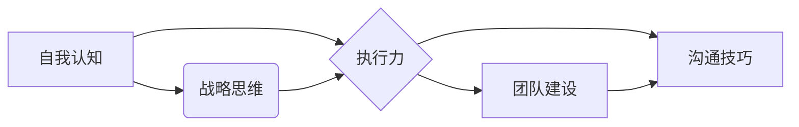

                 

## 构建个人领导力体系的方法论

> 关键词：领导力体系、个人成长、自我认知、战略思维、执行力、团队建设、沟通技巧

### 1. 背景介绍

在当今瞬息万变的科技时代，个人领导力已成为企业发展和个人成长的关键驱动力。 优秀的领导者能够清晰地洞察未来趋势，制定有效的战略，并带领团队高效地执行目标。然而，领导力并非天生的，它需要通过不断的学习、实践和反思来构建和提升。

本文将探讨构建个人领导力体系的方法论，旨在帮助IT从业者，特别是程序员、架构师和技术管理者，系统地提升自身领导力，成为更优秀的团队领导者和技术专家。

### 2. 核心概念与联系

个人领导力体系的构建是一个多维度的过程，涉及到自我认知、战略思维、执行力、团队建设、沟通技巧等多个方面。 

**核心概念：**

* **自我认知:** 了解自己的优势、劣势、价值观、性格特点等，建立清晰的自我定位。
* **战略思维:** 能够洞察全局，分析形势，制定有效的战略目标和行动计划。
* **执行力:** 将战略目标转化为实际行动，并高效地推动执行，确保目标的达成。
* **团队建设:** 能够招募、培养和激励优秀的团队成员，构建高效协作的团队氛围。
* **沟通技巧:** 能够清晰、准确、有效地传达信息，并与团队成员建立良好的沟通关系。

**核心概念关系图:**



### 3. 核心算法原理 & 具体操作步骤

构建个人领导力体系的核心算法可以理解为一个持续迭代的过程，需要不断地自我评估、学习、实践和反思。

#### 3.1 算法原理概述

该算法的核心原理是基于“循环反馈”机制，通过以下步骤不断提升个人领导力：

1. **自我评估:** 定期进行自我评估，了解自身优势、劣势、领导力水平等。
2. **目标设定:** 根据自我评估结果，设定具体的领导力提升目标。
3. **学习与实践:** 通过阅读书籍、参加培训、观察优秀领导者等方式学习领导力知识和技能，并将其应用到实际工作中。
4. **反思与调整:** 反思实践经验，总结成功和失败，并根据需要调整目标和策略。

#### 3.2 算法步骤详解

1. **自我认知阶段:**

   * **工具:** 
      * 360度反馈
      * MBTI性格测试
      * DISC性格测试
      * 价值观评估
   * **步骤:**
      * 通过360度反馈了解他人对自己的评价，包括领导力方面的表现。
      * 通过性格测试了解自己的性格特点和优势，以及在领导力方面的潜在优势和挑战。
      * 通过价值观评估了解自己的核心价值观，并将其与领导力目标相结合。

2. **目标设定阶段:**

   * **工具:** SMART目标设定方法
   * **步骤:**
      * 根据自我评估结果，设定具体的、可衡量的、可实现的、相关的和有时间限制的领导力目标。
      * 将目标分解成可执行的行动计划，并设定相应的截止日期。

3. **学习与实践阶段:**

   * **工具:** 
      * 领导力书籍
      * 领导力培训课程
      * 优秀领导者案例分析
      * 团队项目实践
   * **步骤:**
      * 阅读相关书籍，学习领导力理论和实践方法。
      * 参加领导力培训课程，提升领导力技能。
      * 通过观察优秀领导者的行为，学习他们的经验和技巧。
      * 在团队项目中实践领导力，并不断总结经验教训。

4. **反思与调整阶段:**

   * **工具:** 
      * 日记
      * 反思问卷
      * 团队反馈
   * **步骤:**
      * 定期进行反思，记录自己的领导力实践经验，总结成功和失败的原因。
      * 通过团队反馈，了解团队成员对自己的评价，并根据反馈进行调整。
      * 根据反思和反馈结果，调整目标和策略，不断优化领导力体系。

#### 3.3 算法优缺点

**优点:**

* **系统性:** 该算法提供了一个系统性的框架，帮助个人全面提升领导力。
* **可持续性:** 该算法是一个持续迭代的过程，能够帮助个人不断进步和成长。
* **个性化:** 该算法可以根据个人的实际情况进行调整，使其更加个性化。

**缺点:**

* **需要时间和精力:** 构建个人领导力体系需要持续的学习、实践和反思，需要投入时间和精力。
* **需要自我觉察:** 该算法需要个人具备一定的自我觉察能力，才能准确地评估自身优势和劣势。
* **需要反馈机制:** 该算法需要有效的反馈机制，才能及时调整策略，确保目标的达成。

#### 3.4 算法应用领域

该算法适用于所有希望提升领导力的个人，特别是IT从业者，例如：

* 程序员
* 架构师
* 技术经理
* 项目经理
* 技术团队负责人

### 4. 数学模型和公式 & 详细讲解 & 举例说明

领导力体系的构建可以抽象为一个数学模型，其中个人领导力水平 (L) 可以通过以下公式计算：

$$L = f(S, E, T, C)$$

其中：

* **S:** 自我认知水平
* **E:** 执行力水平
* **T:** 团队建设水平
* **C:** 沟通技巧水平

每个指标的具体计算方法可以根据实际情况进行调整，例如可以使用评分制、等级制等方式进行量化。

#### 4.1 数学模型构建

该数学模型假设个人领导力水平是以上四个指标的综合函数，每个指标对领导力水平的影响程度不同。

#### 4.2 公式推导过程

该公式的推导过程基于以下假设：

* 自我认知水平越高，个人能够更准确地了解自身优势和劣势，制定更有效的领导策略。
* 执行力水平越高，个人能够更有效地将战略目标转化为实际行动，并推动目标的达成。
* 团队建设水平越高，个人能够构建更高效协作的团队，并激发团队成员的潜力。
* 沟通技巧水平越高，个人能够更清晰、准确地传达信息，并与团队成员建立良好的沟通关系。

#### 4.3 案例分析与讲解

假设一个程序员想要提升自己的领导力水平，他可以通过以下方式进行提升：

* **自我认知:** 通过性格测试和360度反馈了解自己的优势和劣势，例如发现自己擅长技术问题解决，但缺乏沟通技巧。
* **执行力:** 通过制定明确的目标和行动计划，并定期跟踪进度，提高执行力。
* **团队建设:** 通过积极参与团队项目，并主动帮助团队成员解决问题，提升团队建设能力。
* **沟通技巧:** 通过参加沟通技巧培训，学习如何清晰、准确地表达自己的想法，并有效地倾听他人的意见。

通过以上努力，该程序员的领导力水平 (L) 将会得到提升。

### 5. 项目实践：代码实例和详细解释说明

为了更好地理解构建个人领导力体系的方法论，我们可以通过一个实际项目来进行实践。

#### 5.1 开发环境搭建

* 操作系统: Linux/macOS/Windows
* 编程语言: Python
* 工具: Jupyter Notebook

#### 5.2 源代码详细实现

```python
# 导入必要的库
import pandas as pd

# 定义一个函数来计算领导力水平
def calculate_leadership_level(self_awareness, execution_level, team_building_level, communication_skills):
    leadership_level = 0.3 * self_awareness + 0.25 * execution_level + 0.2 * team_building_level + 0.25 * communication_skills
    return leadership_level

# 创建一个数据框来存储个人领导力指标
leadership_data = pd.DataFrame({
    '自我认知': [80, 70, 90, 85],
    '执行力': [75, 80, 65, 90],
    '团队建设': [60, 75, 80, 70],
    '沟通技巧': [65, 70, 85, 95]
})

# 计算每个人的领导力水平
leadership_data['领导力水平'] = leadership_data.apply(lambda row: calculate_leadership_level(row['自我认知'], row['执行力'], row['团队建设'], row['沟通技巧']), axis=1)

# 打印结果
print(leadership_data)
```

#### 5.3 代码解读与分析

该代码首先定义了一个函数 `calculate_leadership_level` 来计算领导力水平，该函数根据四个指标的权重进行加权平均。然后，创建一个数据框来存储个人领导力指标，并使用 `apply` 方法计算每个人的领导力水平。最后，打印结果。

#### 5.4 运行结果展示

运行该代码后，会输出一个包含个人领导力指标和领导力水平的数据框。

### 6. 实际应用场景

构建个人领导力体系的应用场景非常广泛，例如：

* **团队管理:** 优秀的领导者能够有效地激励和管理团队成员，提高团队效率和士气。
* **项目管理:** 领导者需要能够制定有效的项目计划，并协调团队成员完成项目目标。
* **技术决策:** 领导者需要能够洞察技术趋势，并做出正确的技术决策。
* **沟通协调:** 领导者需要能够与团队成员、客户和合作伙伴有效地沟通协调。

#### 6.4 未来应用展望

随着科技的不断发展，个人领导力将变得更加重要。未来，人工智能、大数据等技术将对领导力产生新的影响，例如：

* **数据驱动的领导力:** 利用数据分析工具，领导者能够更准确地了解团队成员的绩效和需求，并制定更有效的领导策略。
* **个性化领导力:** 人工智能可以根据个人的性格特点和需求，提供个性化的领导力建议和培训。
* **协作式领导力:** 人工智能可以帮助领导者更好地协调团队成员，提高团队协作效率。

### 7. 工具和资源推荐

#### 7.1 学习资源推荐

* **书籍:**
    * 《领导力》 - 罗伯特·格雷厄姆
    * 《高效能人士的七个习惯》 - 斯蒂芬·柯维
    * 《从优秀到卓越》 - 乔·杜比
* **课程:**
    * Coursera: 领导力与管理
    * edX: 领导力与团队建设
    * Udemy: 成为一名优秀的领导者

#### 7.2 开发工具推荐

* **项目管理工具:** Jira, Asana, Trello
* **沟通协作工具:** Slack, Microsoft Teams, Zoom
* **数据分析工具:** Tableau, Power BI

#### 7.3 相关论文推荐

* **The Transformational Leadership Theory**
* **The Authentic Leadership Theory**
* **The Servant Leadership Theory**

### 8. 总结：未来发展趋势与挑战

#### 8.1 研究成果总结

本文探讨了构建个人领导力体系的方法论，包括自我认知、战略思维、执行力、团队建设、沟通技巧等核心概念，并通过数学模型和代码实例进行了详细的阐述。

#### 8.2 未来发展趋势

未来，个人领导力体系的构建将更加注重数据驱动、个性化和协作性。人工智能、大数据等技术将为领导力发展提供新的工具和方法。

#### 8.3 面临的挑战

构建个人领导力体系面临的挑战包括：

* **自我认知的难度:** 准确地了解自身优势和劣势需要持续的自我反思和反馈。
* **执行力的提升:** 将战略目标转化为实际行动需要克服惰性和拖延症。
* **团队建设的复杂性:** 构建高效协作的团队需要具备良好的沟通、激励和协调能力。

#### 8.4 研究展望

未来研究将更加关注以下方面：

* **个性化领导力体系的构建:** 根据个人的性格特点、领导风格和发展目标，构建个性化的领导力体系。
* **人工智能在领导力发展中的应用:** 利用人工智能技术，提供个性化的领导力建议、培训和评估。
* **跨文化领导力的研究:** 研究不同文化背景下领导力的差异和共通点，为跨文化团队领导提供指导。

### 9. 附录：常见问题与解答

**Q1: 如何进行自我认知？**

**A1:** 自我认知可以通过多种方式进行，例如性格测试、360度反馈、自我反思等。

**Q2: 如何提升执行力？**

**A2:** 提升执行力可以通过制定明确的目标和行动计划、设定截止日期、定期跟踪进度等方式。

**Q3: 如何构建高效协作的团队？**

**A3:** 构建高效协作的团队需要具备良好的沟通、激励和协调能力，并建立信任和尊重的工作氛围。


作者：禅与计算机程序设计艺术 / Zen and the Art of Computer Programming 
<end_of_turn>

