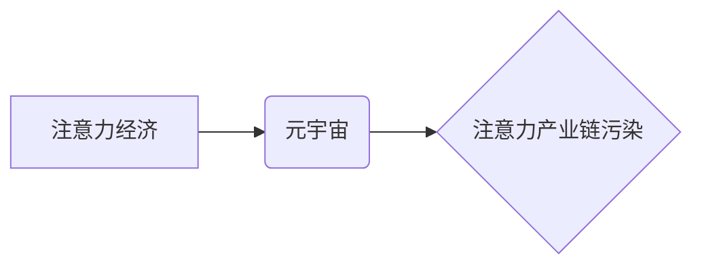

                 

## 注意力产业链污染:元宇宙经济发展的负面外部性研究

> 关键词：元宇宙、注意力经济、负面外部性、算法设计、伦理问题、可持续发展

## 1. 背景介绍

元宇宙概念的兴起，预示着人类社会进入一个全新的数字交互时代。其沉浸式体验、虚拟经济和社交交互等特性，为人们提供了前所未有的可能性。然而，元宇宙的发展也引发了诸多社会议题，其中“注意力产业链污染”尤为突出。

注意力，作为人类认知的核心资源，在元宇宙经济中被高度重视。元宇宙平台通过各种手段，如个性化推荐、虚拟奖励、社交互动等，不断吸引用户注意力，并将其转化为商业价值。然而，这种过度追求注意力获取的行为，却可能导致一系列负面外部性，对个体和社会造成潜在危害。

## 2. 核心概念与联系

### 2.1 注意力经济

注意力经济是指以获取和利用用户注意力为核心驱动的经济模式。在数字时代，注意力成为一种稀缺资源，而平台通过算法、内容和设计等手段，争夺用户的注意力，并将其转化为广告收入、数据价值等。

### 2.2 元宇宙

元宇宙是指一个基于互联网、虚拟现实、增强现实等技术的虚拟世界，其特点包括：

* **沉浸式体验:**  用户可以通过虚拟现实设备或增强现实设备，沉浸在虚拟世界中，体验逼真的感官刺激。
* **虚拟经济:**  元宇宙内拥有自己的经济体系，用户可以通过虚拟货币、虚拟资产等进行交易。
* **社交交互:**  用户可以在元宇宙中与其他用户进行社交互动，建立虚拟关系。

### 2.3 注意力产业链污染

注意力产业链污染是指元宇宙平台为了获取用户注意力，而采取的过度营销、算法操控、内容沉迷等行为，对用户身心健康、社会关系、认知能力等方面造成负面影响。

**核心概念关系图:**



## 3. 核心算法原理 & 具体操作步骤

### 3.1 算法原理概述

元宇宙平台利用各种算法来分析用户行为，预测用户兴趣，并推送个性化内容，以吸引和保持用户注意力。常见的算法包括：

* **推荐算法:**  根据用户的历史行为、偏好等信息，推荐用户可能感兴趣的内容。
* **内容分发算法:**  根据内容的受欢迎程度、用户参与度等因素，决定内容的展示顺序和曝光量。
* **个性化算法:**  根据用户的个人特征、行为模式等信息，定制个性化的内容和体验。

### 3.2 算法步骤详解

1. **数据收集:**  元宇宙平台收集用户的各种行为数据，包括浏览记录、点击行为、停留时间、评论点赞等。
2. **数据分析:**  利用机器学习、深度学习等算法，对收集到的数据进行分析，挖掘用户兴趣、偏好等特征。
3. **模型训练:**  根据分析结果，训练推荐、分发、个性化等算法模型。
4. **内容推荐:**  根据用户的特征和模型预测，推荐用户可能感兴趣的内容。
5. **内容分发:**  根据内容受欢迎程度、用户参与度等因素，决定内容的展示顺序和曝光量。
6. **个性化体验:**  根据用户的个人特征，定制个性化的内容和体验。

### 3.3 算法优缺点

**优点:**

* **提高用户体验:**  个性化推荐和内容分发，可以帮助用户找到感兴趣的内容，提升用户体验。
* **提升商业价值:**  通过精准营销和广告投放，可以提升平台的商业价值。

**缺点:**

* **算法偏差:**  算法模型可能存在偏差，导致推荐内容不准确，甚至出现歧视性推荐。
* **信息茧房:**  算法推荐可能会导致用户陷入信息茧房，只接触到自己感兴趣的信息，缺乏多元化视野。
* **注意力过度消耗:**  平台为了获取用户注意力，可能会采用过度营销、推送频率过高等手段，导致用户注意力过度消耗。

### 3.4 算法应用领域

注意力算法广泛应用于元宇宙平台的各个领域，包括：

* **内容推荐:**  推荐用户可能感兴趣的虚拟物品、游戏、活动等。
* **虚拟社交:**  推荐用户可能认识的朋友、兴趣小组等。
* **虚拟广告:**  根据用户的兴趣和行为，精准投放虚拟广告。
* **虚拟教育:**  根据用户的学习进度和兴趣，推荐个性化的学习内容。

## 4. 数学模型和公式 & 详细讲解 & 举例说明

### 4.1 数学模型构建

注意力机制可以看作是一个加权求和的过程，其中每个元素的权重代表其重要程度。

**模型公式:**

$$
Attention(Q, K, V) = softmax(\frac{QK^T}{\sqrt{d_k}})V
$$

其中：

* $Q$：查询矩阵
* $K$：键矩阵
* $V$：值矩阵
* $d_k$：键向量的维度
* $softmax$：softmax函数，用于将权重归一化

### 4.2 公式推导过程

1. **计算查询向量与键向量的点积:**  $QK^T$，得到一个矩阵，每个元素代表查询向量与键向量的相似度。
2. **对点积结果进行缩放:**  将点积结果除以 $\sqrt{d_k}$，可以防止梯度爆炸。
3. **应用softmax函数:**  对缩放后的点积结果应用softmax函数，得到每个键向量的权重。
4. **加权求和:**  将权重与值矩阵相乘，得到最终的注意力输出。

### 4.3 案例分析与讲解

假设我们有一个句子 "我爱吃苹果"，想要计算每个词语对句子的整体语义贡献。

* $Q$：查询向量，表示整个句子的语义。
* $K$：键向量，表示每个词语的语义。
* $V$：值向量，表示每个词语的词义信息。

通过注意力机制，我们可以计算出每个词语对句子的贡献权重，例如 "苹果" 的权重可能比 "我" 和 "爱" 更高，因为 "苹果" 是句子的核心内容。

## 5. 项目实践：代码实例和详细解释说明

### 5.1 开发环境搭建

* Python 3.x
* TensorFlow 或 PyTorch 深度学习框架
* Jupyter Notebook 或 VS Code 开发环境

### 5.2 源代码详细实现

```python
import tensorflow as tf

# 定义查询矩阵、键矩阵和值矩阵
Q = tf.random.normal([1, 5, 64])
K = tf.random.normal([1, 5, 64])
V = tf.random.normal([1, 5, 128])

# 计算注意力权重
attention_weights = tf.nn.softmax(tf.matmul(Q, K, transpose_b=True) / tf.math.sqrt(64), axis=-1)

# 加权求和得到注意力输出
attention_output = tf.matmul(attention_weights, V)

# 打印注意力输出
print(attention_output)
```

### 5.3 代码解读与分析

* 代码首先定义了查询矩阵、键矩阵和值矩阵，这些矩阵代表了不同词语的语义信息。
* 然后，代码计算了注意力权重，权重表示每个词语对句子的贡献程度。
* 最后，代码通过加权求和，得到了注意力输出，即每个词语对句子的整体语义贡献。

### 5.4 运行结果展示

运行代码后，会输出一个注意力输出矩阵，每个元素代表一个词语对句子的贡献权重。

## 6. 实际应用场景

注意力机制在元宇宙领域有着广泛的应用场景，例如：

* **虚拟角色交互:**  根据用户的行为和对话内容，调整虚拟角色的反应和行为，提供更自然、更人性化的交互体验。
* **虚拟环境导航:**  根据用户的目标和周围环境信息，推荐最优的导航路径，提高用户在虚拟环境中的移动效率。
* **虚拟物品推荐:**  根据用户的兴趣和需求，推荐个性化的虚拟物品，提升用户购物体验。

### 6.4 未来应用展望

随着元宇宙技术的不断发展，注意力机制将在元宇宙领域发挥更重要的作用，例如：

* **沉浸式体验增强:**  通过更精准的注意力引导，提升用户在虚拟世界中的沉浸感和参与度。
* **个性化内容定制:**  根据用户的行为和偏好，提供更个性化的内容和服务，满足用户的多样化需求。
* **虚拟经济发展:**  通过注意力机制，优化虚拟商品的推荐和交易，促进虚拟经济的发展。

## 7. 工具和资源推荐

### 7.1 学习资源推荐

* **书籍:**  《深度学习》、《自然语言处理》
* **在线课程:**  Coursera、edX、Udacity 等平台上的深度学习和自然语言处理课程
* **开源项目:**  TensorFlow、PyTorch 等深度学习框架的官方文档和示例代码

### 7.2 开发工具推荐

* **Python:**  深度学习开发的常用语言
* **TensorFlow:**  开源深度学习框架
* **PyTorch:**  开源深度学习框架
* **Jupyter Notebook:**  交互式编程环境

### 7.3 相关论文推荐

* **Attention Is All You Need:**  Transformer 模型的论文
* **BERT: Pre-training of Deep Bidirectional Transformers for Language Understanding:**  BERT 模型的论文
* **GPT-3: Language Models are Few-Shot Learners:**  GPT-3 模型的论文

## 8. 总结：未来发展趋势与挑战

### 8.1 研究成果总结

注意力机制在元宇宙领域展现出巨大的潜力，可以提升用户体验、促进虚拟经济发展，并为元宇宙的未来发展提供新的思路。

### 8.2 未来发展趋势

* **更精准的注意力机制:**  研究更精准、更有效的注意力机制，能够更好地理解用户的需求和行为。
* **多模态注意力机制:**  将文本、图像、音频等多模态信息融合到注意力机制中，提供更丰富的用户体验。
* **可解释性注意力机制:**  研究可解释性注意力机制，能够更好地理解注意力机制的决策过程，提高用户信任度。

### 8.3 面临的挑战

* **数据隐私保护:**  注意力机制需要收集大量的用户数据，如何保护用户隐私是一个重要的挑战。
* **算法公平性:**  注意力算法可能存在偏差，导致不公平的结果，需要研究算法公平性问题。
* **用户控制权:**  用户应该拥有对注意力机制的控制权，能够选择关注哪些内容，避免过度营销和信息茧房。

### 8.4 研究展望

未来，注意力机制的研究将继续深入，并与其他人工智能技术融合，为元宇宙的发展提供更强大的技术支撑。同时，需要加强对注意力机制的伦理和社会影响的探讨，确保其健康、可持续发展。

## 9. 附录：常见问题与解答

* **Q: 注意力机制是如何工作的？**

A: 注意力机制是一种模仿人类注意力机制的算法，它通过计算每个元素的权重，来决定哪些元素更重要。

* **Q: 注意力机制有哪些应用场景？**

A: 注意力机制在元宇宙领域有着广泛的应用场景，例如虚拟角色交互、虚拟环境导航、虚拟物品推荐等。

* **Q: 注意力机制有哪些挑战？**

A: 注意力机制面临着数据隐私保护、算法公平性、用户控制权等挑战。


作者：禅与计算机程序设计艺术 / Zen and the Art of Computer Programming 
<end_of_turn>

