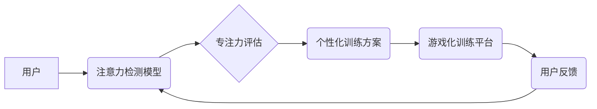

                 

## 注意力游戏化：AI驱动的专注力训练

> 关键词：注意力、游戏化、AI、专注力训练、深度学习、神经网络、行为反馈、个性化学习

## 1. 背景介绍

在当今信息爆炸的时代，人们面临着前所未有的注意力挑战。社交媒体、电子邮件、新闻推送等信息源不断地涌入，分散着我们的注意力，导致专注力下降，学习效率降低，工作效率低下。如何有效提升专注力，在纷繁的信息海洋中保持清醒的头脑，已成为当今社会亟待解决的问题。

传统专注力训练方法，例如冥想、正念练习等，虽然有一定的效果，但往往需要长时间的坚持和训练，并且难以量化评估效果。近年来，随着人工智能技术的快速发展，AI驱动的专注力训练方法逐渐崭露头角，为提升专注力提供了一种更加高效、个性化、可量化的解决方案。

## 2. 核心概念与联系

**2.1  注意力机制**

注意力机制是深度学习领域的重要技术，其灵感来源于人类的注意力机制。人类在处理信息时，不会将所有信息都平等地对待，而是会根据信息的重要性，选择性地关注某些信息，忽略其他信息。注意力机制通过赋予不同输入不同权重，模拟了这种选择性关注的行为，从而提高了模型的学习效率和准确性。

**2.2  游戏化学习**

游戏化学习是指将游戏元素融入学习过程，以提高学习者的兴趣、参与度和学习效果。游戏化学习的核心要素包括：目标设定、反馈机制、奖励机制、竞争机制等。通过这些元素，可以激发学习者的内在动力，增强学习的趣味性和可持续性。

**2.3  AI驱动的专注力训练**

AI驱动的专注力训练将注意力机制和游戏化学习相结合，通过人工智能算法，个性化定制专注力训练方案，并实时提供反馈和奖励，帮助用户提升专注力。

**2.4  架构图**



## 3. 核心算法原理 & 具体操作步骤

**3.1  算法原理概述**

AI驱动的专注力训练通常采用深度学习算法，例如卷积神经网络（CNN）和循环神经网络（RNN），来检测用户的注意力状态，并根据用户的注意力状态，生成个性化的训练方案。

**3.2  算法步骤详解**

1. **数据采集:** 收集用户的注意力数据，例如眼动追踪数据、脑电波数据、行为数据等。
2. **数据预处理:** 对收集到的数据进行清洗、转换、特征提取等预处理操作。
3. **模型训练:** 使用深度学习算法，训练注意力检测模型，使其能够准确识别用户的注意力状态。
4. **专注力评估:** 将用户的注意力数据输入到训练好的注意力检测模型中，评估用户的专注力水平。
5. **个性化训练方案:** 根据用户的专注力水平，生成个性化的训练方案，例如选择不同的游戏类型、调整游戏难度、设置不同的奖励机制等。
6. **游戏化训练:** 用户在游戏化训练平台上进行训练，并根据训练效果，实时调整训练方案。
7. **反馈和评估:** 收集用户的训练反馈，并对训练效果进行评估，不断优化训练方案。

**3.3  算法优缺点**

**优点:**

* **个性化定制:** 根据用户的注意力状态，生成个性化的训练方案，提高训练效果。
* **实时反馈:** 实时提供训练反馈，帮助用户及时调整训练策略。
* **可量化评估:** 可以通过注意力数据和训练效果，量化评估训练效果。

**缺点:**

* **数据依赖:** 需要大量的注意力数据进行模型训练，数据质量直接影响模型性能。
* **算法复杂:** 深度学习算法训练复杂，需要专业的技术人员进行开发和维护。
* **伦理问题:** 需要关注用户隐私保护和数据安全问题。

**3.4  算法应用领域**

* **教育领域:** 帮助学生提高学习效率，增强专注力。
* **医疗领域:** 帮助患者治疗注意力缺陷多动障碍（ADHD）等注意力问题。
* **企业领域:** 帮助员工提高工作效率，增强专注力。
* **游戏领域:** 开发更加智能化、个性化的游戏体验。

## 4. 数学模型和公式 & 详细讲解 & 举例说明

**4.1  数学模型构建**

注意力机制通常使用一个注意力权重来表示模型对不同输入的关注程度。注意力权重可以由一个可学习的参数矩阵计算得到。

**4.2  公式推导过程**

假设输入序列为 $x = (x_1, x_2, ..., x_n)$，输出序列为 $y = (y_1, y_2, ..., y_m)$，则注意力权重 $a_{ij}$ 可以表示为：

$$a_{ij} = \frac{exp(score(x_i, h_j))}{\sum_{k=1}^{n} exp(score(x_k, h_j))}$$

其中，$h_j$ 是隐藏层状态，$score(x_i, h_j)$ 是输入 $x_i$ 和隐藏层状态 $h_j$ 之间的相似度得分。

**4.3  案例分析与讲解**

例如，在机器翻译任务中，注意力机制可以帮助模型关注源语言句子中与目标语言句子相对应的词语，从而提高翻译的准确性。

## 5. 项目实践：代码实例和详细解释说明

**5.1  开发环境搭建**

* Python 3.x
* TensorFlow 或 PyTorch 深度学习框架
* Jupyter Notebook 或 VS Code 开发环境

**5.2  源代码详细实现**

```python
import tensorflow as tf

# 定义注意力机制
def attention_layer(inputs, hidden_states):
    # 计算注意力权重
    attention_weights = tf.matmul(inputs, hidden_states, transpose_b=True)
    attention_weights = tf.nn.softmax(attention_weights, axis=-1)
    # 计算加权和
    context_vector = tf.matmul(attention_weights, inputs)
    return context_vector

# 定义模型
model = tf.keras.Sequential([
    # ... 其他层 ...
    attention_layer(inputs, hidden_states),
    # ... 其他层 ...
])

# 训练模型
model.compile(optimizer='adam', loss='mse')
model.fit(train_data, train_labels, epochs=10)
```

**5.3  代码解读与分析**

* `attention_layer()` 函数实现了注意力机制，计算注意力权重并生成加权和。
* `model` 定义了一个深度学习模型，其中包含注意力层。
* `model.compile()` 配置模型的训练参数。
* `model.fit()` 训练模型。

**5.4  运行结果展示**

训练完成后，可以将模型应用于实际场景，例如注意力检测、个性化训练方案生成等。

## 6. 实际应用场景

**6.1  教育领域**

AI驱动的专注力训练可以帮助学生提高学习效率，增强专注力。例如，可以开发一款学习软件，通过游戏化学习和注意力检测，帮助学生集中注意力，提高学习效果。

**6.2  医疗领域**

AI驱动的专注力训练可以帮助患者治疗注意力缺陷多动障碍（ADHD）等注意力问题。例如，可以开发一款脑机接口设备，通过脑电波数据，实时监测患者的注意力状态，并提供个性化的训练方案。

**6.3  企业领域**

AI驱动的专注力训练可以帮助员工提高工作效率，增强专注力。例如，可以开发一款办公软件，通过游戏化学习和注意力检测，帮助员工集中注意力，提高工作效率。

**6.4  未来应用展望**

随着人工智能技术的不断发展，AI驱动的专注力训练将有更广泛的应用场景，例如：

* **虚拟现实（VR）和增强现实（AR）训练:** 利用VR和AR技术，创造更加沉浸式的专注力训练环境。
* **个性化脑机接口:** 开发更加精准的脑机接口，实时监测和调节用户的注意力状态。
* **跨学科融合:** 将注意力训练与其他领域，例如心理学、教育学、神经科学等进行融合，探索更深层次的注意力机制。

## 7. 工具和资源推荐

**7.1  学习资源推荐**

* **书籍:**
    * 《深度学习》
    * 《注意力机制》
* **在线课程:**
    * Coursera: 深度学习
    * Udacity: 自然语言处理
* **博客和网站:**
    * TensorFlow 官方博客
    * PyTorch 官方博客
    * AI 相关的技术博客

**7.2  开发工具推荐**

* **深度学习框架:** TensorFlow, PyTorch
* **数据可视化工具:** Matplotlib, Seaborn
* **代码编辑器:** Jupyter Notebook, VS Code

**7.3  相关论文推荐**

* 《Attention Is All You Need》
* 《BERT: Pre-training of Deep Bidirectional Transformers for Language Understanding》
* 《Transformer-XL: Attentive Language Models Beyond a Fixed-Length Context》

## 8. 总结：未来发展趋势与挑战

**8.1  研究成果总结**

AI驱动的专注力训练取得了显著的成果，为提升专注力提供了新的思路和方法。

**8.2  未来发展趋势**

* **更加精准的注意力检测:** 开发更加精准的注意力检测模型，能够更准确地识别用户的注意力状态。
* **更加个性化的训练方案:** 基于用户的注意力数据和学习风格，生成更加个性化的训练方案。
* **更加沉浸式的训练环境:** 利用VR和AR技术，创造更加沉浸式的专注力训练环境。
* **跨学科融合:** 将注意力训练与其他领域，例如心理学、教育学、神经科学等进行融合，探索更深层次的注意力机制。

**8.3  面临的挑战**

* **数据获取和隐私保护:** 需要大量的注意力数据进行模型训练，同时需要关注用户隐私保护问题。
* **算法复杂性和可解释性:** 深度学习算法训练复杂，其决策过程难以解释，需要进一步研究算法的可解释性。
* **伦理问题:** 需要关注AI驱动的专注力训练的伦理问题，例如过度依赖AI，忽略自身学习能力的培养等。

**8.4  研究展望**

未来，AI驱动的专注力训练将继续朝着更加精准、个性化、沉浸式、跨学科的方向发展，为人们提供更加高效、便捷的专注力训练解决方案。


## 9. 附录：常见问题与解答

**9.1  Q: AI驱动的专注力训练真的有效吗？**

**A:** 目前已有大量研究表明，AI驱动的专注力训练能够有效提升用户的专注力水平。

**9.2  Q: AI驱动的专注力训练需要花费多少时间？**

**A:** 训练时间取决于用户的注意力水平和训练方案的强度，一般来说，每天只需投入15-30分钟即可看到效果。

**9.3  Q: AI驱动的专注力训练对隐私安全有什么保障？**

**A:** 

在开发AI驱动的专注力训练系统时，需要严格遵守数据隐私保护原则，例如数据加密、匿名化处理等，确保用户隐私安全。

**9.4  Q: AI驱动的专注力训练适合所有人群吗？**

**A:** 

AI驱动的专注力训练可以应用于各个年龄段的人群，但对于一些特殊人群，例如患有严重注意力障碍的人群，需要根据实际情况进行调整。


作者：禅与计算机程序设计艺术 / Zen and the Art of Computer Programming 
<end_of_turn>

