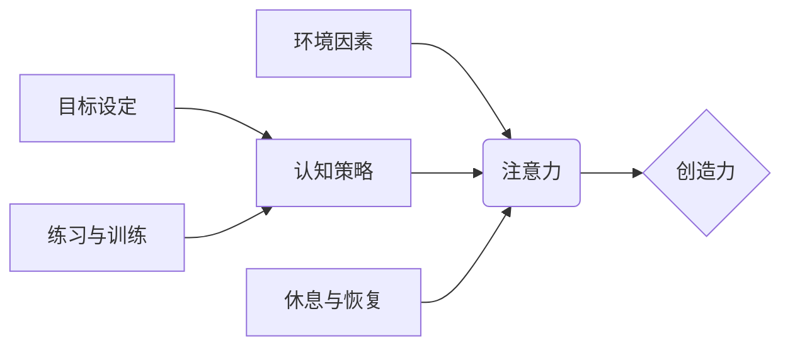

                 

## 1. 背景介绍

在当今信息爆炸的时代，我们面临着前所未有的信息洪流。来自邮件、社交媒体、新闻推送的各种信息无时无刻不在冲击着我们的注意力。这种持续的干扰不仅降低了我们的工作效率，也阻碍了我们进行深度思考和创造力的激发。如何有效地管理注意力，集中精力于重要的事情，并激发创造力，已成为当今社会面临的重大挑战。

## 2. 核心概念与联系

### 2.1 注意力与创造力的关系

注意力是认知过程的核心，它指我们对特定信息或任务的集中和选择性关注。创造力则是指我们能够产生新颖、独特和有价值的思想、概念或解决方案的能力。两者之间存在着密切的联系：

* **注意力是创造力的基础：** 创造力需要我们能够深入思考、联想和探索，而这都需要高度的注意力集中。
* **创造力可以提升注意力：** 当我们沉浸在创造性的活动中时，注意力会更加集中，因为我们对正在进行的事情充满兴趣和热情。

### 2.2  注意力管理与创造力提升的架构

注意力管理与创造力提升是一个复杂的系统，涉及多个方面：



* **环境因素：** 包括物理环境、社交环境、信息环境等，这些因素会对我们的注意力产生直接影响。
* **注意力：** 是我们对特定信息或任务的集中和选择性关注。
* **认知策略：** 包括注意力训练、思维导图、番茄工作法等，这些策略可以帮助我们更好地管理注意力。
* **休息与恢复：** 充足的睡眠、适度的运动和放松活动可以帮助我们恢复注意力。
* **目标设定：** 明确的目标可以帮助我们集中注意力，并提高工作效率。
* **练习与训练：** 持续练习和训练可以帮助我们提升注意力和创造力。

## 3. 核心算法原理 & 具体操作步骤

### 3.1  算法原理概述

注意力机制是一种模仿人类注意力机制的算法，它能够学习到哪些信息对任务最相关，并对这些信息给予更多的关注。

### 3.2  算法步骤详解

1. **输入数据：** 将输入数据（例如文本、图像等）转换为向量表示。
2. **计算注意力权重：** 使用注意力机制计算每个输入元素对输出的影响权重。
3. **加权求和：** 根据计算出的注意力权重，对输入元素进行加权求和，得到最终的输出。

### 3.3  算法优缺点

**优点：**

* 可以有效地提高模型的性能，尤其是在处理长序列数据时。
* 可以帮助模型理解输入数据的语义关系。
* 可以解释模型的决策过程，提高模型的可解释性。

**缺点：**

* 计算复杂度较高，训练时间较长。
* 需要大量的训练数据才能达到最佳效果。

### 3.4  算法应用领域

注意力机制在自然语言处理、计算机视觉、机器翻译等领域都有广泛的应用。

## 4. 数学模型和公式 & 详细讲解 & 举例说明

### 4.1  数学模型构建

注意力机制的核心是计算每个输入元素对输出的影响权重。常用的注意力机制模型包括：

* **点积注意力：** 使用点积运算计算输入元素和查询向量的相似度，作为注意力权重。
* **加权求和注意力：** 使用加权求和运算计算输入元素的加权平均值，作为注意力权重。

### 4.2  公式推导过程

**点积注意力：**

$$
\text{Attention}(Q, K, V) = \text{softmax}\left(\frac{Q K^T}{\sqrt{d_k}}\right) V
$$

其中：

* $Q$：查询向量
* $K$：键向量
* $V$：值向量
* $d_k$：键向量的维度
* $\text{softmax}$：softmax函数，用于将注意力权重归一化

**加权求和注意力：**

$$
\text{Attention}(Q, K, V) = \sum_{i=1}^{n} \alpha_i V_i
$$

其中：

* $\alpha_i$：输入元素 $i$ 的注意力权重
* $V_i$：输入元素 $i$ 的值向量

### 4.3  案例分析与讲解

假设我们有一个句子 "我爱吃苹果"，我们要计算每个单词对句子的整体语义的影响。可以使用点积注意力机制计算每个单词的注意力权重。

* 查询向量 $Q$ 可以是句子 "我爱吃" 的向量表示。
* 键向量 $K$ 和值向量 $V$ 可以是每个单词的向量表示。

通过计算 $Q$ 和每个 $K$ 的点积，得到每个单词的注意力权重。然后，根据这些权重，对每个单词的值向量进行加权求和，得到句子的最终语义向量。

## 5. 项目实践：代码实例和详细解释说明

### 5.1  开发环境搭建

* Python 3.x
* TensorFlow 或 PyTorch

### 5.2  源代码详细实现

```python
import tensorflow as tf

# 定义点积注意力机制
def dot_product_attention(query, key, value, mask=None):
    # 计算点积
    scores = tf.matmul(query, key, transpose_b=True)
    # 应用掩码
    if mask is not None:
        scores += (1 - mask) * -1e9
    # 计算注意力权重
    attention_weights = tf.nn.softmax(scores, axis=-1)
    # 计算加权求和
    context_vector = tf.matmul(attention_weights, value)
    return context_vector, attention_weights

# 示例代码
query = tf.constant([[1, 2, 3], [4, 5, 6]])
key = tf.constant([[7, 8, 9], [10, 11, 12]])
value = tf.constant([[13, 14, 15], [16, 17, 18]])

# 计算注意力
context_vector, attention_weights = dot_product_attention(query, key, value)

# 打印结果
print("Context Vector:", context_vector)
print("Attention Weights:", attention_weights)
```

### 5.3  代码解读与分析

* `dot_product_attention` 函数实现了点积注意力机制。
* `query`, `key`, `value` 分别代表查询向量、键向量和值向量。
* `mask` 用于屏蔽不需要关注的信息。
* `tf.matmul` 函数用于计算矩阵乘法。
* `tf.nn.softmax` 函数用于计算注意力权重。
* `tf.matmul` 函数用于计算加权求和。

### 5.4  运行结果展示

运行代码后，会输出 `context_vector` 和 `attention_weights` 的值。

## 6. 实际应用场景

### 6.1  机器翻译

注意力机制可以帮助机器翻译模型更好地理解句子结构和语义关系，从而提高翻译质量。

### 6.2  文本摘要

注意力机制可以帮助文本摘要模型识别句子中最关键的信息，并生成更准确的摘要。

### 6.3  对话系统

注意力机制可以帮助对话系统更好地理解用户输入，并生成更自然、更流畅的回复。

### 6.4  未来应用展望

注意力机制在人工智能领域有着广泛的应用前景，未来可能会应用于更多领域，例如：

* **图像识别：** 帮助模型更好地理解图像内容。
* **语音识别：** 提高语音识别的准确率。
* **药物研发：** 帮助模型预测药物的活性。

## 7. 工具和资源推荐

### 7.1  学习资源推荐

* **书籍：**
    * 《深度学习》
    * 《自然语言处理》
* **在线课程：**
    * Coursera
    * edX
* **博客和网站：**
    * TensorFlow Blog
    * PyTorch Blog

### 7.2  开发工具推荐

* **TensorFlow：** 开源深度学习框架。
* **PyTorch：** 开源深度学习框架。
* **Keras：** 高级深度学习API。

### 7.3  相关论文推荐

* **Attention Is All You Need**
* **BERT: Pre-training of Deep Bidirectional Transformers for Language Understanding**

## 8. 总结：未来发展趋势与挑战

### 8.1  研究成果总结

注意力机制在人工智能领域取得了显著的成果，提高了模型的性能，并为我们理解认知过程提供了新的视角。

### 8.2  未来发展趋势

* **更有效的注意力机制：** 研究更有效的注意力机制，例如自注意力机制、多头注意力机制等。
* **注意力机制的解释性：** 提高注意力机制的可解释性，帮助我们更好地理解模型的决策过程。
* **注意力机制的应用扩展：** 将注意力机制应用于更多领域，例如图像识别、语音识别等。

### 8.3  面临的挑战

* **计算复杂度：** 某些注意力机制的计算复杂度较高，需要更高效的算法和硬件支持。
* **数据依赖性：** 注意力机制需要大量的训练数据才能达到最佳效果。
* **可解释性：** 注意力机制的决策过程相对复杂，需要进一步研究提高其可解释性。

### 8.4  研究展望

未来，注意力机制的研究将继续深入，并取得更多突破。相信注意力机制将在人工智能领域发挥越来越重要的作用，帮助我们解决更多实际问题。

## 9. 附录：常见问题与解答

### 9.1  Q：注意力机制和深度学习有什么关系？

**A：** 注意力机制是一种深度学习中的重要技术，它可以帮助模型更好地理解输入数据，并提高模型的性能。

### 9.2  Q：注意力机制有哪些类型？

**A：** 常见的注意力机制类型包括点积注意力、加权求和注意力、自注意力等。

### 9.3  Q：注意力机制的应用场景有哪些？

**A：** 注意力机制在机器翻译、文本摘要、对话系统等领域都有广泛的应用。


作者：禅与计算机程序设计艺术 / Zen and the Art of Computer Programming 
<end_of_turn>

