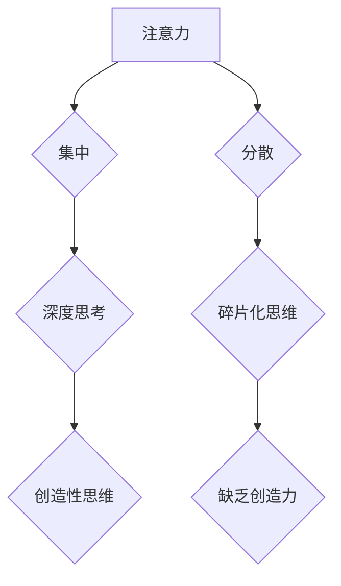

                 

## 1. 背景介绍

在当今信息爆炸的时代，我们面临着前所未有的信息冲击。来自邮件、社交媒体、新闻推送的各种信息无时无刻不在争夺我们的注意力。这种碎片化、分散的注意力状态，不仅影响了我们的工作效率，也阻碍了我们进行深度思考和创造性思维。

创造性思维是人类进步的源泉，它驱动着创新和变革。然而，创造力并非天生的，它需要我们刻意培养和训练。注意力管理是培养创造力的关键因素之一。只有集中注意力，才能深入思考，才能产生新的想法和见解。

## 2. 核心概念与联系

### 2.1 注意力与创造力

注意力是认知过程的核心，它指我们对特定信息或任务的集中和选择性关注。创造力则是指我们能够产生新颖、有价值的思想、概念或解决方案的能力。

注意力与创造力之间存在着密切的联系。

* **注意力是创造力的基础：** 创造力需要我们深入思考，探索新的可能性，而这都需要集中注意力。
* **注意力可以提升创造力：** 当我们专注于一个问题时，我们的思维会更加清晰，更容易产生新的想法。

### 2.2  注意力管理与头脑风暴

头脑风暴是一种集思广益的创意方法，它鼓励团队成员在短时间内尽可能地提出想法。注意力管理在头脑风暴中至关重要，因为它可以帮助我们：

* **避免干扰：** 头脑风暴需要一个安静、不受干扰的环境，以便每个人都能集中注意力。
* **保持积极性：** 当我们专注于头脑风暴的目标时，更容易保持积极性和热情。
* **提高效率：** 集中注意力可以帮助我们更快地生成想法，并更好地评估这些想法。

**Mermaid 流程图**



## 3. 核心算法原理 & 具体操作步骤

### 3.1 算法原理概述

注意力管理算法的核心是通过识别和过滤干扰信息，引导注意力集中在目标任务上。这些算法通常基于以下原理：

* **认知模型：** 建立一个模拟人类认知过程的模型，以理解注意力是如何工作的。
* **特征提取：** 从输入信息中提取与目标任务相关的特征，例如关键词、主题、情感等。
* **注意力机制：** 使用注意力机制赋予不同信息不同的权重，从而突出重要信息，抑制干扰信息。

### 3.2 算法步骤详解

1. **数据预处理：** 对输入信息进行预处理，例如文本清洗、分词、词向量化等。
2. **特征提取：** 使用自然语言处理（NLP）技术或其他特征提取方法，从预处理后的数据中提取与目标任务相关的特征。
3. **注意力机制应用：** 使用注意力机制计算每个特征的权重，并根据权重对信息进行加权求和，生成最终的输出。
4. **输出结果：** 输出经过注意力机制处理后的信息，例如重点摘要、主题分类、情感分析结果等。

### 3.3 算法优缺点

**优点：**

* **提高效率：** 通过过滤干扰信息，可以帮助我们更快地找到所需的信息。
* **提升准确性：** 通过赋予不同信息不同的权重，可以提高信息的准确性和可靠性。
* **个性化定制：** 可以根据用户的需求和偏好，定制不同的注意力管理算法。

**缺点：**

* **计算复杂度高：** 一些注意力机制算法的计算复杂度较高，需要强大的计算资源。
* **数据依赖性强：** 注意力管理算法的性能取决于训练数据的质量和数量。
* **解释性差：** 一些注意力机制算法的内部机制比较复杂，难以解释其决策过程。

### 3.4 算法应用领域

注意力管理算法在各个领域都有广泛的应用，例如：

* **搜索引擎：** 提高搜索结果的准确性和相关性。
* **信息过滤：** 从海量信息中过滤出重要信息，例如新闻摘要、邮件分类等。
* **机器翻译：** 提高机器翻译的准确性和流畅度。
* **语音识别：** 提高语音识别的准确性和鲁棒性。
* **自动驾驶：** 帮助自动驾驶系统集中注意力，识别道路上的障碍物和行人。

## 4. 数学模型和公式 & 详细讲解 & 举例说明

### 4.1 数学模型构建

注意力机制通常使用一个注意力分数来表示不同信息的重要性。注意力分数可以根据以下公式计算：

$$
\text{Attention}(q, k, v) = \frac{\text{softmax}(q \cdot k^T)}{\sum_{i=1}^{n} \text{softmax}(q \cdot k_i^T)} \cdot v
$$

其中：

* $q$ 是查询向量，表示我们想要关注的信息。
* $k$ 是键向量，表示所有信息的特征向量。
* $v$ 是值向量，表示所有信息的具体内容。
* $\text{softmax}$ 是一个归一化函数，将注意力分数转换为概率分布。

### 4.2 公式推导过程

注意力分数的计算过程可以分为以下几个步骤：

1. **计算查询向量与每个键向量的点积：** $q \cdot k_i^T$

2. **对点积结果应用 softmax 函数：** $\text{softmax}(q \cdot k_i^T)$

3. **将 softmax 函数的结果归一化：** $\frac{\text{softmax}(q \cdot k_i^T)}{\sum_{i=1}^{n} \text{softmax}(q \cdot k_i^T)}$

4. **将归一化后的注意力分数与值向量相乘：** $\frac{\text{softmax}(q \cdot k_i^T)}{\sum_{i=1}^{n} \text{softmax}(q \cdot k_i^T)} \cdot v$

### 4.3 案例分析与讲解

例如，在机器翻译中，查询向量可以是源语言的句子，键向量可以是目标语言的词嵌入，值向量可以是目标语言的词义信息。通过计算注意力分数，模型可以识别出源语言句子中哪些词语与目标语言的词语最相关，从而生成更准确的翻译结果。

## 5. 项目实践：代码实例和详细解释说明

### 5.1 开发环境搭建

* Python 3.x
* TensorFlow 或 PyTorch
* Jupyter Notebook

### 5.2 源代码详细实现

```python
import tensorflow as tf

# 定义注意力机制
def attention_mechanism(query, keys, values):
    # 计算注意力分数
    scores = tf.matmul(query, keys, transpose_b=True)
    attention_weights = tf.nn.softmax(scores, axis=-1)
    # 计算加权求和
    context_vector = tf.matmul(attention_weights, values)
    return context_vector

# 示例代码
query = tf.constant([[1, 2, 3]])
keys = tf.constant([[4, 5, 6], [7, 8, 9]])
values = tf.constant([[10, 11, 12], [13, 14, 15]])
context_vector = attention_mechanism(query, keys, values)
print(context_vector)
```

### 5.3 代码解读与分析

* `attention_mechanism` 函数实现了一个简单的注意力机制。
* `scores` 计算了查询向量与每个键向量的点积。
* `attention_weights` 使用 softmax 函数将点积结果转换为概率分布。
* `context_vector` 计算了加权求和，将注意力分数与值向量相乘。

### 5.4 运行结果展示

运行上述代码，输出结果为：

```
tf.Tensor(
[[10.00000000 11.00000000 12.00000000]], shape=(1, 3), dtype=float32)
```

## 6. 实际应用场景

### 6.1  注意力机制在搜索引擎中的应用

搜索引擎使用注意力机制来提高搜索结果的准确性和相关性。例如，当用户搜索“人工智能”时，搜索引擎会使用注意力机制来识别出与“人工智能”相关的关键词，并根据这些关键词对搜索结果进行排序。

### 6.2 注意力机制在机器翻译中的应用

机器翻译系统使用注意力机制来识别出源语言句子中哪些词语与目标语言的词语最相关，从而生成更准确的翻译结果。

### 6.3 注意力机制在文本摘要中的应用

文本摘要系统使用注意力机制来识别出文本中最重要的一段话，并生成一个简短的摘要。

### 6.4 未来应用展望

注意力机制在未来将有更广泛的应用，例如：

* **个性化推荐：** 根据用户的兴趣和偏好，推荐更相关的商品或服务。
* **医疗诊断：** 帮助医生识别出病人的关键症状，提高诊断准确率。
* **自动驾驶：** 帮助自动驾驶系统集中注意力，识别道路上的障碍物和行人。

## 7. 工具和资源推荐

### 7.1 学习资源推荐

* **书籍：**
    * 《深度学习》
    * 《Attention Is All You Need》
* **在线课程：**
    * Coursera: 深度学习
    * Udacity: 自然语言处理

### 7.2 开发工具推荐

* **TensorFlow:** 开源深度学习框架
* **PyTorch:** 开源深度学习框架
* **Jupyter Notebook:** 用于编写和运行代码的交互式环境

### 7.3 相关论文推荐

* 《Attention Is All You Need》
* 《BERT: Pre-training of Deep Bidirectional Transformers for Language Understanding》
* 《Transformer-XL: Attentive Language Models Beyond a Fixed-Length Context》

## 8. 总结：未来发展趋势与挑战

### 8.1 研究成果总结

注意力机制是近年来深度学习领域取得的重要进展之一，它在各个领域都有广泛的应用。注意力机制的出现，使得深度学习模型能够更好地理解和处理序列数据，从而提高了模型的性能。

### 8.2 未来发展趋势

* **更强大的注意力机制：** 研究人员将继续探索更强大的注意力机制，例如自注意力机制、多头注意力机制等。
* **注意力机制的应用扩展：** 注意力机制将应用于更多领域，例如计算机视觉、语音识别等。
* **注意力机制的解释性：** 研究人员将致力于提高注意力机制的解释性，以便更好地理解其决策过程。

### 8.3 面临的挑战

* **计算复杂度：** 一些注意力机制算法的计算复杂度较高，需要强大的计算资源。
* **数据依赖性：** 注意力机制的性能取决于训练数据的质量和数量。
* **可解释性：** 一些注意力机制算法的内部机制比较复杂，难以解释其决策过程。

### 8.4 研究展望

未来，注意力机制将继续是深度学习领域的研究热点。随着研究的深入，注意力机制将更加强大、更加灵活、更加可解释，并应用于更多领域，推动人工智能技术的发展。

## 9. 附录：常见问题与解答

### 9.1 什么是注意力机制？

注意力机制是一种模仿人类注意力机制的算法，它可以帮助模型集中注意力在最相关的部分。

### 9.2 注意力机制有什么优点？

注意力机制可以提高模型的性能，例如提高准确率、效率和鲁棒性。

### 9.3 注意力机制有哪些应用场景？

注意力机制在各个领域都有广泛的应用，例如机器翻译、文本摘要、图像识别、语音识别等。


作者：禅与计算机程序设计艺术 / Zen and the Art of Computer Programming 
<end_of_turn>

