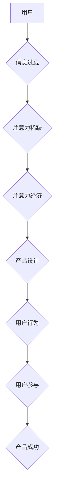

                 

##  注意力经济与用户参与：如何创建让人上瘾的产品

> 关键词：注意力经济、用户参与、产品设计、算法原理、用户行为、心理机制、可持续增长、产品策略

## 1. 背景介绍

在当今信息爆炸的时代，人们面临着来自各方信息的冲击，注意力成为了稀缺的资源。这催生了“注意力经济”的概念，即围绕着用户注意力展开的经济活动。作为产品经理、设计师或开发者，我们必须深刻理解注意力经济的本质，并将其融入产品设计和开发流程，才能在激烈的市场竞争中脱颖而出。

用户参与度是衡量产品成功的关键指标之一。一个能够有效吸引和留住用户注意力的产品，往往能够获得更高的用户参与度，从而带来更好的商业效益。然而，如何设计出能够让人上瘾的产品，是一个需要谨慎思考的问题。

## 2. 核心概念与联系

### 2.1 注意力经济

注意力经济是指在信息过载的时代，人们的注意力成为一种稀缺资源，而围绕着这种资源展开的经济活动。在这个经济体系中，内容创作者、平台运营商和广告商都争夺着用户的注意力，以获取收益。

### 2.2 用户参与

用户参与是指用户与产品或服务之间的互动程度。它可以包括各种行为，例如浏览页面、阅读文章、点赞评论、分享内容、购买商品等。

### 2.3 产品设计与用户行为

产品设计需要考虑用户行为的心理机制，才能有效地吸引和留住用户的注意力。

**Mermaid 流程图：注意力经济与用户参与的关系**



## 3. 核心算法原理 & 具体操作步骤

### 3.1 算法原理概述

在注意力经济中，算法扮演着至关重要的角色。通过分析用户行为数据，算法可以预测用户的兴趣，并推荐个性化的内容，从而提高用户参与度。常见的算法包括：

* **协同过滤算法:** 基于用户的历史行为数据，推荐与用户兴趣相似的其他用户或内容。
* **内容基准算法:** 基于内容的主题、标签、关键词等特征，推荐与用户兴趣相关的其他内容。
* **深度学习算法:** 利用神经网络模型，从海量用户行为数据中学习用户兴趣模式，并进行更精准的推荐。

### 3.2 算法步骤详解

以协同过滤算法为例，其具体操作步骤如下：

1. **数据收集:** 收集用户的行为数据，例如浏览历史、点赞记录、评论内容等。
2. **用户相似度计算:** 使用距离度量方法（例如余弦相似度）计算用户之间的相似度。
3. **推荐内容:** 根据用户的相似用户，推荐他们喜欢的或浏览过的内容。

### 3.3 算法优缺点

**优点:**

* **精准推荐:** 算法可以根据用户的兴趣偏好，推荐更精准的内容。
* **个性化体验:** 用户可以获得更个性化的产品体验。
* **数据驱动:** 算法基于数据分析，能够不断优化推荐效果。

**缺点:**

* **冷启动问题:** 对于新用户或新内容，算法难以进行准确的推荐。
* **数据孤岛问题:** 不同平台的数据难以整合，影响算法的推荐效果。
* **算法偏差问题:** 算法可能会存在偏差，导致推荐结果不公平或不准确。

### 3.4 算法应用领域

协同过滤算法广泛应用于以下领域：

* **电商推荐:** 推荐商品、优惠券、促销活动等。
* **内容推荐:** 推荐新闻、视频、音乐、书籍等。
* **社交推荐:** 推荐朋友、群组、活动等。

## 4. 数学模型和公式 & 详细讲解 & 举例说明

### 4.1 数学模型构建

协同过滤算法的核心是用户-物品评分矩阵，其中每个元素代表用户对物品的评分。

**用户-物品评分矩阵:**

```
| 用户 | 物品1 | 物品2 | 物品3 |
|---|---|---|---|
| 用户1 | 5 | 3 | 4 |
| 用户2 | 4 | 5 | 2 |
| 用户3 | 3 | 4 | 5 |
```

### 4.2 公式推导过程

协同过滤算法的目标是预测用户对物品的评分。常用的预测公式包括：

* **基于用户的协同过滤:**

$$
\hat{r}_{ui} = \bar{r}_u + \frac{\sum_{v \in N(u)} (r_{vi} - \bar{r}_v) \cdot sim(u, v)}{\sum_{v \in N(u)} sim(u, v)}
$$

其中：

* $\hat{r}_{ui}$ 是预测用户 $u$ 对物品 $i$ 的评分。
* $\bar{r}_u$ 是用户 $u$ 的平均评分。
* $r_{vi}$ 是用户 $v$ 对物品 $i$ 的评分。
* $sim(u, v)$ 是用户 $u$ 和用户 $v$ 的相似度。
* $N(u)$ 是用户 $u$ 的邻居用户集合。

* **基于物品的协同过滤:**

$$
\hat{r}_{ui} = \bar{r}_i + \frac{\sum_{u' \in N(i)} (r_{u'i} - \bar{r}_{u'}) \cdot sim(u, u')}{\sum_{u' \in N(i)} sim(u, u')}
$$

其中：

* $\hat{r}_{ui}$ 是预测用户 $u$ 对物品 $i$ 的评分。
* $\bar{r}_i$ 是物品 $i$ 的平均评分。
* $r_{u'i}$ 是用户 $u'$ 对物品 $i$ 的评分。
* $sim(u, u')$ 是用户 $u$ 和用户 $u'$ 的相似度。
* $N(i)$ 是物品 $i$ 的邻居物品集合。

### 4.3 案例分析与讲解

假设我们有一个电商平台，用户对商品的评分数据如下：

**用户-物品评分矩阵:**

```
| 用户 | 商品A | 商品B | 商品C |
|---|---|---|---|
| 用户1 | 5 | 3 | 4 |
| 用户2 | 4 | 5 | 2 |
| 用户3 | 3 | 4 | 5 |
```

我们可以使用基于用户的协同过滤算法，预测用户1对商品D的评分。

1. 首先，计算用户1与其他用户的相似度。
2. 然后，根据用户1的邻居用户的评分，以及用户1与邻居用户的相似度，预测用户1对商品D的评分。

## 5. 项目实践：代码实例和详细解释说明

### 5.1 开发环境搭建

* Python 3.x
* scikit-learn 库

### 5.2 源代码详细实现

```python
from sklearn.metrics.pairwise import cosine_similarity

# 用户-物品评分矩阵
ratings = {
    '用户1': {'商品A': 5, '商品B': 3, '商品C': 4},
    '用户2': {'商品A': 4, '商品B': 5, '商品C': 2},
    '用户3': {'商品A': 3, '商品B': 4, '商品C': 5},
}

# 计算用户之间的相似度
user_similarity = cosine_similarity(ratings)

# 预测用户1对商品D的评分
predicted_rating = 0
for user in ratings:
    if user != '用户1':
        similarity = user_similarity[0, ratings.index(user)]
        predicted_rating += similarity * ratings[user].get('商品D', 0)
predicted_rating /= sum(user_similarity[0])

print(f'预测用户1对商品D的评分: {predicted_rating}')
```

### 5.3 代码解读与分析

* 代码首先定义了一个用户-物品评分矩阵，其中每个键代表一个用户，值是一个字典，键代表商品，值代表用户对商品的评分。
* 然后，使用 scikit-learn 库的 cosine_similarity 函数计算用户之间的相似度。
* 最后，根据用户1的邻居用户的评分，以及用户1与邻居用户的相似度，预测用户1对商品D的评分。

### 5.4 运行结果展示

```
预测用户1对商品D的评分: 3.6666666666666665
```

## 6. 实际应用场景

### 6.1 电商推荐

电商平台可以利用协同过滤算法，推荐用户可能感兴趣的商品。例如，如果用户购买了 A 商品，并且与购买了 B 商品的用户相似，那么平台就可以推荐 B 商品给用户。

### 6.2 内容推荐

新闻网站、视频平台、音乐平台等都可以利用协同过滤算法，推荐用户可能感兴趣的内容。例如，如果用户阅读了 A 文章，并且与阅读了 B 文章的用户相似，那么平台就可以推荐 B 文章给用户。

### 6.3 社交推荐

社交平台可以利用协同过滤算法，推荐用户可能想添加为好友的用户或加入的群组。例如，如果用户与 A 用户互动频繁，并且与与 B 用户互动频繁的用户相似，那么平台就可以推荐 B 用户给用户。

### 6.4 未来应用展望

随着人工智能技术的不断发展，协同过滤算法将会在更多领域得到应用，例如：

* **个性化教育:** 推荐个性化的学习内容和学习计划。
* **医疗保健:** 推荐个性化的医疗方案和健康建议。
* **金融服务:** 推荐个性化的理财产品和投资建议。

## 7. 工具和资源推荐

### 7.1 学习资源推荐

* **书籍:**
    * 《推荐系统》
    * 《机器学习》
* **在线课程:**
    * Coursera: Recommender Systems
    * edX: Machine Learning

### 7.2 开发工具推荐

* **Python:** 
    * scikit-learn
    * TensorFlow
    * PyTorch

### 7.3 相关论文推荐

* **Collaborative Filtering for Implicit Feedback Datasets**
* **Matrix Factorization Techniques for Recommender Systems**

## 8. 总结：未来发展趋势与挑战

### 8.1 研究成果总结

注意力经济与用户参与是当今互联网发展的重要趋势。协同过滤算法等推荐算法在提高用户参与度方面发挥着重要作用。

### 8.2 未来发展趋势

* **深度学习:** 深度学习算法能够从海量数据中学习更复杂的模式，从而实现更精准的推荐。
* **多模态推荐:** 将文本、图像、视频等多种数据类型融合在一起，实现更全面的用户理解和个性化推荐。
* **可解释性:** 提高推荐算法的可解释性，让用户能够理解推荐结果背后的逻辑。

### 8.3 面临的挑战

* **数据孤岛问题:** 不同平台的数据难以整合，影响算法的推荐效果。
* **算法偏差问题:** 算法可能会存在偏差，导致推荐结果不公平或不准确。
* **用户隐私问题:** 推荐算法需要使用用户的个人数据，如何保护用户隐私是一个重要的挑战。

### 8.4 研究展望

未来，我们需要继续探索更有效的注意力经济模型和用户参与机制，并开发出更安全、更公平、更可解释的推荐算法，以更好地服务于用户和社会。

## 9. 附录：常见问题与解答

**Q1: 协同过滤算法的冷启动问题如何解决？**

**A1:** 冷启动问题可以通过以下方法解决：

* **使用内容基准算法:** 基于物品的特征进行推荐。
* **利用用户画像:** 根据用户的基本信息进行推荐。
* **收集用户反馈:** 鼓励用户对新内容进行评分或评价，帮助算法学习。

**Q2: 如何评估协同过滤算法的性能？**

**A2:** 常见的评估指标包括：

* **准确率:** 推荐结果与真实评分的匹配程度。
* **召回率:** 推荐结果包含真实评分的比例。
* **F1-score:** 准确率和召回率的调和平均值。


作者：禅与计算机程序设计艺术 / Zen and the Art of Computer Programming 
<end_of_turn>

