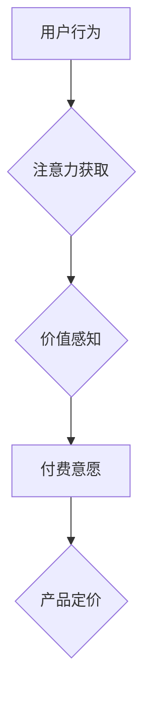

                 

##  注意力经济对企业产品定价的新要求

> 关键词：注意力经济、产品定价、用户行为、价值评估、算法模型、数据驱动

## 1. 背景介绍

在当今信息爆炸的时代，人们面临着来自各方信息的冲击，注意力已成为稀缺的资源。这被称为“注意力经济”，其核心是人们对信息的筛选和选择，而企业的产品和服务正是争夺用户注意力的焦点。

传统的产品定价模型往往基于成本加成、市场竞争等因素，但随着注意力经济的兴起，单纯依靠这些因素已难以准确反映产品价值。用户对信息的接受和付费意愿，很大程度上取决于其对产品的注意力和兴趣。因此，企业需要重新思考产品定价策略，将注意力经济的原理融入其中，才能在竞争激烈的市场中脱颖而出。

## 2. 核心概念与联系

### 2.1 注意力经济

注意力经济是指在信息过载的时代，人们对信息的筛选和选择成为一种重要的经济活动。注意力是一种稀缺资源，而能够有效吸引和获取用户注意力的产品和服务，就拥有了更高的价值。

### 2.2 产品定价

产品定价是指企业根据产品价值、成本、市场需求等因素，设定产品的销售价格。传统的定价模型主要包括成本加成定价、竞争性定价、价值定价等。

### 2.3 联系

注意力经济对产品定价提出了新的要求。用户对产品的注意力和兴趣，直接影响着其对产品的感知价值和付费意愿。因此，企业需要将注意力经济的原理融入产品定价策略中，才能更准确地评估产品价值，制定合理的定价方案。

**Mermaid 流程图**



## 3. 核心算法原理 & 具体操作步骤

### 3.1 算法原理概述

注意力经济的产品定价算法，本质上是通过分析用户行为数据，预测用户对产品的注意力和兴趣，从而评估产品的价值，并制定相应的定价策略。

常用的算法包括：

* **回归算法:** 通过训练数据，建立用户注意力和产品特征之间的关系，预测用户对产品的注意力得分。
* **分类算法:** 将用户分为不同注意力水平的群体，并根据群体特征，制定不同的定价策略。
* **深度学习算法:** 利用神经网络，学习用户行为数据中的复杂模式，更准确地预测用户注意力和付费意愿。

### 3.2 算法步骤详解

1. **数据收集:** 收集用户行为数据，包括用户浏览记录、点击记录、停留时间、购买记录等。
2. **数据预处理:** 对收集到的数据进行清洗、转换和特征工程，以便于算法训练。
3. **模型选择:** 根据具体需求选择合适的算法模型，例如线性回归、逻辑回归、决策树、支持向量机、深度神经网络等。
4. **模型训练:** 使用训练数据训练选定的算法模型，并评估模型的性能。
5. **模型部署:** 将训练好的模型部署到生产环境中，用于预测用户对产品的注意力和付费意愿。
6. **定价策略制定:** 根据模型预测结果，制定相应的定价策略，例如动态定价、个性化定价、捆绑定价等。

### 3.3 算法优缺点

**优点:**

* 数据驱动，能够更准确地评估产品价值。
* 能够根据用户行为变化，动态调整定价策略。
* 能够实现个性化定价，提高用户体验。

**缺点:**

* 需要大量用户行为数据进行训练。
* 模型训练和部署需要一定的技术成本。
* 算法结果可能受到数据质量和模型选择的影响。

### 3.4 算法应用领域

注意力经济的产品定价算法，广泛应用于以下领域:

* **电商平台:** 根据用户浏览记录和购买历史，动态调整商品价格。
* **内容平台:** 根据用户阅读时长和点赞数，制定内容付费策略。
* **广告平台:** 根据用户兴趣和行为特征，精准投放广告，提高广告转化率。
* **游戏平台:** 根据玩家游戏时长和付费行为，制定游戏道具和虚拟货币价格。

## 4. 数学模型和公式 & 详细讲解 & 举例说明

### 4.1 数学模型构建

注意力经济的产品定价模型，可以基于用户行为数据构建一个预测模型，例如线性回归模型。

**线性回归模型:**

$$
P = a + b_1 * X_1 + b_2 * X_2 + ... + b_n * X_n
$$

其中:

* $P$：预测的用户付费意愿
* $a$：截距项
* $b_1, b_2, ..., b_n$：各个用户行为特征的权重系数
* $X_1, X_2, ..., X_n$：用户行为特征，例如浏览时长、点击次数、购买次数等

### 4.2 公式推导过程

通过最小二乘法，可以求解出模型参数 $a$ 和 $b_1, b_2, ..., b_n$。

### 4.3 案例分析与讲解

假设我们有一个电商平台，想要预测用户对产品的付费意愿。我们可以收集用户浏览记录、点击记录、购买记录等数据，构建一个线性回归模型。

例如，我们可以将浏览时长、点击次数和购买次数作为用户行为特征，预测用户对产品的付费意愿。通过训练模型，我们可以得到各个特征的权重系数，例如：

* 浏览时长：0.2
* 点击次数：0.3
* 购买次数：0.5

这意味着，用户浏览时长对付费意愿的影响相对较小，而购买次数对付费意愿的影响最大。

## 5. 项目实践：代码实例和详细解释说明

### 5.1 开发环境搭建

* Python 3.x
* Jupyter Notebook
* pandas
* scikit-learn

### 5.2 源代码详细实现

```python
import pandas as pd
from sklearn.linear_model import LinearRegression

# 加载数据
data = pd.read_csv('user_behavior_data.csv')

# 选择特征和目标变量
X = data[['浏览时长', '点击次数', '购买次数']]
y = data['付费意愿']

# 创建线性回归模型
model = LinearRegression()

# 训练模型
model.fit(X, y)

# 获取模型参数
print(model.intercept_)
print(model.coef_)
```

### 5.3 代码解读与分析

* 首先，我们加载用户行为数据，并选择特征和目标变量。
* 然后，我们创建线性回归模型，并使用训练数据训练模型。
* 最后，我们获取模型参数，例如截距项和特征权重系数。

### 5.4 运行结果展示

运行代码后，我们可以得到模型参数，例如：

* 截距项：0.5
* 浏览时长权重系数：0.2
* 点击次数权重系数：0.3
* 购买次数权重系数：0.5

这些参数可以用于预测用户对产品的付费意愿。

## 6. 实际应用场景

### 6.1 电商平台

电商平台可以利用注意力经济的产品定价算法，根据用户的浏览记录、点击记录、购买记录等数据，动态调整商品价格，提高转化率。例如，对于经常购买特定商品的用户，可以提供更优惠的价格，以增强用户粘性。

### 6.2 内容平台

内容平台可以根据用户的阅读时长、点赞数、评论数等数据，制定内容付费策略。例如，对于用户阅读时长较长的文章，可以提供更优惠的订阅价格，以鼓励用户付费阅读优质内容。

### 6.3 广告平台

广告平台可以根据用户的兴趣和行为特征，精准投放广告，提高广告转化率。例如，对于用户经常浏览科技类网站的用户，可以投放科技类广告，提高广告点击率和转化率。

### 6.4 未来应用展望

随着人工智能技术的不断发展，注意力经济的产品定价算法将更加智能化和个性化。未来，我们可以期待以下应用场景：

* **更精准的个性化定价:** 通过更深入的用户行为分析，实现更精准的个性化定价，满足不同用户群体的需求。
* **动态调整定价策略:** 根据实时用户行为变化，动态调整定价策略，实现更灵活的定价机制。
* **多维度数据融合:** 将用户行为数据、产品特征数据、市场环境数据等多维度数据融合，构建更全面的产品定价模型。

## 7. 工具和资源推荐

### 7.1 学习资源推荐

* **书籍:**

    * 《注意力经济》
    * 《数据驱动产品决策》
    * 《机器学习实战》

* **在线课程:**

    * Coursera: 数据科学
    * edX: 机器学习
    * Udemy: Python数据分析

### 7.2 开发工具推荐

* **Python:** 强大的数据分析和机器学习编程语言。
* **pandas:** 数据分析和处理库。
* **scikit-learn:** 机器学习库。
* **TensorFlow:** 深度学习框架。

### 7.3 相关论文推荐

* **Attention Is All You Need**
* **BERT: Pre-training of Deep Bidirectional Transformers for Language Understanding**
* **Deep Learning for Product Recommendation**

## 8. 总结：未来发展趋势与挑战

### 8.1 研究成果总结

注意力经济的产品定价算法，为企业提供了新的思路和方法，能够更准确地评估产品价值，制定合理的定价策略。

### 8.2 未来发展趋势

未来，注意力经济的产品定价算法将更加智能化和个性化，并与其他技术融合，例如：

* **大数据分析:** 利用更丰富的数据进行分析，构建更精准的模型。
* **人工智能:** 利用人工智能技术，实现更智能的定价策略。
* **区块链技术:** 利用区块链技术，实现更透明和可信的定价机制。

### 8.3 面临的挑战

注意力经济的产品定价算法也面临着一些挑战，例如：

* **数据隐私:** 如何保护用户数据隐私，是需要认真考虑的问题。
* **算法公平性:** 算法模型可能存在偏见，需要确保算法公平性。
* **监管政策:** 政府监管政策对注意力经济的产品定价算法的影响，需要持续关注。

### 8.4 研究展望

未来，我们需要继续深入研究注意力经济的产品定价算法，解决算法中的技术难题，并探索其在更多领域的应用，为企业提供更有效的定价解决方案。

## 9. 附录：常见问题与解答

* **Q1: 注意力经济的产品定价算法需要多少数据才能训练？**

* **A1:** 训练模型所需的的数据量取决于模型复杂度和数据质量。一般来说，需要收集至少几千条用户行为数据才能训练一个有效的模型。

* **Q2: 注意力经济的产品定价算法是否会侵犯用户隐私？**

* **A2:**  在使用注意力经济的产品定价算法时，需要确保用户数据隐私的保护。例如，可以采用匿名化技术，将用户个人信息脱敏处理。

* **Q3: 注意力经济的产品定价算法是否适用于所有行业？**

* **A3:**  注意力经济的产品定价算法可以应用于许多行业，例如电商、内容平台、广告平台等。但具体应用场景需要根据行业特点进行调整。


作者：禅与计算机程序设计艺术 / Zen and the Art of Computer Programming 
<end_of_turn>

