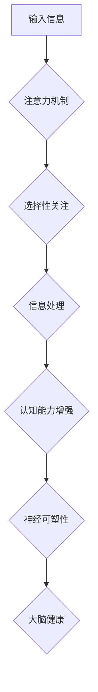

                 

## 1. 背景介绍

在当今信息爆炸的时代，注意力已成为至关重要的认知能力。然而，现代生活节奏快，信息纷繁，人们的注意力持续受到干扰，注意力缺陷问题日益突出。这不仅影响了学习、工作效率，也可能导致心理健康问题。

注意力训练旨在通过特定的练习和方法，增强个体的注意力能力，提高专注力、记忆力和认知控制力。近年来，随着神经科学和认知心理学研究的深入，注意力训练逐渐成为提升认知能力和神经可塑性的热门话题。

## 2. 核心概念与联系

### 2.1 注意力机制

注意力机制是生物神经网络中的一种重要功能，它允许我们从大量信息中筛选出与当前任务相关的关键信息，并对其进行深入处理。

注意力机制的核心在于“选择性关注”。大脑会根据任务需求和环境变化，动态地分配有限的认知资源，优先关注与目标相关的信息，抑制无关信息的影响。

### 2.2 神经可塑性

神经可塑性是指大脑神经元连接和功能在使用和学习过程中不断变化的能力。

注意力训练通过反复的练习，可以改变大脑神经元之间的连接强度和活动模式，从而增强注意力网络的效率和稳定性，促进神经可塑性。

### 2.3 注意力训练与大脑增强

注意力训练通过增强注意力机制，促进神经可塑性，从而达到以下目标：

* **提高专注力:** 增强对目标信息的持续关注，减少分心和干扰。
* **增强记忆力:** 提高对关键信息的编码和存储能力。
* **提升认知控制力:** 增强对思维过程的调节和控制能力，提高决策和解决问题的能力。
* **促进大脑健康:** 增强大脑的适应性和抗应激能力，预防认知衰退。

**Mermaid 流程图**



## 3. 核心算法原理 & 具体操作步骤

### 3.1 算法原理概述

注意力训练算法通常基于深度学习模型，例如Transformer网络，其核心思想是通过学习注意力机制，模拟大脑对信息的筛选和处理过程。

这些算法通过训练模型对不同类型的信息进行加权，突出重要信息，抑制无关信息，从而提高模型的注意力能力。

### 3.2 算法步骤详解

1. **数据预处理:** 收集和预处理训练数据，例如文本、图像、音频等，将其转换为模型可识别的格式。
2. **模型构建:** 选择合适的深度学习模型架构，例如Transformer网络，并根据任务需求进行调整。
3. **模型训练:** 使用训练数据训练模型，通过反向传播算法优化模型参数，使其能够有效地学习注意力机制。
4. **模型评估:** 使用测试数据评估模型的性能，例如准确率、召回率、F1-score等，并根据评估结果进行模型调优。
5. **模型部署:** 将训练好的模型部署到实际应用场景中，例如注意力训练应用程序、认知增强设备等。

### 3.3 算法优缺点

**优点:**

* **高精度:** 深度学习模型能够学习复杂的注意力机制，实现高精度的注意力训练。
* **可扩展性:** 这些算法可以应用于各种类型的数据，并可以根据任务需求进行扩展。
* **自动化:** 模型训练过程可以自动化，无需人工干预。

**缺点:**

* **数据依赖:** 深度学习模型需要大量的训练数据才能达到最佳性能。
* **计算资源:** 训练深度学习模型需要大量的计算资源和时间。
* **黑盒效应:** 深度学习模型的内部工作机制难以理解，缺乏可解释性。

### 3.4 算法应用领域

注意力训练算法在以下领域具有广泛的应用前景:

* **教育:** 提高学生的注意力和学习效率。
* **医疗:** 治疗注意力缺陷障碍 (ADHD) 和其他认知障碍。
* **游戏:** 增强游戏玩家的反应速度和决策能力。
* **人机交互:** 开发更智能和人性化的交互系统。

## 4. 数学模型和公式 & 详细讲解 & 举例说明

### 4.1 数学模型构建

注意力机制通常使用一个注意力权重来表示对不同输入信息的关注程度。

注意力权重可以通过以下公式计算:

$$
\text{Attention}(Q, K, V) = \text{softmax}(\frac{Q K^T}{\sqrt{d_k}}) V
$$

其中:

* $Q$ 是查询矩阵，表示需要关注的信息。
* $K$ 是键矩阵，表示所有输入信息的特征。
* $V$ 是值矩阵，表示所有输入信息的具体内容。
* $d_k$ 是键向量的维度。
* $\text{softmax}$ 函数将注意力权重归一化到 [0, 1] 之间。

### 4.2 公式推导过程

注意力权重计算过程可以分为以下步骤:

1. 计算查询矩阵 $Q$ 和键矩阵 $K$ 的点积，得到一个得分矩阵。
2. 对得分矩阵进行归一化，使用 $\text{softmax}$ 函数将得分转换为注意力权重。
3. 将注意力权重与值矩阵 $V$ 进行加权求和，得到最终的输出。

### 4.3 案例分析与讲解

例如，在机器翻译任务中，查询矩阵 $Q$ 表示目标语言的词嵌入，键矩阵 $K$ 和值矩阵 $V$ 表示源语言的词嵌入。

注意力机制可以学习到哪些源语言词语与目标语言词语相关，并根据这些关系进行翻译。

## 5. 项目实践：代码实例和详细解释说明

### 5.1 开发环境搭建

* Python 3.7+
* TensorFlow/PyTorch 深度学习框架
* Jupyter Notebook 或其他代码编辑器

### 5.2 源代码详细实现

```python
import tensorflow as tf

# 定义注意力机制
def attention_mechanism(query, key, value, mask=None):
    # 计算得分矩阵
    scores = tf.matmul(query, key, transpose_b=True) / tf.math.sqrt(tf.shape(key)[-1])
    # 应用掩码
    if mask is not None:
        scores += (1 - mask) * -1e9
    # 计算注意力权重
    attention_weights = tf.nn.softmax(scores, axis=-1)
    # 加权求和
    context_vector = tf.matmul(attention_weights, value)
    return context_vector, attention_weights

# 示例代码
query = tf.random.normal([1, 5, 128])
key = tf.random.normal([1, 10, 128])
value = tf.random.normal([1, 10, 256])

context_vector, attention_weights = attention_mechanism(query, key, value)
print(context_vector.shape)
print(attention_weights.shape)
```

### 5.3 代码解读与分析

* `attention_mechanism` 函数实现了一个基本的注意力机制。
* `scores` 计算了查询向量与键向量的点积，得分矩阵表示不同键向量与查询向量的相关性。
* `softmax` 函数将得分转换为注意力权重，权重表示对不同键向量的关注程度。
* `context_vector` 是通过对值向量进行加权求和得到的，权重由注意力权重决定。

### 5.4 运行结果展示

运行代码后，会输出 `context_vector` 和 `attention_weights` 的形状，分别表示注意力机制的输出向量和注意力权重矩阵。

## 6. 实际应用场景

### 6.1 教育领域

注意力训练应用程序可以帮助学生提高专注力，增强学习效率。例如，一些应用程序提供专注力训练游戏，通过设定目标和计时器，引导学生集中注意力，并提供反馈和奖励机制。

### 6.2 医疗领域

注意力训练可以作为治疗注意力缺陷障碍 (ADHD) 和其他认知障碍的一种辅助手段。

通过专门设计的注意力训练程序，可以帮助患者提高注意力、记忆力和执行功能。

### 6.3 游戏领域

注意力训练可以增强游戏玩家的反应速度和决策能力。例如，一些游戏设计了需要玩家快速反应和做出判断的关卡，通过训练玩家的注意力，提高游戏体验。

### 6.4 未来应用展望

随着注意力训练技术的不断发展，其应用场景将更加广泛。例如，可以开发更智能的虚拟助手，通过注意力训练，更好地理解用户的需求和意图。

## 7. 工具和资源推荐

### 7.1 学习资源推荐

* **书籍:**

* 《深度学习》 by Ian Goodfellow, Yoshua Bengio, and Aaron Courville
* 《注意力机制》 by Christopher Manning

* **在线课程:**

* Coursera: 深度学习 Specialization
* edX: Artificial Intelligence

### 7.2 开发工具推荐

* **TensorFlow:** 开源深度学习框架
* **PyTorch:** 开源深度学习框架
* **Jupyter Notebook:** 代码编辑器和交互式笔记本

### 7.3 相关论文推荐

* "Attention Is All You Need" by Vaswani et al.
* "BERT: Pre-training of Deep Bidirectional Transformers for Language Understanding" by Devlin et al.

## 8. 总结：未来发展趋势与挑战

### 8.1 研究成果总结

注意力训练技术取得了显著的进展，在认知增强、医疗治疗、教育等领域展现出巨大的潜力。

深度学习模型能够有效地学习注意力机制，提高注意力训练的精度和效率。

### 8.2 未来发展趋势

* **个性化注意力训练:** 根据个体差异，定制化注意力训练方案，提高训练效果。
* **多模态注意力训练:** 将文本、图像、音频等多种模态信息融合到注意力训练中，增强训练效果。
* **脑机接口结合:** 将注意力训练与脑机接口技术结合，实现更直接的脑功能调节。

### 8.3 面临的挑战

* **数据获取和标注:** 高质量的注意力训练数据难以获取和标注。
* **模型解释性和可信度:** 深度学习模型的内部工作机制难以理解，缺乏可解释性和可信度。
* **伦理和安全问题:** 注意力训练技术可能带来伦理和安全问题，例如信息操控和隐私泄露。

### 8.4 研究展望

未来，注意力训练技术将继续发展，并应用于更广泛的领域。

需要加强对数据获取、模型解释性和伦理问题的研究，确保注意力训练技术安全、有效地应用于人类社会。

## 9. 附录：常见问题与解答

### 9.1 注意力训练需要多长时间才能看到效果？

注意力训练的效果因人而异，一般需要持续练习一段时间才能看到明显的效果。

建议每天坚持练习 15-30 分钟，每周至少练习 3-5 次。

### 9.2 注意力训练适合所有人群吗？

注意力训练一般适合大多数人群，但对于一些特定人群，例如患有严重认知障碍的人群，需要在专业医生的指导下进行。

### 9.3 注意力训练有哪些副作用？

注意力训练一般没有明显的副作用，但如果过度训练，可能会导致疲劳和头痛。

建议在训练过程中注意休息，避免过度疲劳。

作者：禅与计算机程序设计艺术 / Zen and the Art of Computer Programming


<end_of_turn>

