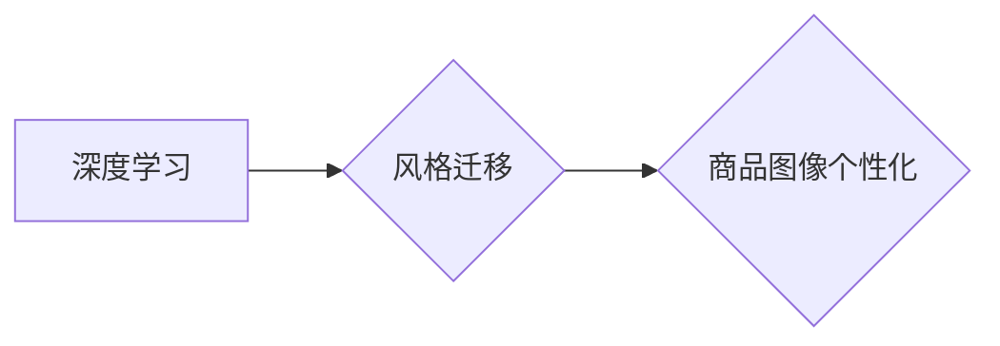

                 

## 深度学习驱动的商品图像风格迁移个性化

> 关键词：深度学习、风格迁移、商品图像、个性化、图像处理、卷积神经网络、生成对抗网络

## 1. 背景介绍

随着电商平台的蓬勃发展，商品图像在消费者决策中扮演着越来越重要的角色。高质量、吸引人的商品图像能够显著提升转化率，促进销售。然而，传统的商品图像拍摄方式往往受限于成本、时间和场景等因素，难以满足消费者对个性化商品展示的需求。

深度学习技术近年来取得了飞速发展，尤其是在图像处理领域展现出强大的潜力。风格迁移技术作为深度学习的一个重要分支，能够将一种图像的风格迁移到另一幅图像上，从而实现图像的个性化定制。将风格迁移技术应用于商品图像，可以为消费者提供更加个性化的购物体验，提升商品的吸引力。

## 2. 核心概念与联系

### 2.1  风格迁移

风格迁移是指将一幅图像的风格特征迁移到另一幅图像上，保留目标图像的内容，同时赋予其新的艺术风格。

### 2.2  商品图像个性化

商品图像个性化是指根据用户的喜好、需求或场景，对商品图像进行定制化处理，使其更加符合用户的审美和需求。

### 2.3  深度学习

深度学习是一种机器学习的子领域，利用多层神经网络来模拟人类大脑的学习过程，能够从海量数据中学习复杂的特征和模式。

**核心概念与联系流程图**



## 3. 核心算法原理 & 具体操作步骤

### 3.1  算法原理概述

深度学习驱动的商品图像风格迁移个性化通常采用生成对抗网络 (GAN) 作为核心算法。GAN 由两个网络组成：生成网络 (Generator) 和判别网络 (Discriminator)。

* **生成网络 (Generator)**：负责生成新的图像，并试图将其风格与目标风格相匹配。
* **判别网络 (Discriminator)**：负责判断图像的真实性，即判断图像是否为真实图像或由生成网络生成的图像。

GAN 通过对抗训练的方式，生成网络不断生成更逼真的图像，而判别网络不断提高其判断能力。最终，生成网络能够生成与目标风格相匹配的个性化商品图像。

### 3.2  算法步骤详解

1. **数据准备**: 收集大量商品图像和目标风格图像，并进行预处理，例如裁剪、缩放、归一化等。
2. **模型搭建**: 搭建生成对抗网络模型，包括生成网络和判别网络。
3. **模型训练**: 使用训练数据对模型进行训练，通过对抗训练的方式，生成网络不断生成更逼真的图像，而判别网络不断提高其判断能力。
4. **风格迁移**: 将用户选择的商品图像作为输入，通过训练好的生成网络进行风格迁移，生成个性化商品图像。

### 3.3  算法优缺点

**优点**:

* **效果逼真**: GAN 能够生成逼真的个性化商品图像，保留目标图像的内容，同时赋予其新的艺术风格。
* **个性化定制**: 可以根据用户的喜好、需求或场景，对商品图像进行定制化处理。
* **自动化程度高**: 整个风格迁移过程可以自动化完成，无需人工干预。

**缺点**:

* **训练复杂**: GAN 的训练过程比较复杂，需要大量的计算资源和训练数据。
* **训练不稳定**: GAN 的训练过程容易出现不稳定现象，例如模式崩溃等。
* **控制性有限**: 对生成的图像风格的控制性有限，难以精确地控制风格迁移效果。

### 3.4  算法应用领域

* **电商**: 个性化商品展示，提升商品吸引力。
* **广告**: 生成个性化的广告图像，提高广告点击率。
* **艺术创作**: 将艺术风格迁移到照片或其他图像上，创作新的艺术作品。
* **游戏**: 生成游戏场景和角色，提升游戏体验。

## 4. 数学模型和公式 & 详细讲解 & 举例说明

### 4.1  数学模型构建

GAN 模型通常由两个神经网络组成：生成网络 (G) 和判别网络 (D)。

* **生成网络 (G)**：输入随机噪声向量 $z$，输出风格迁移后的图像 $G(z)$。
* **判别网络 (D)**：输入图像 $x$，输出判断图像真实性的概率 $D(x)$。

### 4.2  公式推导过程

GAN 的训练目标是让生成网络生成逼真的图像，而判别网络能够准确地判断图像的真实性。

* **生成网络的损失函数**: $L_G = E_{z \sim p_z(z)}[ -log(D(G(z)))]$，目标是最大化判别网络对生成图像的判断概率。
* **判别网络的损失函数**: $L_D = E_{x \sim p_{data}(x)}[ -log(D(x))] + E_{z \sim p_z(z)}[ -log(1 - D(G(z)))]$，目标是最大化判别网络对真实图像的判断概率，同时最小化对生成图像的判断概率。

### 4.3  案例分析与讲解

假设我们想要将梵高的风格迁移到一张普通的风景照片上。

1. 我们需要收集大量的梵高作品和风景照片作为训练数据。
2. 我们搭建一个 GAN 模型，其中生成网络负责将随机噪声向量转换为风格迁移后的图像，判别网络负责判断图像的真实性。
3. 我们使用训练数据对模型进行训练，让生成网络学习梵高的风格特征，并将其迁移到风景照片上。
4. 训练完成后，我们可以将新的风景照片作为输入，通过训练好的生成网络进行风格迁移，生成具有梵高风格的个性化图像。

## 5. 项目实践：代码实例和详细解释说明

### 5.1  开发环境搭建

* **操作系统**: Ubuntu 18.04 或更高版本
* **编程语言**: Python 3.6 或更高版本
* **深度学习框架**: TensorFlow 或 PyTorch
* **其他依赖**: numpy, matplotlib, opencv-python 等

### 5.2  源代码详细实现

```python
# 导入必要的库
import tensorflow as tf

# 定义生成网络
def generator(input_shape):
    # ...

# 定义判别网络
def discriminator(input_shape):
    # ...

# 定义损失函数和优化器
loss_fn = tf.keras.losses.BinaryCrossentropy()
optimizer_G = tf.keras.optimizers.Adam(learning_rate=0.0002)
optimizer_D = tf.keras.optimizers.Adam(learning_rate=0.0002)

# 定义训练循环
def train_step(images, style_images):
    # ...

# 训练模型
for epoch in range(epochs):
    for batch in dataset:
        # ...

# 保存模型
model.save("style_transfer_model.h5")

```

### 5.3  代码解读与分析

* **生成网络**: 负责将随机噪声向量转换为风格迁移后的图像。
* **判别网络**: 负责判断图像的真实性。
* **损失函数**: 用于衡量生成网络和判别网络的性能。
* **优化器**: 用于更新生成网络和判别网络的权重。
* **训练循环**: 用于训练生成网络和判别网络。

### 5.4  运行结果展示

训练完成后，我们可以将新的商品图像作为输入，通过训练好的生成网络进行风格迁移，生成具有目标风格的个性化商品图像。

## 6. 实际应用场景

### 6.1  电商平台

* **个性化商品展示**: 根据用户的喜好、购买历史等信息，为用户推荐具有特定风格的商品图像，提升用户体验。
* **虚拟试衣间**: 利用风格迁移技术，将用户的照片与商品图像融合，实现虚拟试衣间功能，提升用户购物决策的信心。
* **商品创意设计**: 为设计师提供新的创意灵感，通过风格迁移技术，将不同的艺术风格应用于商品设计，创造出更具吸引力的商品。

### 6.2  广告营销

* **个性化广告**: 根据用户的兴趣爱好，将广告图像与用户的喜好风格相匹配，提升广告点击率和转化率。
* **品牌形象塑造**: 利用风格迁移技术，将品牌形象融入到广告图像中，增强品牌辨识度和用户记忆点。

### 6.3  艺术创作

* **艺术风格迁移**: 将不同的艺术风格迁移到照片或其他图像上，创作出具有独特艺术风格的图像作品。
* **艺术作品生成**: 利用风格迁移技术，生成具有特定艺术风格的图像作品，为艺术家提供新的创作灵感。

### 6.4  未来应用展望

随着深度学习技术的不断发展，风格迁移技术将有更广泛的应用场景。例如，可以应用于电影特效、游戏场景设计、虚拟现实等领域。

## 7. 工具和资源推荐

### 7.1  学习资源推荐

* **书籍**:
    * 《深度学习》 - Ian Goodfellow, Yoshua Bengio, Aaron Courville
    * 《Generative Deep Learning》 - David Foster
* **在线课程**:
    * Coursera: Deep Learning Specialization
    * Udacity: Deep Learning Nanodegree
* **博客**:
    * https://blog.openai.com/
    * https://towardsdatascience.com/

### 7.2  开发工具推荐

* **深度学习框架**: TensorFlow, PyTorch
* **图像处理库**: OpenCV, Pillow
* **云计算平台**: AWS, Google Cloud, Azure

### 7.3  相关论文推荐

* **《Image Style Transfer Using Convolutional Neural Networks》**: Leon A. Gatys, Alexander S. Ecker, Matthias Bethge
* **《Generative Adversarial Networks》**: Ian Goodfellow, Jean Pouget-Abadie, Mehdi Mirza, Bing Xu, David Warde-Farley, Sherjil Ozair, Aaron Courville, Yoshua Bengio

## 8. 总结：未来发展趋势与挑战

### 8.1  研究成果总结

深度学习驱动的商品图像风格迁移个性化技术取得了显著进展，能够生成逼真的个性化商品图像，为电商、广告营销、艺术创作等领域提供了新的应用场景。

### 8.2  未来发展趋势

* **更高质量的图像生成**: 提升生成网络的生成能力，生成更加逼真、细节丰富的个性化商品图像。
* **更精细的风格控制**: 开发更加精确的风格控制方法，能够更好地满足用户的个性化需求。
* **跨模态风格迁移**: 将风格迁移技术扩展到多模态数据，例如文本、音频等。
* **实时风格迁移**: 开发更加高效的风格迁移算法，实现实时风格迁移，为用户提供更加流畅的体验。

### 8.3  面临的挑战

* **训练数据**: 训练高质量的风格迁移模型需要大量的训练数据，而获取高质量的风格迁移数据仍然是一个挑战。
* **计算资源**: 训练大型深度学习模型需要大量的计算资源，这对于个人开发者和小型企业来说是一个负担。
* **伦理问题**: 风格迁移技术可能被用于制作虚假信息，因此需要关注其伦理问题，并制定相应的规范和政策。

### 8.4  研究展望

未来，我们将继续致力于深度学习驱动的商品图像风格迁移个性化技术的研究，探索更先进的算法、更有效的训练方法，以及更广泛的应用场景，为用户提供更加个性化、更加智能的购物体验。

## 9. 附录：常见问题与解答

**Q1: 风格迁移技术是否会改变商品的本质？**

A1: 风格迁移技术只是改变了商品图像的视觉风格，不会改变商品的本质属性，例如材质、功能等。

**Q2: 风格迁移技术是否会侵犯版权？**

A2: 风格迁移技术本身不会侵犯版权，但如果使用他人作品作为训练数据或生成侵权作品，则可能构成版权侵权。

**Q3: 风格迁移技术是否适用于所有类型的商品图像？**

A3: 风格迁移技术适用于大多数类型的商品图像，但对于一些特殊的商品图像，例如具有复杂纹理或特殊材质的商品图像，效果可能不如预期。


作者：禅与计算机程序设计艺术 / Zen and the Art of Computer Programming 
<end_of_turn>

