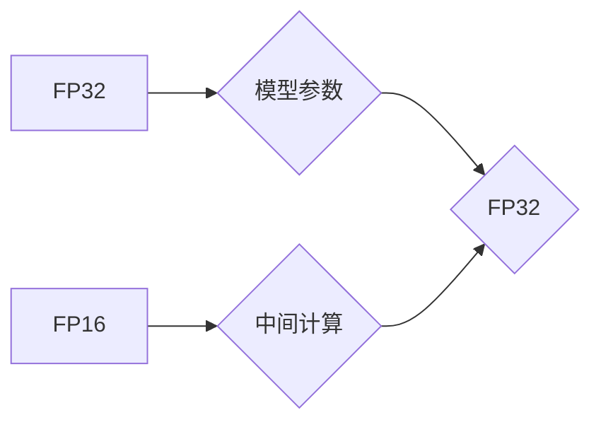

                 

## 混合精度在工业界中的应用

> 关键词：混合精度、深度学习、浮点运算、性能优化、效率提升、TensorFlow、PyTorch

## 1. 背景介绍

深度学习的蓬勃发展推动了人工智能技术的飞速进步，其核心在于训练庞大的神经网络模型。然而，训练这些模型需要大量的计算资源和时间，其中浮点运算占据了主要部分。传统的浮点运算精度（例如单精度 FP32）虽然能够保证计算结果的准确性，但其计算量巨大，导致训练速度缓慢，对硬件资源要求高。

为了解决这一问题，混合精度计算应运而生。混合精度计算是指在深度学习训练过程中，使用不同精度的浮点运算格式，例如 FP32 和 FP16，以平衡计算精度和效率。这种方法能够显著降低模型训练的计算量和内存占用，从而加速训练速度，降低成本，并使深度学习模型能够在更强大的硬件平台上运行。

## 2. 核心概念与联系

混合精度计算的核心概念是利用不同精度浮点运算格式的特性，在不同的计算阶段使用不同的精度，以达到最佳的性能和效率平衡。

**混合精度计算的架构**



**核心概念解释:**

* **FP32:**  标准的单精度浮点运算格式，精度高，但计算量大。
* **FP16:** 半精度浮点运算格式，精度相对较低，但计算量小，速度快。
* **模型参数:**  深度学习模型的权重和偏置等重要参数，通常使用 FP32 存储以保证精度。
* **中间计算:**  深度学习模型的激活函数、卷积运算等计算过程，可以使用 FP16 进行计算以提高效率。

## 3. 核心算法原理 & 具体操作步骤

### 3.1  算法原理概述

混合精度计算的核心原理是将模型训练过程分为不同的阶段，在不同的阶段使用不同的精度浮点运算格式。

* **FP32 阶段:**  模型参数存储和更新使用 FP32 格式，以保证精度。
* **FP16 阶段:**  模型的中间计算使用 FP16 格式，以提高计算速度和降低内存占用。

在训练过程中，FP16 计算结果需要转换为 FP32 格式才能更新模型参数。

### 3.2  算法步骤详解

1. **模型初始化:**  使用 FP32 格式初始化模型参数。
2. **前向传播:**  使用 FP16 格式进行模型的前向传播计算，得到输出结果。
3. **反向传播:**  使用 FP16 格式进行反向传播计算，得到梯度信息。
4. **梯度更新:**  将 FP16 格式的梯度转换为 FP32 格式，并使用 FP32 格式更新模型参数。
5. **重复步骤 2-4:**  重复上述步骤，直到模型训练完成。

### 3.3  算法优缺点

**优点:**

* **提高训练速度:**  使用 FP16 格式计算可以显著降低计算量和内存占用，从而加速训练速度。
* **降低成本:**  加速训练速度可以降低训练成本，例如减少训练时间和硬件资源消耗。
* **支持更大模型:**  混合精度计算可以使训练更大的模型成为可能，因为其降低了硬件资源要求。

**缺点:**

* **精度损失:**  FP16 格式的精度相对较低，可能会导致模型精度下降。
* **硬件支持:**  并非所有硬件平台都支持混合精度计算，需要特定的硬件加速器。
* **代码复杂度:**  实现混合精度计算需要修改代码，增加代码复杂度。

### 3.4  算法应用领域

混合精度计算广泛应用于各种深度学习领域，例如：

* **图像识别:**  加速图像分类、目标检测、图像分割等任务。
* **自然语言处理:**  提高文本分类、机器翻译、问答系统等任务的效率。
* **语音识别:**  加速语音转文本、语音合成等任务。
* **推荐系统:**  提升推荐系统的准确性和效率。

## 4. 数学模型和公式 & 详细讲解 & 举例说明

### 4.1  数学模型构建

混合精度计算的数学模型主要基于浮点运算的精度转换和梯度更新。

* **FP32 到 FP16 的转换:**  可以使用量化技术将 FP32 数值转换为 FP16 数值，例如使用线性量化或非线性量化。
* **FP16 到 FP32 的转换:**  可以使用反量化技术将 FP16 数值转换为 FP32 数值，以保证梯度更新的精度。

### 4.2  公式推导过程

假设一个 FP32 数值 $x$，将其转换为 FP16 数值 $x_{fp16}$，可以使用以下公式：

$$x_{fp16} = \text{quantize}(x, \text{scale}, \text{zero_point})$$

其中，$\text{scale}$ 和 $\text{zero\_point}$ 是量化参数，用于控制 FP16 数值的范围和偏移。

反量化公式为：

$$x = \text{dequantize}(x_{fp16}, \text{scale}, \text{zero\_point})$$

### 4.3  案例分析与讲解

例如，将 FP32 数值 1.23456789 转换为 FP16 数值，可以使用以下步骤：

1. **确定量化参数:**  选择合适的 $\text{scale}$ 和 $\text{zero\_point}$，例如 $\text{scale} = 0.00390625$ 和 $\text{zero\_point} = 0$.
2. **应用量化公式:**  将 FP32 数值 1.23456789 代入量化公式，得到 FP16 数值。
3. **反量化:**  在梯度更新阶段，将 FP16 数值反量化回 FP32 格式，以保证精度。

## 5. 项目实践：代码实例和详细解释说明

### 5.1  开发环境搭建

* **操作系统:**  Linux 或 Windows
* **深度学习框架:**  TensorFlow 或 PyTorch
* **GPU:**  支持混合精度计算的 GPU

### 5.2  源代码详细实现

以下是一个使用 TensorFlow 实现混合精度计算的简单代码示例：

```python
import tensorflow as tf

# 定义一个简单的模型
model = tf.keras.Sequential([
    tf.keras.layers.Dense(10, activation='relu', dtype=tf.float16),
    tf.keras.layers.Dense(1, activation='sigmoid', dtype=tf.float16)
])

# 定义损失函数和优化器
loss_fn = tf.keras.losses.BinaryCrossentropy()
optimizer = tf.keras.optimizers.Adam(learning_rate=0.001)

# 训练模型
for epoch in range(10):
    for batch in dataset:
        with tf.GradientTape() as tape:
            predictions = model(batch)
            loss = loss_fn(batch, predictions)
        gradients = tape.gradient(loss, model.trainable_variables)
        optimizer.apply_gradients(zip(gradients, model.trainable_variables))

# 保存模型
model.save('mixed_precision_model.h5')
```

### 5.3  代码解读与分析

* **dtype=tf.float16:**  指定模型层和训练过程使用 FP16 格式。
* **tf.GradientTape():**  用于记录梯度信息，以便反向传播计算。
* **optimizer.apply_gradients():**  使用优化器更新模型参数。

### 5.4  运行结果展示

训练完成后，可以评估模型的性能，例如使用准确率、召回率等指标。

## 6. 实际应用场景

混合精度计算已在许多实际应用场景中得到广泛应用，例如：

* **图像分类:**  使用混合精度训练的深度学习模型可以实现更高的准确率和更快的训练速度，例如在 ImageNet 图像分类任务中。
* **目标检测:**  混合精度计算可以加速目标检测模型的训练，例如在 COCO 目标检测数据集上。
* **自然语言处理:**  混合精度计算可以提高自然语言处理模型的效率，例如在机器翻译和文本摘要任务中。

### 6.4  未来应用展望

随着硬件平台和深度学习框架的不断发展，混合精度计算将在未来得到更广泛的应用，例如：

* **训练更大模型:**  混合精度计算可以使训练更大的模型成为可能，从而提升模型的性能和能力。
* **部署在边缘设备:**  混合精度计算可以降低模型的计算量和内存占用，使其能够部署在资源有限的边缘设备上。
* **支持新兴应用:**  混合精度计算可以为新兴的深度学习应用，例如自动驾驶、机器人等，提供更强大的计算能力。

## 7. 工具和资源推荐

### 7.1  学习资源推荐

* **TensorFlow 官方文档:**  https://www.tensorflow.org/
* **PyTorch 官方文档:**  https://pytorch.org/
* **混合精度计算论文:**  https://arxiv.org/search/?query=mixed+precision&searchtype=all&source=header

### 7.2  开发工具推荐

* **TensorFlow:**  https://www.tensorflow.org/
* **PyTorch:**  https://pytorch.org/
* **CUDA Toolkit:**  https://developer.nvidia.com/cuda-toolkit

### 7.3  相关论文推荐

* **Mixed Precision Training:**  https://arxiv.org/abs/1710.03740
* **Deep Learning with Mixed Precision:**  https://arxiv.org/abs/1901.08262

## 8. 总结：未来发展趋势与挑战

### 8.1  研究成果总结

混合精度计算在深度学习领域取得了显著的成果，显著提高了模型训练速度和效率，降低了成本，并使训练更大的模型成为可能。

### 8.2  未来发展趋势

未来，混合精度计算的发展趋势包括：

* **更广泛的应用:**  混合精度计算将应用于更多深度学习领域，例如自动驾驶、机器人等。
* **更先进的算法:**  新的混合精度计算算法将不断涌现，进一步提高训练效率和精度。
* **硬件加速:**  新的硬件平台和加速器将专门支持混合精度计算，进一步提升性能。

### 8.3  面临的挑战

混合精度计算也面临一些挑战，例如：

* **精度损失:**  FP16 格式的精度相对较低，需要进一步研究如何有效地控制精度损失。
* **硬件支持:**  并非所有硬件平台都支持混合精度计算，需要推动硬件平台的普及。
* **代码复杂度:**  实现混合精度计算需要修改代码，增加代码复杂度，需要开发更易于使用的工具和框架。

### 8.4  研究展望

未来，混合精度计算的研究方向包括：

* **开发更精确的混合精度算法:**  研究如何有效地控制精度损失，提高模型的准确性。
* **探索新的混合精度应用场景:**  将混合精度计算应用于更多深度学习领域，例如自动驾驶、机器人等。
* **推动硬件平台的普及:**  推动硬件平台对混合精度计算的支持，使其能够更广泛地应用于实际场景。

## 9. 附录：常见问题与解答

**Q1:  混合精度计算的精度损失如何控制？**

**A1:**  可以通过以下方法控制精度损失：

* **选择合适的量化参数:**  确定合适的 $\text{scale}$ 和 $\text{zero\_point}$，以最小化精度损失。
* **使用混合精度训练策略:**  在不同的训练阶段使用不同的精度，例如在训练初期使用 FP32 格式，在后期使用 FP16 格式。
* **使用量化感知训练:**  在训练过程中，使用量化感知的优化算法和损失函数，以最小化量化带来的精度损失。

**Q2:  混合精度计算需要哪些硬件支持？**

**A2:**  混合精度计算需要支持 FP16 格式的硬件加速器，例如 NVIDIA 的 Tensor Cores。

**Q3:  如何选择合适的混合精度计算框架？**

**A3:**  选择合适的混合精度计算框架取决于具体的应用场景和硬件平台。 TensorFlow 和 PyTorch 都是支持混合精度计算的流行深度学习框架。


作者：禅与计算机程序设计艺术 / Zen and the Art of Computer Programming 
<end_of_turn>

