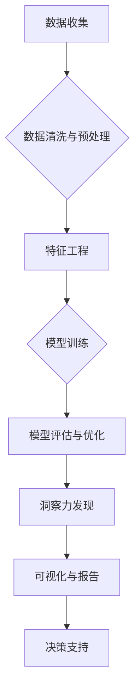

                 

## 理解洞察力的力量：在商业领域的应用

> 关键词：人工智能、洞察力、商业应用、数据分析、机器学习、预测模型、商业决策、数据可视化

### 1. 背景介绍

在当今数据爆炸的时代，企业面临着海量数据的挑战。如何从这些数据中挖掘有价值的洞察力，并将其转化为商业价值，成为企业竞争的关键。人工智能（AI）技术的快速发展为企业提供了强大的工具，帮助他们实现这一目标。AI算法能够从数据中识别出隐藏的模式和趋势，为企业决策提供数据驱动的支持。

传统的商业决策往往依赖于经验和直觉，而AI驱动的洞察力可以提供更客观、更准确的分析结果。通过分析客户行为、市场趋势、竞争对手动态等数据，企业可以更好地了解自身和外部环境，做出更明智的决策。

### 2. 核心概念与联系

**2.1 洞察力的定义**

洞察力是指从数据中识别出隐藏的模式、趋势和关系的能力，并将其转化为有价值的知识和见解。洞察力不仅是发现事实，更重要的是理解这些事实背后的含义，并将其应用于实际问题解决。

**2.2 商业洞察力的重要性**

商业洞察力对于企业成功至关重要。它可以帮助企业：

* **了解客户需求:** 通过分析客户行为和偏好，企业可以更好地了解客户需求，开发更符合市场需求的产品和服务。
* **优化运营效率:** 通过分析运营数据，企业可以识别出流程中的瓶颈和浪费，并采取措施提高运营效率。
* **制定有效的营销策略:** 通过分析市场趋势和竞争对手动态，企业可以制定更有效的营销策略，提高营销效果。
* **降低风险:** 通过分析潜在风险因素，企业可以采取措施降低风险，避免损失。

**2.3 AI在商业洞察力中的作用**

AI技术可以帮助企业从海量数据中挖掘洞察力，并将其转化为可行动的见解。AI算法能够识别出人类难以发现的模式和趋势，并提供更准确、更全面的分析结果。

**2.4 商业洞察力流程**



### 3. 核心算法原理 & 具体操作步骤

**3.1 算法原理概述**

在商业洞察力中，常用的算法包括：

* **机器学习:**  机器学习算法能够从数据中学习模式，并根据这些模式进行预测或分类。常见的机器学习算法包括线性回归、逻辑回归、决策树、支持向量机、神经网络等。
* **深度学习:** 深度学习是机器学习的一个子集，它使用多层神经网络来学习更复杂的模式。深度学习算法在图像识别、自然语言处理等领域取得了突破性进展。
* **数据挖掘:** 数据挖掘算法能够从数据中发现隐藏的模式和关系，例如关联规则、聚类分析、异常检测等。

**3.2 算法步骤详解**

以下以机器学习算法为例，详细说明其步骤：

1. **数据收集:** 收集与业务相关的各种数据，例如销售数据、客户数据、市场数据等。
2. **数据清洗与预处理:** 对收集到的数据进行清洗和预处理，例如删除重复数据、处理缺失值、标准化数据等。
3. **特征工程:** 从原始数据中提取特征，例如客户年龄、购买频率、购买金额等，这些特征将作为机器学习算法的输入。
4. **模型训练:** 选择合适的机器学习算法，并使用训练数据对模型进行训练。训练过程的目标是让模型能够准确地预测或分类新的数据。
5. **模型评估与优化:** 使用测试数据评估模型的性能，并根据评估结果对模型进行优化，例如调整模型参数、选择不同的算法等。
6. **模型部署:** 将训练好的模型部署到生产环境中，用于对实时数据进行预测或分类。

**3.3 算法优缺点**

**优点:**

* **自动化:** AI算法可以自动化数据分析过程，节省人力成本。
* **准确性:** AI算法能够识别出人类难以发现的模式和趋势，提供更准确的分析结果。
* **效率:** AI算法可以快速处理海量数据，提高分析效率。

**缺点:**

* **数据依赖:** AI算法的性能取决于数据的质量和数量。
* **解释性:** 一些AI算法的决策过程难以解释，这可能导致企业难以理解模型的决策依据。
* **成本:** 开发和部署AI模型需要一定的成本投入。

**3.4 算法应用领域**

* **客户关系管理 (CRM):** 通过分析客户数据，预测客户行为，提供个性化服务。
* **市场营销:** 分析市场趋势，识别潜在客户，优化营销策略。
* **风险管理:** 分析风险因素，预测潜在风险，采取措施降低风险。
* **运营优化:** 分析运营数据，识别流程瓶颈，提高运营效率。

### 4. 数学模型和公式 & 详细讲解 & 举例说明

**4.1 数学模型构建**

在商业洞察力中，常用的数学模型包括线性回归模型、逻辑回归模型、决策树模型等。

**4.1.1 线性回归模型**

线性回归模型假设数据之间存在线性关系，可以使用以下公式进行建模：

$$y = mx + c$$

其中：

* $y$ 是预测变量
* $x$ 是解释变量
* $m$ 是回归系数
* $c$ 是截距

**4.1.2 逻辑回归模型**

逻辑回归模型用于预测分类结果，其输出是一个概率值，表示样本属于某个类别的概率。

$$P(y=1|x) = \frac{1}{1 + e^{-(mx+c)}}$$

其中：

* $P(y=1|x)$ 是样本属于类别1的概率
* $x$ 是解释变量
* $m$ 是回归系数
* $c$ 是截距

**4.2 公式推导过程**

公式推导过程通常涉及微积分、概率论等数学知识。

**4.3 案例分析与讲解**

例如，可以使用线性回归模型预测房屋价格，解释变量包括房屋面积、房间数量、地理位置等。通过训练模型，可以得到回归系数和截距，从而预测新房子的价格。

### 5. 项目实践：代码实例和详细解释说明

**5.1 开发环境搭建**

可以使用Python语言和相关的库进行开发，例如Scikit-learn、TensorFlow等。

**5.2 源代码详细实现**

```python
from sklearn.linear_model import LinearRegression
import pandas as pd

# 加载数据
data = pd.read_csv('house_data.csv')

# 划分训练集和测试集
X = data[['area', 'rooms', 'location']]
y = data['price']
from sklearn.model_selection import train_test_split
X_train, X_test, y_train, y_test = train_test_split(X, y, test_size=0.2)

# 创建线性回归模型
model = LinearRegression()

# 训练模型
model.fit(X_train, y_train)

# 预测测试集数据
y_pred = model.predict(X_test)

# 评估模型性能
from sklearn.metrics import mean_squared_error
mse = mean_squared_error(y_test, y_pred)
print('Mean Squared Error:', mse)
```

**5.3 代码解读与分析**

这段代码首先加载数据，然后划分训练集和测试集。接着创建线性回归模型，并使用训练集训练模型。最后使用测试集数据进行预测，并评估模型性能。

**5.4 运行结果展示**

运行结果会显示测试集数据与预测值的均方误差，可以用来评估模型的准确性。

### 6. 实际应用场景

**6.1 客户行为分析**

通过分析客户购买历史、浏览记录、评价等数据，可以预测客户未来的购买行为，例如哪些产品更可能被购买，哪些客户更有可能流失。

**6.2 市场趋势预测**

通过分析市场数据，例如产品销量、价格趋势、竞争对手动态等，可以预测未来的市场趋势，例如哪些产品将成为热门，哪些市场将迎来增长。

**6.3 运营效率优化**

通过分析运营数据，例如生产效率、物流成本、客户服务效率等，可以识别出运营中的瓶颈和浪费，并采取措施提高运营效率。

**6.4 未来应用展望**

随着AI技术的不断发展，商业洞察力将发挥越来越重要的作用。未来，AI将能够更深入地理解数据，提供更精准的洞察力，帮助企业做出更明智的决策。

### 7. 工具和资源推荐

**7.1 学习资源推荐**

* **书籍:**
    * 《Python机器学习实战》
    * 《深入理解机器学习》
    * 《数据挖掘：概念与技术》
* **在线课程:**
    * Coursera: 机器学习
    * edX: 数据科学
    * Udacity: AI工程师

**7.2 开发工具推荐**

* **Python:** 
    * Scikit-learn: 机器学习库
    * TensorFlow: 深度学习库
    * Pandas: 数据处理库
    * Matplotlib: 数据可视化库
* **其他工具:**
    * Jupyter Notebook: 代码编辑和可视化工具
    * Tableau: 数据可视化工具
    * Power BI: 数据分析和可视化工具

**7.3 相关论文推荐**

* 《Attention Is All You Need》
* 《Deep Learning》
* 《A Survey of Transfer Learning》

### 8. 总结：未来发展趋势与挑战

**8.1 研究成果总结**

AI技术在商业洞察力领域取得了显著进展，能够帮助企业从海量数据中挖掘有价值的洞察力，并将其转化为商业价值。

**8.2 未来发展趋势**

* **更强大的AI算法:** 未来，AI算法将更加强大，能够识别出更复杂的模式和关系，提供更精准的洞察力。
* **更广泛的应用场景:** AI将应用于更多商业领域，例如供应链管理、人力资源管理、金融风险管理等。
* **更易于使用的工具:** 未来，AI工具将更加易于使用，即使没有编程经验的用户也能轻松使用AI进行洞察力分析。

**8.3 面临的挑战**

* **数据质量:** AI算法的性能取决于数据的质量和数量，如何保证数据质量是未来一个重要的挑战。
* **算法解释性:** 一些AI算法的决策过程难以解释，这可能导致企业难以理解模型的决策依据。
* **伦理问题:** AI技术的应用也带来了一些伦理问题，例如数据隐私、算法偏见等，需要认真思考和解决。

**8.4 研究展望**

未来，研究人员将继续探索更强大的AI算法，开发更易于使用的工具，并解决AI技术的伦理问题，推动AI技术在商业洞察力领域的进一步发展。

### 9. 附录：常见问题与解答

**9.1 如何选择合适的AI算法？**

选择合适的AI算法取决于具体的业务需求和数据特点。例如，如果需要预测连续变量，可以使用线性回归模型；如果需要预测分类结果，可以使用逻辑回归模型。

**9.2 如何保证数据质量？**

数据质量是AI算法性能的关键因素。需要进行数据清洗、预处理等操作，确保数据准确、完整、一致。

**9.3 如何解释AI模型的决策结果？**

一些AI算法的决策过程难以解释，可以使用可解释AI技术来解释模型的决策结果。


作者：禅与计算机程序设计艺术 / Zen and the Art of Computer Programming 
<end_of_turn>

