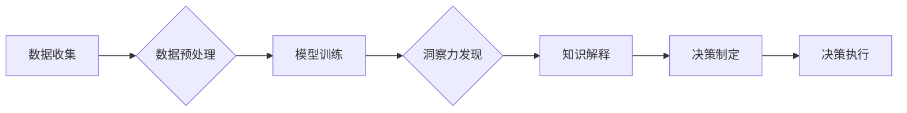

                 

## 理解洞察力的实践：在决策中运用智慧

> 关键词：洞察力、决策、人工智能、机器学习、数据分析、模式识别、预测建模

### 1. 背景介绍

在当今数据爆炸的时代，我们被海量信息淹没。如何从纷繁复杂的数字海洋中提取有价值的洞察力，并将其转化为明智的决策，成为摆在我们面前的重大挑战。传统的决策方法往往依赖于经验和直觉，而人工智能技术的兴起为我们提供了全新的视角和工具。

人工智能，特别是机器学习和深度学习，能够从海量数据中识别出隐藏的模式和趋势，为决策提供数据驱动的支持。然而，仅仅依靠算法的输出并不能保证最佳决策。我们需要理解洞察力的本质，并将其与人类的智慧相结合，才能真正发挥人工智能的价值。

### 2. 核心概念与联系

**2.1 洞察力的定义**

洞察力是指从数据中识别出隐藏的模式、趋势和关系，并将其转化为有价值的见解的能力。它不仅仅是发现事实，更重要的是理解这些事实背后的意义，并将其应用于实际决策中。

**2.2 人工智能与洞察力的关系**

人工智能技术为洞察力的发现提供了强大的工具。机器学习算法能够从海量数据中识别出人类难以察觉的模式，而深度学习则能够学习更复杂的特征和关系。

**2.3 洞察力决策模型**

洞察力决策模型是一个将人工智能技术与人类智慧相结合的决策框架。它包括以下几个关键步骤：

* **数据收集和预处理:** 收集相关数据，并进行清洗、转换和特征工程等预处理工作。
* **模型训练和评估:** 选择合适的机器学习模型，并利用训练数据进行模型训练和评估。
* **洞察力发现:** 利用训练好的模型对新数据进行分析，并识别出隐藏的模式和趋势。
* **知识解释和可视化:** 将洞察力以易于理解的方式呈现给决策者，并提供对模型决策的解释。
* **决策制定和执行:** 基于洞察力和人类的判断，制定最终的决策并进行执行。

**2.4 Mermaid 流程图**



### 3. 核心算法原理 & 具体操作步骤

**3.1 算法原理概述**

在洞察力决策模型中，机器学习算法是核心组件。常见的机器学习算法包括：

* **监督学习:** 利用标记数据训练模型，例如分类和回归问题。
* **无监督学习:** 从未标记数据中发现模式，例如聚类和降维。
* **强化学习:** 通过试错学习，在环境中获得最大奖励。

**3.2 算法步骤详解**

具体算法步骤取决于选择的机器学习算法类型。以下以监督学习为例，详细说明算法步骤：

1. **数据收集和预处理:** 收集相关数据，并进行清洗、转换和特征工程等预处理工作。
2. **数据划分:** 将数据划分为训练集、验证集和测试集。
3. **模型选择:** 选择合适的监督学习模型，例如逻辑回归、决策树、支持向量机等。
4. **模型训练:** 利用训练集训练模型，并调整模型参数以最小化训练误差。
5. **模型评估:** 利用验证集评估模型性能，并选择最佳模型。
6. **模型测试:** 利用测试集评估模型在未知数据上的性能。
7. **模型部署:** 将训练好的模型部署到生产环境中，用于预测和决策。

**3.3 算法优缺点**

不同的机器学习算法具有不同的优缺点，需要根据具体问题选择合适的算法。

* **逻辑回归:** 优点：简单易懂，易于解释。缺点：只能处理线性关系，对高维数据效果较差。
* **决策树:** 优点：易于理解和解释，可以处理非线性关系。缺点：容易过拟合，对数据噪声敏感。
* **支持向量机:** 优点：可以处理高维数据，具有较好的泛化能力。缺点：训练时间较长，参数选择较复杂。

**3.4 算法应用领域**

机器学习算法广泛应用于各个领域，例如：

* **金融:** 欺诈检测、信用评分、风险管理。
* **医疗:** 疾病诊断、药物研发、患者个性化治疗。
* **电商:** 商品推荐、用户画像、精准营销。
* **交通:** 交通预测、自动驾驶、智能交通管理。

### 4. 数学模型和公式 & 详细讲解 & 举例说明

**4.1 数学模型构建**

机器学习算法通常基于数学模型进行构建。例如，线性回归模型的数学表达式为：

$$y = w_0 + w_1x_1 + w_2x_2 + ... + w_nx_n + \epsilon$$

其中：

* $y$ 是预测值
* $w_0, w_1, ..., w_n$ 是模型参数
* $x_1, x_2, ..., x_n$ 是输入特征
* $\epsilon$ 是误差项

**4.2 公式推导过程**

机器学习算法的训练过程本质上是参数优化过程。常用的优化算法包括梯度下降法、随机梯度下降法等。这些算法通过迭代更新模型参数，使得模型预测值与真实值之间的误差最小化。

**4.3 案例分析与讲解**

以线性回归为例，假设我们想要预测房屋价格，输入特征包括房屋面积、房间数量等。通过训练数据，我们可以学习到房屋价格与这些特征之间的关系，并构建一个线性回归模型。

当我们想要预测新房子的价格时，只需要将新房子的面积和房间数量作为输入，模型就可以输出预测价格。

### 5. 项目实践：代码实例和详细解释说明

**5.1 开发环境搭建**

* Python 3.x
* Jupyter Notebook
* scikit-learn

**5.2 源代码详细实现**

```python
from sklearn.linear_model import LinearRegression
from sklearn.model_selection import train_test_split
from sklearn.metrics import mean_squared_error

# 加载数据
data = ...

# 划分训练集和测试集
X_train, X_test, y_train, y_test = train_test_split(data.drop('price', axis=1), data['price'], test_size=0.2)

# 创建线性回归模型
model = LinearRegression()

# 训练模型
model.fit(X_train, y_train)

# 预测测试集数据
y_pred = model.predict(X_test)

# 计算模型性能
mse = mean_squared_error(y_test, y_pred)
print(f'Mean Squared Error: {mse}')
```

**5.3 代码解读与分析**

* 首先，我们加载数据并将其划分成训练集和测试集。
* 然后，我们创建线性回归模型并使用训练集进行模型训练。
* 训练完成后，我们使用测试集数据进行模型预测，并计算模型性能指标。

**5.4 运行结果展示**

运行代码后，我们可以得到模型的性能指标，例如均方误差 (MSE)。

### 6. 实际应用场景

**6.1 金融领域**

* **信用评分:** 利用机器学习算法分析客户的财务数据，预测其信用风险。
* **欺诈检测:** 利用机器学习算法识别异常交易行为，防止金融欺诈。

**6.2 医疗领域**

* **疾病诊断:** 利用机器学习算法分析患者的病历和检查结果，辅助医生诊断疾病。
* **药物研发:** 利用机器学习算法分析药物分子结构和生物活性，加速药物研发过程。

**6.3 电商领域**

* **商品推荐:** 利用机器学习算法分析用户的购买历史和浏览记录，推荐个性化商品。
* **用户画像:** 利用机器学习算法分析用户的行为数据，构建用户画像，进行精准营销。

**6.4 未来应用展望**

随着人工智能技术的不断发展，洞察力决策模型将在更多领域得到应用，例如：

* **智能交通:** 利用机器学习算法预测交通流量，优化交通信号灯控制，缓解交通拥堵。
* **智能制造:** 利用机器学习算法进行设备故障预测和预防性维护，提高生产效率。
* **个性化教育:** 利用机器学习算法分析学生的学习情况，提供个性化学习方案。

### 7. 工具和资源推荐

**7.1 学习资源推荐**

* **书籍:**
    * 《机器学习》 - 周志华
    * 《深度学习》 - Ian Goodfellow
* **在线课程:**
    * Coursera: Machine Learning
    * edX: Artificial Intelligence

**7.2 开发工具推荐**

* **Python:** 
    * scikit-learn
    * TensorFlow
    * PyTorch

**7.3 相关论文推荐**

* **《机器学习》** - 周志华
* **《深度学习》** - Ian Goodfellow

### 8. 总结：未来发展趋势与挑战

**8.1 研究成果总结**

洞察力决策模型在人工智能领域取得了显著进展，为数据驱动的决策提供了强大的工具。

**8.2 未来发展趋势**

未来，洞察力决策模型将朝着以下方向发展：

* **更强大的算法:** 开发更强大的机器学习算法，能够处理更复杂的数据和问题。
* **更强的解释性:** 提高模型的解释性，使决策者能够更好地理解模型的决策过程。
* **更广泛的应用:** 将洞察力决策模型应用于更多领域，解决更实际的问题。

**8.3 面临的挑战**

洞察力决策模型也面临一些挑战：

* **数据质量:** 模型的性能依赖于数据质量，数据不完整、不准确或存在偏差都会影响模型的准确性。
* **模型解释性:** 许多机器学习算法是黑箱模型，难以解释其决策过程，这可能会导致决策者对模型结果缺乏信任。
* **伦理问题:** 人工智能技术的应用引发了一些伦理问题，例如算法偏见和数据隐私，需要认真对待和解决。

**8.4 研究展望**

未来，我们需要继续加强对洞察力决策模型的研究，开发更强大、更可解释、更安全的模型，并将其应用于更多领域，为人类社会创造更大的价值。

### 9. 附录：常见问题与解答

**9.1 如何选择合适的机器学习算法？**

选择合适的机器学习算法需要根据具体问题和数据特点进行选择。

**9.2 如何处理数据不完整或不准确的问题？**

可以使用数据清洗和预处理技术来处理数据不完整或不准确的问题。

**9.3 如何提高模型的解释性？**

可以使用可解释机器学习算法或模型解释技术来提高模型的解释性。


作者：禅与计算机程序设计艺术 / Zen and the Art of Computer Programming 
<end_of_turn>

