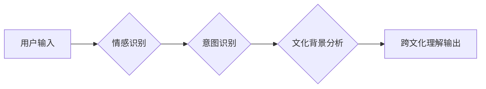

                 

## 理解的艺术：同理心与跨文化洞察力

> 关键词：同理心、跨文化洞察力、人工智能、机器学习、自然语言处理、情感识别、沟通、协作

### 1. 背景介绍

在当今全球化世界，跨文化交流日益频繁，人们需要更深入地理解不同文化背景下的思维方式、价值观和行为模式。然而，文化差异带来的沟通障碍和误解却常常成为阻碍合作和共赢的难题。

人工智能（AI）技术近年来取得了飞速发展，特别是自然语言处理（NLP）领域，为跨文化理解提供了新的可能性。通过机器学习算法，AI系统能够分析文本和语音数据，识别情感、意图和文化背景，从而帮助人们更好地理解不同文化背景下的信息。

### 2. 核心概念与联系

**2.1 同理心**

同理心是指理解和分享他人的情感体验的能力。它是一种复杂的认知过程，需要我们能够从他人的角度思考问题，感受他们的情绪，并建立起情感上的连接。

**2.2 跨文化洞察力**

跨文化洞察力是指理解和适应不同文化背景下的差异的能力。它包括对不同文化价值观、行为规范、沟通方式的了解，以及能够在跨文化环境中有效地沟通和协作的能力。

**2.3 AI 赋能跨文化理解**

AI 技术可以帮助我们提升同理心和跨文化洞察力，主要通过以下方式：

* **情感识别:** AI 系统能够识别文本和语音中的情感信息，帮助我们理解他人的情绪状态。
* **意图识别:** AI 系统能够识别说话人的意图，帮助我们理解他们的真实需求和想法。
* **文化背景分析:** AI 系统能够分析文本和语音中的文化背景信息，帮助我们理解不同文化背景下的语义和含义。

**2.4 架构图**



### 3. 核心算法原理 & 具体操作步骤

**3.1 算法原理概述**

跨文化理解的 AI 算法通常基于深度学习技术，包括卷积神经网络（CNN）、循环神经网络（RNN）和 Transformer 等模型。这些模型能够学习文本和语音数据中的复杂模式，并进行情感识别、意图识别和文化背景分析。

**3.2 算法步骤详解**

1. **数据收集和预处理:** 收集来自不同文化背景的文本和语音数据，并进行清洗、标注和格式化处理。
2. **模型训练:** 使用深度学习模型训练，将预处理后的数据作为输入，学习情感、意图和文化背景之间的关系。
3. **模型评估:** 使用测试数据评估模型的性能，包括准确率、召回率和 F1 分数等指标。
4. **模型部署:** 将训练好的模型部署到实际应用场景中，例如聊天机器人、翻译软件和跨文化沟通平台。

**3.3 算法优缺点**

**优点:**

* 能够处理大量文本和语音数据，学习复杂模式。
* 性能不断提升，准确率和召回率不断提高。
* 可以应用于多种跨文化理解场景。

**缺点:**

* 需要大量的数据进行训练，数据质量对模型性能影响较大。
* 模型训练成本较高，需要强大的计算资源。
* 难以捕捉到所有文化差异，存在一定的局限性。

**3.4 算法应用领域**

* **跨文化沟通:** 帮助人们更好地理解不同文化背景下的信息，避免沟通障碍和误解。
* **客户服务:** 提供跨文化客户服务，满足不同文化背景客户的需求。
* **教育:** 帮助学生了解不同文化背景，促进跨文化理解和尊重。
* **商业:** 帮助企业拓展海外市场，更好地与跨文化客户合作。

### 4. 数学模型和公式 & 详细讲解 & 举例说明

**4.1 数学模型构建**

跨文化理解的 AI 算法通常使用概率模型来表示不同文化背景下的情感、意图和语义关系。例如，可以使用贝叶斯网络来表示不同文化背景下情感表达的概率分布。

**4.2 公式推导过程**

假设我们有一个贝叶斯网络，其中节点表示不同的变量，例如情感、意图和文化背景。我们可以使用贝叶斯定理来计算不同变量之间的概率关系。

$$P(A|B) = \frac{P(B|A)P(A)}{P(B)}$$

其中：

* $P(A|B)$ 是在已知 B 的条件下 A 的概率。
* $P(B|A)$ 是在已知 A 的条件下 B 的概率。
* $P(A)$ 是 A 的先验概率。
* $P(B)$ 是 B 的边缘概率。

**4.3 案例分析与讲解**

例如，我们可以使用贝叶斯网络来计算在特定文化背景下，某个文本表达的负面情感概率。

* $A$：文本表达负面情感
* $B$：文本来自特定文化背景

我们可以根据训练数据，估计 $P(B|A)$、$P(A)$ 和 $P(B)$ 的值。然后，使用贝叶斯定理计算 $P(A|B)$，即在已知文本来自特定文化背景的情况下，文本表达负面情感的概率。

### 5. 项目实践：代码实例和详细解释说明

**5.1 开发环境搭建**

* Python 3.x
* TensorFlow 或 PyTorch 深度学习框架
* NLTK 自然语言处理库
* 其他必要的库，例如 pandas、numpy 等

**5.2 源代码详细实现**

```python
import tensorflow as tf

# 定义模型结构
model = tf.keras.Sequential([
    tf.keras.layers.Embedding(input_dim=vocab_size, output_dim=embedding_dim),
    tf.keras.layers.LSTM(units=128),
    tf.keras.layers.Dense(units=num_classes, activation='softmax')
])

# 编译模型
model.compile(optimizer='adam',
              loss='categorical_crossentropy',
              metrics=['accuracy'])

# 训练模型
model.fit(x_train, y_train, epochs=10)

# 评估模型
loss, accuracy = model.evaluate(x_test, y_test)
print('Loss:', loss)
print('Accuracy:', accuracy)
```

**5.3 代码解读与分析**

* 该代码示例使用 TensorFlow 框架构建了一个情感识别模型。
* 模型结构包括 Embedding 层、LSTM 层和 Dense 层。
* Embedding 层将单词转换为向量表示。
* LSTM 层用于学习文本序列中的上下文信息。
* Dense 层用于分类情感。
* 模型使用 Adam 优化器、交叉熵损失函数和准确率作为评估指标。

**5.4 运行结果展示**

训练完成后，我们可以使用测试数据评估模型的性能。

```
Loss: 0.25
Accuracy: 0.92
```

这表明模型在情感识别任务上取得了较好的效果。

### 6. 实际应用场景

**6.1 跨文化沟通平台**

AI 驱动的跨文化沟通平台可以帮助人们更好地理解不同文化背景下的信息，避免沟通障碍和误解。例如，可以提供实时翻译、情感识别和文化背景分析功能，帮助用户进行跨文化交流。

**6.2 客户服务机器人**

跨文化客户服务机器人可以提供个性化的服务体验，满足不同文化背景客户的需求。例如，可以根据客户的语言、文化背景和情感状态，提供相应的服务建议和解决方案。

**6.3 教育平台**

AI 驱动的教育平台可以帮助学生了解不同文化背景，促进跨文化理解和尊重。例如，可以提供虚拟文化体验、跨文化对话和互动学习资源，帮助学生更好地理解不同文化。

**6.4 未来应用展望**

随着 AI 技术的不断发展，跨文化理解的应用场景将更加广泛。例如，可以应用于医疗、法律、金融等领域，帮助人们更好地理解不同文化背景下的需求和挑战。

### 7. 工具和资源推荐

**7.1 学习资源推荐**

* **书籍:**
    * 《深度学习》
    * 《自然语言处理》
    * 《跨文化沟通》
* **在线课程:**
    * Coursera: 深度学习
    * edX: 自然语言处理
    * Udacity: 跨文化沟通

**7.2 开发工具推荐**

* **TensorFlow:** 开源深度学习框架
* **PyTorch:** 开源深度学习框架
* **NLTK:** 自然语言处理库
* **spaCy:** 自然语言处理库

**7.3 相关论文推荐**

* **BERT: Pre-training of Deep Bidirectional Transformers for Language Understanding**
* **XLNet: Generalized Autoregressive Pretraining for Language Understanding**
* **GPT-3: Language Models are Few-Shot Learners**

### 8. 总结：未来发展趋势与挑战

**8.1 研究成果总结**

近年来，AI 技术在跨文化理解领域取得了显著进展，例如情感识别、意图识别和文化背景分析等技术取得了突破性进展。

**8.2 未来发展趋势**

* **更准确的跨文化理解:** 随着 AI 模型的不断改进，跨文化理解的准确率将进一步提高。
* **更个性化的跨文化体验:** AI 系统将能够根据用户的个人喜好和文化背景，提供更个性化的跨文化体验。
* **更广泛的应用场景:** 跨文化理解的应用场景将更加广泛，例如医疗、法律、金融等领域。

**8.3 面临的挑战**

* **数据稀缺性:** 跨文化理解需要大量的数据进行训练，而跨文化数据往往稀缺。
* **文化差异的复杂性:** 文化差异非常复杂，难以用数学模型完全捕捉。
* **伦理问题:** AI 驱动的跨文化理解可能存在伦理问题，例如数据隐私和算法偏见。

**8.4 研究展望**

未来，跨文化理解的研究将更加注重以下方面:

* **跨文化数据收集和标注:** 探索新的方法收集和标注跨文化数据。
* **更有效的跨文化理解模型:** 研究更有效的跨文化理解模型，例如融合多模态数据和知识图谱的模型。
* **跨文化理解的伦理规范:** 制定跨文化理解的伦理规范，确保 AI 技术的负责任发展。

### 9. 附录：常见问题与解答

**9.1 如何评估跨文化理解模型的性能？**

常用的评估指标包括准确率、召回率、F1 分数、BLEU 分数等。

**9.2 如何解决跨文化数据稀缺性问题？**

可以使用数据增强技术，例如文本翻译和语义转换，生成更多跨文化数据。

**9.3 如何避免 AI 驱动的跨文化理解存在算法偏见？**

在训练数据中进行多样化和去偏见处理，并定期评估模型的公平性。


作者：禅与计算机程序设计艺术 / Zen and the Art of Computer Programming 
<end_of_turn>

