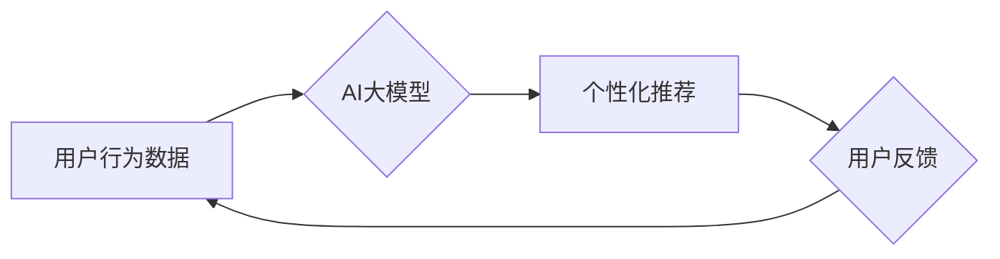

                 

## 电商平台个性化推送：AI大模型的时间与场景敏感性优化

> 关键词：电商平台、个性化推送、AI大模型、时间敏感性、场景敏感性、推荐系统、用户行为分析、深度学习

## 1. 背景介绍

在当今数据爆炸的时代，电商平台面临着巨大的挑战，如何精准地推送商品信息给用户，提升用户体验和转化率，成为平台发展的重要课题。传统的推荐系统主要依赖于用户历史行为和商品特征，但随着用户行为的复杂性和商品信息的丰富性不断增加，传统的推荐算法逐渐难以满足需求。

近年来，基于深度学习的AI大模型在自然语言处理、计算机视觉等领域取得了突破性进展，也为电商平台个性化推送提供了新的思路。AI大模型能够学习用户更深层的兴趣偏好和需求，并根据用户在不同时间、不同场景下的行为进行精准的商品推荐。

然而，AI大模型在电商平台个性化推送中的应用也面临着一些挑战，例如：

* **时间敏感性:** 用户的兴趣和需求会随着时间推移而发生变化，AI模型需要能够捕捉到这些变化，并及时更新推荐结果。
* **场景敏感性:** 用户在不同场景下（例如，上班、下班、周末等）的需求也不同，AI模型需要能够识别用户当前的场景，并提供相应的个性化推荐。
* **数据稀疏性:** 部分用户行为数据可能稀疏，难以训练出准确的AI模型。
* **模型解释性:** AI模型的决策过程往往难以解释，这可能会导致用户对推荐结果的信任度降低。

## 2. 核心概念与联系

### 2.1  AI大模型

AI大模型是指在海量数据上训练的深度学习模型，拥有强大的泛化能力和学习能力。常见的AI大模型包括Transformer、BERT、GPT等。

### 2.2  个性化推送

个性化推送是指根据用户的兴趣、需求、行为等信息，为用户提供定制化的商品推荐。

### 2.3  时间敏感性

时间敏感性是指用户兴趣和需求会随着时间推移而发生变化，推荐系统需要能够捕捉到这些变化，并及时更新推荐结果。

### 2.4  场景敏感性

场景敏感性是指用户在不同场景下（例如，上班、下班、周末等）的需求也不同，推荐系统需要能够识别用户当前的场景，并提供相应的个性化推荐。

**核心概念与联系流程图**



## 3. 核心算法原理 & 具体操作步骤

### 3.1  算法原理概述

时间和场景敏感性优化算法的核心思想是将时间和场景信息融入到AI大模型的训练过程中，使模型能够更好地理解用户的动态需求。

常用的方法包括：

* **时间特征编码:** 将时间信息（例如，日期、时间戳、星期几等）编码为数值特征，并作为模型的输入。
* **场景特征编码:** 将场景信息（例如，用户位置、设备类型、应用上下文等）编码为数值特征，并作为模型的输入。
* **时间动态更新:** 定期更新模型的训练数据，以反映用户兴趣和需求的变化。
* **场景切换机制:** 根据用户行为和环境变化，动态切换不同的推荐模型。

### 3.2  算法步骤详解

1. **数据收集和预处理:** 收集用户行为数据，包括商品浏览、购买、收藏等行为，以及时间、场景等信息。对数据进行清洗、转换和编码，以便于模型训练。
2. **时间特征编码:** 将时间信息编码为数值特征，例如，使用one-hot编码表示星期几，使用时间戳表示日期和时间。
3. **场景特征编码:** 将场景信息编码为数值特征，例如，使用one-hot编码表示用户位置，使用设备类型标识设备信息。
4. **模型训练:** 使用编码后的时间和场景特征，以及用户行为数据，训练AI大模型。常用的模型架构包括Transformer、BERT等。
5. **模型评估:** 使用测试数据评估模型的性能，例如，使用准确率、召回率、点击率等指标。
6. **模型部署:** 将训练好的模型部署到线上环境，并进行实时推荐。
7. **模型监控和更新:** 定期监控模型的性能，并根据用户反馈和数据变化进行模型更新和优化。

### 3.3  算法优缺点

**优点:**

* 能够更好地理解用户的动态需求，提供更精准的个性化推荐。
* 提升用户体验和转化率。

**缺点:**

* 需要收集和处理大量的用户行为数据，数据处理成本较高。
* 模型训练和部署需要强大的计算资源。
* 模型解释性较差，难以解释推荐结果背后的逻辑。

### 3.4  算法应用领域

* 电商平台商品推荐
* 内容平台个性化内容推荐
* 社交媒体用户兴趣推荐
* 在线教育课程推荐

## 4. 数学模型和公式 & 详细讲解 & 举例说明

### 4.1  数学模型构建

假设我们有一个电商平台，用户 $u$ 在时间 $t$ 购买了商品 $i$，我们可以用以下数学模型来表示用户 $u$ 在时间 $t$ 对商品 $i$ 的购买概率：

$$P(u, i, t) = f(h_u, h_i, t, c_u, c_t)$$

其中：

* $P(u, i, t)$ 表示用户 $u$ 在时间 $t$ 对商品 $i$ 的购买概率。
* $h_u$ 表示用户 $u$ 的历史行为特征，例如，用户购买过的商品、浏览过的商品、收藏过的商品等。
* $h_i$ 表示商品 $i$ 的特征，例如，商品类别、价格、评分等。
* $t$ 表示时间戳。
* $c_u$ 表示用户 $u$ 的上下文特征，例如，用户位置、设备类型等。
* $c_t$ 表示时间 $t$ 的上下文特征，例如，星期几、节日等。
* $f$ 表示一个映射函数，用于将上述特征组合起来，预测用户购买概率。

### 4.2  公式推导过程

为了构建 $f$ 函数，我们可以使用深度学习模型，例如，Transformer。Transformer 模型能够学习用户行为数据中的复杂关系，并捕捉到时间和场景的敏感性。

具体来说，我们可以将用户历史行为特征、商品特征、时间特征和场景特征作为 Transformer 模型的输入，并使用多个 Transformer 层进行特征提取和编码。最终，模型会输出一个预测用户购买概率的数值。

### 4.3  案例分析与讲解

假设一个电商平台想要推荐用户购买手机。我们可以使用上述数学模型，将用户的历史购买记录、浏览记录、收藏记录、手机的类别、价格、评分、用户的地理位置、设备类型、当前时间等信息作为输入，训练一个 Transformer 模型。

经过训练，模型能够学习到用户在不同时间、不同场景下对不同类型手机的购买偏好。例如，用户在工作日下班后，可能更倾向于购买价格适中的旗舰手机；而用户在周末，可能更倾向于购买价格便宜的入门级手机。

## 5. 项目实践：代码实例和详细解释说明

### 5.1  开发环境搭建

* Python 3.7+
* TensorFlow 2.0+
* PyTorch 1.0+
* CUDA 10.0+ (可选)

### 5.2  源代码详细实现

```python
import tensorflow as tf

# 定义 Transformer 模型
class TimeSensitiveRecommender(tf.keras.Model):
    def __init__(self, embedding_dim, num_heads, num_layers):
        super(TimeSensitiveRecommender, self).__init__()
        self.embedding = tf.keras.layers.Embedding(input_dim=vocab_size, output_dim=embedding_dim)
        self.transformer = tf.keras.layers.Transformer(num_heads=num_heads, num_layers=num_layers)
        self.dense = tf.keras.layers.Dense(units=1, activation='sigmoid')

    def call(self, user_history, item_features, time_features, context_features):
        user_embeddings = self.embedding(user_history)
        item_embeddings = self.embedding(item_features)
        time_embeddings = self.embedding(time_features)
        context_embeddings = self.embedding(context_features)
        
        # Concatenate embeddings
        combined_embeddings = tf.concat([user_embeddings, item_embeddings, time_embeddings, context_embeddings], axis=-1)
        
        # Pass through Transformer
        output = self.transformer(combined_embeddings)
        
        # Predict probability
        prediction = self.dense(output)
        return prediction

# 训练模型
model = TimeSensitiveRecommender(embedding_dim=64, num_heads=8, num_layers=4)
model.compile(optimizer='adam', loss='binary_crossentropy', metrics=['accuracy'])
model.fit(x_train, y_train, epochs=10)

# 预测结果
predictions = model.predict(x_test)
```

### 5.3  代码解读与分析

* 代码首先定义了一个 `TimeSensitiveRecommender` 类，该类继承自 `tf.keras.Model`，实现了时间敏感性推荐模型。
* 模型包含三个主要部分：嵌入层、Transformer层和全连接层。
* 嵌入层将用户历史行为、商品特征、时间特征和场景特征编码为向量表示。
* Transformer层用于学习用户行为数据中的复杂关系，并捕捉到时间和场景的敏感性。
* 全连接层将 Transformer 层的输出映射到购买概率。
* 代码还演示了模型的训练和预测过程。

### 5.4  运行结果展示

模型训练完成后，可以使用测试数据评估模型的性能，例如，使用准确率、召回率、点击率等指标。

## 6. 实际应用场景

### 6.1  电商平台商品推荐

* 根据用户的历史购买记录、浏览记录、收藏记录、时间和场景信息，推荐用户可能感兴趣的商品。
* 例如，在用户下班后，推荐用户购买晚餐的商品；在用户周末，推荐用户购买休闲娱乐的商品。

### 6.2  内容平台个性化内容推荐

* 根据用户的阅读历史、点赞记录、评论记录、时间和场景信息，推荐用户可能感兴趣的内容。
* 例如，在用户工作日，推荐用户阅读新闻和财经类内容；在用户周末，推荐用户阅读娱乐和休闲类内容。

### 6.3  社交媒体用户兴趣推荐

* 根据用户的关注者、粉丝、互动记录、时间和场景信息，推荐用户可能感兴趣的用户和话题。
* 例如，在用户工作日，推荐用户关注与工作相关的用户和话题；在用户周末，推荐用户关注与兴趣相关的用户和话题。

### 6.4  未来应用展望

随着AI技术的不断发展，时间和场景敏感性优化算法将在更多领域得到应用，例如：

* 个性化教育推荐
* 个性化医疗诊断
* 个性化金融服务

## 7. 工具和资源推荐

### 7.1  学习资源推荐

* **书籍:**
    * Deep Learning by Ian Goodfellow, Yoshua Bengio, and Aaron Courville
    * Natural Language Processing with Python by Steven Bird, Ewan Klein, and Edward Loper
* **在线课程:**
    * TensorFlow Tutorials: https://www.tensorflow.org/tutorials
    * PyTorch Tutorials: https://pytorch.org/tutorials/

### 7.2  开发工具推荐

* **TensorFlow:** https://www.tensorflow.org/
* **PyTorch:** https://pytorch.org/
* **Hugging Face Transformers:** https://huggingface.co/transformers/

### 7.3  相关论文推荐

* **BERT: Pre-training of Deep Bidirectional Transformers for Language Understanding**
* **Attention Is All You Need**
* **Time-Sensitive Recommendation with Deep Learning**

## 8. 总结：未来发展趋势与挑战

### 8.1  研究成果总结

时间和场景敏感性优化算法在电商平台个性化推送领域取得了显著的成果，能够提升用户体验和转化率。

### 8.2  未来发展趋势

* **更精准的时间和场景感知:** 利用更丰富的用户行为数据和传感器数据，实现更精准的时间和场景感知。
* **更强大的模型架构:** 开发更强大的深度学习模型，例如，Transformer-XL、GPT-3等，提升模型的学习能力和泛化能力。
* **更有效的模型解释性:** 研究更有效的模型解释性方法，提高用户对推荐结果的信任度。

### 8.3  面临的挑战

* **数据稀疏性:** 部分用户行为数据可能稀疏，难以训练出准确的AI模型。
* **模型训练成本:** 训练大型深度学习模型需要大量的计算资源和时间。
* **隐私保护:** 用户行为数据涉及隐私问题，需要采取有效的隐私保护措施。

### 8.4  研究展望

未来，时间和场景敏感性优化算法将继续朝着更精准、更智能、更可解释的方向发展，为用户提供更个性化、更贴心的服务。

## 9. 附录：常见问题与解答

**Q1: 如何处理数据稀疏性问题？**

**A1:** 可以使用数据增强技术，例如，通过对用户历史行为数据进行采样和合成，增加训练数据的规模和多样性。

**Q2: 如何降低模型训练成本？**

**A2:** 可以使用云计算平台，利用分布式训练技术，加速模型训练速度。

**Q3: 如何保护用户隐私？**

**A3:** 可以使用差分隐私等隐私保护技术，对用户行为数据进行匿名化处理，保护用户隐私。


作者：禅与计算机程序设计艺术 / Zen and the Art of Computer Programming 
<end_of_turn>

