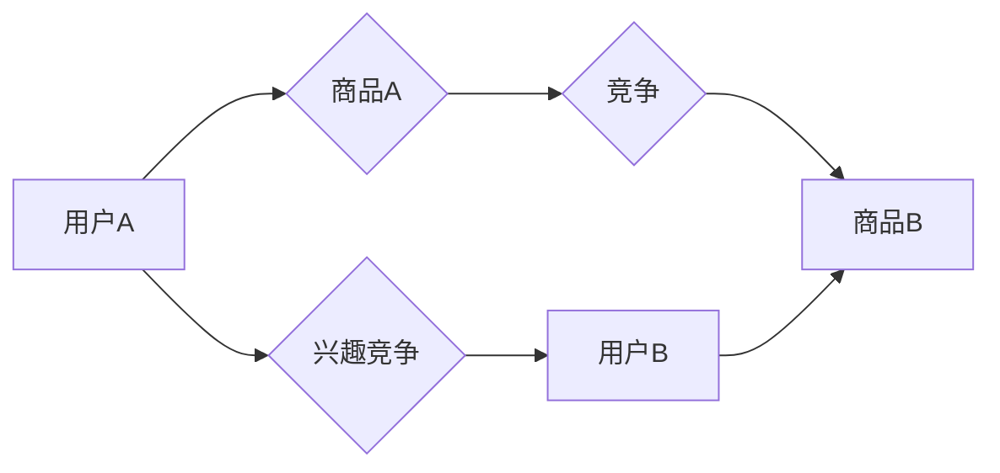

                 

## 电商平台中的用户兴趣竞争模型

> 关键词：用户兴趣，竞争模型，推荐系统，电商平台，个性化推荐，协同过滤，深度学习

## 1. 背景介绍

在当今数据爆炸的时代，电商平台面临着巨大的挑战，如何精准地推荐用户感兴趣的产品，提升用户体验，并最终促进交易成为平台发展的重要课题。传统的推荐系统主要依赖于用户历史行为数据，但随着用户行为的多样化和平台商品的不断更新，传统的推荐方法逐渐显得力不从心。

用户兴趣竞争模型 (User Interest Competition Model，UICM) 应运而生，它将用户兴趣视为一个竞争性的资源，通过模拟用户兴趣之间的竞争关系，预测用户对商品的偏好，从而实现更精准的个性化推荐。

## 2. 核心概念与联系

### 2.1 用户兴趣

用户兴趣是指用户对特定商品或类别商品的偏好程度，它是一个动态变化的属性，受多种因素影响，例如用户年龄、性别、职业、生活方式、购买历史等。

### 2.2 商品竞争

商品竞争是指不同商品之间为了吸引用户注意力和购买行为而展开的竞争。商品的竞争力取决于其自身属性、价格、促销活动等因素。

### 2.3 兴趣竞争关系

用户兴趣竞争模型将用户兴趣和商品竞争视为一个动态的博弈过程，用户兴趣之间存在着竞争关系，而商品也通过竞争吸引用户兴趣。

**Mermaid 流程图**



## 3. 核心算法原理 & 具体操作步骤

### 3.1 算法原理概述

用户兴趣竞争模型通常采用基于图的算法来模拟用户兴趣和商品竞争的关系。用户和商品被视为图中的节点，用户兴趣和商品竞争关系被视为图中的边。通过分析图结构，可以预测用户对商品的偏好。

常见的算法包括：

* **PageRank算法**:  最初用于搜索引擎排名，可以用来衡量用户兴趣的“重要性”。
* **Katz centrality算法**:  扩展了PageRank算法，考虑了边权重，可以更准确地反映用户兴趣之间的竞争关系。
* **Random Walk with Restart算法**:  模拟用户在兴趣网络中的随机游走，可以预测用户对商品的点击概率。

### 3.2 算法步骤详解

1. **构建用户兴趣图**: 将用户和商品作为节点，用户对商品的偏好作为边权重，构建用户兴趣图。
2. **计算用户兴趣权重**: 使用PageRank、Katz centrality或Random Walk with Restart算法计算每个用户的兴趣权重。
3. **计算商品竞争力**: 使用商品的属性、价格、销量等信息计算每个商品的竞争力。
4. **预测用户偏好**: 根据用户兴趣权重和商品竞争力，预测用户对每个商品的偏好。
5. **推荐商品**: 根据预测结果，推荐用户感兴趣的商品。

### 3.3 算法优缺点

**优点**:

* 可以更精准地预测用户兴趣，提高推荐效果。
* 可以考虑用户兴趣之间的竞争关系，更符合用户行为的真实情况。
* 可以动态更新用户兴趣和商品竞争关系，适应用户行为的变化。

**缺点**:

* 算法复杂度较高，需要大量的计算资源。
* 需要大量的用户行为数据进行训练，否则效果不佳。
* 难以处理冷启动问题，即对于新用户和新商品的推荐效果较差。

### 3.4 算法应用领域

用户兴趣竞争模型广泛应用于电商平台、社交媒体、内容推荐等领域，例如：

* **商品推荐**:  根据用户的兴趣和商品的竞争力，推荐用户感兴趣的商品。
* **内容推荐**:  根据用户的兴趣和内容的竞争力，推荐用户感兴趣的内容。
* **广告推荐**:  根据用户的兴趣和广告的竞争力，推荐用户感兴趣的广告。

## 4. 数学模型和公式 & 详细讲解 & 举例说明

### 4.1 数学模型构建

用户兴趣竞争模型可以抽象为一个图论模型，其中用户和商品分别对应图中的节点，用户对商品的偏好对应图中的边权重。

**用户兴趣图**:

* 节点：用户 (u) 和商品 (i)
* 边： (u, i) 表示用户 u 对商品 i 的偏好，边权重为 w(u, i)

**用户兴趣权重**:

*  用户 u 的兴趣权重为：$P(u)$

**商品竞争力**:

* 商品 i 的竞争力为：$C(i)$

### 4.2 公式推导过程

**PageRank算法**:

* $P(u) = \sum_{i \in N(u)} \frac{C(i)}{C(i) + \sum_{j \in N(i)} C(j)}$

其中：

* $N(u)$ 表示用户 u 的邻居节点集合 (即用户 u 喜欢的商品集合)

**Katz centrality算法**:

* $P(u) = \alpha \sum_{i \in N(u)} \frac{C(i)}{C(i) + \sum_{j \in N(i)} C(j)} + (1-\alpha)P(u)$

其中：

* $\alpha$ 为衰减因子 (0 < $\alpha$ < 1)

**Random Walk with Restart算法**:

* $P(u) = \beta \sum_{i \in N(u)} \frac{C(i)}{C(i) + \sum_{j \in N(i)} C(j)} + (1-\beta)P(u)$

其中：

* $\beta$ 为重启概率 (0 < $\beta$ < 1)

### 4.3 案例分析与讲解

假设有一个电商平台，用户 A 和用户 B 都喜欢商品 1 和商品 2，但用户 A 对商品 1 的偏好比用户 B 高，用户 B 对商品 2 的偏好比用户 A 高。

使用 PageRank 算法计算用户兴趣权重，可以得到用户 A 的兴趣权重高于用户 B，因为用户 A 对商品 1 的偏好更高。

使用 Katz centrality 算法计算用户兴趣权重，可以得到用户 A 和用户 B 的兴趣权重都较高，因为用户 A 和用户 B 都对商品 1 和商品 2 有偏好。

使用 Random Walk with Restart 算法计算用户兴趣权重，可以得到用户 A 和用户 B 的兴趣权重都较高，因为用户 A 和用户 B 都对商品 1 和商品 2 有偏好，并且算法考虑了用户在兴趣网络中的随机游走行为。

## 5. 项目实践：代码实例和详细解释说明

### 5.1 开发环境搭建

* Python 3.x
* NetworkX 库
* Scikit-learn 库

### 5.2 源代码详细实现

```python
import networkx as nx
from sklearn.metrics.pairwise import cosine_similarity

# 构建用户兴趣图
graph = nx.Graph()
# 添加用户节点
graph.add_nodes_from(['user1', 'user2', 'user3'])
# 添加商品节点
graph.add_nodes_from(['product1', 'product2', 'product3'])
# 添加用户对商品的偏好边
graph.add_edge('user1', 'product1', weight=0.8)
graph.add_edge('user1', 'product2', weight=0.6)
graph.add_edge('user2', 'product2', weight=0.9)
graph.add_edge('user2', 'product3', weight=0.7)
graph.add_edge('user3', 'product1', weight=0.5)
graph.add_edge('user3', 'product3', weight=0.4)

# 计算用户兴趣权重
page_rank_weights = nx.pagerank(graph)
print("PageRank Weights:", page_rank_weights)

# 计算商品竞争力
# ...

# 预测用户偏好
# ...

# 推荐商品
# ...
```

### 5.3 代码解读与分析

* 代码首先构建了一个用户兴趣图，其中用户和商品分别对应图中的节点，用户对商品的偏好对应图中的边权重。
* 然后使用 PageRank 算法计算用户兴趣权重，并将结果打印出来。
* 接下来可以根据商品的属性、价格、销量等信息计算商品竞争力。
* 最后，根据用户兴趣权重和商品竞争力，预测用户对每个商品的偏好，并推荐用户感兴趣的商品。

### 5.4 运行结果展示

运行代码后，可以得到用户兴趣权重，以及其他相关信息，例如商品竞争力、用户偏好预测结果等。

## 6. 实际应用场景

用户兴趣竞争模型在电商平台的实际应用场景非常广泛，例如：

* **个性化商品推荐**: 根据用户的兴趣和商品的竞争力，推荐用户感兴趣的商品，提高用户购物体验。
* **新品推荐**:  根据用户的兴趣和新品的竞争力，推荐用户可能感兴趣的新商品，促进新品销售。
* **促销活动推荐**: 根据用户的兴趣和促销活动的竞争力，推荐用户可能感兴趣的促销活动，提高用户参与度。

### 6.4 未来应用展望

随着人工智能技术的不断发展，用户兴趣竞争模型将更加智能化、个性化。未来，用户兴趣竞争模型可以应用于更多场景，例如：

* **内容推荐**:  根据用户的兴趣和内容的竞争力，推荐用户感兴趣的内容，例如新闻、视频、文章等。
* **广告推荐**:  根据用户的兴趣和广告的竞争力，推荐用户感兴趣的广告，提高广告精准度。
* **社交关系推荐**:  根据用户的兴趣和社交关系的竞争力，推荐用户可能感兴趣的社交关系，例如朋友、兴趣小组等。

## 7. 工具和资源推荐

### 7.1 学习资源推荐

* **书籍**:
    * 《图论及其应用》
    * 《推荐系统》
* **在线课程**:
    * Coursera: Recommender Systems
    * edX: Introduction to Machine Learning

### 7.2 开发工具推荐

* **Python**:  Python 是一个流行的编程语言，广泛应用于数据科学和机器学习领域。
* **NetworkX**:  NetworkX 是一个用于构建和分析图的 Python 库。
* **Scikit-learn**:  Scikit-learn 是一个用于机器学习的 Python 库。

### 7.3 相关论文推荐

* **PageRank**:  Brin, S., & Page, L. (1998). The anatomy of a large-scale hypertextual web search engine. Computer networks and ISDN systems, 30(1-7), 107-117.
* **Katz centrality**:  Katz, L. (1953). A new status index derived from sociometric analysis. Psychometrika, 18(1), 39-43.
* **Random Walk with Restart**:  Haveliwala, A. H. (2002). Topic-sensitive pagerank. In Proceedings of the 11th international conference on World Wide Web (pp. 517-526). ACM.

## 8. 总结：未来发展趋势与挑战

### 8.1 研究成果总结

用户兴趣竞争模型为电商平台的个性化推荐提供了新的思路，并取得了一定的成果。

### 8.2 未来发展趋势

* **更精准的兴趣预测**:  利用深度学习等先进算法，更精准地预测用户兴趣。
* **更个性化的推荐**:  根据用户的个性化需求，提供更个性化的商品推荐。
* **更智能的交互**:  利用自然语言处理等技术，实现更智能的与用户的交互。

### 8.3 面临的挑战

* **数据稀疏性**:  用户兴趣数据往往是稀疏的，难以训练有效的模型。
* **冷启动问题**:  对于新用户和新商品的推荐效果较差。
* **用户隐私保护**:  用户兴趣数据涉及用户隐私，需要采取有效的保护措施。

### 8.4 研究展望

未来，用户兴趣竞争模型的研究将更加注重以下方面：

* **解决数据稀疏性和冷启动问题**:  探索新的数据获取和处理方法，提高模型的泛化能力。
* **提升模型的解释性**:  使模型的决策过程更加透明，提高用户对推荐结果的信任度。
* **加强用户隐私保护**:  研究新的隐私保护技术，确保用户数据的安全和隐私。


## 9. 附录：常见问题与解答

* **Q1: 用户兴趣竞争模型的优势是什么？**

**A1:** 用户兴趣竞争模型可以更精准地预测用户兴趣，提高推荐效果，并考虑用户兴趣之间的竞争关系，更符合用户行为的真实情况。

* **Q2: 用户兴趣竞争模型的缺点是什么？**

**A2:** 用户兴趣竞争模型的算法复杂度较高，需要大量的计算资源，并且需要大量的用户行为数据进行训练，否则效果不佳。

* **Q3: 如何解决用户兴趣竞争模型的冷启动问题？**

**A3:** 可以利用用户的其他信息，例如用户画像、用户行为轨迹等，来辅助预测新用户的兴趣。

* **Q4: 如何保护用户隐私？**

**A4:** 可以采用数据加密、匿名化等技术来保护用户隐私。


作者：禅与计算机程序设计艺术 / Zen and the Art of Computer Programming 
<end_of_turn>

