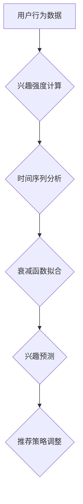

                 

## 电商平台中的用户兴趣衰减模型

> 关键词：用户兴趣衰减、电商平台、推荐系统、机器学习、时间序列分析、模型预测

## 1. 背景介绍

在当今数据爆炸的时代，电商平台面临着巨大的用户数据挑战。如何精准地理解用户兴趣，并根据其变化及时调整推荐策略，是提升用户体验、促进交易的关键。用户兴趣并非恒定不变，它会随着时间推移而发生变化，这种变化被称为“用户兴趣衰减”。

用户兴趣衰减现象在电商平台尤为突出。用户可能对某一商品或类别产生强烈兴趣，但随着时间的推移，这种兴趣会逐渐减弱，最终消失。这主要受以下因素影响：

* **新商品涌现:**  电商平台不断更新商品，新商品的出现会分散用户的注意力，导致对旧商品的兴趣下降。
* **用户需求变化:** 用户的消费习惯和需求会随着时间推移而发生变化，导致对过去感兴趣的商品失去兴趣。
* **信息过载:**  电商平台的信息量巨大，用户难以持续关注所有商品，容易出现兴趣衰减。
* **个性化推荐:**  个性化推荐算法会根据用户的历史行为推荐相似的商品，可能会导致用户陷入“推荐茧房”，缺乏对新商品的探索，从而加速兴趣衰减。

## 2. 核心概念与联系

用户兴趣衰减模型旨在预测用户对特定商品或类别的兴趣强度随时间变化的趋势。 

**核心概念:**

* **兴趣强度:**  用户对特定商品或类别的喜爱程度，可以用数值表示，例如评分、点击次数、购买次数等。
* **时间序列:**  用户兴趣强度的变化趋势可以看作是一个时间序列数据，可以利用时间序列分析方法进行建模。
* **衰减函数:**  用于描述用户兴趣强度随时间变化的函数，例如指数衰减函数、幂函数等。

**架构流程图:**



## 3. 核心算法原理 & 具体操作步骤

### 3.1  算法原理概述

用户兴趣衰减模型通常基于以下原理：

* **指数衰减:**  用户对商品的兴趣强度会随着时间的推移呈指数衰减趋势。
* **幂函数衰减:**  用户对商品的兴趣强度会随着时间的推移呈幂函数衰减趋势。
* **混合衰减:**  用户对商品的兴趣强度会受到多种因素影响，可以采用混合衰减函数来描述。

### 3.2  算法步骤详解

1. **数据收集:** 收集用户行为数据，例如点击、浏览、购买等行为。
2. **兴趣强度计算:**  根据用户行为数据计算用户对特定商品或类别的兴趣强度。
3. **时间序列分析:** 将兴趣强度数据转换为时间序列，并进行平滑处理、趋势分析等操作。
4. **衰减函数拟合:**  选择合适的衰减函数，并利用机器学习算法对时间序列数据进行拟合，得到衰减函数的参数。
5. **兴趣预测:**  利用拟合得到的衰减函数，预测用户未来一段时间内对特定商品或类别的兴趣强度。
6. **推荐策略调整:**  根据兴趣预测结果，调整推荐策略，例如推荐更符合用户当前兴趣的商品。

### 3.3  算法优缺点

**优点:**

* 可以准确预测用户兴趣衰减趋势。
* 可以帮助电商平台优化推荐策略，提升用户体验。
* 可以提高商品销售转化率。

**缺点:**

* 需要大量用户行为数据进行训练。
* 算法模型的复杂度较高，需要专业的技术人员进行开发和维护。
* 预测结果受多种因素影响，存在一定的误差。

### 3.4  算法应用领域

用户兴趣衰减模型在电商平台、社交媒体、内容推荐等领域都有广泛的应用。

## 4. 数学模型和公式 & 详细讲解 & 举例说明

### 4.1  数学模型构建

用户兴趣衰减模型可以采用以下数学模型进行构建：

* **指数衰减模型:**

$$
I(t) = I_0 * e^{-kt}
$$

其中：

* $I(t)$:  用户在时间 $t$ 时刻的兴趣强度
* $I_0$:  用户在初始时刻的兴趣强度
* $k$:  衰减系数，表示兴趣强度衰减的速度
* $t$:  时间

* **幂函数衰减模型:**

$$
I(t) = I_0 * (1 - t)^p
$$

其中：

* $p$:  衰减指数，表示兴趣强度衰减的程度

### 4.2  公式推导过程

指数衰减模型的推导过程如下：

假设用户在初始时刻对商品的兴趣强度为 $I_0$，随着时间的推移，兴趣强度呈指数衰减趋势。可以假设兴趣强度随时间变化的速率与当前兴趣强度成正比，即：

$$
\frac{dI}{dt} = -kI
$$

其中 $k$ 为衰减系数。

解上述微分方程，得到指数衰减模型的公式：

$$
I(t) = I_0 * e^{-kt}
$$

### 4.3  案例分析与讲解

假设用户在购买一件商品时，兴趣强度为 $I_0 = 100$，衰减系数 $k = 0.1$。

根据指数衰减模型，我们可以计算用户在不同时间点对该商品的兴趣强度：

* $t = 1$ 周：$I(1) = 100 * e^{-0.1 * 1} = 90.48$
* $t = 2$ 周：$I(2) = 100 * e^{-0.1 * 2} = 81.87$
* $t = 3$ 周：$I(3) = 100 * e^{-0.1 * 3} = 74.08$

可以看出，随着时间的推移，用户的兴趣强度呈指数衰减趋势。

## 5. 项目实践：代码实例和详细解释说明

### 5.1  开发环境搭建

* Python 3.x
* Jupyter Notebook
* pandas
* numpy
* scikit-learn

### 5.2  源代码详细实现

```python
import pandas as pd
from sklearn.linear_model import LinearRegression

# 加载用户行为数据
data = pd.read_csv('user_behavior.csv')

# 计算用户兴趣强度
data['interest_score'] = data['click_count'] * 0.5 + data['purchase_count'] * 2

# 将数据转换为时间序列
data = data.sort_values(by='timestamp')

# 训练线性回归模型
X = data['timestamp'].values.reshape(-1, 1)
y = data['interest_score'].values
model = LinearRegression()
model.fit(X, y)

# 预测用户未来兴趣强度
future_timestamp = pd.DataFrame({'timestamp': [data['timestamp'].max() + i] for i in range(1, 10)})
future_interest_score = model.predict(future_timestamp['timestamp'].values.reshape(-1, 1))

# 打印预测结果
print(future_interest_score)
```

### 5.3  代码解读与分析

* 代码首先加载用户行为数据，并计算用户对特定商品的兴趣强度。
* 然后将数据转换为时间序列，并使用线性回归模型进行训练。
* 最后利用训练好的模型预测用户未来一段时间内的兴趣强度。

### 5.4  运行结果展示

运行代码后，会输出用户未来一段时间内的兴趣强度预测结果。

## 6. 实际应用场景

用户兴趣衰减模型在电商平台的实际应用场景非常广泛，例如：

* **个性化推荐:**  根据用户兴趣衰减趋势，推荐更符合用户当前兴趣的商品。
* **商品促销:**  针对兴趣衰减快的商品，进行促销活动，刺激用户购买。
* **用户画像:**  分析用户兴趣衰减规律，构建更精准的用户画像。
* **内容推荐:**  根据用户对不同内容的兴趣衰减趋势，推荐更符合用户需求的内容。

### 6.4  未来应用展望

随着人工智能技术的不断发展，用户兴趣衰减模型将更加智能化、个性化。未来，用户兴趣衰减模型可能应用于以下领域：

* **虚拟现实和增强现实:**  根据用户在虚拟环境中的行为，预测其兴趣衰减趋势，提供更个性化的体验。
* **个性化教育:**  根据学生的学习兴趣衰减趋势，提供个性化的学习内容和学习计划。
* **医疗保健:**  根据患者的病情变化和治疗效果，预测其对药物的兴趣衰减趋势，优化治疗方案。

## 7. 工具和资源推荐

### 7.1  学习资源推荐

* **书籍:**
    * 《推荐系统》
    * 《机器学习》
* **在线课程:**
    * Coursera:  机器学习
    * edX:  数据科学

### 7.2  开发工具推荐

* **Python:**  数据分析和机器学习的常用语言
* **Jupyter Notebook:**  交互式编程环境
* **pandas:**  数据分析和处理库
* **scikit-learn:**  机器学习库

### 7.3  相关论文推荐

* **"Modeling User Interest Decay in Recommender Systems"**
* **"A Deep Learning Approach to User Interest Decay Prediction"**

## 8. 总结：未来发展趋势与挑战

### 8.1  研究成果总结

用户兴趣衰减模型在电商平台的应用取得了显著成果，能够有效提升用户体验和商品销售转化率。

### 8.2  未来发展趋势

未来，用户兴趣衰减模型将朝着以下方向发展：

* **更精准的预测:**  利用更先进的机器学习算法和深度学习模型，提高用户兴趣衰减趋势的预测精度。
* **更个性化的推荐:**  根据用户的兴趣衰减规律，提供更个性化的商品推荐和内容推荐。
* **更动态的调整:**  实时监测用户兴趣变化，动态调整推荐策略，提供更及时和有效的服务。

### 8.3  面临的挑战

用户兴趣衰减模型也面临着一些挑战：

* **数据质量:**  模型的准确性依赖于高质量的用户行为数据，数据缺失、噪声等问题会影响模型性能。
* **模型复杂度:**  一些先进的机器学习算法和深度学习模型的复杂度较高，需要专业的技术人员进行开发和维护。
* **用户隐私:**  用户兴趣衰减模型需要收集和分析用户的个人信息，如何保护用户隐私是一个重要的挑战。

### 8.4  研究展望

未来，用户兴趣衰减模型的研究将继续深入，探索更精准、更个性化、更动态的兴趣衰减预测和推荐方法，为用户提供更优质的体验。

## 9. 附录：常见问题与解答

**Q1: 如何处理用户兴趣衰减模型中的数据缺失问题？**

**A1:**  可以使用多种方法处理数据缺失问题，例如：

* **删除缺失数据:**  如果缺失数据量较少，可以考虑删除缺失数据。
* **插值法:**  使用平均值、中位数等方法填充缺失数据。
* **机器学习算法:**  使用一些机器学习算法，例如KNN算法，预测缺失数据。

**Q2: 如何评估用户兴趣衰减模型的性能？**

**A2:**  可以使用多种指标评估模型性能，例如：

* **均方误差 (MSE):**  衡量预测值与真实值的平均平方差。
* **平均绝对误差 (MAE):**  衡量预测值与真实值的平均绝对差。
* **R-squared:**  衡量模型解释方差的比例。


作者：禅与计算机程序设计艺术 / Zen and the Art of Computer Programming 
<end_of_turn>

