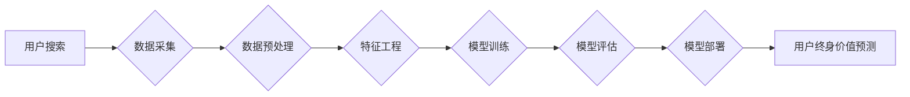

                 

## 电商搜索中的用户终身价值预测模型与应用

> 关键词：用户终身价值，电商搜索，预测模型，机器学习，深度学习，推荐系统，数据挖掘

## 1. 背景介绍

在当今数据爆炸的时代，电商平台积累了海量用户数据，这些数据蕴藏着丰富的商业价值。用户终身价值 (Customer Lifetime Value，CLTV) 作为衡量用户对平台价值的指标，已成为电商平台运营和发展的重要参考。准确预测用户的终身价值，可以帮助电商平台进行精准营销、个性化推荐、资源优化等，从而提升用户粘性、提高转化率，最终实现商业目标。

传统的电商搜索主要基于关键词匹配和商品属性检索，缺乏对用户行为和价值的深度挖掘。随着机器学习和深度学习技术的快速发展，电商搜索开始引入用户终身价值预测模型，以更精准地理解用户需求，提供更个性化的搜索体验。

## 2. 核心概念与联系

**2.1 用户终身价值 (CLTV)**

用户终身价值是指用户在与平台交互的整个生命周期内，为平台带来的总价值。它不仅考虑用户的直接消费金额，还包括用户的复购率、购买频率、平均消费金额等因素。

**2.2 电商搜索**

电商搜索是指用户在电商平台上输入关键词或商品信息，平台根据算法匹配并展示相关商品的过程。

**2.3 预测模型**

预测模型是指利用历史数据和算法，对未来事件进行预测的数学模型。

**2.4 核心概念联系**

电商搜索中的用户终身价值预测模型，通过分析用户的搜索行为、浏览记录、购买历史等数据，预测用户的未来消费潜力，从而为电商平台提供以下价值：

* **精准营销:** 根据用户的终身价值预测结果，平台可以制定个性化的营销策略，精准推送广告和促销活动，提高营销效果。
* **个性化推荐:** 预测用户可能感兴趣的商品，提供更精准的商品推荐，提升用户体验和转化率。
* **资源优化:** 根据用户的终身价值，平台可以优化资源分配，优先服务高价值用户，提高运营效率。

**2.5  核心架构流程图**



## 3. 核心算法原理 & 具体操作步骤

**3.1 算法原理概述**

用户终身价值预测模型通常基于机器学习算法，例如线性回归、逻辑回归、决策树、支持向量机、神经网络等。这些算法通过学习历史用户数据，建立用户终身价值与用户特征之间的关系模型，从而预测新用户的终身价值。

**3.2 算法步骤详解**

1. **数据采集:** 收集用户相关数据，包括用户基本信息、搜索行为、浏览记录、购买历史、评价信息等。
2. **数据预处理:** 对收集到的数据进行清洗、转换、编码等操作，使其符合模型训练的要求。
3. **特征工程:** 从原始数据中提取有价值的特征，例如用户年龄、性别、购买频率、平均消费金额、商品类别偏好等，这些特征可以帮助模型更好地理解用户行为和价值。
4. **模型训练:** 选择合适的机器学习算法，利用训练数据训练模型，并通过交叉验证等方法评估模型性能。
5. **模型评估:** 使用测试数据评估模型的预测精度，常用的指标包括均方误差 (MSE)、平均绝对误差 (MAE)、R-squared等。
6. **模型部署:** 将训练好的模型部署到线上环境，用于预测新用户的终身价值。

**3.3 算法优缺点**

* **优点:**

    * 可以准确预测用户的终身价值，为电商平台提供精准的运营决策依据。
    * 可以个性化推荐商品，提升用户体验和转化率。
    * 可以优化资源分配，提高运营效率。

* **缺点:**

    * 需要大量的历史数据进行训练，数据质量直接影响模型性能。
    * 模型训练和部署需要一定的技术门槛。
    * 预测结果存在一定的误差，需要结合其他因素进行决策。

**3.4 算法应用领域**

用户终身价值预测模型在电商平台、金融机构、社交媒体平台等领域都有广泛的应用，例如：

* **精准营销:** 根据用户的终身价值预测结果，制定个性化的营销策略，精准推送广告和促销活动。
* **个性化推荐:** 预测用户可能感兴趣的商品，提供更精准的商品推荐。
* **客户关系管理 (CRM):** 识别高价值客户，提供个性化的服务，提升客户忠诚度。
* **风险控制:** 预测用户的信用风险，制定相应的风险控制策略。

## 4. 数学模型和公式 & 详细讲解 & 举例说明

**4.1 数学模型构建**

用户终身价值预测模型通常采用回归模型，例如线性回归或逻辑回归。

**线性回归模型:**

$$CLTV = \beta_0 + \beta_1 * Age + \beta_2 * Income + \beta_3 * PurchaseFrequency + \epsilon$$

其中:

* $CLTV$：用户终身价值
* $Age$：用户年龄
* $Income$：用户收入
* $PurchaseFrequency$：用户购买频率
* $\beta_0$, $\beta_1$, $\beta_2$, $\beta_3$：回归系数
* $\epsilon$：随机误差项

**4.2 公式推导过程**

线性回归模型的回归系数可以通过最小二乘法求解，目标是找到使得模型预测值与实际值误差最小的系数。

**4.3 案例分析与讲解**

假设我们有一个电商平台的用户数据，包含用户年龄、收入、购买频率和终身价值信息。我们可以使用线性回归模型训练一个预测用户终身价值的模型。

例如，如果模型训练结果显示，用户年龄每增加1岁，终身价值增加10元，则我们可以推断出，年龄是影响用户终身价值的重要因素。

## 5. 项目实践：代码实例和详细解释说明

**5.1 开发环境搭建**

* Python 3.x
* Jupyter Notebook
* scikit-learn

**5.2 源代码详细实现**

```python
import pandas as pd
from sklearn.linear_model import LinearRegression
from sklearn.model_selection import train_test_split
from sklearn.metrics import mean_squared_error

# 加载数据
data = pd.read_csv('user_data.csv')

# 选择特征和目标变量
features = ['Age', 'Income', 'PurchaseFrequency']
target = 'CLTV'

# 数据分割
X_train, X_test, y_train, y_test = train_test_split(data[features], data[target], test_size=0.2, random_state=42)

# 创建线性回归模型
model = LinearRegression()

# 模型训练
model.fit(X_train, y_train)

# 模型预测
y_pred = model.predict(X_test)

# 模型评估
mse = mean_squared_error(y_test, y_pred)
print(f'Mean Squared Error: {mse}')

# 打印模型系数
print(f'Coefficients: {model.coef_}')
```

**5.3 代码解读与分析**

* 首先，我们加载用户数据，并选择特征和目标变量。
* 然后，我们将数据分割成训练集和测试集。
* 接下来，我们创建线性回归模型，并使用训练集进行模型训练。
* 训练完成后，我们使用测试集进行模型预测，并计算模型的均方误差 (MSE) 作为模型性能指标。
* 最后，我们打印模型系数，了解每个特征对用户终身价值的影响程度。

**5.4 运行结果展示**

运行代码后，会输出模型的均方误差值以及每个特征的系数。

## 6. 实际应用场景

**6.1 精准营销**

电商平台可以根据用户的终身价值预测结果，将用户进行分层，针对不同层级的用户制定不同的营销策略。例如，高价值用户可以享受更优惠的折扣和更个性化的服务，而低价值用户可以进行引导式营销，提升其消费潜力。

**6.2 个性化推荐**

电商平台可以根据用户的终身价值预测结果，推荐更符合其消费偏好的商品。例如，对高价值用户推荐高品质、高价位的商品，对低价值用户推荐性价比高的商品。

**6.3 资源优化**

电商平台可以根据用户的终身价值预测结果，优化资源分配，优先服务高价值用户，提升运营效率。例如，可以为高价值用户提供更优质的客服服务，更快的物流配送等。

**6.4 未来应用展望**

随着人工智能技术的不断发展，用户终身价值预测模型将更加精准、智能化。未来，用户终身价值预测模型可以应用于更广泛的场景，例如：

* **用户画像构建:** 结合用户行为数据和终身价值预测结果，构建更精准的用户画像，为用户提供更个性化的服务。
* **用户流失预测:** 通过分析用户的终身价值变化趋势，预测用户流失风险，及时采取措施挽留用户。
* **新用户精准引流:** 根据终身价值预测模型，精准定位目标用户群体，进行有效的引流推广。

## 7. 工具和资源推荐

**7.1 学习资源推荐**

* **书籍:**

    * 《Python机器学习》
    * 《深入理解机器学习》
    * 《数据挖掘：概念与技术》

* **在线课程:**

    * Coursera: 机器学习
    * edX: 数据科学
    * Udemy: Python机器学习

**7.2 开发工具推荐**

* **Python:** 强大的编程语言，广泛应用于机器学习领域。
* **scikit-learn:** Python机器学习库，提供丰富的算法和工具。
* **TensorFlow:** 深度学习框架，用于构建和训练复杂的深度学习模型。
* **PyTorch:** 深度学习框架，以其灵活性和易用性而闻名。

**7.3 相关论文推荐**

* **Customer Lifetime Value Prediction Using Machine Learning Techniques**
* **A Deep Learning Approach to Customer Lifetime Value Prediction**
* **Predicting Customer Lifetime Value with Ensemble Methods**

## 8. 总结：未来发展趋势与挑战

**8.1 研究成果总结**

用户终身价值预测模型在电商平台的应用取得了显著的成果，帮助平台提高运营效率、提升用户体验、实现商业目标。

**8.2 未来发展趋势**

* **模型精度提升:** 随着人工智能技术的不断发展，用户终身价值预测模型的精度将不断提升，能够更准确地预测用户的终身价值。
* **模型个性化:** 未来，用户终身价值预测模型将更加个性化，能够根据用户的不同特征和行为模式，提供更精准的预测结果。
* **模型实时性:** 未来，用户终身价值预测模型将更加实时，能够实时更新用户的终身价值预测结果，为平台提供更及时的数据支持。

**8.3 面临的挑战**

* **数据质量:** 用户终身价值预测模型的精度直接取决于数据的质量，如何获取高质量的用户数据是未来需要解决的关键问题。
* **模型解释性:** 许多机器学习模型的内部机制难以解释，如何提高模型的解释性，让平台能够更好地理解模型的预测结果，也是未来需要解决的挑战。
* **隐私保护:** 用户数据涉及到个人隐私，如何保护用户数据隐私，是未来需要认真考虑的问题。

**8.4 研究展望**

未来，用户终身价值预测模型的研究将更加深入，将探索更先进的算法、更有效的模型训练方法、更完善的数据处理技术，以实现更精准、更智能、更安全的用户终身价值预测。

## 9. 附录：常见问题与解答

**9.1 如何选择合适的机器学习算法？**

选择合适的机器学习算法取决于数据的特点和预测目标。

* **线性回归:** 适合预测连续数值型目标变量，数据线性相关。
* **逻辑回归:** 适合预测分类型目标变量，数据线性可分。
* **决策树:** 适合处理非线性数据，可解释性强。
* **支持向量机:** 适合处理高维数据，具有较好的泛化能力。
* **神经网络:** 适合处理复杂数据，具有强大的学习能力。

**9.2 如何评估模型性能？**

常用的模型性能评估指标包括均方误差 (MSE)、平均绝对误差 (MAE)、R-squared等。

**9.3 如何处理缺失数据？**

常用的缺失数据处理方法包括删除缺失值、用均值或中位数填充缺失值、使用机器学习算法进行预测填充等。

**9.4 如何防止模型过拟合？**

常用的防止模型过拟合的方法包括正则化、交叉验证、早停等。


作者：禅与计算机程序设计艺术 / Zen and the Art of Computer Programming 
<end_of_turn>

