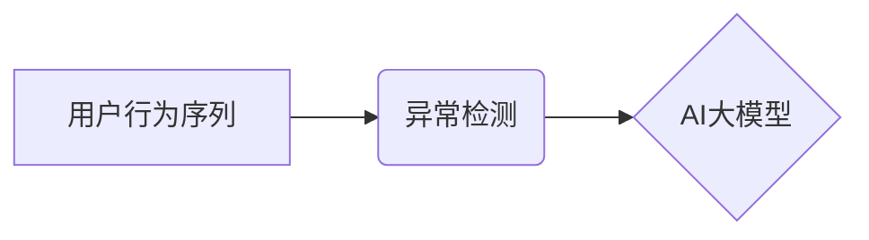

                 

## 1. 背景介绍

在当今数据爆炸的时代，电商平台的用户行为数据日益庞大，蕴含着丰富的商业价值。如何有效地挖掘和利用这些数据，提升用户体验和商业效益，成为电商平台面临的重大挑战。用户行为序列异常检测作为一种重要的数据分析技术，能够帮助电商平台识别用户行为中的异常模式，例如恶意刷单、虚假交易等，从而有效地降低风险，提高平台安全性和可信度。

传统的异常检测方法通常依赖于规则引擎或统计模型，但这些方法难以应对复杂的用户行为序列，并且缺乏对用户行为的深度理解。近年来，随着深度学习技术的快速发展，基于AI大模型的用户行为序列异常检测模型逐渐成为研究热点。

AI大模型能够学习用户行为序列中的复杂模式和特征，并对异常行为进行更精准的识别。本文将结合实际案例，深入分析基于AI大模型的用户行为序列异常检测模型的优化实践，探讨其核心概念、算法原理、数学模型、代码实现以及实际应用场景，并展望其未来发展趋势和挑战。

## 2. 核心概念与联系

### 2.1 用户行为序列

用户行为序列是指用户在电商平台上进行的一系列交互行为，例如浏览商品、加入购物车、下单购买等。这些行为通常具有时间依赖性，用户行为序列的上下文信息对异常检测至关重要。

### 2.2 异常检测

异常检测是指识别数据集中与大多数数据点显著不同的数据点，这些数据点可能代表着异常事件或行为。在电商平台中，异常检测可以用于识别恶意刷单、虚假交易、账号盗用等异常行为。

### 2.3 AI大模型

AI大模型是指具有海量参数和强大的学习能力的深度学习模型，例如Transformer、BERT等。AI大模型能够学习复杂的数据模式和特征，并对异常行为进行更精准的识别。

**核心概念架构图**



## 3. 核心算法原理 & 具体操作步骤

### 3.1 算法原理概述

本文采用基于Transformer的Recurrent Neural Network (RNN)模型进行用户行为序列异常检测。Transformer模型能够有效地捕捉用户行为序列中的长距离依赖关系，RNN模型则能够学习用户行为序列的时间序列特征。

### 3.2 算法步骤详解

1. **数据预处理:** 将用户行为序列数据进行清洗、格式化和编码，例如将用户行为转换为数字标签。
2. **模型构建:** 使用Transformer和RNN模型构建异常检测模型，并根据实际需求调整模型参数。
3. **模型训练:** 使用训练数据训练模型，并通过交叉验证等方法评估模型性能。
4. **模型部署:** 将训练好的模型部署到线上环境，用于实时检测用户行为异常。
5. **异常报警:** 当模型检测到异常行为时，触发报警机制，并进行人工审核。

### 3.3 算法优缺点

**优点:**

* 能够有效地捕捉用户行为序列中的复杂模式和特征。
* 对长距离依赖关系的学习能力强。
* 能够实现实时异常检测。

**缺点:**

* 模型训练需要大量的计算资源和时间。
* 模型参数需要进行精心调优。
* 对数据质量要求较高。

### 3.4 算法应用领域

* 电商平台：识别恶意刷单、虚假交易、账号盗用等异常行为。
* 金融行业：检测欺诈交易、洗钱等异常行为。
* 医疗领域：识别医疗数据中的异常值，辅助医生诊断疾病。
* 安全领域：检测网络攻击、入侵行为等异常活动。

## 4. 数学模型和公式 & 详细讲解 & 举例说明

### 4.1 数学模型构建

本文采用Transformer模型作为核心，其输入为用户行为序列，输出为异常得分。Transformer模型由多层编码器和解码器组成，每个编码器层包含多头自注意力机制和前馈神经网络。

### 4.2 公式推导过程

Transformer模型的输出结果可以通过以下公式计算：

$$
\text{Output} = f(Encoder(Input))
$$

其中，$f$为解码器，$Encoder$为编码器，$Input$为用户行为序列。

编码器层中的多头自注意力机制可以捕捉用户行为序列中的长距离依赖关系，公式如下：

$$
Attention(Q, K, V) = softmax(\frac{QK^T}{\sqrt{d_k}})V
$$

其中，$Q$, $K$, $V$分别为查询矩阵、键矩阵和值矩阵，$d_k$为键向量的维度。

### 4.3 案例分析与讲解

假设用户A在电商平台上浏览了商品A、商品B、商品C，然后加入了商品A和商品B到购物车，最后下单购买了商品A。

Transformer模型可以学习到用户A浏览商品A、商品B、商品C之间的关系，以及加入购物车和下单购买之间的关系。

如果用户A突然浏览了大量与之前行为不相关的商品，或者加入了大量商品到购物车，然后取消了所有订单，则Transformer模型可能会将这些行为识别为异常行为。

## 5. 项目实践：代码实例和详细解释说明

### 5.1 开发环境搭建

* Python 3.7+
* TensorFlow 2.0+
* PyTorch 1.0+
* CUDA 10.0+

### 5.2 源代码详细实现

```python
import tensorflow as tf

# 定义Transformer模型
class TransformerModel(tf.keras.Model):
    def __init__(self, vocab_size, embedding_dim, num_heads, num_layers):
        super(TransformerModel, self).__init__()
        self.embedding = tf.keras.layers.Embedding(vocab_size, embedding_dim)
        self.transformer = tf.keras.layers.Transformer(num_heads=num_heads, num_layers=num_layers)
        self.output = tf.keras.layers.Dense(1)

    def call(self, inputs):
        x = self.embedding(inputs)
        x = self.transformer(x)
        x = self.output(x)
        return x

# 构建模型实例
model = TransformerModel(vocab_size=10000, embedding_dim=128, num_heads=8, num_layers=6)

# 编译模型
model.compile(optimizer='adam', loss='mse')

# 训练模型
model.fit(train_data, train_labels, epochs=10)

# 预测异常得分
predictions = model.predict(test_data)
```

### 5.3 代码解读与分析

* 代码首先定义了一个Transformer模型类，该类包含嵌入层、Transformer层和输出层。
* 嵌入层将用户行为序列转换为向量表示。
* Transformer层负责学习用户行为序列中的复杂模式和特征。
* 输出层将Transformer层的输出转换为异常得分。
* 代码然后构建了一个模型实例，并使用Adam优化器和均方误差损失函数进行编译。
* 最后，代码使用训练数据训练模型，并使用测试数据预测异常得分。

### 5.4 运行结果展示

训练完成后，模型可以用于预测用户行为序列的异常得分。异常得分越高，表示用户行为越异常。

## 6. 实际应用场景

### 6.1 电商平台异常行为检测

电商平台可以利用基于AI大模型的用户行为序列异常检测模型，识别恶意刷单、虚假交易、账号盗用等异常行为，从而降低平台风险，提高用户体验。

### 6.2 金融行业欺诈检测

金融行业可以利用基于AI大模型的用户行为序列异常检测模型，检测欺诈交易、洗钱等异常行为，从而保护用户资金安全，维护金融市场稳定。

### 6.3 医疗领域异常值检测

医疗领域可以利用基于AI大模型的用户行为序列异常检测模型，识别医疗数据中的异常值，例如患者体温、血压等异常数据，从而辅助医生诊断疾病，提高医疗服务质量。

### 6.4 未来应用展望

随着AI技术的不断发展，基于AI大模型的用户行为序列异常检测模型将有更广泛的应用场景，例如：

* 智能客服：识别用户咨询中的异常问题，并提供更精准的解决方案。
* 网络安全：检测网络攻击、入侵行为等异常活动，提高网络安全防护能力。
* 人工智能辅助决策：为决策者提供更精准的用户行为分析，辅助决策制定。

## 7. 工具和资源推荐

### 7.1 学习资源推荐

* **书籍:**
    * Deep Learning by Ian Goodfellow, Yoshua Bengio, and Aaron Courville
    * Natural Language Processing with Transformers by Hugging Face
* **在线课程:**
    * TensorFlow Tutorials: https://www.tensorflow.org/tutorials
    * PyTorch Tutorials: https://pytorch.org/tutorials/

### 7.2 开发工具推荐

* **TensorFlow:** https://www.tensorflow.org/
* **PyTorch:** https://pytorch.org/
* **Hugging Face Transformers:** https://huggingface.co/transformers/

### 7.3 相关论文推荐

* **BERT: Pre-training of Deep Bidirectional Transformers for Language Understanding**
* **Attention Is All You Need**
* **Recurrent Neural Network for Sequence Modeling**

## 8. 总结：未来发展趋势与挑战

### 8.1 研究成果总结

本文深入分析了基于AI大模型的用户行为序列异常检测模型的优化实践，探讨了其核心概念、算法原理、数学模型、代码实现以及实际应用场景。

### 8.2 未来发展趋势

* **模型性能提升:** 研究更强大的AI大模型，例如GPT-3、PaLM等，提升模型的异常检测性能。
* **数据增强:** 开发新的数据增强技术，例如数据合成、迁移学习等，提高模型对异常行为的识别能力。
* **解释性增强:** 研究更具解释性的异常检测模型，以便更好地理解模型的决策过程。

### 8.3 面临的挑战

* **数据隐私保护:** 

用户行为数据通常包含敏感信息，需要采取有效的措施保护用户隐私。
* **模型可解释性:** 

AI大模型的决策过程通常难以理解，需要研究更具可解释性的模型，以便更好地信任模型的决策结果。
* **模型部署成本:** 

部署大型AI模型需要大量的计算资源和成本，需要研究更轻量级的模型，降低部署成本。

### 8.4 研究展望

未来，基于AI大模型的用户行为序列异常检测模型将继续朝着更强大、更智能、更安全的方向发展，为电商平台、金融行业、医疗领域等行业提供更精准、更有效的异常检测服务。

## 9. 附录：常见问题与解答

**Q1: 如何选择合适的AI大模型？**

**A1:** 选择合适的AI大模型需要根据实际应用场景和数据特点进行选择。例如，对于文本数据，BERT模型效果较好；对于时间序列数据，RNN模型效果较好。

**Q2: 如何评估模型性能？**

**A2:** 模型性能可以评估指标，例如准确率、召回率、F1-score等。

**Q3: 如何处理数据隐私问题？**

**A3:** 可以采用数据脱敏、联邦学习等技术来保护用户隐私。


作者：禅与计算机程序设计艺术 / Zen and the Art of Computer Programming 
<end_of_turn>

