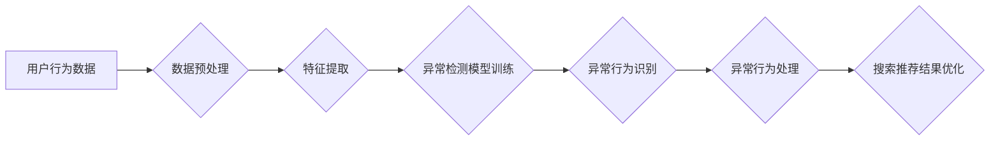

                 

## 电商搜索推荐中的AI大模型用户行为序列异常检测模型选择

> 关键词：电商搜索推荐、AI大模型、用户行为序列、异常检测、时间序列分析、深度学习

## 1. 背景介绍

在当今数据爆炸的时代，电商平台积累了海量用户行为数据，这些数据蕴含着丰富的商业价值。用户行为序列分析，即对用户在电商平台上的搜索、浏览、购买等行为进行时间序贯分析，已成为电商搜索推荐的重要研究方向。通过挖掘用户行为序列中的潜在模式和规律，可以帮助电商平台更精准地推荐商品，提升用户体验，最终促进销售额增长。

然而，用户行为序列数据也存在着异常值和噪声，这些异常值会对模型训练和预测结果造成负面影响。因此，在电商搜索推荐中，需要对用户行为序列进行异常检测，识别和过滤掉异常行为，以提高模型的准确性和可靠性。

近年来，随着深度学习技术的快速发展，基于AI大模型的用户行为序列异常检测模型取得了显著的成果。这些模型能够学习到更复杂的序列特征，并对异常行为进行更精准的识别。

## 2. 核心概念与联系

### 2.1 用户行为序列

用户行为序列是指用户在电商平台上进行一系列行为的记录，例如：搜索关键词、浏览商品、加入购物车、下单购买等。这些行为通常按时间顺序排列，形成一个序列。

### 2.2 异常检测

异常检测是指识别数据集中与众不同的数据点，这些数据点可能代表着异常行为或事件。在电商搜索推荐中，异常行为可以包括：

* **刷单行为:** 用户恶意下单，然后取消订单，以获取平台奖励或恶意抬高商品排名。
* **恶意搜索行为:** 用户输入无关或敏感关键词，以干扰平台搜索结果或攻击其他用户。
* **数据造假行为:** 用户通过人工或自动化手段，制造虚假用户行为数据，以欺骗平台算法。

### 2.3 AI大模型

AI大模型是指具有海量参数和强大的学习能力的深度学习模型。这些模型通常通过训练大量的文本或序列数据，学习到复杂的语言表示和模式。

**Mermaid 流程图**



## 3. 核心算法原理 & 具体操作步骤

### 3.1 算法原理概述

基于AI大模型的用户行为序列异常检测模型通常采用以下几种算法原理：

* **自编码器:** 自编码器是一种无监督学习模型，通过学习数据自身的编码和解码关系，可以识别出数据中的异常值。
* **循环神经网络(RNN):** RNN能够处理序列数据，并学习到序列中的时间依赖关系。通过训练RNN模型，可以识别出与正常用户行为序列不同的异常行为序列。
* **Transformer:** Transformer是一种基于注意力机制的深度学习模型，能够捕捉序列数据中的长距离依赖关系。Transformer模型在用户行为序列异常检测方面也取得了很好的效果。

### 3.2 算法步骤详解

1. **数据预处理:** 对用户行为序列数据进行清洗、格式化和转换，例如：去除重复数据、填充缺失值、将行为类型编码为数字。
2. **特征提取:** 从用户行为序列数据中提取特征，例如：行为类型、时间间隔、商品类别、用户属性等。
3. **模型训练:** 使用选定的AI大模型算法，对预处理后的数据进行训练，学习到异常行为的特征表示。
4. **异常行为识别:** 将新的用户行为序列数据输入到训练好的模型中，预测其是否属于异常行为。
5. **异常行为处理:** 对识别出的异常行为进行处理，例如：报警、封禁用户、调整搜索结果等。

### 3.3 算法优缺点

| 算法 | 优点 | 缺点 |
|---|---|---|
| 自编码器 | 能够学习到数据自身的编码和解码关系，识别出异常值 | 训练过程复杂，需要大量的训练数据 |
| RNN | 能够处理序列数据，并学习到序列中的时间依赖关系 | 训练过程容易出现梯度消失问题，难以捕捉长距离依赖关系 |
| Transformer | 能够捕捉序列数据中的长距离依赖关系，效果更优于RNN | 训练过程更加复杂，需要更多的计算资源 |

### 3.4 算法应用领域

基于AI大模型的用户行为序列异常检测模型在电商搜索推荐、金融 fraud检测、网络安全等领域都有广泛的应用。

## 4. 数学模型和公式 & 详细讲解 & 举例说明

### 4.1 数学模型构建

假设用户行为序列为 $X = (x_1, x_2, ..., x_T)$，其中 $x_t$ 表示第 $t$ 个时间步长的行为。

**自编码器模型:**

* **编码器:** 将用户行为序列 $X$ 编码为一个低维向量 $Z = f(X)$，其中 $f$ 是编码器网络。
* **解码器:** 将低维向量 $Z$ 解码为一个接近原始序列 $X$ 的序列 $\hat{X} = g(Z)$，其中 $g$ 是解码器网络。

**损失函数:**

* 使用均方误差 (MSE) 作为损失函数，衡量原始序列 $X$ 和解码序列 $\hat{X}$ 之间的差异。

$$
L = \frac{1}{T} \sum_{t=1}^{T} (x_t - \hat{x}_t)^2
$$

**训练目标:**

* 通过最小化损失函数 $L$，训练编码器和解码器网络，使编码后的低维向量 $Z$ 能有效地表示用户行为序列 $X$。

**异常检测:**

* 将新的用户行为序列 $X'$ 编码为低维向量 $Z'$，如果 $Z'$ 与训练好的编码器网络的输出分布相差较大，则认为 $X'$ 是异常行为。

### 4.2 公式推导过程

自编码器的训练过程是一个优化问题，目标是找到最优的编码器和解码器网络参数，使得损失函数 $L$ 最小。

可以使用梯度下降算法来优化网络参数。

### 4.3 案例分析与讲解

假设电商平台收集到用户搜索关键词的序列数据，其中包含一些刷单行为。

可以使用自编码器模型对这些数据进行训练，学习到正常用户搜索行为的特征表示。

然后，将新的用户搜索关键词序列数据输入到训练好的模型中，如果模型预测该序列属于异常行为，则可以认为该用户可能存在刷单行为。

## 5. 项目实践：代码实例和详细解释说明

### 5.1 开发环境搭建

* Python 3.7+
* TensorFlow 2.0+
* PyTorch 1.0+
* Jupyter Notebook

### 5.2 源代码详细实现

```python
# 使用 TensorFlow 实现自编码器模型

import tensorflow as tf

# 定义编码器网络
encoder = tf.keras.Sequential([
    tf.keras.layers.Embedding(input_dim=vocab_size, output_dim=embedding_dim),
    tf.keras.layers.LSTM(units=hidden_units),
    tf.keras.layers.Dense(units=latent_dim)
])

# 定义解码器网络
decoder = tf.keras.Sequential([
    tf.keras.layers.Dense(units=hidden_units),
    tf.keras.layers.LSTM(units=hidden_units),
    tf.keras.layers.Dense(units=vocab_size, activation='softmax')
])

# 定义自编码器模型
autoencoder = tf.keras.Model(inputs=encoder.input, outputs=decoder(encoder(inputs)))

# 定义损失函数和优化器
autoencoder.compile(optimizer='adam', loss='sparse_categorical_crossentropy')

# 训练模型
autoencoder.fit(train_data, train_data, epochs=10)

# 预测异常行为
predictions = autoencoder.predict(test_data)
```

### 5.3 代码解读与分析

* 编码器网络使用 Embedding 层将关键词编码为向量表示，然后使用 LSTM 层学习到关键词之间的时间依赖关系，最后使用 Dense 层将向量表示压缩到低维空间。
* 解码器网络使用 Dense 层和 LSTM 层将低维向量表示解码回关键词序列。
* 自编码器模型使用 MSE 作为损失函数，训练目标是使解码后的序列与原始序列尽可能接近。
* 训练完成后，可以将新的用户行为序列数据输入到模型中，预测其是否属于异常行为。

### 5.4 运行结果展示

* 可以使用可视化工具，例如 TensorBoard，来展示模型的训练过程和预测结果。
* 可以使用指标，例如 AUC 和 F1-score，来评估模型的性能。

## 6. 实际应用场景

### 6.1 电商搜索推荐

* 识别刷单行为，防止恶意用户影响搜索结果排名。
* 识别恶意搜索行为，过滤掉无关或敏感关键词，提高搜索结果的质量。
* 识别数据造假行为，保证数据真实性和可靠性。

### 6.2 金融 fraud检测

* 识别信用卡欺诈行为，例如：虚假交易、身份盗用等。
* 识别网络钓鱼攻击，例如：伪造网站、钓鱼邮件等。
* 识别洗钱行为，例如：通过多笔小额交易掩盖大额资金转移等。

### 6.3 网络安全

* 识别恶意软件攻击，例如：病毒、木马、蠕虫等。
* 识别网络入侵行为，例如：端口扫描、暴力破解等。
* 识别DDoS攻击，例如：利用大量僵尸网络攻击服务器，导致服务器瘫痪等。

### 6.4 未来应用展望

随着AI大模型技术的不断发展，用户行为序列异常检测模型将应用于更多领域，例如：医疗保健、教育、交通运输等。

## 7. 工具和资源推荐

### 7.1 学习资源推荐

* **书籍:**
    * Deep Learning by Ian Goodfellow, Yoshua Bengio, and Aaron Courville
    * Hands-On Machine Learning with Scikit-Learn, Keras & TensorFlow by Aurélien Géron
* **在线课程:**
    * TensorFlow Tutorials: https://www.tensorflow.org/tutorials
    * PyTorch Tutorials: https://pytorch.org/tutorials/

### 7.2 开发工具推荐

* **TensorFlow:** https://www.tensorflow.org/
* **PyTorch:** https://pytorch.org/
* **Jupyter Notebook:** https://jupyter.org/

### 7.3 相关论文推荐

* **Autoencoders** by Geoffrey Hinton and Ruslan Salakhutdinov
* **Recurrent Neural Networks** by Sepp Hochreiter and Jürgen Schmidhuber
* **Attention Is All You Need** by Ashish Vaswani et al.

## 8. 总结：未来发展趋势与挑战

### 8.1 研究成果总结

基于AI大模型的用户行为序列异常检测模型取得了显著的成果，能够有效识别出异常行为，提高电商搜索推荐的准确性和可靠性。

### 8.2 未来发展趋势

* **模型复杂度提升:** 将更复杂的深度学习模型，例如 Transformer 和 Graph Neural Networks，应用于用户行为序列异常检测。
* **数据融合:** 将用户行为序列数据与其他数据源，例如用户画像、商品信息、平台运营数据等，进行融合，提高模型的识别精度。
* **解释性增强:** 研究如何提高模型的解释性，使得异常行为的识别结果更易于理解和解释。

### 8.3 面临的挑战

* **数据质量:** 用户行为序列数据往往存在着噪声、缺失值和不完整性等问题，需要进行有效的预处理和清洗。
* **模型训练成本:** 训练大型深度学习模型需要大量的计算资源和时间，成本较高。
* **模型泛化能力:** 模型在不同平台和场景下的泛化能力需要进一步提升。

### 8.4 研究展望

未来，用户行为序列异常检测模型将朝着更智能、更精准、更可解释的方向发展，为电商搜索推荐、金融 fraud检测、网络安全等领域提供更有效的解决方案。

## 9. 附录：常见问题与解答

* **Q1: 如何选择合适的异常检测模型？**

* **A1:** 选择合适的异常检测模型需要根据具体应用场景和数据特点进行考虑。例如，对于时间序列数据，RNN 和 Transformer 模型效果较好；对于结构化数据，自编码器模型效果较好。

* **Q2: 如何评估异常检测模型的性能？**

* **A2:** 可以使用指标，例如 AUC 和 F1-score，来评估异常检测模型的性能。

* **Q3: 如何处理异常行为？**

* **A3:** 处理异常行为的方法多种多样，例如：报警、封禁用户、调整搜索结果等。具体的处理方法需要根据异常行为的类型和严重程度进行选择。


作者：禅与计算机程序设计艺术 / Zen and the Art of Computer Programming 
<end_of_turn>

