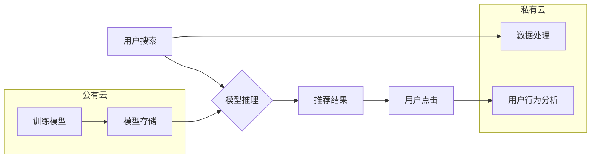

                 

## 电商搜索推荐场景下的AI大模型模型部署混合云实践

> 关键词：AI大模型、混合云、电商搜索推荐、模型部署、性能优化、成本控制

## 1. 背景介绍

随着电商行业的蓬勃发展，用户对商品搜索和推荐的需求日益增长。传统的基于规则的搜索推荐系统难以满足用户个性化、精准化的需求。而基于AI大模型的搜索推荐系统，凭借其强大的学习能力和泛化能力，能够更精准地理解用户意图，提供更个性化的商品推荐，从而提升用户体验和转化率。

然而，AI大模型的训练和部署都面临着巨大的挑战。其模型规模庞大，对算力、存储和网络带宽要求极高。同时，AI大模型的部署需要考虑模型的实时性、可扩展性和安全性等因素。

混合云架构为AI大模型的部署提供了灵活、高效的解决方案。混合云架构将公有云和私有云相结合，充分利用了两种云计算模式的优势。公有云可以提供弹性、可扩展的计算资源，而私有云则可以保障数据安全和隐私。

## 2. 核心概念与联系

### 2.1  AI大模型

AI大模型是指参数量巨大、训练数据海量的人工智能模型。这类模型通常采用深度学习技术，能够学习复杂的模式和关系，从而实现强大的泛化能力和推理能力。

### 2.2  混合云

混合云是一种将公有云和私有云相结合的云计算架构。它可以根据不同的应用场景和需求，灵活选择使用不同的云资源。

### 2.3  电商搜索推荐

电商搜索推荐是指在电商平台上，根据用户的搜索行为和历史购买记录，推荐相关商品的系统。

**混合云架构在电商搜索推荐场景下的应用**



## 3. 核心算法原理 & 具体操作步骤

### 3.1  算法原理概述

电商搜索推荐系统通常采用基于协同过滤、内容过滤和混合过滤的算法。

* **协同过滤:** 根据用户的历史行为，预测用户对商品的喜好。
* **内容过滤:** 根据商品的特征，推荐与用户兴趣相符的商品。
* **混合过滤:** 将协同过滤和内容过滤相结合，提高推荐的准确性。

### 3.2  算法步骤详解

1. **数据预处理:** 收集用户行为数据、商品信息数据等，进行清洗、转换和特征提取。
2. **模型训练:** 使用训练数据，训练协同过滤、内容过滤或混合过滤模型。
3. **模型评估:** 使用测试数据，评估模型的性能，例如准确率、召回率和覆盖率。
4. **模型部署:** 将训练好的模型部署到线上环境，用于实时推荐。
5. **模型监控:** 持续监控模型的性能，并进行模型更新和优化。

### 3.3  算法优缺点

| 算法类型 | 优点 | 缺点 |
|---|---|---|
| 协同过滤 | 能够发现隐含的用户偏好 | 数据稀疏性问题 |
| 内容过滤 | 能够推荐与用户兴趣相符的商品 | 冷启动问题 |
| 混合过滤 | 能够结合协同过滤和内容过滤的优势 | 模型复杂度较高 |

### 3.4  算法应用领域

电商搜索推荐算法广泛应用于电商平台、社交媒体、内容推荐等领域。

## 4. 数学模型和公式 & 详细讲解 & 举例说明

### 4.1  数学模型构建

协同过滤算法通常使用矩阵分解模型，将用户-商品交互矩阵分解成用户特征矩阵和商品特征矩阵。

假设用户集合为U，商品集合为I，用户-商品交互矩阵为R，其中R(u,i)表示用户u对商品i的评分。

用户特征矩阵为U，商品特征矩阵为V。则有：

$$R(u,i) \approx U(u) \cdot V(i)$$

其中，U(u)表示用户u的特征向量，V(i)表示商品i的特征向量。

### 4.2  公式推导过程

目标函数为最小化预测评分与实际评分之间的误差，可以使用均方误差作为损失函数：

$$L = \frac{1}{2} \sum_{u \in U, i \in I} (R(u,i) - U(u) \cdot V(i))^2$$

可以使用梯度下降算法优化目标函数，更新用户特征矩阵和商品特征矩阵。

### 4.3  案例分析与讲解

假设有一个用户-商品交互矩阵，其中用户集合为{1, 2, 3}，商品集合为{A, B, C}。

用户1对商品A评分为5，对商品B评分为3，对商品C评分为4。

用户2对商品A评分为4，对商品B评分为5，对商品C评分为2。

用户3对商品A评分为3，对商品B评分为2，对商品C评分为5。

可以使用矩阵分解模型对该交互矩阵进行分解，得到用户特征矩阵和商品特征矩阵。

## 5. 项目实践：代码实例和详细解释说明

### 5.1  开发环境搭建

* 操作系统：Ubuntu 20.04
* Python 版本：3.8
* 框架：TensorFlow 2.x
* 库：NumPy, Pandas, Scikit-learn

### 5.2  源代码详细实现

```python
import tensorflow as tf
from tensorflow import keras

# 定义模型
model = keras.Sequential([
    keras.layers.Dense(64, activation='relu', input_shape=(n_users,)),
    keras.layers.Dense(n_items)
])

# 定义损失函数和优化器
model.compile(loss='mse', optimizer='adam')

# 训练模型
model.fit(X_train, y_train, epochs=10, batch_size=32)

# 预测评分
predictions = model.predict(X_test)
```

### 5.3  代码解读与分析

* 定义模型：使用多层感知机构建模型，输入用户特征，输出商品评分。
* 定义损失函数和优化器：使用均方误差作为损失函数，使用Adam优化器进行训练。
* 训练模型：使用训练数据训练模型，设置训练轮数和批处理大小。
* 预测评分：使用测试数据预测商品评分。

### 5.4  运行结果展示

训练完成后，可以评估模型的性能，例如使用均方根误差 (RMSE) 衡量预测评分与实际评分之间的差异。

## 6. 实际应用场景

### 6.1  电商平台商品推荐

AI大模型可以根据用户的搜索历史、浏览记录、购买记录等数据，推荐与用户兴趣相符的商品。

### 6.2  个性化广告推荐

AI大模型可以根据用户的兴趣爱好、行为特征等数据，推荐个性化的广告。

### 6.3  内容推荐

AI大模型可以根据用户的阅读习惯、观看记录等数据，推荐与用户兴趣相符的内容。

### 6.4  未来应用展望

随着AI技术的不断发展，AI大模型在电商搜索推荐场景下的应用将更加广泛和深入。例如，可以利用自然语言处理技术，理解用户的更复杂的意图，提供更精准的推荐；可以利用强化学习技术，优化推荐策略，提升推荐效果。

## 7. 工具和资源推荐

### 7.1  学习资源推荐

* TensorFlow 官方文档：https://www.tensorflow.org/
* PyTorch 官方文档：https://pytorch.org/
* 深度学习书籍：

    * 《深度学习》
    * 《动手学深度学习》

### 7.2  开发工具推荐

* Jupyter Notebook
* VS Code
* PyCharm

### 7.3  相关论文推荐

* 《Collaborative Filtering for Implicit Feedback Datasets》
* 《Neural Collaborative Filtering》
* 《Hybrid Recommender Systems: A Survey》

## 8. 总结：未来发展趋势与挑战

### 8.1  研究成果总结

AI大模型在电商搜索推荐场景下的应用取得了显著的成果，能够提升用户体验和转化率。

### 8.2  未来发展趋势

* 模型规模和复杂度不断提升
* 模型训练效率和部署效率不断提高
* 模型解释性和可解释性不断增强
* 模型个性化和定制化能力不断增强

### 8.3  面临的挑战

* 模型训练和部署成本高
* 数据安全和隐私保护问题
* 模型公平性和可控性问题
* 模型的泛化能力和鲁棒性问题

### 8.4  研究展望

未来，需要进一步研究如何降低AI大模型的训练和部署成本，提高模型的效率、公平性和可控性，以及如何解决模型的泛化能力和鲁棒性问题。


## 9. 附录：常见问题与解答

### 9.1  Q1: 如何选择合适的混合云架构？

**A1:** 选择合适的混合云架构需要根据具体的应用场景和需求进行评估。需要考虑因素包括：

* 应用的计算资源需求
* 应用的数据存储需求
* 应用的网络带宽需求
* 数据安全和隐私保护需求
* 成本预算

### 9.2  Q2: 如何优化AI大模型的部署效率？

**A2:** 优化AI大模型的部署效率可以从以下几个方面入手：

* 使用容器化技术，例如Docker，将模型和依赖库打包成容器，方便部署和管理。
* 使用微服务架构，将模型拆分成多个小的服务，提高部署和扩展的灵活性。
* 使用模型压缩和量化技术，减小模型的大小，降低部署成本。

### 9.3  Q3: 如何保障AI大模型的数据安全和隐私保护？

**A3:** 保障AI大模型的数据安全和隐私保护需要采取以下措施：

* 使用加密技术，对数据进行加密，防止数据泄露。
* 使用身份验证和授权机制，控制对数据的访问权限。
* 遵循数据隐私法规，例如GDPR和CCPA。


作者：禅与计算机程序设计艺术 / Zen and the Art of Computer Programming 
<end_of_turn>

