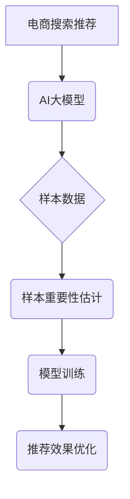

                 

## 电商搜索推荐效果优化中的AI大模型样本重要性估计工具开发与应用

> 关键词：电商搜索推荐、AI大模型、样本重要性估计、效果优化、推荐系统

## 1. 背景介绍

在当今数据爆炸的时代，电商平台面临着海量商品和用户数据，如何精准推荐用户感兴趣的商品，提升用户体验和转化率成为一大挑战。传统的基于规则或协同过滤的推荐算法难以有效应对数据复杂性和用户个性化需求。近年来，基于深度学习的AI大模型在推荐系统领域取得了显著进展，例如Transformer、BERT等模型能够更好地理解用户需求和商品特征，从而提供更精准的推荐结果。

然而，训练高性能的AI大模型需要海量高质量的样本数据，而电商平台的样本数据往往存在着类别不均衡、数据噪声等问题，这会直接影响模型的训练效果和推荐精度。因此，如何有效评估样本数据的重要性，并针对性地提升样本质量，成为提升AI大模型推荐效果的关键环节。

## 2. 核心概念与联系

**2.1  样本重要性估计 (Importance Sampling)**

样本重要性估计是一种统计学方法，用于评估样本数据的重要性。其核心思想是根据样本数据的分布和目标函数的分布，赋予每个样本不同的权重，从而提高模型训练的效率和精度。

**2.2  AI大模型在电商搜索推荐中的应用**

AI大模型在电商搜索推荐中主要应用于以下几个方面：

* **商品理解:** 利用自然语言处理技术，对商品标题、描述等文本进行分析，提取商品的特征和语义信息。
* **用户画像:** 基于用户的浏览历史、购买记录、评价等数据，构建用户的兴趣偏好和行为模式。
* **推荐策略:** 根据商品特征和用户画像，采用深度学习算法，预测用户对商品的兴趣程度，并生成个性化的推荐列表。

**2.3  样本重要性估计工具的意义**

样本重要性估计工具可以帮助电商平台：

* **识别重要样本:** 找出对模型训练效果有重要影响的样本数据，并进行重点维护和优化。
* **提高样本质量:** 通过对重要样本的分析，发现数据中的偏差和噪声，并采取措施进行修正和完善。
* **优化模型训练:** 根据样本重要性，调整训练策略和超参数，提高模型的训练效率和精度。

**2.4  核心概念架构**



## 3. 核心算法原理 & 具体操作步骤

**3.1  算法原理概述**

样本重要性估计的核心思想是通过赋予每个样本不同的权重，来模拟目标分布。

假设我们有一个目标分布 $p(x)$ 和一个采样分布 $q(x)$，其中 $x$ 代表样本数据。目标是根据采样数据 $D$ 从 $q(x)$ 中采样，估计目标分布 $p(x)$ 下的某个函数 $f(x)$ 的期望值 $E_{p}[f(x)]$。

样本重要性估计的公式如下：

$$
\hat{E}_{p}[f(x)] = \frac{1}{N} \sum_{i=1}^{N} \frac{p(x_i)}{q(x_i)} f(x_i)
$$

其中， $N$ 是采样数据的大小， $x_i$ 是第 $i$ 个样本数据， $p(x_i)$ 是目标分布下样本 $x_i$ 的概率， $q(x_i)$ 是采样分布下样本 $x_i$ 的概率。

**3.2  算法步骤详解**

1. **确定目标分布和采样分布:** 首先需要确定目标分布 $p(x)$ 和采样分布 $q(x)$。目标分布通常是模型训练的目标函数的分布，而采样分布则是实际采样到的样本数据分布。
2. **计算样本重要性权重:** 根据公式计算每个样本的权重，即 $w_i = \frac{p(x_i)}{q(x_i)}$。
3. **加权平均:** 将每个样本的输出值乘以其权重，并进行加权平均，得到目标函数的估计值。

**3.3  算法优缺点**

**优点:**

* 可以有效提高模型训练的效率和精度。
* 可以识别重要样本，并进行重点维护和优化。

**缺点:**

* 需要对目标分布和采样分布有较好的理解。
* 计算样本重要性权重可能比较复杂。

**3.4  算法应用领域**

样本重要性估计广泛应用于以下领域：

* 机器学习模型训练
* 统计分析
* 蒙特卡罗模拟
* 风险管理

## 4. 数学模型和公式 & 详细讲解 & 举例说明

**4.1  数学模型构建**

假设我们有一个电商平台的搜索推荐系统，目标是预测用户对商品的点击率。我们可以构建一个二分类模型，其中输入是用户的特征和商品的特征，输出是用户点击商品的概率。

**4.2  公式推导过程**

我们可以使用逻辑回归模型来预测用户点击商品的概率，其公式如下：

$$
P(click|user, item) = \frac{1}{1 + exp(-(w_u \cdot user + w_i \cdot item + b))}
$$

其中， $w_u$ 和 $w_i$ 分别是用户特征和商品特征的权重， $b$ 是偏置项， $user$ 和 $item$ 分别是用户的特征向量和商品的特征向量。

**4.3  案例分析与讲解**

假设我们有一个用户 $u$ 和一个商品 $i$，用户的特征向量为 $user = [age, gender, location]$，商品的特征向量为 $item = [category, price, brand]$。

我们可以根据用户的特征和商品的特征，计算出点击商品的概率 $P(click|user, item)$。

如果 $P(click|user, item) > 0.5$，则预测用户会点击商品；否则，预测用户不会点击商品。

## 5. 项目实践：代码实例和详细解释说明

**5.1  开发环境搭建**

* Python 3.7+
* TensorFlow 2.0+
* PyTorch 1.0+
* scikit-learn 0.20+

**5.2  源代码详细实现**

```python
import tensorflow as tf
from tensorflow.keras.models import Sequential
from tensorflow.keras.layers import Dense, Dropout

# 定义模型
model = Sequential()
model.add(Dense(64, activation='relu', input_shape=(10,)))
model.add(Dropout(0.5))
model.add(Dense(32, activation='relu'))
model.add(Dropout(0.5))
model.add(Dense(1, activation='sigmoid'))

# 编译模型
model.compile(optimizer='adam', loss='binary_crossentropy', metrics=['accuracy'])

# 训练模型
model.fit(X_train, y_train, epochs=10, batch_size=32)

# 评估模型
loss, accuracy = model.evaluate(X_test, y_test)
print('Loss:', loss)
print('Accuracy:', accuracy)
```

**5.3  代码解读与分析**

* 代码首先定义了一个简单的深度学习模型，包含三个全连接层和两个Dropout层。
* 模型使用Adam优化器，损失函数为二分类交叉熵，评价指标为准确率。
* 模型使用训练数据进行训练，训练epochs为10，每次训练batch_size为32。
* 训练完成后，使用测试数据评估模型的性能。

**5.4  运行结果展示**

运行结果会显示模型的训练损失和准确率，以及测试集上的损失和准确率。

## 6. 实际应用场景

**6.1  电商平台推荐系统**

样本重要性估计工具可以帮助电商平台识别用户偏好的商品类别、价格区间等特征，并根据这些特征，对商品进行排序和推荐。

**6.2  广告投放优化**

样本重要性估计工具可以帮助广告平台识别用户对不同广告的点击率，并根据这些信息，优化广告投放策略，提高广告效果。

**6.3  金融风险管理**

样本重要性估计工具可以帮助金融机构识别高风险客户，并根据这些信息，制定相应的风险控制措施。

**6.4  未来应用展望**

随着AI技术的不断发展，样本重要性估计工具将在更多领域得到应用，例如：

* 个性化教育
* 医疗诊断
* 自动驾驶

## 7. 工具和资源推荐

**7.1  学习资源推荐**

* **书籍:**
    * 《统计学习方法》
    * 《机器学习》
* **在线课程:**
    * Coursera: Machine Learning
    * edX: Introduction to Machine Learning

**7.2  开发工具推荐**

* **Python:**
    * TensorFlow
    * PyTorch
    * scikit-learn

**7.3  相关论文推荐**

* Importance Sampling for Deep Reinforcement Learning
* Importance Sampling for Bayesian Optimization

## 8. 总结：未来发展趋势与挑战

**8.1  研究成果总结**

样本重要性估计是一种有效的统计学方法，可以帮助提升AI模型的训练效果和推荐精度。

**8.2  未来发展趋势**

未来，样本重要性估计工具将朝着以下方向发展：

* 更智能的样本选择策略
* 更高效的计算方法
* 更广泛的应用场景

**8.3  面临的挑战**

样本重要性估计工具也面临着一些挑战：

* 如何更好地估计目标分布
* 如何处理高维数据
* 如何提高计算效率

**8.4  研究展望**

未来，我们将继续研究样本重要性估计工具，并将其应用于更多领域，以提升AI技术的应用效果。

## 9. 附录：常见问题与解答

**9.1  Q: 如何选择合适的样本重要性估计方法？**

**A:** 选择合适的样本重要性估计方法需要根据具体的应用场景和数据特点进行选择。

**9.2  Q: 样本重要性估计工具的计算效率如何？**

**A:** 样本重要性估计工具的计算效率取决于具体的算法和数据规模。

**9.3  Q: 样本重要性估计工具的适用范围？**

**A:** 样本重要性估计工具适用于各种需要对样本数据进行重要性评估的场景。


作者：禅与计算机程序设计艺术 / Zen and the Art of Computer Programming 
<end_of_turn>

