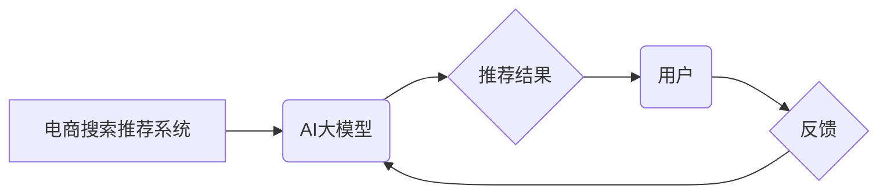

                 

## 电商搜索推荐效果评估中的AI大模型公平性评估技术

> 关键词：电商搜索推荐、AI大模型、公平性评估、偏见检测、算法解释、可解释AI、伦理AI

## 1. 背景介绍

电商平台的搜索推荐系统是用户获取商品信息和完成购买的重要途径。随着AI技术的快速发展，基于深度学习的大模型在电商搜索推荐领域得到了广泛应用，展现出强大的个性化推荐能力。然而，AI大模型的训练数据往往存在偏差，导致模型输出结果可能带有不可察觉的偏见，从而影响推荐结果的公平性，甚至加剧社会不公。

公平性问题在AI领域日益受到关注，尤其是在涉及社会决策和个人利益的场景下，其重要性尤为突出。电商搜索推荐作为一种影响用户消费行为的重要系统，其公平性问题不容忽视。如果推荐系统存在偏见，可能会导致某些用户群体获得更优质的推荐结果，而其他用户群体则受到不公平的对待，这不仅会损害用户的体验，还会加剧社会分化和不平等。

## 2. 核心概念与联系

**2.1 核心概念**

* **公平性 (Fairness):** 在AI系统中，公平性是指系统对所有用户群体进行平等对待，不产生歧视或偏袒。
* **偏见 (Bias):** 指AI模型在训练数据中学习到的不准确或不公正的模式，导致模型输出结果对某些用户群体产生不利影响。
* **AI大模型 (Large Language Model):** 指参数量庞大的深度学习模型，能够处理和生成复杂文本数据，在自然语言处理、机器翻译、文本生成等领域表现出色。
* **电商搜索推荐:** 指电商平台根据用户的搜索历史、浏览记录、购买行为等信息，推荐相关商品的系统。

**2.2 架构关系**



**2.3 核心联系**

电商搜索推荐系统中，AI大模型扮演着核心角色，负责分析用户数据并生成推荐结果。然而，由于训练数据可能存在偏见，AI大模型可能会学习到这些偏见，导致推荐结果不公平。因此，需要对AI大模型的公平性进行评估，并采取措施 mitigating 偏见的影响。

## 3. 核心算法原理 & 具体操作步骤

**3.1 算法原理概述**

公平性评估算法旨在识别和量化AI模型中的偏见。常见的公平性评估方法包括：

* **差分公平性 (Demographic Parity):** 衡量模型对不同用户群体的预测结果差异。
* **可解释性 (Interpretability):** 通过解释模型的决策过程，识别潜在的偏见来源。
* **对抗性训练 (Adversarial Training):** 通过训练一个对抗性模型来识别和减轻模型中的偏见。

**3.2 算法步骤详解**

1. **数据收集和预处理:** 收集包含用户特征和目标变量的数据，并进行预处理，例如数据清洗、特征工程等。
2. **模型训练:** 使用训练数据训练AI模型，例如深度学习模型。
3. **公平性评估:** 使用公平性评估算法对模型进行评估，例如计算不同用户群体的预测结果差异。
4. **偏见缓解:** 根据评估结果，采取措施缓解模型中的偏见，例如调整训练数据、修改模型结构、使用公平性约束等。
5. **模型重新训练:** 使用缓解偏见后的模型进行重新训练。
6. **持续监控:** 对模型进行持续监控，及时发现和缓解新的偏见问题。

**3.3 算法优缺点**

* **优点:** 可以识别和量化AI模型中的偏见，帮助开发更公平的AI系统。
* **缺点:** 

    * 评估方法的选择对结果有很大影响，需要根据具体场景选择合适的评估方法。
    * 缓解偏见的方法可能导致模型性能下降，需要权衡公平性和性能之间的 trade-off。

**3.4 算法应用领域**

* **金融领域:** 避免贷款申请、信用卡审批等决策中存在性别、种族等方面的偏见。
* **医疗领域:** 确保医疗诊断、治疗方案等决策对所有患者公平。
* **教育领域:** 避免招生、评价等决策中存在地域、经济背景等方面的偏见。

## 4. 数学模型和公式 & 详细讲解 & 举例说明

**4.1 数学模型构建**

假设我们有一个电商搜索推荐系统，其目标是根据用户的历史行为推荐商品。我们可以使用一个二分类模型来预测用户是否会点击推荐的商品，其中用户特征和商品特征作为输入，点击行为作为输出。

**4.2 公式推导过程**

我们可以使用逻辑回归模型来实现二分类预测，其目标函数为：

$$
L(w) = -\frac{1}{N} \sum_{i=1}^{N} y_i \log(p_i) + (1-y_i) \log(1-p_i)
$$

其中：

* $w$ 是模型参数
* $N$ 是样本数量
* $y_i$ 是第 $i$ 个样本的真实标签 (0 或 1)
* $p_i$ 是模型预测第 $i$ 个样本点击概率

**4.3 案例分析与讲解**

假设我们有一个电商平台，其用户特征包括性别、年龄、居住地等，商品特征包括价格、类别、品牌等。如果模型训练数据中存在性别偏见，例如女性用户更倾向于购买化妆品，则模型可能会学习到这种偏见，导致男性用户在搜索化妆品时获得更差的推荐结果。

## 5. 项目实践：代码实例和详细解释说明

**5.1 开发环境搭建**

* Python 3.7+
* TensorFlow 2.0+
* PyTorch 1.0+
* Jupyter Notebook

**5.2 源代码详细实现**

```python
# 导入必要的库
import tensorflow as tf

# 定义模型结构
model = tf.keras.models.Sequential([
    tf.keras.layers.Dense(64, activation='relu', input_shape=(num_features,)),
    tf.keras.layers.Dense(1, activation='sigmoid')
])

# 编译模型
model.compile(optimizer='adam',
              loss='binary_crossentropy',
              metrics=['accuracy'])

# 训练模型
model.fit(X_train, y_train, epochs=10, batch_size=32)

# 评估模型
loss, accuracy = model.evaluate(X_test, y_test)
print('Loss:', loss)
print('Accuracy:', accuracy)
```

**5.3 代码解读与分析**

* 代码首先导入必要的库，例如 TensorFlow。
* 然后定义一个简单的深度学习模型，包含一个全连接层和一个输出层。
* 模型使用 Adam 优化器、二分类交叉熵损失函数和精度作为评估指标进行训练。
* 训练完成后，使用测试数据评估模型的性能。

**5.4 运行结果展示**

运行代码后，会输出模型的训练损失、精度以及测试损失、精度。

## 6. 实际应用场景

**6.1 应用场景**

* **商品推荐:** 针对不同用户群体推荐个性化商品，避免推荐结果存在性别、年龄、地域等方面的偏见。
* **搜索结果排序:** 排序搜索结果时，避免对某些用户群体进行歧视性排序。
* **广告投放:** 确保广告投放公平公正，避免针对特定用户群体进行过度投放或屏蔽。

**6.2 未来应用展望**

随着AI技术的不断发展，公平性评估技术将在电商搜索推荐领域发挥越来越重要的作用。未来，我们可以期待以下发展趋势：

* **更精准的公平性评估方法:** 开发更精准、更有效的公平性评估方法，能够更全面地识别和量化AI模型中的偏见。
* **更有效的偏见缓解技术:** 研究更有效的偏见缓解技术，能够有效地减轻模型中的偏见，同时保持模型性能。
* **公平性评估的自动化:** 将公平性评估纳入到AI模型开发的整个流程中，实现公平性评估的自动化。

## 7. 工具和资源推荐

**7.1 学习资源推荐**

* **书籍:**

    * "Fairness and Machine Learning" by  Sarah M. Bender, Timnit Gebru, Angelina McMillan-Major, and  Emily M. Bender
    * "Weapons of Math Destruction: How Big Data Increases Inequality and Threatens Democracy" by Cathy O'Neil

* **论文:**

    * "On the Dangers of Stochastic Parrots: Can Language Models Be Too Big?" by Emily M. Bender, Timnit Gebru, Angelina McMillan-Major, and Margaret Mitchell
    * "Mitigating Bias in Machine Learning" by  Virginia Eubanks

* **在线课程:**

    * Coursera: "Fairness and Machine Learning" by Stanford University
    * edX: "AI Ethics" by University of California, Berkeley

**7.2 开发工具推荐**

* **TensorFlow Fairness:** TensorFlow 的一个开源库，提供公平性评估和偏见缓解工具。
* **AIF360:** 一个开源工具包，用于公平性评估和偏见缓解。
* **Fairlearn:** 一个 Python 库，用于公平性评估和偏见缓解。

**7.3 相关论文推荐**

* "Demographic Parity Does Not Imply Fairness" by  Barocas and Selbst
* "Fairness Through Awareness" by  Kamiran and Calders
* "Adversarial Debiasing" by  Zhao et al.

## 8. 总结：未来发展趋势与挑战

**8.1 研究成果总结**

近年来，在AI大模型公平性评估领域取得了显著进展，涌现出多种公平性评估方法和偏见缓解技术。这些成果为开发更公平、更可信赖的AI系统提供了重要的理论基础和实践经验。

**8.2 未来发展趋势**

* **更深入的理论研究:** 需要深入研究公平性的定义、度量和实现方法，探索更有效的公平性评估和偏见缓解技术。
* **跨领域合作:** 需要加强不同领域的合作，例如计算机科学、社会学、伦理学等，共同探讨AI公平性问题。
* **标准和规范的制定:** 需要制定相应的标准和规范，指导AI模型的开发和应用，确保AI技术的公平、公正和可持续发展。

**8.3 面临的挑战**

* **定义公平性的复杂性:** 公平性是一个多方面、复杂的概念，其定义和实现方式取决于具体的应用场景和社会价值观。
* **数据偏差的难解性:** 训练数据中的偏差是导致AI模型不公平的主要原因，但数据偏差的识别和缓解仍然是一个很大的挑战。
* **公平性评估的局限性:** 目前的公平性评估方法存在局限性，难以全面地识别和量化AI模型中的所有偏见。

**8.4 研究展望**

未来，AI公平性评估技术将继续朝着更精准、更有效、更可解释的方向发展。随着技术的进步和社会认知的提高，AI技术将更好地服务于人类，促进社会公平正义。

## 9. 附录：常见问题与解答

**9.1 如何识别AI模型中的偏见?**

可以使用公平性评估算法，例如差分公平性、可解释性等，来识别AI模型中的偏见。

**9.2 如何缓解AI模型中的偏见?**

可以使用多种方法缓解AI模型中的偏见，例如调整训练数据、修改模型结构、使用公平性约束等。

**9.3 公平性评估是否会降低模型性能?**

在某些情况下，缓解偏见可能会导致模型性能下降，需要权衡公平性和性能之间的 trade-off。

**9.4 如何确保AI模型的公平性?**

需要从多个方面入手，例如制定公平性原则、使用公平性评估方法、加强监督和监管等，才能确保AI模型的公平性。


作者：禅与计算机程序设计艺术 / Zen and the Art of Computer Programming 
<end_of_turn>

