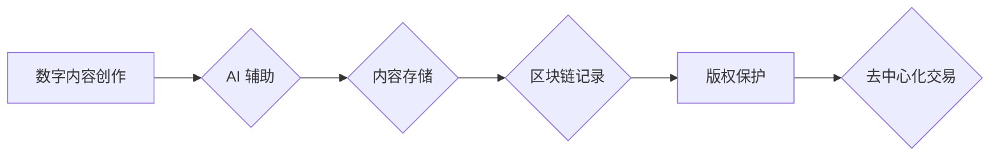

                 

## 知识产权与数字内容创作的新范式

> 关键词：知识产权、数字内容、人工智能、区块链、版权保护、去中心化、NFT

### 1. 背景介绍

数字内容创作正经历着前所未有的变革。人工智能（AI）技术的飞速发展，使得内容生成更加便捷高效，同时，区块链技术的出现为数字内容的版权保护提供了新的可能性。然而，这些技术变革也带来了新的挑战，传统的知识产权（IP）保护机制面临着前所未有的压力。

**1.1 数字内容创作的爆发式增长**

互联网的普及和移动设备的广泛使用，催生了海量数字内容的创作和传播。从文字、图片、视频到音频、游戏，各种形式的数字内容无处不在，并以惊人的速度增长。

**1.2 AI 赋能内容创作的效率提升**

人工智能技术的进步，特别是深度学习的应用，使得内容创作更加智能化和自动化。AI 可以帮助人们生成高质量的文本、图像、音乐等内容，极大地提高了内容创作的效率。

**1.3 区块链技术为版权保护提供新思路**

区块链技术的去中心化、透明性和不可篡改性，为数字内容的版权保护提供了新的思路。通过将版权信息记录在区块链上，可以有效防止内容被盗用和侵权。

**1.4 传统 IP 保护机制面临挑战**

传统的 IP 保护机制主要依赖于法律法规和行政执法，但面对数字内容的快速传播和匿名性，这些机制显得捉襟见肘。

### 2. 核心概念与联系

**2.1 知识产权 (IP)**

知识产权是指个人或组织对知识、创造和发明享有的排他性权利。常见的 IP 类型包括专利、版权、商标和商业秘密。

**2.2 数字内容**

指以数字化形式存在的各种信息，包括文本、图像、音频、视频、软件等。

**2.3 人工智能 (AI)**

指能够模拟人类智能行为的计算机系统，例如学习、推理、决策和创造。

**2.4 区块链**

是一种分布式账本技术，能够记录和验证交易信息，并确保其安全性和不可篡改性。

**2.5 非同质化代币 (NFT)**

是一种基于区块链技术的数字资产，代表着独一无二的数字内容，例如艺术品、音乐、游戏道具等。

**2.6 去中心化**

指没有中心控制机构，而是由多个节点共同维护和管理的系统。

**2.7 流程图**



### 3. 核心算法原理 & 具体操作步骤

**3.1 算法原理概述**

数字内容创作的新范式主要基于以下核心算法原理：

* **生成式对抗网络 (GAN)**：用于生成高质量的数字内容，例如图像、文本、音乐等。
* **加密算法**：用于保护数字内容的版权信息，防止被盗用和侵权。
* **智能合约**：用于自动执行版权交易和分配，实现去中心化的版权管理。

**3.2 算法步骤详解**

1. **内容创作**: 使用 AI 辅助工具生成数字内容。
2. **内容存储**: 将生成的数字内容存储在分布式存储系统中。
3. **版权登记**: 将内容的版权信息记录在区块链上，生成 NFT。
4. **内容发布**: 将 NFT 作为数字内容的唯一标识，发布到去中心化平台。
5. **版权交易**: 使用智能合约进行版权交易和分配，实现去中心化的版权管理。

**3.3 算法优缺点**

**优点:**

* **提高内容创作效率**: AI 辅助工具可以帮助人们快速生成高质量的内容。
* **加强版权保护**: 区块链技术可以有效防止内容被盗用和侵权。
* **实现去中心化管理**: 智能合约可以自动执行版权交易和分配，无需第三方介入。

**缺点:**

* **技术门槛高**: 需要一定的技术知识才能使用 AI 辅助工具和区块链技术。
* **数据安全问题**: 数字内容存储和交易过程中存在数据安全风险。
* **法律法规不完善**: 目前针对数字内容的 IP 保护法律法规尚不完善。

**3.4 算法应用领域**

* **数字艺术**: NFT 可以用于销售和管理数字艺术作品的版权。
* **音乐创作**: AI 可以帮助音乐人创作新的音乐作品，并通过 NFT 进行发行和销售。
* **游戏开发**: NFT 可以用于游戏道具的交易和管理，实现游戏内资产的真正所有权。
* **教育培训**: AI 可以生成个性化的学习内容，并通过 NFT 进行知识产权保护。

### 4. 数学模型和公式 & 详细讲解 & 举例说明

**4.1 数学模型构建**

数字内容的版权保护可以看作是一个博弈模型，参与者包括内容创作者、内容使用者和版权管理平台。

* **内容创作者**: 希望获得对内容的独占使用权和收益。
* **内容使用者**: 希望获得对内容的合法使用权。
* **版权管理平台**: 希望提供安全可靠的版权管理服务。

**4.2 公式推导过程**

假设内容创作者拥有一个独一无二的数字内容，其价值为 $V$。内容使用者愿意支付 $P$ 的价格来使用该内容。版权管理平台的费用为 $F$。

则，内容创作者的收益为：

$$
R_c = P - F
$$

内容使用者的收益为：

$$
R_u = V - P
$$

版权管理平台的收益为：

$$
R_p = F
$$

**4.3 案例分析与讲解**

例如，一位艺术家创作了一幅数字艺术作品，其价值为 $1000$ 美元。一位收藏家愿意支付 $800$ 美元来购买该作品的版权。版权管理平台的费用为 $100$ 美元。

则，艺术家、收藏家和版权管理平台的收益分别为：

* 艺术家：$800 - 100 = 700$ 美元
* 收藏家：$1000 - 800 = 200$ 美元
* 版权管理平台：$100$ 美元

### 5. 项目实践：代码实例和详细解释说明

**5.1 开发环境搭建**

* **操作系统**: Ubuntu 20.04 LTS
* **编程语言**: Python 3.8
* **开发工具**: VS Code
* **区块链平台**: Ethereum

**5.2 源代码详细实现**

```python
# 导入必要的库
from web3 import Web3

# 连接到 Ethereum 网络
w3 = Web3(Web3.HTTPProvider("https://mainnet.infura.io/v3/YOUR_INFURA_PROJECT_ID"))

# 定义智能合约代码
contract_code = """
pragma solidity ^0.8.0;

contract NFTContract {
    // ...
}
"""

# 部署智能合约
contract_instance = w3.eth.contract(abi=contract_abi, bytecode=contract_bytecode).deploy(
    # 传入合约参数
).transact({
    # 设置交易参数
})

# 获取合约地址
contract_address = contract_instance.address

# ...
```

**5.3 代码解读与分析**

* **导入库**: 导入 Web3 库，用于与 Ethereum 网络交互。
* **连接网络**: 连接到 Ethereum 网络，使用 Infura 提供的节点服务。
* **定义合约代码**: 定义智能合约代码，包括合约名称、函数定义等。
* **部署合约**: 部署智能合约到 Ethereum 网络，并获取合约地址。

**5.4 运行结果展示**

部署成功后，可以查看合约地址和相关信息，例如合约余额、交易记录等。

### 6. 实际应用场景

**6.1 数字艺术创作与销售**

艺术家可以使用 AI 生成数字艺术作品，并通过 NFT 将其出售给收藏家。

**6.2 音乐版权管理**

音乐人可以使用 NFT 来管理音乐作品的版权，并通过去中心化平台进行发行和销售。

**6.3 游戏内资产交易**

游戏开发商可以使用 NFT 来代表游戏内资产，例如道具、角色等，实现玩家之间的资产交易。

**6.4 教育资源共享**

教育机构可以使用 NFT 来保护教育资源的版权，并通过去中心化平台进行共享和交易。

**6.5 未来应用展望**

数字内容创作的新范式将进一步推动数字内容的创新和发展，并为内容创作者、内容使用者和版权管理平台带来新的机遇。

### 7. 工具和资源推荐

**7.1 学习资源推荐**

* **区块链技术**: Coursera, edX, Udemy
* **人工智能**: Stanford CS229, MIT 6.S191
* **NFT**: OpenSea, Rarible

**7.2 开发工具推荐**

* **智能合约开发**: Remix, Truffle Suite
* **区块链浏览器**: Etherscan, Blockchair
* **AI 工具**: OpenAI API, Google AI Platform

**7.3 相关论文推荐**

* **The Economics of Blockchain-Based Digital Content Distribution**
* **Non-Fungible Tokens: A Comprehensive Overview**
* **Generative Adversarial Networks for Image Synthesis**

### 8. 总结：未来发展趋势与挑战

**8.1 研究成果总结**

数字内容创作的新范式基于 AI 和区块链技术的融合，为数字内容的版权保护和交易提供了新的解决方案。

**8.2 未来发展趋势**

* **更智能化的内容创作工具**: AI 技术将进一步发展，生成更逼真、更具创意的内容。
* **更完善的版权管理机制**: 区块链技术将被应用于更广泛的数字内容领域，实现更完善的版权管理。
* **更丰富的应用场景**: 数字内容创作的新范式将应用于更多领域，例如教育、医疗、金融等。

**8.3 面临的挑战**

* **技术标准的制定**: 需要制定统一的技术标准，确保不同平台和系统的互操作性。
* **法律法规的完善**: 需要完善相关法律法规，规范数字内容的版权保护和交易。
* **数据安全和隐私保护**: 需要加强数据安全和隐私保护措施，防止数据泄露和滥用。

**8.4 研究展望**

未来，我们将继续研究数字内容创作的新范式，探索 AI 和区块链技术的更深层次应用，为数字内容的创新和发展做出更大的贡献。

### 9. 附录：常见问题与解答

**9.1 如何使用 AI 生成数字内容？**

可以使用各种 AI 生成工具，例如 OpenAI 的 DALL-E 2、Stable Diffusion 等。

**9.2 如何将数字内容转换为 NFT？**

可以使用 NFT 平台，例如 OpenSea、Rarible 等，将数字内容转换为 NFT。

**9.3 如何保护数字内容的版权？**

可以通过将版权信息记录在区块链上，生成 NFT 来保护数字内容的版权。


作者：禅与计算机程序设计艺术 / Zen and the Art of Computer Programming 
<end_of_turn>

