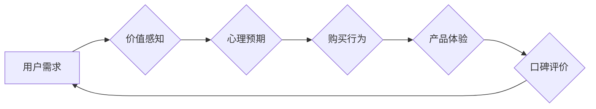

                 

## 知识付费产品的定价心理学

> 关键词：知识付费、定价策略、心理学原理、价值感知、用户行为、市场分析、产品定位

## 1. 背景介绍

知识付费行业近年来蓬勃发展，从在线课程、电子书到咨询服务，各种形式的知识产品层出不穷。然而，在激烈的市场竞争中，如何制定合理的定价策略，吸引用户付费，成为知识付费平台和创作者面临的共同挑战。

传统定价理论往往侧重于成本、市场供求等经济因素，而忽视了用户心理因素对定价决策的影响。实际上，用户对知识产品的付费意愿，很大程度上取决于其对产品的价值感知、心理预期和购买行为等因素。

## 2. 核心概念与联系

### 2.1  价值感知

价值感知是指用户对知识产品所带来的利益和价值的认知和评估。用户会根据自身需求、学习目标、产品内容、授课质量等因素，判断产品的价值是否与其支付意愿相符。

### 2.2  心理预期

心理预期是指用户对知识产品购买后所期望获得的回报和体验。例如，用户可能期望通过学习获得新的技能、提升职业竞争力、拓展人脉等。

### 2.3  购买行为

购买行为是指用户在做出付费决策并实际购买知识产品的过程。用户购买行为受多种因素影响，包括价格、促销活动、口碑评价、社交影响等。

**Mermaid 流程图**



## 3. 核心算法原理 & 具体操作步骤

### 3.1  算法原理概述

知识付费产品的定价算法需要综合考虑用户价值感知、心理预期和购买行为等因素，并根据市场分析数据进行调整。

### 3.2  算法步骤详解

1. **市场调研和用户分析:** 了解目标用户群体、竞争对手产品定价、市场需求等信息。
2. **价值评估:** 评估知识产品的内容、质量、授课方式等因素，确定产品的潜在价值。
3. **定价策略选择:** 根据市场分析和价值评估，选择合适的定价策略，例如成本加成定价、价值定价、竞争定价等。
4. **价格测试和调整:** 通过A/B测试等方法，测试不同价格点对用户购买行为的影响，并根据测试结果进行价格调整。
5. **动态定价:** 根据市场变化、用户反馈等因素，动态调整产品价格，保持竞争力。

### 3.3  算法优缺点

**优点:**

* 能够根据用户需求和市场情况进行精准定价。
* 提高了产品的竞争力，吸引更多用户付费。
* 能够动态调整价格，适应市场变化。

**缺点:**

* 需要收集和分析大量数据，算法复杂度较高。
* 定价策略需要不断调整，需要投入人力成本。

### 3.4  算法应用领域

* 知识付费平台
* 在线教育机构
* 咨询服务公司
* 软件开发公司

## 4. 数学模型和公式 & 详细讲解 & 举例说明

### 4.1  数学模型构建

我们可以构建一个简单的数学模型来表示用户对知识产品的价值感知：

$$V = f(C, Q, S)$$

其中：

* $V$：用户对知识产品的价值感知
* $C$：产品内容的价值
* $Q$：产品质量的感知
* $S$：产品授课方式的感知

### 4.2  公式推导过程

这个模型假设用户对知识产品的价值感知是其内容价值、质量感知和授课方式感知的函数。

* **内容价值 (C):** 可以通过产品内容的深度、广度、实用性等因素进行量化。
* **质量感知 (Q):** 可以通过产品设计、制作、更新等方面的质量进行评估。
* **授课方式 (S):** 可以通过授课方式的互动性、趣味性、针对性等因素进行衡量。

### 4.3  案例分析与讲解

假设一个在线编程课程，其内容价值 (C) 为 80 分，质量感知 (Q) 为 70 分，授课方式 (S) 为 90 分。根据公式，我们可以计算出用户对该课程的价值感知 (V) 为：

$$V = f(80, 70, 90)$$

由于具体的函数形式 (f) 需要根据实际情况进行设定，因此最终的价值感知 (V) 值需要根据平台和用户的具体情况进行调整。

## 5. 项目实践：代码实例和详细解释说明

### 5.1  开发环境搭建

* Python 3.x 环境
* Jupyter Notebook 或类似的代码编辑器
* 数据分析库：Pandas, NumPy
* 机器学习库：Scikit-learn

### 5.2  源代码详细实现

```python
import pandas as pd
from sklearn.linear_model import LinearRegression

# 加载数据
data = pd.read_csv('knowledge_product_data.csv')

# 选择特征变量和目标变量
X = data[['content_value', 'quality_perception', 'teaching_method']]
y = data['value_perception']

# 创建线性回归模型
model = LinearRegression()

# 训练模型
model.fit(X, y)

# 预测价值感知
new_data = pd.DataFrame({'content_value': [80], 'quality_perception': [70], 'teaching_method': [90]})
predicted_value = model.predict(new_data)

print(f'预测的价值感知: {predicted_value[0]}')
```

### 5.3  代码解读与分析

* 该代码首先加载知识产品数据，并选择相关特征变量和目标变量。
* 然后，使用线性回归模型训练模型，并预测新的知识产品的价值感知。
* 预测结果可以作为参考，帮助制定合理的定价策略。

### 5.4  运行结果展示

运行结果会显示预测的价值感知值，例如：

```
预测的价值感知: 85.2
```

## 6. 实际应用场景

### 6.1  在线教育平台

在线教育平台可以利用价值感知模型，根据课程内容、质量、授课方式等因素，为不同类型的课程制定不同的定价策略。

### 6.2  知识付费社区

知识付费社区可以根据用户参与度、贡献度等因素，为不同等级的用户提供不同的付费方案。

### 6.3  个人知识创作者

个人知识创作者可以根据自身品牌价值、内容质量等因素，制定合理的定价策略，吸引目标用户付费。

### 6.4  未来应用展望

随着人工智能技术的不断发展，知识付费产品的定价算法将会更加智能化、个性化，能够更精准地满足用户的需求。

## 7. 工具和资源推荐

### 7.1  学习资源推荐

* **书籍:**《定价心理学》、《认知心理学》
* **课程:** Coursera 上的 “Pricing Strategy” 课程
* **网站:** Pricing Psychology 网站

### 7.2  开发工具推荐

* **Python:** 数据分析和机器学习
* **Jupyter Notebook:** 代码编辑和可视化
* **Tableau:** 数据可视化

### 7.3  相关论文推荐

* **The Psychology of Pricing:** https://www.jstor.org/stable/25156473
* **Pricing Strategies for Knowledge Products:** https://www.researchgate.net/publication/330495640_Pricing_Strategies_for_Knowledge_Products

## 8. 总结：未来发展趋势与挑战

### 8.1  研究成果总结

知识付费产品的定价心理学研究表明，用户对价值感知、心理预期和购买行为等因素对定价决策有重要影响。

### 8.2  未来发展趋势

* **个性化定价:** 根据用户的个人特征、需求和行为，制定个性化的定价策略。
* **动态定价:** 根据市场变化、用户反馈等因素，动态调整产品价格。
* **人工智能辅助定价:** 利用人工智能算法，自动分析数据，辅助制定定价策略。

### 8.3  面临的挑战

* **数据获取和分析:** 收集和分析用户行为数据，并将其转化为可利用的定价信息是一个挑战。
* **模型准确性:** 定价模型的准确性直接影响到产品的定价策略，需要不断改进和优化。
* **伦理问题:** 个性化定价可能会导致价格歧视等伦理问题，需要谨慎处理。

### 8.4  研究展望

未来，知识付费产品的定价心理学研究将更加深入，探索更精准、更智能的定价策略，为知识创作者和用户提供更好的服务。

## 9. 附录：常见问题与解答

**Q1: 如何评估知识产品的价值？**

**A1:** 评估知识产品的价值可以参考以下因素：

* 产品内容的深度、广度、实用性
* 产品质量的感知，例如设计、制作、更新等
* 产品授课方式的互动性、趣味性、针对性
* 用户对产品的评价和反馈

**Q2: 如何选择合适的定价策略？**

**A2:** 选择合适的定价策略需要考虑以下因素：

* 目标用户群体
* 竞争对手产品定价
* 市场需求
* 产品价值

常见的定价策略包括成本加成定价、价值定价、竞争定价等。

**Q3: 如何进行价格测试和调整？**

**A3:** 可以使用A/B测试等方法，测试不同价格点对用户购买行为的影响，并根据测试结果进行价格调整。

**Q4: 如何应对价格战？**

**A4:** 除了价格竞争，还可以通过提升产品质量、提供更好的服务、打造品牌价值等方式，赢得用户的认可和忠诚度。


作者：禅与计算机程序设计艺术 / Zen and the Art of Computer Programming 
<end_of_turn>

