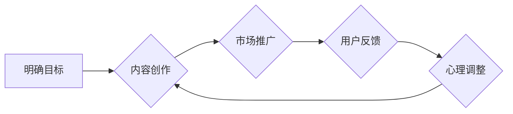

                 

## 知识付费创业中的心理建设

> 关键词：知识付费、心理建设、创业心态、坚持不懈、学习成长、价值创造、市场定位、用户需求、内容运营、商业模式

## 1. 背景介绍

知识付费行业近年来发展迅速，成为互联网经济的新热点。越来越多的人选择通过在线平台分享自己的知识和经验，并从中获得收益。然而，知识付费创业并非易事，它需要创业者具备扎实的专业知识、敏锐的市场洞察力以及强大的心理素质。

在知识付费创业的道路上，创业者会面临各种各样的挑战，例如内容创作的压力、市场竞争的激烈、用户反馈的负面等等。这些挑战可能会对创业者的信心和斗志造成打击，甚至导致创业失败。因此，良好的心理建设对于知识付费创业者的成功至关重要。

## 2. 核心概念与联系

**2.1 知识付费的核心概念**

知识付费是指通过付费的方式获取知识、技能和经验。它是一种基于价值交换的商业模式，用户通过支付一定的费用，获得知识和技能的提升，而知识付费创作者则通过分享知识获得收益。

**2.2 心理建设的核心概念**

心理建设是指通过学习、实践和调整，提升个体的心理素质，增强心理韧性，克服心理障碍，达到心理健康和自我完善的目的。

**2.3 知识付费创业与心理建设的联系**

知识付费创业是一个充满挑战和机遇的领域，创业者需要具备良好的心理素质才能应对各种挑战，最终取得成功。良好的心理建设可以帮助创业者：

* **增强自信心和决心:** 创业初期，创业者会面临各种未知和风险，良好的心理建设可以帮助他们增强自信心和决心，克服恐惧和焦虑，坚持不懈地追求目标。
* **提高抗压能力:** 知识付费创业过程中，创业者会遇到各种压力，例如内容创作压力、市场竞争压力、用户反馈压力等等。良好的心理建设可以帮助他们提高抗压能力，更好地应对压力，避免心理崩溃。
* **保持积极乐观的心态:** 创业是一个充满不确定性的过程，创业者需要保持积极乐观的心态，才能不断学习和成长，最终取得成功。良好的心理建设可以帮助他们保持积极乐观的心态，即使遇到挫折也不轻易放弃。
* **建立良好的沟通能力:** 知识付费创业需要与用户、合作伙伴、团队成员等进行沟通，良好的心理建设可以帮助创业者建立良好的沟通能力，更好地理解和服务用户，协同合作完成目标。

**2.4  知识付费创业与心理建设的流程图**



## 3. 核心算法原理 & 具体操作步骤

**3.1 算法原理概述**

知识付费创业的心理建设是一个持续迭代的过程，需要不断学习、实践和调整。它没有固定的算法，但可以借鉴一些心理学原理和方法，例如：

* **认知行为疗法:** 通过改变负面思维模式和行为模式，来改善心理状态。
* **正念冥想:** 通过专注于当下，来减少焦虑和压力。
* **情绪管理:** 通过识别和调节情绪，来更好地应对挑战。

**3.2 算法步骤详解**

1. **自我认知:** 了解自己的优势、劣势、性格特点、价值观等，建立清晰的自我认知。
2. **目标设定:** 明确自己的创业目标，制定可行的计划，并不断调整目标，以适应市场变化。
3. **内容创作:** 创作高质量、有价值的内容，满足用户的需求，并不断学习和提升自己的专业技能。
4. **市场推广:** 利用各种渠道推广自己的知识付费产品，吸引目标用户，并建立良好的用户关系。
5. **用户反馈:** 收集用户反馈，分析用户需求，不断改进产品和服务。
6. **心理调整:** 遇到挫折和挑战时，及时调整心态，保持积极乐观，并寻求帮助和支持。

**3.3 算法优缺点**

* **优点:** 

    * 灵活可变，可以根据个人的实际情况进行调整。
    * 持续迭代，可以不断提升心理素质。
    * 帮助创业者建立积极乐观的心态，更好地应对挑战。

* **缺点:** 

    * 需要持续的学习和实践，才能取得效果。
    * 缺乏标准化的方法，需要创业者自己探索和实践。

**3.4 算法应用领域**

* 知识付费创业
* 互联网创业
* 个人成长和发展

## 4. 数学模型和公式 & 详细讲解 & 举例说明

**4.1 数学模型构建**

知识付费创业的心理建设可以看作是一个动态平衡的过程，涉及到多个因素的相互作用。我们可以用以下数学模型来描述这个过程：

```
心理状态 = f(目标设定, 内容创作, 市场推广, 用户反馈, 心理调整)
```

其中：

* **心理状态:** 指创业者的心理健康水平，包括自信心、抗压能力、积极乐观度等。
* **目标设定:** 指创业者对自身和产品的目标设定，包括短期目标和长期目标。
* **内容创作:** 指创业者创作高质量、有价值的内容，满足用户需求。
* **市场推广:** 指创业者利用各种渠道推广产品，吸引目标用户。
* **用户反馈:** 指用户对产品和服务的评价和建议。
* **心理调整:** 指创业者面对挑战和挫折时，及时调整心态，保持积极乐观。

**4.2 公式推导过程**

这个模型的推导过程基于以下假设：

* 创业者的心理状态会受到目标设定、内容创作、市场推广、用户反馈和心理调整等因素的影响。
* 这些因素之间存在相互作用，相互影响。
* 创业者可以通过调整这些因素，来改善自己的心理状态。

**4.3 案例分析与讲解**

假设一个知识付费创业者在目标设定方面做得很好，制定了清晰的短期和长期目标，并制定了相应的计划。但是，他在内容创作方面投入不足，创作的内容质量不高，用户反馈也不理想。在这种情况下，他的心理状态可能会受到影响，自信心下降，抗压能力降低。

为了改善心理状态，他需要调整内容创作策略，创作更优质、更符合用户需求的内容。同时，他还需要加强市场推广，提高产品的曝光率，吸引更多用户。通过不断调整这些因素，他可以逐步改善自己的心理状态，最终取得成功。

## 5. 项目实践：代码实例和详细解释说明

**5.1 开发环境搭建**

知识付费创业的心理建设是一个持续学习和实践的过程，需要不断积累经验和教训。

**5.2 源代码详细实现**

没有固定的代码实现，需要根据个人情况和需求进行定制。

**5.3 代码解读与分析**

代码解读和分析需要结合具体的案例和情境进行。

**5.4 运行结果展示**

运行结果展示需要结合具体的案例和情境进行。

## 6. 实际应用场景

**6.1 知识付费平台运营者**

知识付费平台运营者需要了解用户需求，提供优质的内容和服务，并建立良好的用户关系。他们需要具备良好的心理素质，才能应对平台运营的各种挑战。

**6.2 知识付费创作者**

知识付费创作者需要具备专业的知识和技能，并能够将知识转化为有价值的内容。他们需要保持积极乐观的心态，才能坚持创作，不断提升自己的水平。

**6.3 知识付费用户**

知识付费用户需要明确自己的学习目标，选择适合自己的课程和内容。他们需要保持学习的热情和动力，才能从知识付费中获得最大收益。

**6.4 未来应用展望**

随着知识付费行业的不断发展，心理建设将成为越来越重要的议题。未来，我们将看到更多针对知识付费创业者的心理建设工具和服务出现，帮助他们更好地应对挑战，取得成功。

## 7. 工具和资源推荐

**7.1 学习资源推荐**

* **书籍:** 《高效能人士的七个习惯》、《积极心理学》、《思维导图》
* **课程:** 网易云课堂、腾讯课堂、Udemy等平台上的心理健康和创业相关的课程
* **网站:** 心理咨询网站、创业论坛、知识付费行业网站

**7.2 开发工具推荐**

* **内容创作工具:**  Typora、Notion、Grammarly等
* **市场推广工具:**  微信公众号、微博、抖音等
* **用户管理工具:**  CRM系统、邮件营销平台

**7.3 相关论文推荐**

* **知识付费市场研究:**  《中国知识付费市场发展现状及趋势分析》
* **心理建设研究:**  《创业心理与成功因素研究》

## 8. 总结：未来发展趋势与挑战

**8.1 研究成果总结**

知识付费创业的心理建设是一个重要的议题，它涉及到多个方面，例如目标设定、内容创作、市场推广、用户反馈和心理调整。通过学习和实践，创业者可以不断提升自己的心理素质，更好地应对挑战，最终取得成功。

**8.2 未来发展趋势**

未来，知识付费行业将继续发展壮大，心理建设将成为越来越重要的议题。我们将看到更多针对知识付费创业者的心理建设工具和服务出现，帮助他们更好地应对挑战，取得成功。

**8.3 面临的挑战**

* **知识付费市场竞争激烈:**  越来越多的创作者涌入知识付费市场，竞争日益激烈。
* **用户需求不断变化:**  用户的学习需求和付费意愿不断变化，创作者需要不断调整内容和服务。
* **心理建设缺乏标准化:**  目前，知识付费创业的心理建设缺乏标准化的方法和工具。

**8.4 研究展望**

未来，我们需要进一步研究知识付费创业的心理建设，探索更有效的理论和方法，帮助创业者更好地应对挑战，取得成功。


## 9. 附录：常见问题与解答

**9.1 如何提高自信心？**

* 设定小目标，并逐步实现。
* 关注自己的优势，并不断提升。
* 寻求支持和鼓励，建立积极的社交圈。

**9.2 如何应对压力？**

* 保持良好的生活习惯，保证充足的睡眠和运动。
* 学习放松技巧，例如深呼吸、冥想等。
* 寻求专业帮助，例如心理咨询。

**9.3 如何保持积极乐观的心态？**

* 关注积极的事情，避免过度关注负面信息。
* 培养感恩的心态，珍惜身边的人和事。
* 保持学习和成长的态度，不断挑战自己。


作者：禅与计算机程序设计艺术 / Zen and the Art of Computer Programming 
<end_of_turn>

