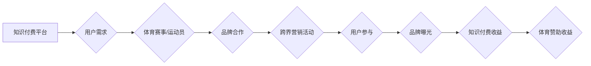

                 

## 关键词：知识付费、跨界营销、体育赞助、数据分析、用户画像、内容营销、品牌合作

## 1. 背景介绍

知识付费作为一种新型的商业模式，近年来发展迅速，其核心在于通过提供有价值的知识和技能，向用户收取费用。而体育赞助则是一种常见的营销方式，企业通过赞助体育赛事或运动员，提升品牌知名度和影响力。

随着互联网和移动互联网的普及，知识付费和体育赞助都面临着新的机遇和挑战。一方面，用户对知识的需求日益增长，而体育赛事和运动员也拥有庞大的粉丝群体，这为跨界合作提供了 fertile ground。另一方面，传统营销模式的效力逐渐下降，企业需要寻找更精准、更有效的营销方式。

知识付费与体育赞助的跨界营销，可以有效地解决双方面临的难题，实现互利共赢。

## 2. 核心概念与联系

### 2.1 知识付费

知识付费是指通过互联网平台，将知识、技能、经验等转化为商品，向用户收取费用。其核心价值在于为用户提供有价值的知识和技能，帮助他们提升个人能力和解决实际问题。

### 2.2 体育赞助

体育赞助是指企业向体育赛事、运动员或体育组织提供资金或其他资源，以换取品牌曝光、提升品牌形象等回报。其核心目的是通过体育赛事和运动员的巨大影响力，扩大品牌知名度和影响力，提升品牌价值。

### 2.3 跨界营销

跨界营销是指企业将自身产品或服务与其他行业或领域的品牌或产品进行合作，共同进行营销推广。其核心目的是通过资源整合和创意碰撞，创造新的价值，吸引更多目标用户。

**Mermaid 流程图**



## 3. 核心算法原理 & 具体操作步骤

### 3.1 算法原理概述

知识付费与体育赞助的跨界营销，本质上是一种数据驱动的精准营销模式。其核心算法原理在于通过数据分析和用户画像，精准匹配用户需求和品牌资源，实现高效的营销推广。

### 3.2 算法步骤详解

1. **数据收集与分析:** 收集用户行为数据、体育赛事数据、品牌数据等，进行分析和挖掘，构建用户画像和品牌画像。
2. **用户画像构建:** 根据用户行为数据、兴趣爱好、消费习惯等信息，构建用户画像，包括用户基本信息、兴趣标签、消费偏好等。
3. **品牌画像构建:** 根据品牌定位、目标用户、营销策略等信息，构建品牌画像，包括品牌价值、品牌形象、品牌故事等。
4. **精准匹配:** 基于用户画像和品牌画像，进行精准匹配，找到与用户需求和品牌资源相匹配的跨界营销机会。
5. **内容营销:** 根据匹配结果，开发和传播具有吸引力和价值的跨界营销内容，例如知识付费课程、体育赛事直播、品牌合作活动等。
6. **效果评估:** 跟踪跨界营销活动的参与度、转化率、品牌影响力等指标，进行效果评估，优化营销策略。

### 3.3 算法优缺点

**优点:**

* 精准匹配: 通过数据分析和用户画像，精准匹配用户需求和品牌资源，提高营销效率。
* 提升用户体验: 提供有价值的知识和技能，满足用户需求，提升用户体验。
* 扩大品牌影响力: 通过体育赛事和运动员的巨大影响力，扩大品牌知名度和影响力。

**缺点:**

* 数据依赖: 需要大量的数据支持，数据质量直接影响算法效果。
* 技术门槛: 需要一定的技术能力，才能进行数据分析和用户画像构建。
* 隐私保护: 需要关注用户隐私保护问题，确保数据安全和合规使用。

### 3.4 算法应用领域

* 知识付费平台与体育赛事/运动员的合作
* 品牌与体育赛事/运动员的跨界营销
* 体育赛事/运动员的知识付费产品开发
* 体育赛事/运动员的粉丝运营和互动

## 4. 数学模型和公式 & 详细讲解 & 举例说明

### 4.1 数学模型构建

我们可以构建一个简单的数学模型来描述知识付费与体育赞助的跨界营销效果。

假设：

* $U$ 为用户数量
* $P$ 为品牌知名度
* $K$ 为知识付费收益
* $S$ 为体育赞助收益

则跨界营销效果可以表示为：

$$E = f(U, P, K, S)$$

其中，$f$ 为一个函数，表示跨界营销效果与用户数量、品牌知名度、知识付费收益和体育赞助收益之间的关系。

### 4.2 公式推导过程

我们可以通过分析用户行为数据、品牌数据和体育赛事数据，推导 $f$ 函数的具体形式。例如，我们可以假设：

$$E = aU + bP + cK + dS$$

其中，$a$, $b$, $c$, $d$ 为系数，可以通过回归分析等方法确定。

### 4.3 案例分析与讲解

假设一家知识付费平台与一家体育俱乐部合作，进行跨界营销活动。

* 用户数量：$U = 10000$
* 品牌知名度：$P = 0.8$
* 知识付费收益：$K = 10000$
* 体育赞助收益：$S = 5000$

如果 $a = 0.1$, $b = 0.2$, $c = 0.3$, $d = 0.1$, 则跨界营销效果为：

$$E = 0.1 \times 10000 + 0.2 \times 0.8 + 0.3 \times 10000 + 0.1 \times 5000 = 3800$$

## 5. 项目实践：代码实例和详细解释说明

### 5.1 开发环境搭建

* 操作系统：Windows/macOS/Linux
* 编程语言：Python
* 开发工具：Jupyter Notebook/VS Code

### 5.2 源代码详细实现

```python
import pandas as pd
from sklearn.cluster import KMeans

# 加载用户数据
user_data = pd.read_csv('user_data.csv')

# 数据预处理
# ...

# 构建用户画像
kmeans = KMeans(n_clusters=5)
user_clusters = kmeans.fit_predict(user_data)

# 加载品牌数据
brand_data = pd.read_csv('brand_data.csv')

# 构建品牌画像
# ...

# 精准匹配
# ...

# 内容营销
# ...

# 效果评估
# ...
```

### 5.3 代码解读与分析

* 数据加载和预处理：使用 pandas 库加载用户数据和品牌数据，进行数据清洗、转换等预处理操作。
* 用户画像构建：使用 KMeans 聚类算法，将用户数据聚类成不同的用户群体，构建用户画像。
* 品牌画像构建：根据品牌数据，构建品牌画像，包括品牌价值、品牌形象、品牌故事等。
* 精准匹配：根据用户画像和品牌画像，进行精准匹配，找到与用户需求和品牌资源相匹配的跨界营销机会。
* 内容营销：开发和传播具有吸引力和价值的跨界营销内容，例如知识付费课程、体育赛事直播、品牌合作活动等。
* 效果评估：跟踪跨界营销活动的参与度、转化率、品牌影响力等指标，进行效果评估，优化营销策略。

### 5.4 运行结果展示

* 用户画像分析结果
* 品牌画像分析结果
* 精准匹配结果
* 内容营销效果评估结果

## 6. 实际应用场景

### 6.1 案例分析

* 某知识付费平台与某足球俱乐部合作，推出足球技能培训课程，并进行线上直播和线下活动，吸引了大量用户参与。
* 某运动品牌与某马拉松赛事合作，赞助赛事并提供运动装备，提升品牌知名度和影响力。

### 6.2 未来应用展望

* 知识付费与体育赞助的跨界营销将更加深入，例如，知识付费平台可以开发针对不同体育项目的专业知识付费课程，体育俱乐部可以利用知识付费平台，向粉丝提供更深入的体育知识和技能。
* 虚拟现实和增强现实技术将被应用于知识付费与体育赞助的跨界营销，例如，用户可以利用虚拟现实技术，体验体育赛事现场，并通过知识付费平台，学习相关知识和技能。

## 7. 工具和资源推荐

### 7.1 学习资源推荐

* 书籍：《跨界营销》、《数据驱动营销》
* 网页：MarketingProfs, HubSpot

### 7.2 开发工具推荐

* Python
* pandas
* scikit-learn
* Jupyter Notebook/VS Code

### 7.3 相关论文推荐

* "The Impact of Cross-Industry Marketing Alliances on Firm Performance"
* "Data-Driven Marketing: A Review and Future Directions"

## 8. 总结：未来发展趋势与挑战

### 8.1 研究成果总结

知识付费与体育赞助的跨界营销，是一种数据驱动的精准营销模式，可以有效地提升用户体验、扩大品牌影响力，实现互利共赢。

### 8.2 未来发展趋势

* 数据分析和用户画像技术将更加成熟，精准匹配能力将进一步提升。
* 虚拟现实和增强现实技术将被更加广泛地应用于跨界营销活动，创造更沉浸式的用户体验。
* 跨界营销将更加个性化和定制化，满足不同用户群体的需求。

### 8.3 面临的挑战

* 数据隐私保护问题需要得到更加重视。
* 技术门槛较高，需要专业技术人员进行开发和维护。
* 跨界合作需要双方充分沟通和协作，才能实现互利共赢。

### 8.4 研究展望

未来，我们将继续研究知识付费与体育赞助的跨界营销模式，探索新的应用场景和技术解决方案，推动跨界营销的健康发展。

## 9. 附录：常见问题与解答

* **Q1: 知识付费与体育赞助的跨界营销有哪些优势？**

* **A1:** 优势包括精准匹配用户需求、提升用户体验、扩大品牌影响力、实现互利共赢等。

* **Q2: 知识付费与体育赞助的跨界营销有哪些挑战？**

* **A2:** 挑战包括数据隐私保护问题、技术门槛较高、跨界合作难度大等。

* **Q3: 如何进行知识付费与体育赞助的跨界营销？**

* **A3:** 可以通过数据分析和用户画像构建，精准匹配用户需求和品牌资源，开发和传播具有吸引力和价值的跨界营销内容，并进行效果评估和优化。


作者：禅与计算机程序设计艺术 / Zen and the Art of Computer Programming 
<end_of_turn>

