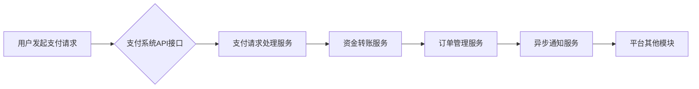

                 

## 知识付费平台的支付系统设计与集成

> 关键词：支付系统、知识付费、微服务、安全、可靠性、API集成、异步处理、数据库设计

## 1. 背景介绍

知识付费平台近年来蓬勃发展，为创作者和学习者提供了新的价值交换模式。然而，支付系统作为平台的核心功能之一，其稳定性、安全性、可靠性和用户体验直接影响着平台的运营和用户粘性。 

传统的支付系统架构往往过于集中，难以应对知识付费平台日益增长的业务需求和用户规模。随着平台功能的不断丰富，支付系统需要支持多种支付方式、处理复杂的交易流程、保障资金安全，同时还要提供良好的用户体验。

## 2. 核心概念与联系

知识付费平台的支付系统设计需要考虑以下核心概念：

* **微服务架构:** 将支付系统拆解成多个独立的服务，每个服务负责特定的功能模块，例如支付请求处理、资金转账、订单管理等。微服务架构具有高可扩展性、高可用性和易维护的特点，能够满足知识付费平台的快速发展需求。
* **API集成:** 通过开放的API接口，将支付系统与平台其他模块（如课程管理、用户管理、内容发布等）进行无缝集成，实现数据共享和业务协同。
* **异步处理:** 支付系统处理大量交易请求，采用异步处理机制可以提高系统吞吐量和响应速度，避免阻塞主业务流程。
* **安全保障:** 支付系统涉及敏感用户数据和资金安全，需要采用多重安全措施，例如加密传输、身份验证、风险控制等，保障交易安全和用户隐私。

**支付系统架构流程图:**



## 3. 核心算法原理 & 具体操作步骤

### 3.1  算法原理概述

支付系统的核心算法主要涉及支付请求处理、资金转账、订单管理等环节。这些算法通常基于以下原理：

* **哈希算法:** 用于生成支付交易的唯一标识符，确保交易的不可篡改性。
* **数字签名算法:** 用于验证支付请求的合法性，防止伪造交易。
* **加密算法:** 用于保护用户敏感数据和交易信息的安全传输。
* **排序算法:** 用于高效地处理大量订单信息，例如根据订单金额进行排序。

### 3.2  算法步骤详解

**支付请求处理算法:**

1. 接收用户支付请求，验证用户身份和支付信息。
2. 生成支付交易唯一标识符，并进行数字签名验证。
3. 根据支付方式选择相应的支付通道。
4. 向支付通道发送支付请求，并获取支付结果。
5. 记录支付交易信息，并返回支付结果给用户。

**资金转账算法:**

1. 根据支付结果，从用户账户扣除支付金额。
2. 将支付金额转账到创作者账户。
3. 记录资金转账信息，并生成转账凭证。

**订单管理算法:**

1. 根据支付结果，生成订单信息，包括订单号、支付金额、商品信息等。
2. 将订单信息存储到数据库中。
3. 发送异步通知给用户和创作者，告知订单状态。

### 3.3  算法优缺点

**优点:**

* 高效、安全、可靠。
* 可扩展性强，能够适应平台业务的快速增长。
* 易于维护和升级。

**缺点:**

* 算法设计和实现需要专业技术人员。
* 需要投入一定的开发和维护成本。

### 3.4  算法应用领域

支付系统算法广泛应用于电商、金融、游戏、社交等领域，为用户提供安全、便捷的支付体验。

## 4. 数学模型和公式 & 详细讲解 & 举例说明

### 4.1  数学模型构建

支付系统中的资金转账过程可以抽象为一个数学模型：

$$
A = B - C
$$

其中：

* $A$：用户账户余额
* $B$：用户支付金额
* $C$：创作者账户余额

### 4.2  公式推导过程

当用户发起支付请求时，系统会从用户账户中扣除支付金额 $B$，并将该金额转账到创作者账户中，从而更新账户余额：

* 用户账户余额 $A$ 减少 $B$。
* 创作者账户余额 $C$ 增加 $B$。

### 4.3  案例分析与讲解

假设用户 $A$ 支付金额为 $100$ 元，购买了创作者 $B$ 的课程。

* 用户 $A$ 账户余额 $A$ 从 $500$ 元减少到 $400$ 元。
* 创作者 $B$ 账户余额 $C$ 从 $200$ 元增加到 $300$ 元。

## 5. 项目实践：代码实例和详细解释说明

### 5.1  开发环境搭建

* 操作系统：Linux
* 编程语言：Python
* 框架：Django
* 数据库：MySQL

### 5.2  源代码详细实现

```python
# models.py
class Payment(models.Model):
    user = models.ForeignKey(User, on_delete=models.CASCADE)
    course = models.ForeignKey(Course, on_delete=models.CASCADE)
    amount = models.DecimalField(max_digits=10, decimal_places=2)
    status = models.CharField(max_length=20, choices=[('pending', 'Pending'), ('success', 'Success'), ('failed', 'Failed')])

# views.py
def process_payment(request, course_id):
    course = Course.objects.get(id=course_id)
    # ... (用户身份验证、支付信息获取等逻辑)
    payment = Payment.objects.create(user=request.user, course=course, amount=course.price, status='pending')
    # ... (调用第三方支付接口进行支付请求)
    if payment_response.status == 'success':
        payment.status = 'success'
        payment.save()
        # ... (更新用户账户余额、发送异步通知等逻辑)
    else:
        payment.status = 'failed'
        payment.save()
        # ... (处理支付失败情况)

```

### 5.3  代码解读与分析

* `models.py` 定义了 `Payment` 模型，用于存储支付交易信息。
* `views.py` 中的 `process_payment` 函数处理用户支付请求，包括用户身份验证、支付信息获取、调用第三方支付接口、更新支付状态等逻辑。

### 5.4  运行结果展示

当用户成功支付课程时，系统会生成支付订单，并更新用户账户余额和创作者账户余额。同时，系统会发送异步通知给用户和创作者，告知订单状态。

## 6. 实际应用场景

知识付费平台的支付系统广泛应用于以下场景：

* **在线课程:** 用户可以通过支付购买在线课程，学习新的知识和技能。
* **电子书:** 用户可以通过支付购买电子书，获取知识和信息。
* **会员服务:** 用户可以通过支付订阅会员服务，享受平台提供的各种权益。
* **咨询服务:** 用户可以通过支付咨询专家，获取专业建议和指导。

### 6.4  未来应用展望

随着人工智能、区块链等技术的不断发展，知识付费平台的支付系统将更加智能化、安全化和便捷化。

* **人工智能驱动的风险控制:** 利用机器学习算法识别和预防欺诈交易。
* **区块链技术的应用:** 利用区块链技术实现支付数据的透明化和不可篡改性。
* **移动支付的普及:** 支持更多移动支付方式，提供更便捷的用户体验。

## 7. 工具和资源推荐

### 7.1  学习资源推荐

* **书籍:**
    * 《支付系统设计与实现》
    * 《分布式系统设计》
* **在线课程:**
    * Coursera: Distributed Systems
    * Udemy: Building a Payment Gateway

### 7.2  开发工具推荐

* **编程语言:** Python, Java, Go
* **框架:** Django, Spring Boot, Flask
* **数据库:** MySQL, PostgreSQL, MongoDB
* **支付接口:** Alipay, WeChat Pay, Stripe

### 7.3  相关论文推荐

* **论文:**
    * 《Microservices Architecture: Principles and Patterns》
    * 《Designing Secure Payment Systems》

## 8. 总结：未来发展趋势与挑战

### 8.1  研究成果总结

知识付费平台的支付系统设计与集成是一个复杂而重要的课题。通过采用微服务架构、API集成、异步处理等技术，可以构建一个高效、安全、可靠的支付系统，为用户提供良好的支付体验。

### 8.2  未来发展趋势

未来，知识付费平台的支付系统将朝着以下方向发展：

* **更智能化:** 利用人工智能技术进行风险控制、用户行为分析等。
* **更安全化:** 采用区块链技术、加密算法等技术保障支付安全。
* **更便捷化:** 支持更多支付方式，提供更流畅的用户体验。

### 8.3  面临的挑战

知识付费平台的支付系统也面临着一些挑战：

* **技术复杂性:** 支付系统涉及多个技术领域，需要专业技术人员进行设计和开发。
* **安全风险:** 支付系统涉及敏感用户数据和资金安全，需要采取有效的安全措施防止攻击和数据泄露。
* **监管要求:** 支付系统需要遵守相关的法律法规和行业标准。

### 8.4  研究展望

未来，我们将继续研究和探索知识付费平台支付系统的创新技术和应用场景，为用户提供更安全、更便捷、更智能的支付体验。

## 9. 附录：常见问题与解答

* **Q: 如何保障支付系统的安全？**
* **A:** 支付系统采用多重安全措施，例如加密传输、身份验证、风险控制等，保障交易安全和用户隐私。
* **Q: 如何处理支付失败的情况？**
* **A:** 系统会根据支付失败原因，采取相应的处理措施，例如重新发起支付请求、联系用户确认支付信息等。
* **Q: 如何支持多种支付方式？**
* **A:** 支付系统集成多种第三方支付接口，支持支付宝、微信支付、信用卡等多种支付方式。


作者：禅与计算机程序设计艺术 / Zen and the Art of Computer Programming 
<end_of_turn>

