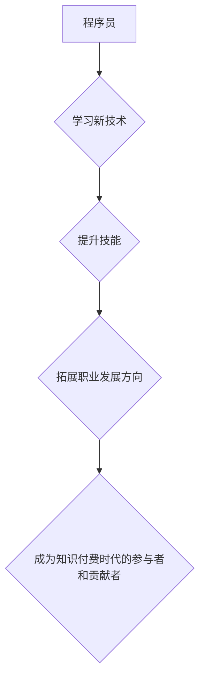

                 

## 知识付费时代程序员的发展机遇与挑战

> 关键词：知识付费、程序员、发展机遇、挑战、技能提升、职业转型、在线学习、社区建设、技术趋势

### 1. 背景介绍

随着互联网技术的飞速发展和数字经济的蓬勃兴起，知识付费行业迎来了爆发式增长。在这一背景下，程序员作为科技领域的核心人才，也面临着前所未有的发展机遇和挑战。

#### 1.1 知识付费行业的兴起

知识付费是指以知识、技能、经验等为核心内容，通过线上平台向用户提供付费学习服务的商业模式。近年来，随着移动互联网、人工智能、大数据等技术的进步，知识付费行业呈现出以下特点：

* **内容丰富多样化:** 从专业技能培训到兴趣爱好学习，知识付费平台涵盖了广泛的领域，满足了不同用户群体的需求。
* **学习方式灵活便捷:** 用户可以通过手机、电脑等设备随时随地学习，打破了时间和空间的限制。
* **互动性增强:** 在线课程、直播、答疑等互动功能，提升了学习的参与度和效果。
* **用户群体扩大:** 知识付费的用户群体正在不断扩大，涵盖了学生、职场人士、创业者等各个阶层。

#### 1.2 程序员的职业发展现状

程序员作为科技行业的热门职业，一直以来都备受追捧。然而，随着技术的不断更新迭代，程序员的职业发展也面临着新的挑战：

* **技术更新迭代快:**  程序员需要不断学习新技术，才能保持竞争力。
* **市场竞争激烈:**  程序员的供需关系不断变化，需要不断提升自身技能，才能获得更好的发展机会。
* **职业发展路径多元化:**  程序员的职业发展路径不再局限于传统的软件开发岗位，需要根据自身兴趣和能力选择不同的发展方向。

### 2. 核心概念与联系

知识付费时代对程序员的发展带来了巨大的机遇，同时也提出了新的挑战。

#### 2.1 知识付费对程序员的影响

* **机遇:** 知识付费平台为程序员提供了学习新技术、提升技能、拓展职业发展方向的便捷途径。
* **挑战:** 程序员需要更加主动地学习和提升，才能在知识付费时代脱颖而出。

#### 2.2 程序员在知识付费时代的定位

程序员需要转变观念，从被动接受知识到主动学习和分享，成为知识付费时代的参与者和贡献者。

**Mermaid 流程图**



### 3. 核心算法原理 & 具体操作步骤

#### 3.1 算法原理概述

知识付费时代，程序员需要掌握一些核心算法，例如：

* **数据结构算法:**  用于解决数据存储、组织和检索问题，例如树、图、链表等。
* **机器学习算法:**  用于从数据中学习模式和规律，例如线性回归、决策树、神经网络等。
* **深度学习算法:**  用于处理复杂的数据，例如卷积神经网络、循环神经网络等。

#### 3.2 算法步骤详解

以线性回归算法为例，其步骤如下：

1. **数据准备:**  收集和预处理数据，例如特征选择、数据清洗等。
2. **模型构建:**  建立线性回归模型，即找到一条直线，使得模型预测值与实际值之间的误差最小。
3. **模型训练:**  使用训练数据训练模型，调整模型参数，使得模型预测效果最佳。
4. **模型评估:**  使用测试数据评估模型性能，例如准确率、召回率等。
5. **模型部署:**  将训练好的模型部署到实际应用场景中。

#### 3.3 算法优缺点

* **优点:**  线性回归算法简单易懂，易于实现，并且计算效率高。
* **缺点:**  线性回归算法只能处理线性关系，对于非线性关系的预测效果较差。

#### 3.4 算法应用领域

线性回归算法广泛应用于以下领域：

* **预测分析:**  例如预测房价、股票价格等。
* **风险评估:**  例如评估贷款风险、信用风险等。
* **广告投放:**  例如预测广告点击率、转化率等。

### 4. 数学模型和公式 & 详细讲解 & 举例说明

#### 4.1 数学模型构建

线性回归模型的数学表达式为：

$$y = wx + b$$

其中：

* $y$ 是预测值
* $x$ 是输入特征
* $w$ 是权重参数
* $b$ 是偏置参数

#### 4.2 公式推导过程

线性回归模型的目标是找到最优的 $w$ 和 $b$ 参数，使得模型预测值与实际值之间的误差最小。常用的误差函数是均方误差（MSE）：

$$MSE = \frac{1}{n} \sum_{i=1}^{n} (y_i - \hat{y}_i)^2$$

其中：

* $n$ 是样本数量
* $y_i$ 是实际值
* $\hat{y}_i$ 是模型预测值

通过最小化 MSE，可以得到最优的 $w$ 和 $b$ 参数。

#### 4.3 案例分析与讲解

假设我们想要预测房价，输入特征为房屋面积，实际房价数据如下：

| 房屋面积 (平方米) | 房价 (万元) |
|---|---|
| 60 | 1.2 |
| 80 | 1.5 |
| 100 | 1.8 |
| 120 | 2.1 |

我们可以使用线性回归算法进行预测。通过最小化 MSE，得到最优的 $w$ 和 $b$ 参数，例如：

* $w = 0.015$
* $b = 0.9$

因此，预测房价的模型为：

$$y = 0.015x + 0.9$$

如果我们想要预测面积为 150 平方米的房屋价格，则可以代入公式计算：

$$y = 0.015 * 150 + 0.9 = 2.4$$

因此，预测该房屋价格为 2.4 万元。

### 5. 项目实践：代码实例和详细解释说明

#### 5.1 开发环境搭建

* **操作系统:**  Windows、macOS 或 Linux
* **编程语言:**  Python
* **库:**  NumPy、Scikit-learn

#### 5.2 源代码详细实现

```python
import numpy as np
from sklearn.linear_model import LinearRegression

# 数据准备
X = np.array([[60], [80], [100], [120]])
y = np.array([1.2, 1.5, 1.8, 2.1])

# 模型构建
model = LinearRegression()

# 模型训练
model.fit(X, y)

# 模型预测
new_data = np.array([[150]])
prediction = model.predict(new_data)

# 结果展示
print("预测房价:", prediction[0])
```

#### 5.3 代码解读与分析

* **数据准备:**  将房屋面积和房价数据存储在 NumPy 数组中。
* **模型构建:**  使用 Scikit-learn 库中的 LinearRegression 类创建线性回归模型。
* **模型训练:**  使用 `fit()` 方法训练模型，将数据输入模型，学习模型参数。
* **模型预测:**  使用 `predict()` 方法预测新的数据，例如面积为 150 平方米的房屋价格。
* **结果展示:**  打印预测结果。

#### 5.4 运行结果展示

```
预测房价: 2.4
```

### 6. 实际应用场景

#### 6.1 在线学习平台

知识付费平台可以提供程序员学习新技术、提升技能的在线课程、直播、答疑等服务。

#### 6.2 技术社区

程序员可以参与技术社区，分享经验、学习新知识、解决技术问题。

#### 6.3 个人博客

程序员可以开设个人博客，记录学习心得、分享技术经验，建立个人品牌。

#### 6.4 知识付费产品开发

程序员可以开发自己的知识付费产品，例如在线课程、电子书、工具等。

#### 6.5 未来应用展望

随着人工智能、大数据等技术的不断发展，知识付费行业将更加智能化、个性化、多元化。程序员将迎来更多学习、发展和创新的机会。

### 7. 工具和资源推荐

#### 7.1 学习资源推荐

* **在线学习平台:**  Coursera、Udemy、edX、Udacity
* **技术社区:**  Stack Overflow、GitHub、知乎
* **个人博客:**  程序员部落、掘金、CSDN

#### 7.2 开发工具推荐

* **代码编辑器:**  VS Code、Sublime Text、Atom
* **版本控制系统:**  Git
* **云平台:**  AWS、Azure、GCP

#### 7.3 相关论文推荐

* **深度学习:**  Goodfellow, I., Bengio, Y., & Courville, A. (2016). Deep learning. MIT press.
* **机器学习:**  Bishop, C. M. (2006). Pattern recognition and machine learning. Springer.

### 8. 总结：未来发展趋势与挑战

#### 8.1 研究成果总结

知识付费时代为程序员的发展带来了机遇和挑战。程序员需要不断学习新技术、提升技能，才能在竞争激烈的市场中脱颖而出。

#### 8.2 未来发展趋势

* **技术迭代加速:**  程序员需要更加敏捷地学习和适应新的技术。
* **个性化学习需求:**  知识付费平台将更加注重个性化学习需求，提供定制化的学习方案。
* **跨领域融合:**  程序员需要具备跨领域的知识和技能，才能更好地解决复杂问题。

#### 8.3 面临的挑战

* **知识更新速度快:**  程序员需要不断学习新知识，才能保持竞争力。
* **技能匹配度问题:**  程序员的技能需要与市场需求相匹配，才能获得更好的发展机会。
* **职业发展路径多元化:**  程序员需要根据自身兴趣和能力选择不同的发展方向。

#### 8.4 研究展望

未来，知识付费行业将更加智能化、个性化、多元化。程序员需要积极拥抱变化，不断学习和提升，才能在知识付费时代取得成功。

### 9. 附录：常见问题与解答

#### 9.1 如何选择合适的知识付费课程？

* **明确学习目标:**  确定自己想要学习的知识和技能。
* **了解课程内容:**  仔细阅读课程介绍，了解课程内容、学习方式、授课老师等信息。
* **查看学员评价:**  参考其他学员的评价，了解课程质量和效果。

#### 9.2 如何提高学习效率？

* **制定学习计划:**  合理安排学习时间，制定详细的学习计划。
* **保持专注:**  学习时避免分心，保持专注。
* **积极互动:**  参加课程讨论，与老师和同学交流学习心得。

#### 9.3 如何将学习到的知识应用到实际工作中？

* **结合实际项目:**  将学习到的知识应用到实际项目中，巩固学习成果。
* **与同事分享:**  与同事分享学习心得，共同进步。
* **持续学习:**  不断学习新知识，提升技能，才能更好地适应工作需求。


作者：禅与计算机程序设计艺术 / Zen and the Art of Computer Programming 
<end_of_turn>

