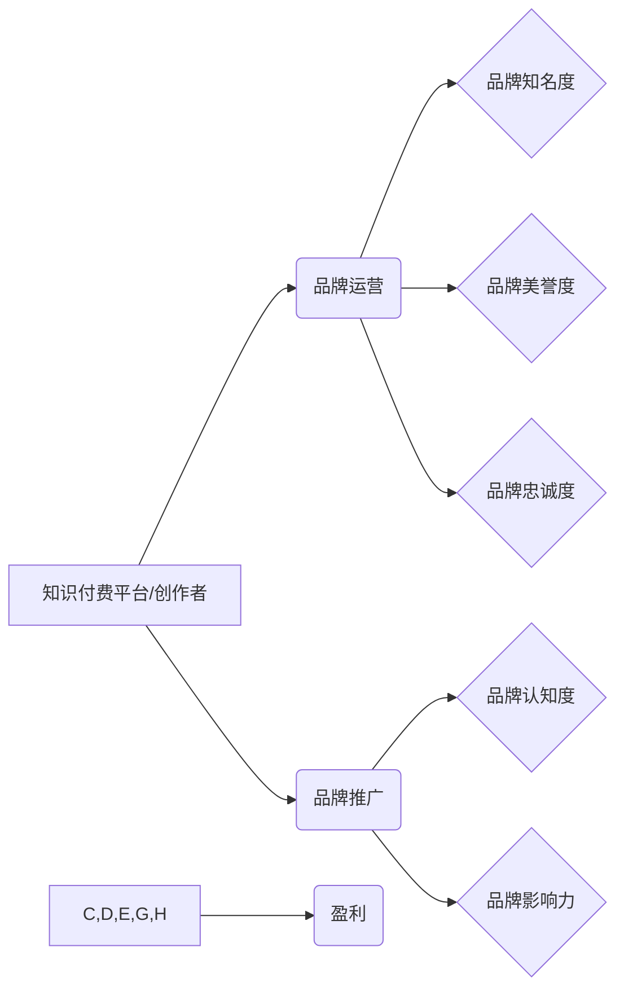

                 

## 知识付费赚钱的品牌品牌运营与品牌推广策略

> 关键词：知识付费、品牌运营、品牌推广、内容营销、社区运营、付费变现、用户增长

### 1. 背景介绍

知识经济时代，知识成为最宝贵的资源。知识付费作为一种新型的商业模式，在近年来迅速发展，成为众多创作者和企业寻求变现的重要途径。 

知识付费的核心在于将个人或机构的专业知识、技能和经验以数字化形式 packaged，并通过线上平台向付费用户提供。 

从课程、电子书到咨询服务，知识付费的形态多种多样，其发展趋势呈现出以下特点：

* **内容多元化:**  知识付费内容不再局限于传统教育领域，涵盖了科技、艺术、生活、投资等多个领域。
* **个性化定制:**  用户对知识的需求越来越个性化，知识付费平台开始提供定制化课程和服务。
* **互动性增强:**  直播、在线答疑、社群互动等方式，让知识付费更加生动有趣，提升用户粘性。
* **生态化发展:**  知识付费平台正在构建完整的生态系统，包括内容生产、知识传播、用户服务等环节。

然而，知识付费市场竞争激烈，想要在激烈的市场竞争中脱颖而出，需要建立一个强大的品牌，并制定有效的品牌运营和推广策略。

### 2. 核心概念与联系

**2.1 品牌运营**

品牌运营是指企业围绕品牌价值，通过一系列的策略和行动，提升品牌知名度、美誉度和忠诚度，最终实现品牌价值最大化。

**2.2 品牌推广**

品牌推广是指企业通过各种营销活动，向目标用户传播品牌信息，提升品牌认知度和影响力。

**2.3 知识付费品牌运营与推广策略**

知识付费品牌运营与推广策略是指针对知识付费平台或创作者，通过品牌运营和品牌推广相结合的方式，提升品牌价值，吸引用户，实现盈利。

**2.4 核心概念关系图**



### 3. 核心算法原理 & 具体操作步骤

**3.1 算法原理概述**

知识付费品牌运营与推广策略的核心算法原理是基于用户行为分析和数据驱动决策。通过收集用户数据，分析用户行为模式，并根据数据 insights 推导相应的运营和推广策略。

**3.2 算法步骤详解**

1. **数据收集:** 收集用户行为数据，包括用户注册信息、学习记录、付费行为、评论反馈等。
2. **数据分析:** 利用数据挖掘和机器学习算法，分析用户行为模式，识别用户画像、兴趣偏好、学习习惯等。
3. **策略制定:** 根据数据分析结果，制定针对不同用户群体的运营和推广策略，包括内容推荐、课程设计、营销活动策划等。
4. **策略执行:** 通过线上平台和线下活动，执行制定的策略，并实时监测策略效果。
5. **数据反馈:** 收集策略执行后的数据反馈，进行数据分析和模型优化，不断迭代改进策略。

**3.3 算法优缺点**

* **优点:** 数据驱动决策，能够精准定位目标用户，提高运营和推广效率。
* **缺点:** 需要大量的数据支持，算法模型的构建和优化需要专业技术人员。

**3.4 算法应用领域**

* **内容推荐:** 根据用户兴趣偏好，推荐相关课程和内容。
* **课程设计:** 根据用户学习习惯和需求，设计个性化课程。
* **营销活动策划:** 根据用户画像，策划精准的营销活动。
* **用户运营:** 通过数据分析，识别用户活跃度和潜在流失风险，制定相应的挽留策略。

### 4. 数学模型和公式 & 详细讲解 & 举例说明

**4.1 数学模型构建**

知识付费品牌运营与推广策略可以构建一个数学模型，来衡量品牌价值和用户增长。

**4.2 公式推导过程**

* **品牌价值 (BV):** BV =  Brand Awareness (BA) * Brand Loyalty (BL) * Brand Perception (BP)
* **品牌知名度 (BA):** BA =  Reach (R) * Frequency (F)
* **品牌忠诚度 (BL):** BL =  Repeat Purchase Rate (RPR) * Customer Lifetime Value (CLTV)
* **品牌感知 (BP):** BP =  Net Promoter Score (NPS) * Customer Satisfaction (CSAT)

**4.3 案例分析与讲解**

假设一个知识付费平台，其品牌知名度为 50%，品牌忠诚度为 30%，品牌感知为 70%。根据公式，其品牌价值为：

BV = 0.5 * 0.3 * 0.7 = 0.105

**5. 项目实践：代码实例和详细解释说明**

**5.1 开发环境搭建**

* Python 3.x
* Jupyter Notebook
* Pandas
* Scikit-learn

**5.2 源代码详细实现**

```python
import pandas as pd
from sklearn.cluster import KMeans

# 数据加载
data = pd.read_csv('user_data.csv')

# 数据预处理
# ...

# K-Means 聚类
kmeans = KMeans(n_clusters=5)
data['cluster'] = kmeans.fit_predict(data[['age', 'income', 'education']])

# 用户画像分析
# ...

# 策略制定
# ...
```

**5.3 代码解读与分析**

* 代码首先加载用户数据，并进行预处理。
* 使用 K-Means 聚类算法，将用户分为 5 个不同的用户群。
* 对每个用户群进行分析，构建用户画像。
* 根据用户画像，制定针对不同用户群体的运营和推广策略。

**5.4 运行结果展示**

* 用户画像分析结果
* 运营和推广策略建议

### 6. 实际应用场景

**6.1 在线教育平台**

* 根据用户的学习记录和兴趣偏好，推荐相关课程和学习资源。
* 设计个性化学习路径，帮助用户高效学习。
* 通过直播和在线答疑，增强用户互动和学习体验。

**6.2 知识分享社区**

* 根据用户的关注领域和贡献度，推荐优质内容和专家。
* 建立用户社群，促进知识交流和分享。
* 通过付费会员制度，提供更优质的知识服务。

**6.3 个人知识付费创作者**

* 通过社交媒体和内容平台，推广自己的知识产品。
* 建立个人品牌，提升用户信任度。
* 利用数据分析，优化内容创作和推广策略。

**6.4 未来应用展望**

* 知识付费将更加个性化、定制化和互动化。
* 知识付费平台将更加注重用户体验和服务。
* 知识付费将与其他新兴技术融合，例如人工智能、虚拟现实等。

### 7. 工具和资源推荐

**7.1 学习资源推荐**

* 《知识付费的商业模式》
* 《互联网营销实战》
* 《品牌管理》

**7.2 开发工具推荐**

* Python
* Jupyter Notebook
* Pandas
* Scikit-learn

**7.3 相关论文推荐**

* “知识付费平台用户行为分析研究”
* “知识付费品牌运营策略研究”
* “数据驱动下的知识付费营销策略”

### 8. 总结：未来发展趋势与挑战

**8.1 研究成果总结**

知识付费品牌运营与推广策略是一个重要的研究课题，其核心是基于用户行为分析和数据驱动决策。通过构建数学模型和算法，可以帮助知识付费平台和创作者提升品牌价值和用户增长。

**8.2 未来发展趋势**

* 知识付费将更加个性化、定制化和互动化。
* 知识付费平台将更加注重用户体验和服务。
* 知识付费将与其他新兴技术融合，例如人工智能、虚拟现实等。

**8.3 面临的挑战**

* 数据安全和隐私保护
* 内容质量和原创性
* 用户信任和口碑建设

**8.4 研究展望**

未来研究可以进一步探索以下方向：

* 基于深度学习的知识付费用户行为预测模型
* 个性化知识付费内容推荐算法
* 知识付费平台的生态系统构建和运营


### 9. 附录：常见问题与解答

**9.1 如何提升知识付费平台的品牌知名度？**

* 通过内容营销，创作优质的知识内容，并通过社交媒体和内容平台进行推广。
* 参与行业活动和论坛，提升品牌曝光度。
* 与其他平台和机构合作，进行联合推广。

**9.2 如何提高知识付费平台的用户粘性？**

* 提供个性化学习路径和课程推荐。
* 建立用户社群，促进知识交流和分享。
* 提供优质的在线服务和答疑支持。

**9.3 如何保证知识付费平台的内容质量？**

* 建立严格的内容审核机制。
* 邀请行业专家和学者参与内容创作。
* 鼓励用户反馈和评价，不断优化内容质量。


作者：禅与计算机程序设计艺术 / Zen and the Art of Computer Programming 
<end_of_turn>

