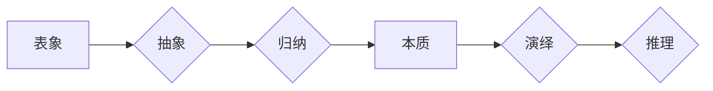

                 

## 知识的层次结构：从表象到本质

> 关键词：知识层次结构、表象、本质、抽象、归纳、演绎、算法、数学模型、代码实现、实际应用

## 1. 背景介绍

在瞬息万变的科技时代，信息爆炸式的增长和知识的快速迭代，让我们面临着如何有效地获取、理解和应用知识的挑战。 知识的层次结构，如同一座通往智慧的阶梯，帮助我们从表象层面的碎片化信息，逐步深入到本质层面的深刻理解。 

传统的学习方式往往停留在表象层面上，注重记忆和重复，缺乏对知识本质的深入探究。而构建知识层次结构，则可以帮助我们建立知识体系，将分散的知识点串联起来，形成一个完整的认知框架。 

## 2. 核心概念与联系

### 2.1 表象与本质

表象是指我们直接感知到的知识的外在形式，例如文字、图像、声音等。本质则是知识的内在逻辑和规律，是表象背后的核心含义。

例如，我们看到一个苹果，其表象是红彤彤的外皮、圆润的形状，但其本质是生命、能量、营养等。

### 2.2 抽象与归纳

抽象是将知识的共同特征提炼出来，形成更概括的概念。归纳则是从具体的实例中总结出通用的规律。

抽象和归纳是构建知识层次结构的关键步骤。通过抽象，我们可以将不同的知识点归类到不同的层次，形成知识体系。通过归纳，我们可以发现知识之间的内在联系，建立更深层次的理解。

### 2.3 演绎与推理

演绎是从已知的普遍规律推导出具体的结论。推理则是根据已有的知识和证据，推断出新的知识。

演绎和推理是运用知识层次结构进行思考和解决问题的重要手段。通过演绎，我们可以将抽象的知识应用到具体的场景中。通过推理，我们可以发现新的知识和规律。

**Mermaid 流程图**



## 3. 核心算法原理 & 具体操作步骤

### 3.1 算法原理概述

构建知识层次结构的核心算法可以概括为以下步骤：

1. **知识表示:** 将知识以结构化的形式表示，例如知识图谱、概念网络等。
2. **特征提取:** 从知识表示中提取知识的特征，例如概念、关系、属性等。
3. **层次聚类:** 根据知识特征，将知识点进行层次聚类，形成不同的知识层次。
4. **关系建模:** 建立知识点之间的关系模型，例如包含、继承、依赖等。
5. **知识导航:** 提供知识导航机制，帮助用户在知识层次结构中进行高效的搜索和浏览。

### 3.2 算法步骤详解

1. **知识表示:** 

   - 使用知识图谱表示知识，每个节点代表一个知识点，每个边代表知识点之间的关系。
   - 使用概念网络表示知识，每个节点代表一个概念，每个边代表概念之间的关联。

2. **特征提取:**

   - 使用自然语言处理技术，从文本数据中提取知识点和关系。
   - 使用机器学习算法，从知识表示中学习知识特征。

3. **层次聚类:**

   - 使用层次聚类算法，将知识点根据相似度进行聚类，形成不同的知识层次。
   - 使用主题模型，从知识点中提取主题，形成知识层次。

4. **关系建模:**

   - 使用规则引擎，定义知识点之间的关系规则。
   - 使用机器学习算法，从知识表示中学习知识关系。

5. **知识导航:**

   - 使用搜索引擎，帮助用户在知识层次结构中搜索特定知识点。
   - 使用知识图谱可视化工具，帮助用户浏览和理解知识层次结构。

### 3.3 算法优缺点

**优点:**

- 可以有效地组织和管理大量知识。
- 可以帮助用户快速找到所需知识。
- 可以促进知识的发现和创新。

**缺点:**

- 构建知识层次结构需要大量的计算资源和时间。
- 知识层次结构的构建需要依赖于高质量的知识数据。
- 知识层次结构的维护需要持续的更新和完善。

### 3.4 算法应用领域

- 教育领域：构建知识地图，帮助学生理解和记忆知识。
- 科研领域：构建知识库，促进科研成果的发现和传播。
- 企业领域：构建知识管理系统，提高企业知识的利用效率。

## 4. 数学模型和公式 & 详细讲解 & 举例说明

### 4.1 数学模型构建

知识层次结构可以抽象为一个树形结构，其中每个节点代表一个知识点，每个边代表知识点之间的关系。

我们可以使用以下数学模型来描述知识层次结构：

- **节点:**  $N = \{n_1, n_2, ..., n_k\}$，其中 $n_i$ 代表第 $i$ 个知识点。
- **边:** $E = \{(n_i, n_j) | n_i \in N, n_j \in N, n_i$ 是 $n_j$ 的父节点\}$，其中 $(n_i, n_j)$ 代表从 $n_i$ 到 $n_j$ 的一条边。

### 4.2 公式推导过程

我们可以使用以下公式来计算知识层次结构的深度：

$$depth(n_i) = \max\{depth(n_j) + 1 | (n_i, n_j) \in E\}$$

其中 $depth(n_i)$ 代表知识点 $n_i$ 的深度，即从根节点到 $n_i$ 的路径长度。

### 4.3 案例分析与讲解

例如，一个简单的知识层次结构如下：

- 根节点: 计算机科学
- 子节点: 算法、数据结构、软件工程
- 子节点: 算法的子节点: 排序算法、搜索算法

在这个例子中，

- 计算机科学的深度为 0。
- 算法、数据结构、软件工程的深度为 1。
- 排序算法、搜索算法的深度为 2。

## 5. 项目实践：代码实例和详细解释说明

### 5.1 开发环境搭建

- 编程语言: Python
- 库: NetworkX

### 5.2 源代码详细实现

```python
import networkx as nx

# 创建知识图谱
G = nx.Graph()

# 添加知识点
G.add_node("计算机科学")
G.add_node("算法")
G.add_node("数据结构")
G.add_node("软件工程")
G.add_node("排序算法")
G.add_node("搜索算法")

# 添加知识点之间的关系
G.add_edge("计算机科学", "算法")
G.add_edge("计算机科学", "数据结构")
G.add_edge("计算机科学", "软件工程")
G.add_edge("算法", "排序算法")
G.add_edge("算法", "搜索算法")

# 绘制知识图谱
nx.draw(G, with_labels=True)
plt.show()
```

### 5.3 代码解读与分析

- 使用 NetworkX 库构建知识图谱。
- 添加知识点和知识点之间的关系。
- 使用 `nx.draw()` 函数绘制知识图谱。

### 5.4 运行结果展示

运行代码后，将生成一个显示知识层次结构的图形。

## 6. 实际应用场景

### 6.1 教育领域

- 构建知识地图，帮助学生理解和记忆知识。
- 提供个性化的学习路径，根据学生的学习进度和兴趣定制学习内容。

### 6.2 科研领域

- 构建知识库，促进科研成果的发现和传播。
- 帮助研究人员发现知识之间的关联，促进跨学科研究。

### 6.3 企业领域

- 构建知识管理系统，提高企业知识的利用效率。
- 帮助员工快速找到所需知识，提高工作效率。

### 6.4 未来应用展望

- 与人工智能技术结合，实现智能知识导航和知识发现。
- 与虚拟现实技术结合，构建沉浸式的知识学习环境。
- 与区块链技术结合，构建可信的知识共享平台。

## 7. 工具和资源推荐

### 7.1 学习资源推荐

- 书籍: 《知识的本质》
- 网页: Stanford Encyclopedia of Philosophy

### 7.2 开发工具推荐

- NetworkX: Python 库，用于构建和分析网络图。
- Gephi: 开源软件，用于可视化和分析网络图。

### 7.3 相关论文推荐

-  "A Survey of Knowledge Graph Embedding Techniques"
- "Knowledge Graph Completion via Relational Reasoning"

## 8. 总结：未来发展趋势与挑战

### 8.1 研究成果总结

构建知识层次结构是知识管理和知识发现的重要技术，它可以帮助我们更好地理解和应用知识。

### 8.2 未来发展趋势

- 知识层次结构将更加智能化，能够自动学习和更新。
- 知识层次结构将更加个性化，能够根据用户的需求定制化。
- 知识层次结构将更加融合，能够与其他技术，例如人工智能和虚拟现实，深度融合。

### 8.3 面临的挑战

- 如何构建更加准确和完整的知识层次结构。
- 如何提高知识层次结构的维护效率。
- 如何将知识层次结构应用到更多领域。

### 8.4 研究展望

未来，我们将继续探索知识层次结构的构建方法和应用场景，努力构建一个更加智能、个性化和融合的知识世界。

## 9. 附录：常见问题与解答

### 9.1 如何构建知识层次结构？

构建知识层次结构需要以下步骤：

1. 确定知识领域。
2. 收集相关知识数据。
3. 提取知识点和关系。
4. 进行层次聚类和关系建模。
5. 提供知识导航机制。

### 9.2 知识层次结构有什么应用场景？

知识层次结构的应用场景非常广泛，例如：

- 教育领域：构建知识地图，帮助学生理解和记忆知识。
- 科研领域：构建知识库，促进科研成果的发现和传播。
- 企业领域：构建知识管理系统，提高企业知识的利用效率。


作者：禅与计算机程序设计艺术 / Zen and the Art of Computer Programming 
<end_of_turn>

