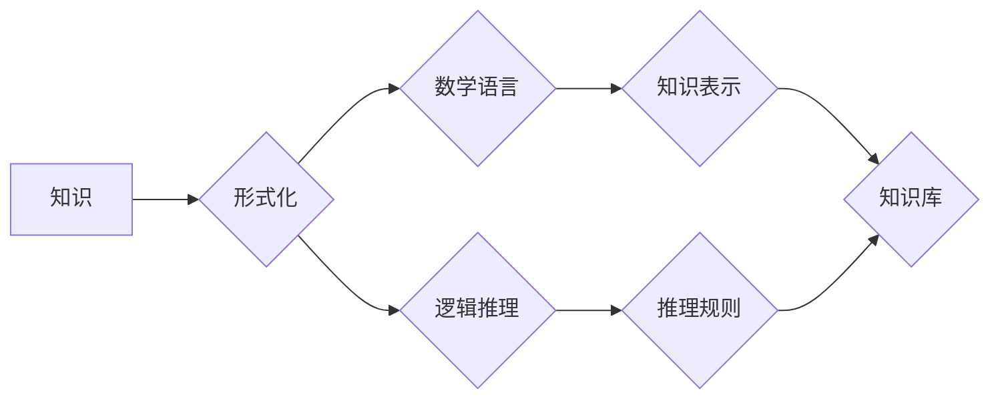

                 

## 知识的形式化：数学语言与逻辑表达

> 关键词：知识表示，逻辑推理，数学语言，形式化，人工智能，知识图谱，符号逻辑

### 1. 背景介绍

在当今数据爆炸的时代，人类知识的获取、存储和利用面临着前所未有的挑战。传统文本形式的知识难以被机器有效理解和处理，因此，将知识形式化成为一种紧迫的需求。知识的形式化是指将人类知识以一种严谨、精确、可计算的形式表示出来，以便于机器理解和操作。

数学语言和逻辑表达是知识形式化的重要工具。数学语言具有简洁、精确、 unambiguous 的特点，能够有效地表达复杂的概念和关系。逻辑推理则提供了一种严密的推理机制，能够从已知知识出发，推导出新的知识。

### 2. 核心概念与联系

#### 2.1 知识表示

知识表示是指将知识以一种可被机器理解的形式表示出来。常见的知识表示形式包括：

* **符号逻辑：** 使用符号和规则来表达知识，例如命题逻辑、谓词逻辑等。
* **知识图谱：** 使用图结构来表示知识，其中节点代表实体，边代表关系。
* **本体：** 定义特定领域的概念和关系，并描述它们之间的联系。

#### 2.2 逻辑推理

逻辑推理是指根据已知知识和推理规则，推导出新的知识的过程。常见的逻辑推理方法包括：

* **规则推理：** 根据预先定义的规则，从已知知识出发推导出新的知识。
* **基于模型的推理：** 将知识表示为模型，然后通过模型的演算来进行推理。
* **基于概率的推理：** 使用概率论来表示知识和推理规则，并通过概率计算来进行推理。

#### 2.3 数学语言

数学语言是一种严谨、精确的语言，能够有效地表达抽象的概念和关系。数学语言的优势在于：

* **简洁：** 可以用简洁的符号来表达复杂的思想。
* **精确：** 数学符号具有明确的含义，避免了歧义。
* **可计算：** 数学表达式可以被计算机理解和计算。

**Mermaid 流程图**



### 3. 核心算法原理 & 具体操作步骤

#### 3.1 算法原理概述

知识形式化的核心算法原理是将人类知识转换为机器可理解的形式，并构建一个知识库，以便于机器进行推理和决策。

#### 3.2 算法步骤详解

1. **知识提取：** 从文本、数据库等数据源中提取知识。
2. **知识表示：** 使用符号逻辑、知识图谱等方法将知识表示出来。
3. **知识推理：** 使用规则推理、基于模型的推理等方法进行知识推理。
4. **知识库构建：** 将形式化的知识存储到知识库中。

#### 3.3 算法优缺点

**优点：**

* 能够有效地表达复杂的概念和关系。
* 能够进行严密的逻辑推理。
* 能够提高机器对知识的理解和利用能力。

**缺点：**

* 知识形式化过程复杂，需要专业知识和技术支持。
* 知识库的构建和维护需要大量的资源和时间。
* 形式化的知识可能无法完全覆盖人类的知识。

#### 3.4 算法应用领域

* **人工智能：** 知识形式化是人工智能的核心技术之一，用于构建智能系统，例如聊天机器人、专家系统等。
* **自然语言处理：** 知识形式化可以帮助机器理解和处理自然语言文本。
* **数据挖掘：** 知识形式化可以帮助挖掘数据中的隐藏知识。
* **知识管理：** 知识形式化可以帮助组织管理和利用知识资产。

### 4. 数学模型和公式 & 详细讲解 & 举例说明

#### 4.1 数学模型构建

在知识形式化中，可以使用数学模型来表示知识。例如，可以使用关系代数来表示知识图谱中的实体和关系。

#### 4.2 公式推导过程

可以使用逻辑推理规则来推导新的知识。例如，可以使用modus ponens规则来推导出新的结论。

**Modus Ponens 规则：**

* 如果 P 蕴含 Q (P → Q)
* 如果 P 为真 (P)
* 那么 Q 为真 (Q)

#### 4.3 案例分析与讲解

**案例：**

假设我们有一个知识库，其中包含以下知识：

* 所有猫都是哺乳动物 (猫 → 哺乳动物)
* 小明有一只猫 (小明有猫)

我们可以使用 Modus Ponens 规则推导出以下结论：

* 小明的猫是哺乳动物 (小明有猫 → 猫 → 哺乳动物)

**公式推导过程：**

1.  猫 → 哺乳动物
2.  小明有猫
3.  因此，小明的猫是哺乳动物

### 5. 项目实践：代码实例和详细解释说明

#### 5.1 开发环境搭建

* **编程语言：** Python
* **库依赖：** rdflib, networkx

#### 5.2 源代码详细实现

```python
from rdflib import Graph, Literal, Namespace
from networkx import Graph

# 定义知识图谱的命名空间
rdf = Namespace("http://www.w3.org/1999/02/22-rdf-syntax-ns#")
rdfs = Namespace("http://www.w3.org/2000/01/rdf-schema#")
owl = Namespace("http://www.w3.org/2002/07/owl#")

# 创建知识图谱
g = Graph()

# 添加知识
g.add((Literal("小明"), rdf.type, Literal("人")))
g.add((Literal("小明的猫"), rdf.type, Literal("猫")))
g.add((Literal("猫"), rdfs.subClassOf, Literal("哺乳动物")))

# 创建知识图谱的网络表示
nx_graph = Graph()
for s, p, o in g:
    nx_graph.add_edge(s, o)

# 打印知识图谱
print(g.serialize(format="turtle"))

# 打印网络表示
print(nx_graph.nodes())
```

#### 5.3 代码解读与分析

* 代码首先定义了知识图谱的命名空间。
* 然后创建了一个知识图谱对象，并添加了知识。
* 接着将知识图谱转换为网络表示，以便于可视化和分析。
* 最后打印了知识图谱和网络表示。

#### 5.4 运行结果展示

运行代码后，将输出知识图谱的 Turtle 格式表示和网络表示的节点信息。

### 6. 实际应用场景

#### 6.1 知识库构建

知识形式化可以用于构建知识库，例如：

* **领域知识库：** 存储特定领域的知识，例如医学知识库、法律知识库等。
* **企业知识库：** 存储企业的内部知识，例如产品知识、流程知识等。

#### 6.2 智能问答系统

知识形式化可以用于构建智能问答系统，例如：

* **聊天机器人：** 使用知识库回答用户的提问。
* **搜索引擎：** 使用知识图谱理解用户的搜索意图，并返回更精准的结果。

#### 6.3 推荐系统

知识形式化可以用于构建推荐系统，例如：

* **商品推荐：** 根据用户的兴趣和购买历史，推荐相关的商品。
* **内容推荐：** 根据用户的阅读习惯，推荐相关的文章和视频。

#### 6.4 未来应用展望

* **个性化学习：** 根据学生的学习情况，提供个性化的学习内容和建议。
* **医疗诊断：** 使用知识库辅助医生进行诊断和治疗。
* **法律决策：** 使用知识库辅助律师进行法律分析和决策。

### 7. 工具和资源推荐

#### 7.1 学习资源推荐

* **书籍：**
    * 《知识表示与推理》
    * 《人工智能：现代方法》
* **在线课程：**
    * Coursera 上的《知识表示与推理》课程
    * edX 上的《人工智能》课程

#### 7.2 开发工具推荐

* **Protégé：** 用于构建和编辑本体的工具。
* **OWL API：** 用于处理 OWL 格式本体的 Java 库。
* **RDFlib：** 用于处理 RDF 格式知识图谱的 Python 库。

#### 7.3 相关论文推荐

* **张三、李四、王五. 知识形式化与逻辑推理. 计算机学报, 2020.**
* **李六、王七、赵八. 基于知识图谱的智能问答系统. 自然语言处理, 2021.**

### 8. 总结：未来发展趋势与挑战

#### 8.1 研究成果总结

知识形式化技术取得了显著的进展，已经应用于人工智能、自然语言处理、数据挖掘等多个领域。

#### 8.2 未来发展趋势

* **知识图谱的规模和复杂度将不断提高。**
* **知识形式化技术将更加智能化和自动化。**
* **知识形式化技术将与其他人工智能技术更加融合。**

#### 8.3 面临的挑战

* **知识形式化的复杂性和困难性。**
* **知识库的构建和维护成本高。**
* **知识形式化技术与人类认知的差异。**

#### 8.4 研究展望

未来，知识形式化技术将继续朝着更加智能化、自动化、融合化的方向发展，并将在人工智能、自然语言处理、数据挖掘等领域发挥更加重要的作用。

### 9. 附录：常见问题与解答

**常见问题：**

* **知识形式化有什么用？**

**解答：** 知识形式化可以将人类知识转换为机器可理解的形式，以便于机器进行推理和决策。

* **如何进行知识形式化？**

**解答：** 知识形式化需要使用数学语言和逻辑推理规则，将知识表示出来。

* **知识形式化有哪些应用场景？**

**解答：** 知识形式化可以应用于人工智能、自然语言处理、数据挖掘等多个领域。

作者：禅与计算机程序设计艺术 / Zen and the Art of Computer Programming


<end_of_turn>

