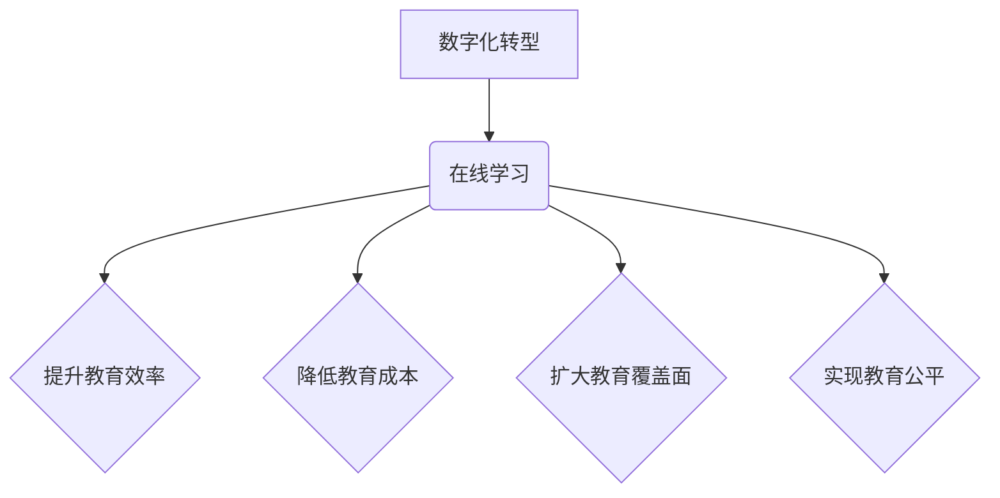

                 

## 关键词：在线学习，数字化转型，教育科技，人工智能，大数据，个性化学习，未来教育

## 1. 背景介绍

21世纪，信息技术飞速发展，深刻地改变着人类社会生活的方方面面。教育领域也不例外，在线学习作为数字技术在教育领域的应用，正经历着前所未有的蓬勃发展。从传统的线下课堂到如今的云端学习平台，从单一的视频课程到交互式的虚拟现实体验，在线学习模式不断创新，为人们提供更加便捷、灵活、个性化的学习方式。

然而，在线学习的普及也面临着诸多挑战。如何有效提升在线学习的质量和效率，如何解决数字鸿沟和教育资源分配不均的问题，如何保障学习者的隐私安全和数据权益，这些都是需要认真思考和解决的关键问题。

## 2. 核心概念与联系

### 2.1 在线学习

在线学习是指利用网络技术，通过互联网平台提供学习资源和服务，学生可以在任何时间、任何地点进行学习的一种新型教育模式。它涵盖了多种形式，包括：

* **同步在线学习:** 学生和教师在同一时间段在线互动，例如网络直播课程、在线研讨会等。
* **异步在线学习:** 学生可以根据自己的时间安排自主学习，例如录播课程、在线论坛、电子教材等。
* **混合式在线学习:** 将同步和异步学习模式相结合，例如部分课程在线学习，部分课程线下授课。

### 2.2 数字化转型

数字化转型是指利用数字技术和数据驱动，重塑企业运营模式、业务流程和组织架构，以实现业务创新、效率提升和价值创造的过程。

在线学习作为教育领域的数字化转型的重要组成部分，旨在通过数字技术手段，提升教育效率、降低教育成本、扩大教育覆盖面，实现教育公平和可持续发展。

### 2.3 核心概念关系

在线学习与数字化转型之间存在着密切的联系。数字化转型为在线学习提供了技术基础和发展动力，而在线学习则是数字化转型在教育领域的典型应用案例。



## 3. 核心算法原理 & 具体操作步骤

### 3.1 算法原理概述

在线学习平台的个性化推荐算法是其核心技术之一，旨在根据用户的学习行为、兴趣偏好等信息，推荐最适合用户的学习资源。常用的算法包括：

* **协同过滤:** 基于用户的相似性或物品的相似性进行推荐。
* **内容过滤:** 根据用户的学习历史和资源的主题内容进行推荐。
* **混合推荐:** 将协同过滤和内容过滤相结合，提高推荐的准确性和个性化程度。

### 3.2 算法步骤详解

以协同过滤算法为例，其具体操作步骤如下：

1. **数据收集:** 收集用户的学习行为数据，例如学习过的课程、浏览过的资源、评分等。
2. **用户相似度计算:** 使用余弦相似度等算法计算用户之间的相似度。
3. **物品相似度计算:** 使用余弦相似度等算法计算资源之间的相似度。
4. **推荐生成:** 根据用户的相似用户或相似资源，推荐用户可能感兴趣的学习资源。

### 3.3 算法优缺点

**优点:**

* **个性化推荐:** 可以根据用户的实际需求和兴趣偏好进行推荐，提高学习效率和用户体验。
* **数据驱动:** 基于用户的学习行为数据进行推荐，更加精准和有效。

**缺点:**

* **冷启动问题:** 新用户或新资源缺乏历史数据，难以进行准确的推荐。
* **数据稀疏性:** 用户学习行为数据可能存在稀疏性，影响算法的准确性。

### 3.4 算法应用领域

在线学习平台的个性化推荐算法广泛应用于：

* **课程推荐:** 根据用户的学习目标、兴趣和水平，推荐合适的课程。
* **资源推荐:** 根据用户的学习需求，推荐相关的学习资源，例如视频、文章、练习题等。
* **学习路径规划:** 根据用户的学习目标和进度，规划个性化的学习路径。

## 4. 数学模型和公式 & 详细讲解 & 举例说明

### 4.1 数学模型构建

协同过滤算法的核心是计算用户之间的相似度和物品之间的相似度。常用的相似度度量方法包括余弦相似度和皮尔逊相关系数。

**余弦相似度:**

$$
\text{相似度} = \frac{\mathbf{u} \cdot \mathbf{v}}{\|\mathbf{u}\| \|\mathbf{v}\|}
$$

其中，$\mathbf{u}$ 和 $\mathbf{v}$ 分别表示两个用户的学习行为向量，$\cdot$ 表示点积，$\|\mathbf{u}\|$ 和 $\|\mathbf{v}\|$ 分别表示两个向量的模长。

**皮尔逊相关系数:**

$$
\text{相关系数} = \frac{\sum_{i=1}^{n}(u_i - \bar{u})(v_i - \bar{v})}{\sqrt{\sum_{i=1}^{n}(u_i - \bar{u})^2} \sqrt{\sum_{i=1}^{n}(v_i - \bar{v})^2}}
$$

其中，$u_i$ 和 $v_i$ 分别表示两个用户在第 $i$ 个资源上的评分，$\bar{u}$ 和 $\bar{v}$ 分别表示两个用户的平均评分。

### 4.2 公式推导过程

余弦相似度的推导过程基于向量空间模型。将用户和物品映射到一个高维向量空间中，每个维度代表一个特征。用户的学习行为向量表示用户在各个特征上的评分或偏好。余弦相似度则衡量两个向量之间的夹角，夹角越小，相似度越高。

皮尔逊相关系数的推导过程基于统计学中的相关分析。它衡量两个变量之间的线性相关性，相关系数的取值范围为 -1 到 1，其中 1 表示完全正相关，-1 表示完全负相关，0 表示不相关。

### 4.3 案例分析与讲解

假设有两个用户 A 和 B，他们在三个课程上的评分分别如下：

| 课程 | 用户 A | 用户 B |
|---|---|---|
| 课程 1 | 5 | 4 |
| 课程 2 | 3 | 5 |
| 课程 3 | 4 | 3 |

我们可以使用余弦相似度计算用户 A 和 B 的相似度。

首先，计算用户 A 和 B 的平均评分：

* $\bar{u} = (5 + 3 + 4) / 3 = 4$
* $\bar{v} = (4 + 5 + 3) / 3 = 4$

然后，计算用户 A 和 B 在每个课程上的评分与平均评分的差值：

* $u_1 - \bar{u} = 5 - 4 = 1$
* $u_2 - \bar{u} = 3 - 4 = -1$
* $u_3 - \bar{u} = 4 - 4 = 0$
* $v_1 - \bar{v} = 4 - 4 = 0$
* $v_2 - \bar{v} = 5 - 4 = 1$
* $v_3 - \bar{v} = 3 - 4 = -1$

最后，计算用户 A 和 B 的余弦相似度：

$$
\text{相似度} = \frac{(1 * 0) + (-1 * 1) + (0 * -1)}{\sqrt{1^2 + (-1)^2 + 0^2} \sqrt{0^2 + 1^2 + (-1)^2}} = \frac{-1}{\sqrt{2} \sqrt{2}} = -\frac{1}{2}
$$

结果表明，用户 A 和 B 的相似度为 -0.5，表示两者之间存在一定的负相关性。

## 5. 项目实践：代码实例和详细解释说明

### 5.1 开发环境搭建

在线学习平台的开发环境通常包括：

* **操作系统:** Linux、Windows 或 macOS
* **编程语言:** Python、Java 或 Node.js
* **数据库:** MySQL、PostgreSQL 或 MongoDB
* **云平台:** AWS、Azure 或 Google Cloud

### 5.2 源代码详细实现

以下是一个使用 Python 和 Flask 框架实现简单的在线学习平台推荐系统的代码示例：

```python
from flask import Flask, request, jsonify
from sklearn.metrics.pairwise import cosine_similarity

app = Flask(__name__)

# 用户学习行为数据
user_data = {
    'user1': {'course1': 5, 'course2': 3, 'course3': 4},
    'user2': {'course1': 4, 'course2': 5, 'course3': 3},
    'user3': {'course1': 3, 'course2': 4, 'course3': 5},
}

# 计算用户之间的余弦相似度
def calculate_similarity(user1, user2):
    user1_vector = list(user_data[user1].values())
    user2_vector = list(user_data[user2].values())
    return cosine_similarity([user1_vector], [user2_vector])[0][0]

# 推荐课程
@app.route('/recommend', methods=['POST'])
def recommend():
    user_id = request.json.get('user_id')
    similarity_scores = []
    for other_user in user_data:
        if other_user != user_id:
            similarity = calculate_similarity(user_id, other_user)
            similarity_scores.append((other_user, similarity))
    similarity_scores.sort(key=lambda x: x[1], reverse=True)
    top_similar_users = similarity_scores[:3]
    recommended_courses = set()
    for user, similarity in top_similar_users:
        for course in user_data[user]:
            if course not in recommended_courses:
                recommended_courses.add(course)
    return jsonify({'recommended_courses': list(recommended_courses)})

if __name__ == '__main__':
    app.run(debug=True)
```

### 5.3 代码解读与分析

该代码实现了一个简单的在线学习平台推荐系统。

* **用户数据:** `user_data` 字典存储了用户的学习行为数据，每个用户对应一个字典，字典的键是课程名称，值是用户对课程的评分。
* **余弦相似度计算:** `calculate_similarity` 函数使用 scikit-learn 库中的 `cosine_similarity` 函数计算用户之间的余弦相似度。
* **推荐课程:** `recommend` 函数接收用户的 ID 作为输入，计算用户与其他用户的相似度，并推荐与相似用户学习过的课程。

### 5.4 运行结果展示

运行该代码后，可以通过 POST 请求发送用户 ID 到 `/recommend` 路径，获取推荐的课程列表。

## 6. 实际应用场景

在线学习平台的个性化推荐算法在实际应用场景中发挥着重要作用，例如：

* **课程推荐:** 根据用户的学习目标、兴趣和水平，推荐合适的课程，提高学习效率和用户体验。
* **资源推荐:** 根据用户的学习需求，推荐相关的学习资源，例如视频、文章、练习题等，帮助用户更深入地理解知识。
* **学习路径规划:** 根据用户的学习目标和进度，规划个性化的学习路径，引导用户循序渐进地学习，提高学习效果。

### 6.4 未来应用展望

随着人工智能技术的不断发展，在线学习平台的个性化推荐算法将更加智能化、精准化和个性化。未来，我们可以期待以下应用场景：

* **基于多模态数据的推荐:** 将文本、图像、音频等多模态数据融合到推荐算法中，提供更加全面的用户画像和个性化推荐。
* **实时动态推荐:** 基于用户的实时学习行为，动态调整推荐内容，提供更加及时和有效的学习建议。
* **跨平台个性化推荐:** 将用户学习行为数据整合到不同的学习平台，实现跨平台的个性化推荐，提供更加连续和完整的学习体验。

## 7. 工具和资源推荐

### 7.1 学习资源推荐

* **在线学习平台:** Coursera、edX、Udacity、Khan Academy
* **机器学习库:** scikit-learn、TensorFlow、PyTorch
* **数据科学书籍:** "Python for Data Analysis" by Wes McKinney, "Hands-On Machine Learning with Scikit-Learn, Keras & TensorFlow" by Aurélien Géron

### 7.2 开发工具推荐

* **编程语言:** Python、Java、Node.js
* **框架:** Flask、Django、Spring Boot
* **数据库:** MySQL、PostgreSQL、MongoDB

### 7.3 相关论文推荐

* "Collaborative Filtering for Recommender Systems" by Su-Yin Lee and Wei-Min Chen
* "Matrix Factorization Techniques for Recommender Systems" by Yehuda Koren
* "Deep Learning for Recommender Systems" by Xiangnan He et al.

## 8. 总结：未来发展趋势与挑战

### 8.1 研究成果总结

在线学习平台的个性化推荐算法取得了显著的成果，能够有效提升学习效率和用户体验。

### 8.2 未来发展趋势

未来，在线学习平台的个性化推荐算法将朝着以下方向发展：

* **更加智能化:** 利用深度学习等人工智能技术，实现更加智能的推荐。
* **更加精准化:** 基于用户的多模态数据和实时行为，提供更加精准的推荐。
* **更加个性化:** 考虑用户的个性化需求和学习风格，提供更加个性化的学习体验。

### 8.3 面临的挑战

在线学习平台的个性化推荐算法也面临着一些挑战：

* **数据稀疏性:** 用户学习行为数据可能存在稀疏性，影响算法的准确性。
* **冷启动问题:** 新用户或新资源缺乏历史数据，难以进行准确的推荐。
* **隐私安全:** 用户学习行为数据涉及个人隐私，需要保障数据的安全和隐私。

### 8.4 研究展望

未来，需要进一步研究以下问题：

* 如何解决数据稀疏性和冷启动问题。
* 如何保障用户隐私安全。
* 如何将个性化推荐与其他教育技术融合，实现更加有效的教育创新。

## 9. 附录：常见问题与解答

### 9.1 如何提高推荐算法的准确性？

* 丰富用户学习行为数据。
* 使用更先进的推荐算法，例如深度学习算法。
* 结合用户反馈，不断优化推荐算法。

### 9.2 如何解决冷启动问题？

* 利用用户的社会关系信息，进行间接推荐。
* 使用内容过滤算法，推荐与用户兴趣相关的资源。
* 使用协同过滤算法，从相似用户的学习行为中进行推荐。

### 9.3 如何保障用户隐私安全？

* 使用匿名化技术，保护用户的个人信息。
* 明确用户数据的使用政策，获得用户的同意。
* 加强数据安全防护，防止数据泄露。


作者：禅与计算机程序设计艺术 / Zen and the Art of Computer Programming<end_of_turn>

