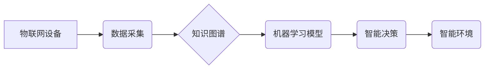

                 

## 知识的物联网应用：智能环境中的无处不在学习

> 关键词：物联网、知识图谱、机器学习、深度学习、智能环境、无处不在学习、知识发现、个性化学习

## 1. 背景介绍

随着物联网技术的飞速发展，智能设备的普及和网络连接的不断加强，我们生活在一个数据爆炸的时代。海量的传感器数据、用户行为数据、社会网络数据等，为构建智能环境提供了丰富的资源。而知识，作为人类理解和认知世界的核心，在智能环境中扮演着越来越重要的角色。

传统的教育模式往往局限于课堂教学，而智能环境则为我们提供了无处不在学习的可能性。通过物联网技术，我们可以将知识嵌入到环境中，让学习成为一种自然、持续的过程。例如，智能家居可以根据用户的行为和喜好，提供个性化的学习建议；智能交通系统可以利用路况信息，为乘客提供实时导航和交通知识；智能博物馆可以通过互动展览，引导游客深度了解历史文化。

## 2. 核心概念与联系

**2.1 核心概念**

* **物联网 (Internet of Things, IoT):** 物联网是指将各种物理设备、传感器、软件和网络连接在一起，形成一个互联互通的智能网络。
* **知识图谱 (Knowledge Graph, KG):** 知识图谱是一种数据结构，用于表示知识的结构化信息。它由实体、关系和属性组成，可以用来存储、推理和查询知识。
* **机器学习 (Machine Learning, ML):** 机器学习是一种人工智能技术，通过算法学习数据中的模式，从而进行预测和决策。
* **深度学习 (Deep Learning, DL):** 深度学习是一种机器学习的子集，利用多层神经网络来学习复杂的数据模式。

**2.2 架构图**



**2.3 核心联系**

物联网设备通过传感器采集数据，这些数据被传输到知识图谱中进行存储和组织。知识图谱利用机器学习模型对数据进行分析和推理，从而生成智能决策。智能决策驱动智能环境的运行，为用户提供个性化服务和无处不在的学习体验。

## 3. 核心算法原理 & 具体操作步骤

**3.1 算法原理概述**

在知识的物联网应用中，常用的算法包括：

* **知识抽取算法:** 从文本数据中提取实体、关系和属性，构建知识图谱。
* **知识推理算法:** 基于知识图谱中的规则和关系，进行知识推理和推导。
* **推荐算法:** 根据用户的行为和偏好，推荐相关的知识和学习资源。
* **个性化学习算法:** 根据用户的学习进度和能力，定制个性化的学习路径和内容。

**3.2 算法步骤详解**

以知识抽取算法为例，其具体操作步骤如下：

1. **数据预处理:** 对文本数据进行清洗、分词、词性标注等预处理操作。
2. **特征提取:** 从预处理后的文本数据中提取特征，例如实体、关系、属性等。
3. **模型训练:** 利用机器学习算法对特征进行训练，构建知识抽取模型。
4. **知识图谱构建:** 将抽取出的知识信息存储到知识图谱中。

**3.3 算法优缺点**

* **优点:** 能够自动从海量文本数据中提取知识，构建知识图谱，为智能环境提供知识支持。
* **缺点:** 知识抽取算法的准确率和效率仍然存在挑战，需要不断改进和优化。

**3.4 算法应用领域**

知识抽取算法广泛应用于：

* **教育领域:** 自动生成学习资源、个性化推荐学习内容。
* **医疗领域:** 提取患者病历信息、辅助医生诊断。
* **金融领域:** 提取金融文本信息、进行风险评估。

## 4. 数学模型和公式 & 详细讲解 & 举例说明

**4.1 数学模型构建**

知识图谱可以表示为一个三元组的集合： (实体1, 关系, 实体2)。

例如，知识图谱中的一个三元组可以表示为： (张三, 工作在, 公司A)。

其中，张三是实体1，工作在是关系，公司A是实体2。

**4.2 公式推导过程**

知识推理可以使用逻辑规则和推理算法进行。

例如，如果我们知道：

* 张三工作在公司A。
* 公司A位于北京。

我们可以通过推理规则推导出：张三位于北京。

**4.3 案例分析与讲解**

在智能环境中，知识图谱可以用于实现个性化学习。

例如，如果一个学生的知识图谱中包含了以下信息：

* 学生A擅长数学。
* 学生A对编程感兴趣。

智能环境可以根据这些信息，推荐学生A学习相关的数学和编程课程。

## 5. 项目实践：代码实例和详细解释说明

**5.1 开发环境搭建**

* 操作系统: Ubuntu 20.04
* 编程语言: Python 3.8
* 开发工具: Jupyter Notebook

**5.2 源代码详细实现**

```python
# 知识图谱构建
import networkx as nx

# 创建知识图谱
graph = nx.DiGraph()

# 添加实体和关系
graph.add_node("张三")
graph.add_node("公司A")
graph.add_edge("张三", "公司A", relation="工作在")

# 打印知识图谱
print(graph.nodes())
print(graph.edges())

# 知识推理
# 使用规则引擎进行知识推理
```

**5.3 代码解读与分析**

* 使用 `networkx` 库构建知识图谱。
* 添加实体和关系，形成知识图谱的结构。
* 打印知识图谱的节点和边信息。
* 使用规则引擎进行知识推理，推导出新的知识。

**5.4 运行结果展示**

运行代码后，将输出知识图谱的节点和边信息，例如：

```
Node: ['张三', '公司A']
Edge: [('张三', '公司A', '工作在')]
```

## 6. 实际应用场景

**6.1 智能教育**

* 个性化学习路径推荐
* 智能辅导系统
* 虚拟现实沉浸式学习

**6.2 智能医疗**

* 疾病诊断辅助系统
* 患者个性化治疗方案
* 远程医疗服务

**6.3 智能家居**

* 智能家居设备控制
* 家庭安全监控
* 家庭能源管理

**6.4 未来应用展望**

* 更智能、更个性化的学习体验
* 更精准、更有效的医疗诊断和治疗
* 更安全、更舒适的智能家居环境

## 7. 工具和资源推荐

**7.1 学习资源推荐**

* **书籍:**
    * 《知识图谱》
    * 《深度学习》
* **在线课程:**
    * Coursera: 知识图谱课程
    * edX: 深度学习课程

**7.2 开发工具推荐**

* **知识图谱构建工具:**
    * Neo4j
    * RDF4J
* **机器学习框架:**
    * TensorFlow
    * PyTorch

**7.3 相关论文推荐**

* **知识图谱:**
    * 《A Survey on Knowledge Graph Embedding》
* **机器学习:**
    * 《Deep Learning》

## 8. 总结：未来发展趋势与挑战

**8.1 研究成果总结**

知识的物联网应用在智能环境建设中取得了显著进展，为我们提供了无处不在学习的可能性。

**8.2 未来发展趋势**

* **更智能的知识推理:** 利用更先进的机器学习算法和推理引擎，实现更智能、更精准的知识推理。
* **更个性化的学习体验:** 基于用户的行为和偏好，提供更个性化的学习内容和学习路径。
* **更广泛的应用场景:** 将知识的物联网应用扩展到更多领域，例如智能交通、智能城市等。

**8.3 面临的挑战**

* **数据质量问题:** 物联网数据往往存在噪声、不完整等问题，需要进行有效的数据清洗和处理。
* **知识表示问题:** 如何更好地表示和组织知识，使其能够被机器理解和利用，仍然是一个挑战。
* **隐私安全问题:** 物联网数据涉及到用户的隐私信息，需要采取有效的措施保障数据安全。

**8.4 研究展望**

未来，我们将继续致力于知识的物联网应用研究，探索更智能、更个性化、更安全、更广泛的应用场景，为构建智慧社会贡献力量。

## 9. 附录：常见问题与解答

**9.1 如何构建知识图谱？**

可以使用开源工具，例如 Neo4j 和 RDF4J，构建知识图谱。

**9.2 如何进行知识推理？**

可以使用规则引擎或机器学习算法进行知识推理。

**9.3 如何保障数据安全？**

需要采取加密、匿名化等措施保障数据安全。


作者：禅与计算机程序设计艺术 / Zen and the Art of Computer Programming 
<end_of_turn>

