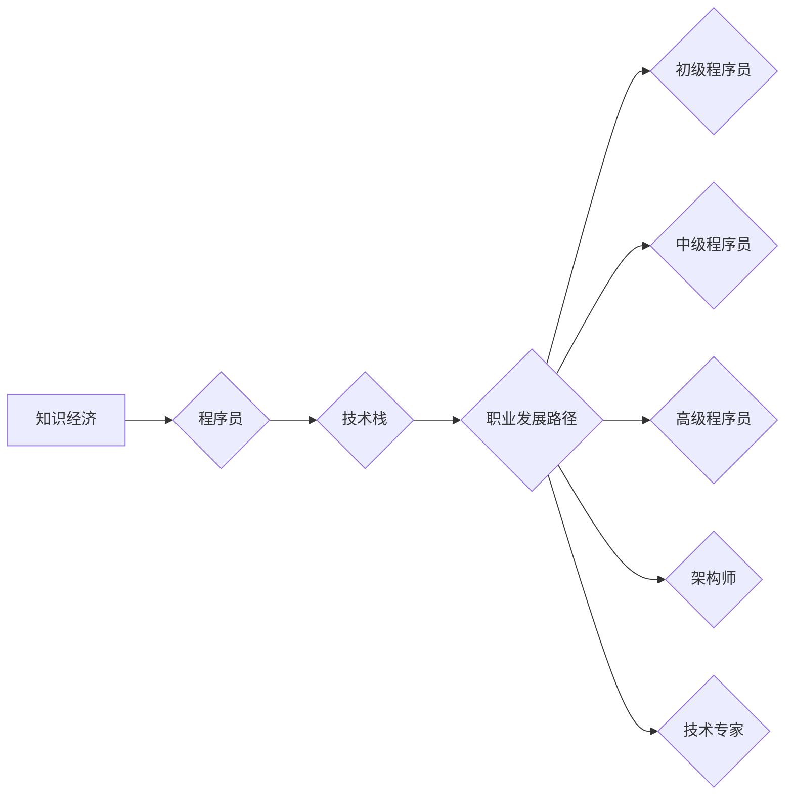

                 

## 知识经济下程序员的职业发展路径

> 关键词：知识经济、程序员、职业发展、技术栈、软技能、持续学习、人工智能、自动化、云计算

### 1. 背景介绍

21世纪已进入知识经济时代，知识成为生产力最主要的要素。在这个时代，程序员作为掌握着数字世界核心技术的人才，地位日益重要。然而，随着技术的快速发展和市场竞争的加剧，程序员的职业发展路径也面临着新的挑战和机遇。

传统意义上的程序员，主要负责编写代码，实现软件功能。但随着人工智能、自动化、云计算等技术的兴起，程序员的角色正在发生着深刻的变化。他们需要具备更广泛的知识和技能，才能在知识经济时代保持竞争力。

### 2. 核心概念与联系

**2.1 知识经济与程序员**

知识经济的核心是知识的创造、传播和应用。程序员作为知识创造者，通过编写代码，构建软件系统，为社会创造价值。

**2.2 程序员职业发展路径**

程序员的职业发展路径可以分为以下几个阶段：

* **初级程序员:** 掌握基础编程语言和软件开发流程，能够完成简单的软件开发任务。
* **中级程序员:** 具备一定的项目经验，能够独立完成复杂软件开发任务，并参与项目设计和架构。
* **高级程序员:** 拥有丰富的项目经验和技术积累，能够领导团队开发大型软件项目，并参与技术决策。
* **架构师:** 负责软件系统的整体设计和架构，具有深厚的技术功底和系统架构能力。
* **技术专家:** 在某个特定领域拥有深厚的技术专长，能够解决复杂的技术问题，并进行技术研究和创新。

**2.3 技术栈与职业发展**

技术栈是指程序员掌握的编程语言、框架、工具等技术组合。不同的技术栈对应不同的职业方向和发展路径。例如，前端开发技术栈主要包括HTML、CSS、JavaScript等，而后端开发技术栈则主要包括Java、Python、Node.js等。

**Mermaid 流程图**



### 3. 核心算法原理 & 具体操作步骤

**3.1 算法原理概述**

算法是解决特定问题的一系列步骤或规则。程序员需要掌握各种算法原理，才能高效地编写代码并解决实际问题。常见的算法包括排序算法、搜索算法、图算法等。

**3.2 算法步骤详解**

以冒泡排序为例，详细说明其算法步骤：

1. 比较相邻的两个元素，如果顺序错误，则交换它们的位置。
2. 重复步骤1，直到整个数组排序完成。

**3.3 算法优缺点**

冒泡排序的优点是简单易懂，缺点是效率较低，时间复杂度为O(n^2)。

**3.4 算法应用领域**

算法广泛应用于各个领域，例如：

* **数据处理:** 排序、搜索、聚类等算法用于处理海量数据。
* **人工智能:** 决策树、神经网络等算法用于构建智能系统。
* **网络安全:** 加密、解密、身份验证等算法用于保障网络安全。

### 4. 数学模型和公式 & 详细讲解 & 举例说明

**4.1 数学模型构建**

数学模型可以用来描述和分析算法的性能。例如，时间复杂度可以用数学公式来表示，它描述了算法运行时间与输入数据大小的关系。

**4.2 公式推导过程**

时间复杂度公式的推导过程通常涉及对算法步骤的分析和计数。例如，冒泡排序的时间复杂度为O(n^2)，是因为它需要进行n-1轮比较，每轮比较需要进行n-i次交换，其中i为轮数。

**4.3 案例分析与讲解**

假设有一个包含n个元素的数组，我们需要对其进行排序。冒泡排序的时间复杂度为O(n^2)，这意味着当输入数据大小n增加时，算法运行时间会呈平方增长。

**4.4 数学公式**

```latex
T(n) = O(n^2)
```

其中，T(n)表示算法运行时间，n表示输入数据大小。

### 5. 项目实践：代码实例和详细解释说明

**5.1 开发环境搭建**

选择合适的编程语言和开发环境，例如Python和VS Code。

**5.2 源代码详细实现**

```python
def bubble_sort(arr):
    n = len(arr)
    for i in range(n):
        for j in range(0, n-i-1):
            if arr[j] > arr[j+1]:
                arr[j], arr[j+1] = arr[j+1], arr[j]
    return arr

# 测试代码
arr = [64, 34, 25, 12, 22, 11, 90]
sorted_arr = bubble_sort(arr)
print("排序后的数组:", sorted_arr)
```

**5.3 代码解读与分析**

代码实现了一个冒泡排序算法。

* 外层循环控制排序轮数，每次循环将最大的元素“冒泡”到数组末尾。
* 内层循环比较相邻元素，如果顺序错误，则交换它们的位置。

**5.4 运行结果展示**

```
排序后的数组: [11, 12, 22, 25, 34, 64, 90]
```

### 6. 实际应用场景

**6.1 数据排序**

在数据库、搜索引擎等领域，需要对数据进行排序，以便快速查找和检索信息。

**6.2 图算法**

图算法用于分析和解决图结构的数据，例如社交网络分析、路径规划等。

**6.3 机器学习**

机器学习算法需要对数据进行处理和分析，例如分类、回归等任务。

**6.4 未来应用展望**

随着人工智能、大数据等技术的不断发展，算法将在更多领域得到应用，例如自动驾驶、医疗诊断等。

### 7. 工具和资源推荐

**7.1 学习资源推荐**

* **书籍:** 《算法导论》、《数据结构与算法分析》
* **在线课程:** Coursera、edX、Udemy等平台提供丰富的算法课程。
* **网站:** GeeksforGeeks、LeetCode等网站提供算法练习题和学习资源。

**7.2 开发工具推荐**

* **IDE:** VS Code、IntelliJ IDEA、Eclipse等
* **版本控制:** Git、GitHub
* **测试工具:** JUnit、pytest等

**7.3 相关论文推荐**

* **排序算法:** 《Comparison-Based Sorting》
* **图算法:** 《Algorithms on Graphs》
* **机器学习算法:** 《The Elements of Statistical Learning》

### 8. 总结：未来发展趋势与挑战

**8.1 研究成果总结**

在知识经济时代，程序员的职业发展路径更加多元化和专业化。掌握算法原理、技术栈和软技能是程序员保持竞争力的关键。

**8.2 未来发展趋势**

* **人工智能:** 人工智能技术将对程序员的工作产生重大影响，例如代码自动生成、自动化测试等。
* **云计算:** 云计算平台将提供更便捷的开发环境和服务，程序员需要掌握云计算相关的技术。
* **大数据:** 大数据分析技术将对程序员的工作产生新的需求，例如数据处理、数据可视化等。

**8.3 面临的挑战**

* **技术迭代速度快:** 程序员需要不断学习新技术，才能跟上时代的步伐。
* **竞争激烈:** 随着编程人才的增多，程序员的竞争压力越来越大。
* **职业发展路径不清晰:** 知识经济时代，程序员的职业发展路径更加多元化，需要更加清晰的规划和目标。

**8.4 研究展望**

未来，程序员需要更加注重跨学科学习，例如数据科学、人工智能等领域。同时，还需要提升软技能，例如沟通能力、团队合作能力等。


### 9. 附录：常见问题与解答

**9.1 如何选择合适的技术栈？**

选择技术栈需要根据自己的兴趣、职业目标和市场需求进行综合考虑。

**9.2 如何保持持续学习？**

可以订阅技术博客、参加技术会议、学习在线课程等方式保持持续学习。

**9.3 如何应对职业发展中的挑战？**

可以积极拓展人脉、提升软技能、不断学习新技术等方式应对职业发展中的挑战。


作者：禅与计算机程序设计艺术 / Zen and the Art of Computer Programming 
<end_of_turn>

