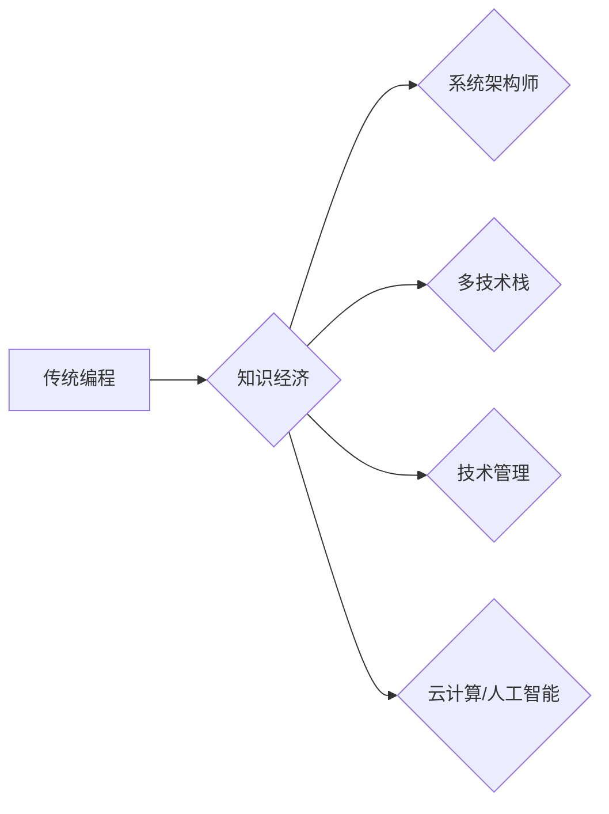

                 

## 知识经济下程序员的职业转型策略

> 关键词：知识经济、程序员转型、技能升级、职业发展、人工智能、数据科学、云计算、软件架构、技术领导力

### 1. 背景介绍

21世纪已进入知识经济时代，信息化和数字化深刻地改变着人类社会生产方式和生活方式。在这个时代，知识、技术和创新成为最重要的生产要素。对于程序员这一群体来说，传统的编程技能已经不再足以满足未来发展的需求。知识经济下，程序员需要不断学习新知识、掌握新技能，进行职业转型，才能在激烈的竞争中脱颖而出。

### 2. 核心概念与联系

**2.1 知识经济与程序员职业发展**

知识经济是指以知识、信息和技术为主要生产要素的经济形态。在这个经济形态下，知识的创造、传播和应用成为经济增长的关键驱动力。程序员作为软件开发的专业人才，在知识经济中扮演着越来越重要的角色。他们负责设计、开发和维护各种软件系统，为社会提供数字化解决方案。

**2.2 程序员职业转型趋势**

随着科技发展和市场需求的变化，程序员的职业发展趋势呈现出以下特点：

* **从代码编写向系统架构师转变:**  程序员需要具备更全面的系统设计和架构能力，能够理解业务需求，设计高性能、可扩展的软件系统。
* **从单一技术栈向多技术栈掌握:**  程序员需要掌握多种编程语言、框架和工具，能够根据项目需求灵活选择合适的技术方案。
* **从技术开发向技术管理转变:**  程序员需要具备一定的管理能力，能够领导团队完成项目开发，并进行技术决策。
* **从传统软件开发向云计算、人工智能等新兴领域发展:**  程序员需要学习新兴技术，适应新的开发模式，例如云原生开发、微服务架构、机器学习等。

**2.3  Mermaid 流程图**



### 3. 核心算法原理 & 具体操作步骤

**3.1 算法原理概述**

在知识经济下，程序员需要掌握一些核心算法原理，例如：

* **数据结构和算法:**  掌握常用的数据结构和算法，例如数组、链表、树、图、排序算法、搜索算法等，能够提高代码效率和解决复杂问题的能力。
* **机器学习算法:**  了解机器学习的基本原理和常用算法，例如线性回归、逻辑回归、决策树、支持向量机、神经网络等，能够应用于数据分析、预测和模式识别等领域。
* **深度学习算法:**  掌握深度学习的基本原理和常用算法，例如卷积神经网络、循环神经网络等，能够应用于图像识别、自然语言处理、语音识别等领域。

**3.2 算法步骤详解**

以排序算法为例，详细说明其步骤：

1. **选择排序算法:**  根据具体需求选择合适的排序算法，例如冒泡排序、插入排序、快速排序、归并排序等。
2. **分析算法步骤:**  理解所选算法的具体步骤，例如冒泡排序的步骤是：比较相邻元素，如果顺序错误则交换位置，重复该过程直到整个数组有序。
3. **实现算法代码:**  根据算法步骤，编写相应的代码实现排序功能。
4. **测试算法效果:**  使用测试数据验证算法的正确性和效率。

**3.3 算法优缺点**

不同的排序算法具有不同的优缺点，需要根据具体需求选择合适的算法。例如，冒泡排序简单易实现，但效率较低；快速排序效率较高，但对于已经排序的数据，效率会降低。

**3.4 算法应用领域**

排序算法广泛应用于各种领域，例如：

* **数据库管理:**  用于对数据进行排序，提高查询效率。
* **搜索引擎:**  用于对网页进行排序，提高搜索结果的 relevance。
* **图像处理:**  用于对图像进行排序，例如根据颜色、亮度等特征进行排序。

### 4. 数学模型和公式 & 详细讲解 & 举例说明

**4.1 数学模型构建**

在知识经济下，程序员需要掌握一些数学模型，例如：

* **线性回归模型:**  用于预测连续变量，例如房价、股票价格等。
* **逻辑回归模型:**  用于预测分类变量，例如客户是否会购买产品、邮件是否为垃圾邮件等。

**4.2 公式推导过程**

以线性回归模型为例，其目标是找到一条直线，使得预测值与实际值之间的误差最小。

$$
y = mx + c
$$

其中：

* $y$ 是预测值
* $x$ 是输入变量
* $m$ 是斜率
* $c$ 是截距

**4.3 案例分析与讲解**

假设我们想要预测房价，输入变量是房屋面积。我们可以收集一些房屋面积和房价的数据，然后使用线性回归模型训练出一个模型。

$$
y = 0.5x + 100000
$$

其中：

* $y$ 是预测房价
* $x$ 是房屋面积

如果房屋面积为100平方米，则预测房价为：

$$
y = 0.5 * 100 + 100000 = 100500
$$

### 5. 项目实践：代码实例和详细解释说明

**5.1 开发环境搭建**

程序员需要选择合适的开发环境，例如：

* **操作系统:**  Windows、Linux、macOS
* **编程语言:**  Python、Java、C++、JavaScript等
* **IDE:**  Eclipse、IntelliJ IDEA、Visual Studio Code等

**5.2 源代码详细实现**

以Python为例，实现一个简单的线性回归模型：

```python
import numpy as np
from sklearn.linear_model import LinearRegression

# 准备数据
x = np.array([[100], [150], [200], [250]])
y = np.array([100500, 151000, 201500, 252000])

# 创建线性回归模型
model = LinearRegression()

# 训练模型
model.fit(x, y)

# 预测房价
new_area = np.array([[120]])
predicted_price = model.predict(new_area)

# 打印预测结果
print(predicted_price)
```

**5.3 代码解读与分析**

* 首先，我们使用NumPy库创建数据数组。
* 然后，我们使用Scikit-learn库中的LinearRegression类创建线性回归模型。
* 接着，我们使用fit()方法训练模型，将数据输入模型进行学习。
* 最后，我们使用predict()方法预测新的房价。

**5.4 运行结果展示**

运行代码后，会输出预测房价的结果，例如：

```
[121000.0]
```

这意味着，如果房屋面积为120平方米，则预测房价为121000元。

### 6. 实际应用场景

**6.1 数据分析**

程序员可以利用数据分析技术，从海量数据中挖掘有价值的信息，例如客户行为分析、市场趋势分析、风险评估等。

**6.2 机器学习应用**

程序员可以应用机器学习算法，开发各种智能应用，例如推荐系统、图像识别、语音识别、自然语言处理等。

**6.3 云计算平台开发**

程序员可以开发云计算平台，提供计算资源、存储资源、网络资源等服务，支持各种应用的部署和运行。

**6.4 未来应用展望**

随着人工智能、大数据、云计算等技术的不断发展，程序员将面临更多新的应用场景和挑战。例如：

* **边缘计算:**  将计算能力部署到设备边缘，实现更低延迟、更高效率的应用。
* **区块链技术:**  开发基于区块链技术的应用，例如去中心化金融、供应链管理等。
* **元宇宙:**  开发元宇宙平台和应用，构建虚拟世界和数字经济。

### 7. 工具和资源推荐

**7.1 学习资源推荐**

* **在线课程平台:**  Coursera、edX、Udemy等
* **书籍:**  《编程之美》、《算法导论》、《深度学习》等
* **技术博客:**  Hacker News、Medium、GitHub等

**7.2 开发工具推荐**

* **代码编辑器:**  Visual Studio Code、Sublime Text、Atom等
* **版本控制系统:**  Git、GitHub、GitLab等
* **云平台:**  AWS、Azure、GCP等

**7.3 相关论文推荐**

* **机器学习:**  《机器学习》
* **深度学习:**  《深度学习》
* **云计算:**  《云计算架构》

### 8. 总结：未来发展趋势与挑战

**8.1 研究成果总结**

知识经济下，程序员职业发展呈现出多元化、专业化、国际化的趋势。程序员需要不断学习新知识、掌握新技能，才能适应市场需求，实现职业发展。

**8.2 未来发展趋势**

未来，程序员职业发展将更加注重以下方面：

* **人工智能:**  人工智能技术将对程序员职业产生重大影响，程序员需要学习人工智能相关知识，开发人工智能应用。
* **云计算:**  云计算技术将成为未来软件开发的主要模式，程序员需要掌握云原生开发技术。
* **数据科学:**  数据科学技术将成为越来越重要的职业方向，程序员需要学习数据分析、机器学习等知识。

**8.3 面临的挑战**

程序员职业发展也面临一些挑战：

* **技术更新迭代速度快:**  程序员需要不断学习新技术，才能保持竞争力。
* **人才竞争激烈:**  程序员市场竞争激烈，需要不断提升自身技能和经验。
* **职业发展路径不清晰:**  程序员职业发展路径多样化，需要根据自身兴趣和能力选择合适的方向。

**8.4 研究展望**

未来，我们需要进一步研究程序员职业发展趋势，探索新的职业发展路径，帮助程序员更好地适应知识经济时代的发展需求。

### 9. 附录：常见问题与解答

**9.1 如何学习新技术？**

* 参加在线课程、线下培训
* 阅读技术书籍、博客文章
* 参与开源项目开发
* 参加技术社区交流

**9.2 如何提升编程技能？**

* 多练习编程，解决实际问题
* 阅读开源代码，学习优秀代码风格
* 参加编程竞赛，提升编程能力
* 与其他程序员交流学习

**9.3 如何选择合适的职业发展方向？**

* 了解自身兴趣和能力
* 研究市场需求和行业发展趋势
* 与行业专家交流，获取职业建议


作者：禅与计算机程序设计艺术 / Zen and the Art of Computer Programming 
<end_of_turn>

