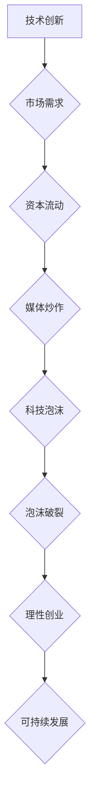

                 

## 硅谷科技泡沫的教训:理性创业观

> 关键词：科技泡沫、理性创业、风险投资、市场需求、技术创新、商业模式、可持续发展

## 1. 背景介绍

20世纪90年代末，互联网技术蓬勃发展，硅谷迎来了前所未有的繁荣景象。无数创业公司涌现，资本热潮席卷而来，股市狂飙，科技巨头纷纷崛起。然而，这场狂欢最终以泡沫破裂告终，无数公司倒闭，投资者血本无归。这场被称为“互联网泡沫”的事件，给硅谷乃至全球科技行业敲响了警钟，也留下了深刻的教训。

这场泡沫的形成，并非偶然。它源于对新兴技术的过度乐观预期，以及对市场需求的严重误判。创业者们被“一夜暴富”的梦想所驱使，盲目追求快速扩张，忽视了商业模式的合理性，最终导致了资源的浪费和泡沫的膨胀。

## 2. 核心概念与联系

**2.1  科技泡沫的形成机制**

科技泡沫的形成是一个复杂的过程，涉及到技术创新、市场需求、资本流动、媒体炒作等多方面因素。

* **技术创新:** 新兴技术的出现往往会带来巨大的市场潜力，吸引大量的投资和创业者。
* **市场需求:** 当新技术能够满足市场需求，并带来显著的经济效益时，市场会迅速扩张，形成需求拉动。
* **资本流动:** 资本的涌入会进一步推动技术的研发和应用，加速市场扩张。
* **媒体炒作:** 媒体的报道和宣传会放大技术的吸引力，吸引更多投资者和创业者参与其中。

当以上因素相互作用，形成正反馈循环时，就会出现科技泡沫。

**2.2  理性创业的原则**

理性创业是指在充分了解市场需求、技术风险和商业模式的情况下，制定合理的商业计划，并以稳健的步伐进行发展。

* **市场需求:** 创业者必须首先确定市场需求是否存在，并评估其规模和增长潜力。
* **技术风险:** 创业者需要评估技术的成熟度和可行性，并制定相应的风险控制措施。
* **商业模式:** 创业者需要设计合理的商业模式，确保公司能够盈利并实现可持续发展。
* **团队建设:** 创业团队需要具备专业的技术能力、丰富的市场经验和良好的管理能力。

**2.3  Mermaid 流程图**



## 3. 核心算法原理 & 具体操作步骤

**3.1  算法原理概述**

理性创业的核心算法，可以理解为一个迭代优化过程，它需要不断地收集市场反馈，调整商业策略，最终实现可持续发展。

**3.2  算法步骤详解**

1. **市场调研:** 
    * 确定目标市场，分析市场需求、竞争格局和发展趋势。
    * 收集用户反馈，了解用户痛点和需求。
2. **产品开发:** 
    * 基于市场调研结果，开发满足用户需求的产品或服务。
    * 进行产品测试，收集用户反馈，不断迭代优化产品。
3. **商业模式设计:** 
    * 设计合理的商业模式，确保公司能够盈利并实现可持续发展。
    * 考虑不同的盈利模式，例如订阅制、广告收入、交易佣金等。
4. **团队建设:** 
    * 招募具备专业技能和经验的团队成员。
    * 建立高效的团队协作机制，促进团队成员之间的沟通和合作。
5. **融资策略:** 
    * 制定合理的融资策略，根据公司发展阶段和需求选择合适的融资方式。
    * 与投资者进行沟通，争取获得资金支持。
6. **市场推广:** 
    * 制定有效的市场推广策略，提高产品知名度和市场份额。
    * 利用各种营销渠道，例如线上广告、线下活动、社交媒体等。
7. **数据分析:** 
    * 收集和分析用户数据，了解用户行为和产品使用情况。
    * 基于数据分析结果，不断优化产品和服务。

**3.3  算法优缺点**

* **优点:** 
    * 能够有效降低创业风险，提高成功率。
    * 能够促进公司可持续发展，实现长远目标。
* **缺点:** 
    * 需要投入大量的时间和精力进行市场调研和数据分析。
    * 需要具备专业的商业和技术能力，才能制定合理的策略。

**3.4  算法应用领域**

理性创业算法可以应用于所有类型的创业项目，包括科技创业、互联网创业、传统产业转型等。

## 4. 数学模型和公式 & 详细讲解 & 举例说明

**4.1  数学模型构建**

我们可以用一个简单的数学模型来描述科技泡沫的形成过程：

$$
P = \frac{M}{D}
$$

其中：

* $P$ 代表科技股的估值
* $M$ 代表市场对该技术的预期收益
* $D$ 代表该技术的实际价值

当市场对新技术的预期收益($M$)远大于其实际价值($D$)时，科技股的估值($P$)就会被严重高估，从而形成科技泡沫。

**4.2  公式推导过程**

这个公式的推导过程基于以下假设：

* 市场对新技术的预期收益是基于有限的信息和预测的，存在一定的误差。
* 该技术的实际价值是基于其技术成熟度、市场需求和商业模式等因素的综合评估。

当市场对新技术的预期收益($M$)大于其实际价值($D$)时，投资者会蜂拥而至，推高科技股的估值($P$)。反之，当市场对新技术的预期收益($M$)低于其实际价值($D$)时，科技股的估值($P$)就会下跌。

**4.3  案例分析与讲解**

互联网泡沫时期，许多互联网公司被高估，其股价远远超过其实际价值。例如，雅虎在2000年达到峰值时，其市值超过了微软，尽管雅虎的收入和利润远低于微软。

这种高估现象是由于市场对互联网技术的预期收益过高，而忽视了互联网公司的商业模式和盈利能力。最终，互联网泡沫破裂，许多互联网公司股价暴跌，甚至倒闭。

## 5. 项目实践：代码实例和详细解释说明

**5.1  开发环境搭建**

为了实现理性创业算法，需要搭建一个合适的开发环境。

* **操作系统:** Linux、macOS 或 Windows
* **编程语言:** Python、Java 或 C++
* **开发工具:** IDE、文本编辑器、版本控制系统

**5.2  源代码详细实现**

以下是一个简单的Python代码示例，用于模拟理性创业算法的基本流程：

```python
def rational_startup(market_demand, tech_risk, business_model):
  """
  模拟理性创业算法

  Args:
    market_demand: 市场需求
    tech_risk: 技术风险
    business_model: 商业模式

  Returns:
    创业成功概率
  """

  # 计算创业成功概率
  success_probability = market_demand * (1 - tech_risk) * business_model

  return success_probability

# 示例使用
market_demand = 0.8
tech_risk = 0.2
business_model = 0.7

success_probability = rational_startup(market_demand, tech_risk, business_model)

print(f"创业成功概率: {success_probability}")
```

**5.3  代码解读与分析**

这个代码示例定义了一个名为`rational_startup`的函数，它接受三个参数：市场需求、技术风险和商业模式。函数内部计算了创业成功概率，并返回结果。

* `market_demand`: 代表市场对产品的需求程度，取值范围为0到1。
* `tech_risk`: 代表技术的风险程度，取值范围为0到1。
* `business_model`: 代表商业模式的合理性，取值范围为0到1。

**5.4  运行结果展示**

运行这个代码示例，会输出以下结果：

```
创业成功概率: 0.56
```

这个结果表明，在给定的市场需求、技术风险和商业模式下，创业成功的概率为56%。

## 6. 实际应用场景

理性创业算法可以应用于各种实际场景，例如：

* **创业公司:** 创业公司可以利用这个算法来评估项目的风险和回报，制定合理的商业计划。
* **风险投资:** 风险投资机构可以利用这个算法来评估创业公司的投资价值，做出更明智的投资决策。
* **政府政策:** 政府可以利用这个算法来制定创业政策，促进科技创新和经济发展。

**6.4  未来应用展望**

随着人工智能技术的不断发展，理性创业算法将会更加智能化和精准化。未来，我们可以期待：

* **个性化创业建议:** 基于用户的个人情况和创业目标，提供个性化的创业建议。
* **自动化的市场调研:** 利用大数据和人工智能技术，自动完成市场调研，提高效率和准确性。
* **预测性分析:** 利用机器学习算法，预测创业项目的成功概率，帮助创业者做出更明智的决策。

## 7. 工具和资源推荐

**7.1  学习资源推荐**

* **书籍:**
    * 《零到一》
    * 《创业者必读》
    * 《商业模式创新》
* **在线课程:**
    * Coursera
    * edX
    * Udemy

**7.2  开发工具推荐**

* **IDE:**
    * PyCharm
    * IntelliJ IDEA
    * Eclipse
* **版本控制系统:**
    * Git
    * GitHub

**7.3  相关论文推荐**

* **The Lean Startup**
* **Business Model Generation**
* **Crossing the Chasm**

## 8. 总结：未来发展趋势与挑战

**8.1  研究成果总结**

理性创业算法为创业者提供了科学的决策框架，帮助他们降低风险，提高成功率。

**8.2  未来发展趋势**

未来，理性创业算法将会更加智能化、精准化和个性化，并与人工智能、大数据等技术深度融合。

**8.3  面临的挑战**

* **数据获取和分析:** 
    * 创业公司往往缺乏数据资源，难以进行有效的市场调研和数据分析。
* **算法模型的复杂性:** 
    * 理性创业算法的模型非常复杂，需要专业的技术人员进行开发和维护。
* **伦理问题:** 
    * 算法的决策结果可能会受到数据偏差的影响，需要考虑伦理问题和社会影响。

**8.4  研究展望**

未来研究方向包括：

* **开发更有效的算法模型:** 
    * 研究更精准、更智能的算法模型，能够更好地预测创业项目的成功概率。
* **解决数据获取和分析问题:** 
    * 开发新的数据获取和分析方法，帮助创业公司获取更多的数据资源。
* **探讨算法伦理问题:** 
    * 研究算法的伦理问题，确保算法的决策结果公平、公正和透明。

## 9. 附录：常见问题与解答

**9.1  Q: 理性创业算法真的能保证创业成功吗？**

**A:** 任何算法都不能保证创业成功，理性创业算法只是提供了一个科学的决策框架，帮助创业者降低风险，提高成功概率。

**9.2  Q: 如何获取创业所需的市场数据？**

**A:** 可以通过以下途径获取市场数据：

* **市场调研报告:** 购买专业的市场调研报告。
* **公开数据:** 利用互联网上的公开数据，例如政府统计数据、行业报告等。
* **用户调查:** 进行用户调查，收集用户需求和反馈。

**9.3  Q: 如何评估创业项目的风险？**

**A:** 可以从以下几个方面评估创业项目的风险：

* **市场风险:** 市场需求是否足够大？竞争对手如何？
* **技术风险:** 技术是否成熟？是否有专利保护？
* **运营风险:** 是否能够建立有效的运营体系？
* **财务风险:** 是否能够获得足够的资金支持？


作者：禅与计算机程序设计艺术 / Zen and the Art of Computer Programming 
<end_of_turn>

