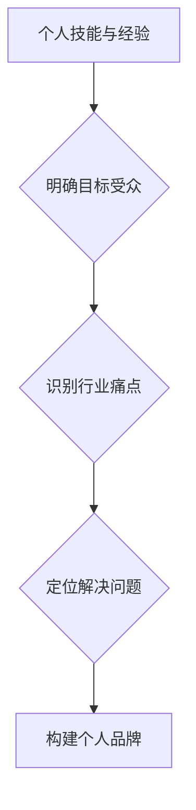

                 

## 确立个人品牌定位：明确你要解决的问题

> 关键词：个人品牌定位、技术领域、问题解决、价值传递、目标受众

### 1. 背景介绍

在当今科技日新月异的时代，个人品牌已成为技术领域不可或缺的一部分。作为一名技术人员，拥有一个清晰的个人品牌定位，能够帮助你脱颖而出，建立专业声誉，吸引更多机会。然而，许多人对个人品牌定位感到困惑，不知道如何确立自己的独特价值，并将其有效地传递给目标受众。

### 2. 核心概念与联系

个人品牌定位的核心在于明确你想要解决的问题，并通过你的技能、经验和知识为目标受众提供价值。

**个人品牌定位流程图:**



**核心概念解释:**

* **个人技能与经验:**  这是你个人在技术领域积累的知识和能力，包括编程语言、框架、工具、项目经验等。
* **目标受众:**  你需要明确你想要服务的对象，例如初学者、企业开发者、研究人员等。
* **行业痛点:**  你需要了解目标受众面临的哪些技术难题，以及他们迫切需要解决的问题。
* **定位解决问题:**  根据你的技能和目标受众的需求，明确你想要解决的具体问题，并将其作为你的个人品牌定位的核心。
* **构建个人品牌:**  通过博客、开源项目、演讲、社交媒体等方式，将你的品牌定位和价值传递给目标受众。

### 3. 核心算法原理 & 具体操作步骤

**3.1 算法原理概述**

个人品牌定位的本质是一种算法，它将你的个人资源与市场需求进行匹配，找到最佳的价值传递路径。

**3.2 算法步骤详解**

1. **自我评估:**  认真分析你的技术技能、经验、兴趣和优势，明确你的核心竞争力。
2. **市场调研:**  深入了解目标受众的需求、痛点和竞争格局，寻找市场空白和机会。
3. **定位确定:**  根据你的技能和市场需求，选择一个具体的技术领域或问题作为你的个人品牌定位。
4. **价值构建:**  围绕你的品牌定位，开发相关内容、项目或服务，为目标受众提供实际价值。
5. **品牌传播:**  通过多种渠道，将你的品牌定位和价值传递给目标受众，建立个人品牌影响力。

**3.3 算法优缺点**

* **优点:**  能够帮助你聚焦目标，提高资源利用效率，建立差异化竞争优势。
* **缺点:**  需要不断迭代和调整，市场环境变化可能会影响品牌定位的有效性。

**3.4 算法应用领域**

个人品牌定位适用于所有技术领域，包括软件开发、数据科学、人工智能、网络安全等。

### 4. 数学模型和公式 & 详细讲解 & 举例说明

**4.1 数学模型构建**

个人品牌定位可以抽象为一个数学模型：

```latex
BrandValue = f(Skills, Experience, MarketDemand, ValueProposition)
```

其中：

* **BrandValue:** 个人品牌价值
* **Skills:** 个人技能和知识
* **Experience:** 个人经验和项目积累
* **MarketDemand:** 市场需求和痛点
* **ValueProposition:**  个人品牌提供的价值主张

**4.2 公式推导过程**

个人品牌价值取决于个人技能、经验、市场需求和价值主张的综合作用。

* **技能和经验:**  是个人品牌的基础，决定了你能解决哪些问题。
* **市场需求:**  是个人品牌定位的导向，你需要解决目标受众迫切需要解决的问题。
* **价值主张:**  是个人品牌的核心竞争力，你需要提供独特的价值，才能脱颖而出。

**4.3 案例分析与讲解**

例如，一位拥有丰富机器学习经验的工程师，可以定位为“帮助企业利用机器学习解决业务问题”的个人品牌。

* **Skills:** 机器学习算法、数据分析、模型开发
* **Experience:**  参与过多个机器学习项目，取得了显著成果
* **MarketDemand:**  企业越来越重视机器学习的应用，需要专业的技术人才
* **ValueProposition:**  提供定制化的机器学习解决方案，帮助企业提高效率和盈利能力

### 5. 项目实践：代码实例和详细解释说明

**5.1 开发环境搭建**

个人品牌定位的实践需要搭建一个合适的开发环境，包括博客平台、社交媒体账号、开源项目仓库等。

**5.2 源代码详细实现**

个人品牌定位的代码实现主要体现在内容创作、项目开发和品牌传播等方面。

* **内容创作:**  可以使用Markdown编辑器编写博客文章，使用Git管理代码仓库，使用Python编写数据分析脚本等。
* **项目开发:**  可以开发开源项目，提供技术解决方案，参与开源社区贡献等。
* **品牌传播:**  可以使用社交媒体平台分享你的作品，参加技术会议演讲，建立个人网站等。

**5.3 代码解读与分析**

代码的解读和分析需要结合具体的项目和技术栈，例如：

* **博客文章:**  需要关注文章结构、内容深度、写作风格等。
* **开源项目:**  需要关注代码质量、文档完善程度、社区活跃度等。
* **品牌传播:**  需要关注内容的传播效果、粉丝增长趋势、品牌影响力等。

**5.4 运行结果展示**

个人品牌定位的运行结果需要通过数据和反馈进行评估，例如：

* **博客文章:**  关注阅读量、评论数、分享量等指标。
* **开源项目:**  关注代码贡献、用户反馈、项目活跃度等指标。
* **品牌传播:**  关注粉丝数量、互动率、品牌知名度等指标。

### 6. 实际应用场景

个人品牌定位在技术领域有着广泛的应用场景，例如：

* **求职:**  清晰的个人品牌定位可以帮助你突出你的优势，吸引招聘者的关注。
* **创业:**  个人品牌定位可以帮助你建立品牌信任，吸引用户和投资人。
* **合作:**  个人品牌定位可以帮助你找到志同道合的合作伙伴，共同发展。

**6.4 未来应用展望**

随着人工智能和虚拟现实技术的不断发展，个人品牌定位将更加个性化、智能化和沉浸式。

### 7. 工具和资源推荐

**7.1 学习资源推荐**

* **书籍:**  《确立个人品牌定位》、《打造个人品牌》
* **网站:**  个人品牌定位网站、技术博客平台
* **课程:**  在线学习平台上的个人品牌定位课程

**7.2 开发工具推荐**

* **博客平台:**  WordPress、Medium、Ghost
* **社交媒体平台:**  Twitter、LinkedIn、GitHub
* **开源项目仓库:**  GitHub、GitLab

**7.3 相关论文推荐**

* **个人品牌定位研究论文:**  可以搜索学术数据库，例如Google Scholar、IEEE Xplore等。

### 8. 总结：未来发展趋势与挑战

**8.1 研究成果总结**

个人品牌定位的研究表明，明确你的目标受众、解决他们的问题，并提供独特的价值，是建立个人品牌成功的关键。

**8.2 未来发展趋势**

个人品牌定位将更加注重个性化、智能化和沉浸式体验。

* **个性化:**  个人品牌定位将更加注重用户的个性需求和喜好。
* **智能化:**  人工智能将帮助用户更好地了解自己的优势和目标受众，并提供个性化的品牌定位建议。
* **沉浸式体验:**  虚拟现实和增强现实技术将为用户提供更加沉浸式的品牌体验。

**8.3 面临的挑战**

个人品牌定位也面临一些挑战，例如：

* **信息过载:**  互联网信息爆炸，如何有效地传递你的品牌信息是一个挑战。
* **竞争激烈:**  技术领域竞争激烈，如何脱颖而出是一个挑战。
* **持续更新:**  技术发展迅速，你需要不断更新你的技能和知识，才能保持品牌竞争力。

**8.4 研究展望**

未来研究可以关注以下几个方面：

* **个性化品牌定位算法:**  开发更精准的算法，帮助用户找到最适合自己的品牌定位。
* **智能品牌传播平台:**  构建智能化的品牌传播平台，帮助用户更有效地传递品牌信息。
* **沉浸式品牌体验技术:**  探索虚拟现实和增强现实技术在品牌定位中的应用。

### 9. 附录：常见问题与解答

**常见问题:**

* 如何确定我的目标受众？
* 如何找到我的核心竞争力？
* 如何构建我的个人品牌价值？

**解答:**

* **目标受众:**  可以通过市场调研、用户分析等方式确定你的目标受众。
* **核心竞争力:**  可以通过自我评估、技能测试、项目经验分析等方式找到你的核心竞争力。
* **个人品牌价值:**  可以通过提供独特的价值主张、解决目标受众的痛点、建立品牌信任等方式构建你的个人品牌价值。


作者：禅与计算机程序设计艺术 / Zen and the Art of Computer Programming 
<end_of_turn>

