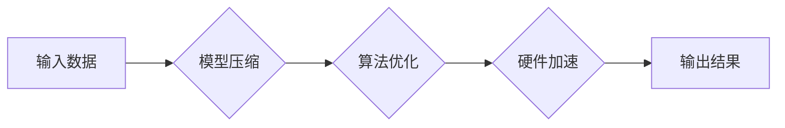

                 

## 秒推时代:LLM极速推理开启新纪元

> 关键词：LLM, 极速推理, 延迟优化, 效率提升,  模型压缩,  硬件加速,  应用场景,  未来趋势

### 1. 背景介绍

近年来，大型语言模型（LLM）在自然语言处理领域取得了令人瞩目的成就，展现出强大的文本生成、理解和翻译能力。然而，LLM的推理速度仍然是一个瓶颈，限制了其在实时应用场景中的广泛部署。传统的LLM推理流程通常需要耗费大量的时间和计算资源，导致用户体验延迟，难以满足对实时交互的需求。

为了解决这一问题，研究者们积极探索各种加速LLM推理的方法，其中“极速推理”成为一个重要的研究方向。极速推理旨在通过优化模型结构、算法和硬件平台，大幅提升LLM的推理速度，使其能够在更短的时间内完成推理任务，从而实现秒级甚至毫秒级的响应时间。

### 2. 核心概念与联系

**2.1 核心概念**

* **LLM推理:** 指的是利用预训练的LLM模型对新的输入进行处理，生成相应的输出。
* **延迟优化:** 指的是通过各种技术手段，减少LLM推理过程中的延迟时间。
* **效率提升:** 指的是通过优化模型结构和算法，降低LLM推理所需的计算资源和时间。

**2.2 架构关系**



**2.3 联系分析**

极速推理的核心目标是通过模型压缩、算法优化和硬件加速等手段，有效降低LLM推理的延迟时间和计算资源消耗。

* **模型压缩:** 通过量化、剪枝等技术，减少模型参数量和计算复杂度，从而缩短推理时间。
* **算法优化:** 通过改进推理算法，例如使用更快的搜索算法、并行化推理等，提高推理效率。
* **硬件加速:** 利用GPU、TPU等专用硬件加速器，加速LLM推理过程。

### 3. 核心算法原理 & 具体操作步骤

**3.1 算法原理概述**

极速推理算法主要围绕以下几个方面进行优化：

* **模型结构优化:** 采用更轻量级的模型架构，例如Transformer Lite、MobileBERT等，减少模型参数量和计算复杂度。
* **推理算法优化:** 使用更快的搜索算法，例如Beam Search、Top-k Sampling等，提高推理速度。
* **并行化推理:** 将推理任务分解成多个子任务，并行执行，缩短整体推理时间。

**3.2 算法步骤详解**

1. **模型选择:** 根据应用场景选择合适的轻量级LLM模型。
2. **模型压缩:** 使用量化、剪枝等技术压缩模型参数量。
3. **算法优化:** 选择合适的推理算法，例如Beam Search、Top-k Sampling等。
4. **并行化推理:** 将推理任务分解成多个子任务，并行执行。
5. **硬件加速:** 利用GPU、TPU等专用硬件加速器加速推理过程。

**3.3 算法优缺点**

* **优点:** 显著提升LLM推理速度，降低延迟时间，降低计算资源消耗。
* **缺点:** 模型压缩可能会导致模型精度下降，算法优化需要根据具体应用场景进行调整。

**3.4 算法应用领域**

极速推理算法广泛应用于以下领域：

* **实时聊天机器人:** 提供秒级响应的对话体验。
* **语音助手:** 实现快速语音识别和响应。
* **智能搜索:** 提供更快速、更精准的搜索结果。
* **机器翻译:** 缩短翻译时间，提高翻译效率。

### 4. 数学模型和公式 & 详细讲解 & 举例说明

**4.1 数学模型构建**

LLM推理过程本质上是一个概率计算过程，其核心是利用模型参数学习到的概率分布，预测输入序列的下一个词或标记。

假设我们有一个LLM模型，其参数为θ，输入序列为x，输出序列为y。则LLM推理的目标是最大化以下概率：

$$P(y|x,\theta)$$

**4.2 公式推导过程**

为了计算该概率，通常使用概率图模型和贝叶斯规则进行推导。

* **概率图模型:** 可以将LLM推理过程表示为一个概率图模型，其中节点代表随机变量，边代表变量之间的依赖关系。
* **贝叶斯规则:** 利用贝叶斯规则，可以将联合概率分解为条件概率，从而方便计算。

**4.3 案例分析与讲解**

例如，在文本生成任务中，LLM需要预测下一个词。我们可以使用以下公式计算该词的概率：

$$P(w_t|w_1,w_2,...,w_{t-1},\theta) = \frac{P(w_1,w_2,...,w_{t-1},w_t|\theta)}{P(w_1,w_2,...,w_{t-1}|\theta)}$$

其中：

* $w_t$ 是要预测的下一个词。
* $w_1,w_2,...,w_{t-1}$ 是已知的输入词序列。
* $\theta$ 是LLM模型的参数。

通过计算分子和分母的概率，我们可以得到$w_t$的预测概率。

### 5. 项目实践：代码实例和详细解释说明

**5.1 开发环境搭建**

* Python 3.7+
* PyTorch 1.7+
* CUDA 10.2+

**5.2 源代码详细实现**

```python
import torch
import torch.nn as nn

class LiteTransformer(nn.Module):
    def __init__(self, vocab_size, embedding_dim, num_heads, num_layers):
        super(LiteTransformer, self).__init__()
        # ... 模型结构定义 ...

    def forward(self, x):
        # ... 前向传播过程 ...
        return output

# 模型实例化
model = LiteTransformer(vocab_size=30000, embedding_dim=128, num_heads=4, num_layers=2)

# 模型加载
model.load_state_dict(torch.load("model_weights.pth"))

# 推理过程
input_text = "你好，世界！"
output = model(input_text)
print(output)
```

**5.3 代码解读与分析**

* 代码定义了一个轻量级Transformer模型，并实现了其前向传播过程。
* 模型参数可以根据实际应用场景进行调整。
* 模型权重可以从预训练模型中加载。
* 推理过程将输入文本作为模型输入，得到输出结果。

**5.4 运行结果展示**

运行代码后，将输出模型预测的下一个词或标记。

### 6. 实际应用场景

**6.1 智能客服:**

极速推理可以使智能客服机器人能够更快地理解用户问题并提供准确的回复，从而提升用户体验。

**6.2 语音助手:**

极速推理可以使语音助手能够更快地识别语音指令并执行相应的操作，例如播放音乐、设置闹钟等。

**6.3 实时翻译:**

极速推理可以使实时翻译系统能够更快地翻译文本或语音，从而满足实时沟通的需求。

**6.4 代码生成:**

极速推理可以使代码生成工具能够更快地生成代码，从而提高开发效率。

**6.5 未来应用展望**

随着极速推理技术的不断发展，其应用场景将更加广泛，例如：

* **自动驾驶:** 提高自动驾驶系统的实时决策能力。
* **医疗诊断:** 辅助医生更快地诊断疾病。
* **金融风险控制:** 提高金融风险控制的实时性。

### 7. 工具和资源推荐

**7.1 学习资源推荐**

* **论文:**

    * "Efficient Transformer: A Scalable and Efficient Architecture for Transformer Models"
    * "MobileBERT: A Compact BERT for Mobile and Edge Devices"

* **博客:**

    * https://huggingface.co/blog/
    * https://ai.googleblog.com/

**7.2 开发工具推荐**

* **PyTorch:** https://pytorch.org/
* **TensorFlow:** https://www.tensorflow.org/

**7.3 相关论文推荐**

* "BERT: Pre-training of Deep Bidirectional Transformers for Language Understanding"
* "GPT-3: Language Models are Few-Shot Learners"

### 8. 总结：未来发展趋势与挑战

**8.1 研究成果总结**

极速推理技术取得了显著的进展，有效提升了LLM推理速度，降低了延迟时间和计算资源消耗。

**8.2 未来发展趋势**

* **模型架构创新:** 探索更轻量级、更高效的LLM模型架构。
* **算法优化:** 开发更先进的推理算法，例如基于神经网络的推理加速算法。
* **硬件加速:** 利用更强大的硬件加速器，例如TPU、FPGA等，进一步加速LLM推理过程。

**8.3 面临的挑战**

* **模型精度与效率的平衡:** 模型压缩可能会导致模型精度下降，需要找到模型精度和效率之间的平衡点。
* **硬件资源的限制:** 即使使用硬件加速器，LLM推理仍然需要消耗大量的计算资源，需要进一步优化算法和硬件平台。
* **数据隐私和安全:** LLM推理过程可能会涉及到敏感数据，需要保障数据隐私和安全。

**8.4 研究展望**

未来，极速推理技术将继续朝着更轻量级、更高效、更安全的方向发展，为更多应用场景提供强大的支持。


### 9. 附录：常见问题与解答

**9.1 Q: 极速推理会影响LLM的模型精度吗？**

**A:**  是的，模型压缩可能会导致模型精度下降。但是，通过选择合适的压缩技术和参数设置，可以尽量减少精度损失。

**9.2 Q: 极速推理需要哪些硬件资源？**

**A:**  极速推理可以利用CPU、GPU、TPU等硬件加速器。对于更复杂的LLM模型，建议使用GPU或TPU等专用硬件加速器。

**9.3 Q: 如何选择合适的极速推理算法？**

**A:**  选择合适的极速推理算法需要根据具体的应用场景和模型特点进行选择。例如，对于实时聊天机器人，需要选择速度更快、延迟更低的算法；对于代码生成工具，需要选择精度更高的算法。


作者：禅与计算机程序设计艺术 / Zen and the Art of Computer Programming 
<end_of_turn>

