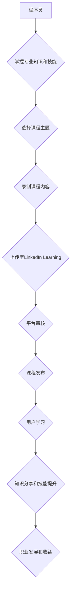

                 

## 程序员如何利用LinkedIn Learning发布课程

> 关键词：LinkedIn Learning, 在线课程, 程序员, 教学, 知识分享, 职业发展, 技能提升

### 1. 背景介绍

在当今数字化时代，技术人才的需求日益增长，程序员作为科技发展的重要力量，拥有着丰富的专业知识和技能。如何将这些宝贵的经验转化为有价值的资源，并与更多人分享，成为许多程序员所思考的问题。LinkedIn Learning作为全球领先的在线学习平台，为程序员提供了绝佳的平台，让他们可以将自己的专业知识和技能以课程的形式发布，并获得收益和认可。

### 2. 核心概念与联系

LinkedIn Learning是一个面向专业人士的在线学习平台，提供涵盖广泛领域的课程，包括编程、数据科学、设计、营销等。程序员可以通过发布课程，将自己的专业知识和技能分享给全球用户，并获得平台提供的收益和认可。

**核心概念：**

* **在线课程:**  以视频、音频、文本等多种形式呈现的知识学习内容。
* **知识分享:**  将自身掌握的知识和技能传递给他人，促进知识传播和学习。
* **职业发展:**  通过发布课程提升个人知名度和影响力，拓展职业发展机会。
* **技能提升:**  学习其他领域的知识和技能，拓宽自身知识面，提升竞争力。

**架构流程图：**



### 3. 核心算法原理 & 具体操作步骤

**3.1 算法原理概述**

发布课程的核心算法原理在于内容创作、平台运营和用户互动。

* **内容创作:**  程序员需要根据自身专业领域和目标用户群体，精心策划课程主题、内容结构和教学方式，确保课程内容实用、易懂、有价值。
* **平台运营:**  LinkedIn Learning提供完善的课程发布、管理和推广体系，帮助程序员将课程发布到目标用户面前，并进行数据分析和用户反馈收集。
* **用户互动:**  课程发布后，程序员需要积极与用户互动，解答疑问、提供帮助，并根据用户反馈不断优化课程内容。

**3.2 算法步骤详解**

1. **主题选择:**  根据自身专业领域和市场需求，选择一个有价值、有市场前景的课程主题。
2. **内容规划:**  制定详细的课程大纲，包括课程目标、学习内容、教学方法等。
3. **录制课程:**  使用专业的录制设备和软件，录制高质量的课程视频。
4. **编辑剪辑:**  对录制好的视频进行剪辑、配音、字幕等后期制作，提升课程质量。
5. **上传至LinkedIn Learning:**  按照平台要求，上传课程内容、封面图片、课程描述等信息。
6. **平台审核:**  LinkedIn Learning会对课程内容进行审核，确保其符合平台规范和质量要求。
7. **课程发布:**  审核通过后，课程即可发布到平台，供用户学习。
8. **用户互动:**  积极回复用户评论和提问，解答疑问，提供帮助。
9. **课程优化:**  根据用户反馈和数据分析，不断优化课程内容和教学方式。

**3.3 算法优缺点**

**优点:**

* **知识分享:**  帮助程序员将自己的专业知识和技能分享给更多人。
* **职业发展:**  提升个人知名度和影响力，拓展职业发展机会。
* **技能提升:**  学习其他领域的知识和技能，拓宽自身知识面，提升竞争力。
* **收益获得:**  通过课程发布获得平台提供的收益。

**缺点:**

* **时间投入:**  录制和制作课程需要投入大量的时间和精力。
* **内容质量:**  课程内容需要高质量，才能吸引用户学习。
* **平台竞争:**  LinkedIn Learning上有众多优秀的课程，需要不断提升自身竞争力。

**3.4 算法应用领域**

* **编程语言学习:**  程序员可以发布针对特定编程语言的课程，帮助初学者快速入门。
* **软件开发技巧:**  分享软件开发经验和技巧，帮助程序员提升开发效率。
* **技术趋势解读:**  解读最新的技术趋势和发展方向，帮助程序员掌握行业前沿知识。
* **项目实战案例:**  分享项目实战经验和案例，帮助程序员学习解决实际问题的方法。

### 4. 数学模型和公式 & 详细讲解 & 举例说明

**4.1 数学模型构建**

课程发布的成功与否可以看作是一个数学模型，其中涉及到多个变量和因素，例如课程质量、用户需求、平台推广力度等。

**4.2 公式推导过程**

我们可以用以下公式来表示课程发布的成功度：

```latex
成功度 = f(课程质量, 用户需求, 平台推广力度)
```

其中：

* 课程质量：指课程内容的实用性、易懂性和价值性。
* 用户需求：指目标用户对课程主题的兴趣和学习需求。
* 平台推广力度：指平台对课程的宣传和推广力度。

**4.3 案例分析与讲解**

假设有两个程序员发布了关于Python编程的课程，课程质量相同，但平台推广力度不同。

* 程序员A的课程平台推广力度较大，吸引了大量用户学习，课程成功度较高。
* 程序员B的课程平台推广力度较小，用户学习量较少，课程成功度较低。

从案例分析可以看出，平台推广力度对课程发布的成功度有重要影响。

### 5. 项目实践：代码实例和详细解释说明

**5.1 开发环境搭建**

发布课程需要准备以下开发环境：

* **电脑:**  配置合理的电脑硬件，确保录制和编辑视频流畅。
* **录制设备:**  使用专业的摄像头和麦克风，录制高质量的视频和音频。
* **编辑软件:**  使用专业的视频编辑软件，对录制好的视频进行剪辑、配音、字幕等后期制作。
* **网络连接:**  稳定的网络连接，确保视频上传和下载顺利。

**5.2 源代码详细实现**

由于课程发布主要涉及到视频录制和编辑，因此代码实现主要集中在视频录制和编辑软件的配置和使用。

**5.3 代码解读与分析**

视频录制和编辑软件的配置和使用需要根据具体软件的特性进行操作。一般来说，需要设置录制分辨率、帧率、音频采样率等参数，并选择合适的剪辑、配音、字幕等功能。

**5.4 运行结果展示**

录制和编辑完成后，可以生成高质量的课程视频，并上传到LinkedIn Learning平台进行发布。

### 6. 实际应用场景

程序员可以通过发布课程，在以下场景中获得实际应用：

* **个人品牌建设:**  提升个人知名度和影响力，建立个人品牌。
* **职业发展:**  拓展职业发展机会，获得更高的薪资和职位。
* **知识传播:**  将自己的专业知识和技能分享给更多人，促进知识传播和学习。
* **社区建设:**  与其他程序员建立联系，共同学习和进步。

**6.4 未来应用展望**

随着在线学习平台的不断发展，程序员发布课程的应用场景将会更加广泛，例如：

* **虚拟现实和增强现实课程:**  利用虚拟现实和增强现实技术，打造更加沉浸式的学习体验。
* **个性化学习路径:**  根据用户的学习进度和需求，提供个性化的学习路径和课程推荐。
* **人工智能辅助教学:**  利用人工智能技术，提供更加智能化的学习辅助和个性化反馈。

### 7. 工具和资源推荐

**7.1 学习资源推荐**

* **LinkedIn Learning:**  https://www.linkedin.com/learning/
* **Coursera:**  https://www.coursera.org/
* **Udemy:**  https://www.udemy.com/

**7.2 开发工具推荐**

* **OBS Studio:**  https://obsproject.com/
* **Camtasia:**  https://www.techsmith.com/camtasia.html
* **Adobe Premiere Pro:**  https://www.adobe.com/products/premiere.html

**7.3 相关论文推荐**

* **The Impact of Online Learning on Student Achievement and Engagement:**  https://eric.ed.gov/?id=EJ1138147
* **A Systematic Review of the Effectiveness of Online Learning:**  https://www.researchgate.net/publication/328943333_A_Systematic_Review_of_the_Effectiveness_of_Online_Learning

### 8. 总结：未来发展趋势与挑战

**8.1 研究成果总结**

程序员利用LinkedIn Learning发布课程，可以有效地将专业知识和技能分享给更多人，并获得收益和认可。

**8.2 未来发展趋势**

在线学习平台将继续发展，程序员发布课程的应用场景将会更加广泛，例如虚拟现实和增强现实课程、个性化学习路径、人工智能辅助教学等。

**8.3 面临的挑战**

* **内容质量:**  需要不断提升课程内容的质量和价值，才能吸引用户学习。
* **平台竞争:**  需要不断提升自身竞争力，才能在平台上脱颖而出。
* **技术更新:**  需要不断学习新的技术和工具，才能跟上行业发展步伐。

**8.4 研究展望**

未来研究可以关注以下方面：

* **人工智能辅助课程创作:**  利用人工智能技术，帮助程序员更高效地创作课程内容。
* **个性化学习推荐:**  根据用户的学习需求和进度，提供更加个性化的课程推荐。
* **虚拟现实和增强现实课程开发:**  利用虚拟现实和增强现实技术，打造更加沉浸式的学习体验。

### 9. 附录：常见问题与解答

**常见问题:**

* **如何选择课程主题?**

  建议选择自己熟悉的领域，并且有市场需求的主题。

* **如何录制高质量的课程视频?**

  使用专业的录制设备和软件，并注意光线、声音和画面质量。

* **如何上传课程到LinkedIn Learning?**

  按照平台的指导步骤进行操作，并确保课程内容符合平台规范。

* **如何推广我的课程?**

  可以通过社交媒体、博客等渠道推广课程，并积极与用户互动。


作者：禅与计算机程序设计艺术 / Zen and the Art of Computer Programming 
<end_of_turn>

