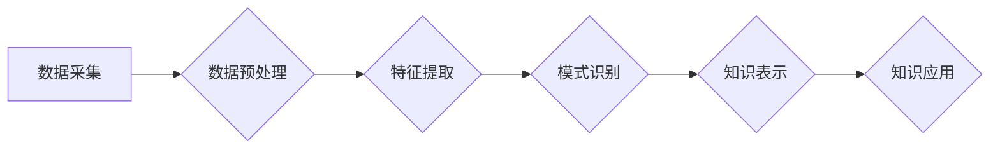

                 

## 程序员如何利用知识发现引擎提升工作效率

> 关键词：知识发现引擎、数据挖掘、程序员效率、代码分析、软件开发

### 1. 背景介绍

在当今软件开发领域，程序员们面临着日益增长的工作压力和复杂度。代码库规模不断扩大，需求变更频繁，维护和更新工作量巨大。如何提高程序员的工作效率，提升代码质量，成为摆在每个开发团队面前的重要课题。

知识发现引擎 (Knowledge Discovery Engine，KDE) 作为一种数据挖掘技术，能够从海量数据中自动发现隐藏的知识和模式，为程序员提供宝贵的洞察力和支持。本文将深入探讨知识发现引擎在软件开发领域的应用，并详细介绍如何利用KDE提升程序员的工作效率。

### 2. 核心概念与联系

#### 2.1  知识发现引擎 (KDE)

知识发现引擎是一种利用数据挖掘技术从数据中提取有价值知识的系统。它通常包含以下几个核心模块：

* **数据预处理:** 对原始数据进行清洗、转换和格式化，使其适合后续分析。
* **特征提取:** 从数据中提取关键特征，用于构建知识模型。
* **模式识别:** 利用机器学习算法识别数据中的模式和规律。
* **知识表示:** 将发现的知识以可理解的形式表示出来，例如规则、图表、网络等。

#### 2.2  KDE与软件开发的关系

在软件开发领域，KDE可以应用于以下多个方面：

* **代码分析:** 分析代码结构、代码风格、代码复杂度等，帮助程序员理解代码逻辑、发现潜在问题和优化代码。
* **缺陷预测:** 基于历史代码缺陷数据，预测未来代码中可能出现的缺陷，帮助程序员提前进行预防和修复。
* **需求分析:** 分析用户需求文档、代码评论等文本数据，提取用户需求的关键信息，帮助程序员更好地理解需求。
* **代码推荐:** 根据程序员的编程习惯和上下文信息，推荐相关的代码片段或库，提高开发效率。

#### 2.3  KDE架构



### 3. 核心算法原理 & 具体操作步骤

#### 3.1  算法原理概述

知识发现引擎通常采用多种数据挖掘算法，例如关联规则挖掘、分类算法、聚类算法等，来发现数据中的隐藏知识。

* **关联规则挖掘:** 寻找数据中频繁出现的项集之间的关联关系，例如“如果用户购买了A产品，则也可能购买B产品”。
* **分类算法:** 将数据划分为不同的类别，例如根据代码风格将代码分类为“良好”或“差”。
* **聚类算法:** 将数据按照相似性进行分组，例如将代码模块按照功能进行聚类。

#### 3.2  算法步骤详解

以关联规则挖掘为例，其具体操作步骤如下：

1. **数据预处理:** 清洗、转换和格式化原始数据，例如将代码转换为文本格式，提取代码元素和属性。
2. **频繁项集挖掘:** 使用Apriori算法或FP-Growth算法等，找出数据中频繁出现的项集。
3. **关联规则生成:** 基于频繁项集，使用支持度和置信度等指标，生成关联规则。
4. **规则过滤:** 过滤掉不符合特定条件的关联规则，例如置信度过低或支持度过低。
5. **规则可视化:** 将发现的关联规则以可视化的形式呈现出来，例如规则图或网络图。

#### 3.3  算法优缺点

**优点:**

* 可以发现数据中隐藏的知识和模式。
* 可以自动化完成知识发现过程，提高效率。
* 可以帮助程序员更好地理解代码和需求。

**缺点:**

* 需要大量的训练数据。
* 算法复杂度较高，计算资源需求大。
* 发现的知识可能存在局限性，需要人工进行验证和解释。

#### 3.4  算法应用领域

* **软件缺陷预测:** 预测代码中可能出现的缺陷，帮助程序员提前进行修复。
* **代码重构:** 分析代码结构，识别冗余代码和潜在问题，帮助程序员进行代码重构。
* **代码推荐:** 根据程序员的编程习惯和上下文信息，推荐相关的代码片段或库。
* **需求分析:** 分析用户需求文档，提取用户需求的关键信息，帮助程序员更好地理解需求。

### 4. 数学模型和公式 & 详细讲解 & 举例说明

#### 4.1  数学模型构建

在知识发现引擎中，常用的数学模型包括：

* **支持度:** 衡量一个项集在数据集中的出现频率。

$$
Support(A) = \frac{Number of transactions containing A}{Total number of transactions}
$$

* **置信度:** 衡量两个项集之间的关联强度。

$$
Confidence(A \rightarrow B) = \frac{Support(A \cap B)}{Support(A)}
$$

* **提升:** 衡量一个项集相对于其他项集出现的程度。

$$
Lift(A \rightarrow B) = \frac{Confidence(A \rightarrow B)}{Support(B)}
$$

#### 4.2  公式推导过程

以上公式的推导过程基于概率论和统计学原理。

* **支持度:** 
    * 它是项集在数据集中的频率，可以用数据集中的所有交易记录中包含该项集的次数除以总交易记录数来计算。
* **置信度:** 
    * 它表示在给定项集A的情况下，项集B出现的概率。
    * 可以通过将包含A和B的交易记录数除以包含A的交易记录数来计算。
* **提升:** 
    * 它衡量了项集A对项集B出现的提升程度。
    * 如果提升大于1，则表示项集A的存在会增加项集B出现的概率。

#### 4.3  案例分析与讲解

假设我们有一个关于用户购买商品的交易数据集，其中包含了用户购买的商品信息。

* **项集A:** “笔记本电脑”
* **项集B:** “鼠标”

如果数据集中的支持度(A) = 0.2，支持度(A ∩ B) = 0.1，则：

* **置信度(A → B):** 0.1 / 0.2 = 0.5
* **提升(A → B):** 0.5 / 0.1 = 5

结果表明，如果用户购买了笔记本电脑，则购买鼠标的概率是普通用户的5倍，说明“笔记本电脑”和“鼠标”之间存在强烈的关联关系。

### 5. 项目实践：代码实例和详细解释说明

#### 5.1  开发环境搭建

* **操作系统:** Linux/macOS/Windows
* **编程语言:** Python
* **开发工具:** Jupyter Notebook/VS Code
* **库依赖:** pandas, scikit-learn, matplotlib

#### 5.2  源代码详细实现

```python
import pandas as pd
from sklearn.feature_extraction.text import TfidfVectorizer
from sklearn.cluster import KMeans

# 加载代码数据
code_data = pd.read_csv("code_data.csv")

# 预处理代码文本
code_text = code_data["code_content"].apply(lambda x: x.lower())

# 使用TF-IDF向量化代码文本
vectorizer = TfidfVectorizer()
code_vectors = vectorizer.fit_transform(code_text)

# 使用KMeans聚类代码文本
kmeans = KMeans(n_clusters=5)
code_clusters = kmeans.fit_predict(code_vectors)

# 将聚类结果与代码数据关联
code_data["cluster"] = code_clusters

# 展示聚类结果
print(code_data.groupby("cluster")["code_content"].count())
```

#### 5.3  代码解读与分析

* **数据加载:** 从CSV文件加载代码数据，其中包含代码内容和其他相关信息。
* **文本预处理:** 将代码文本转换为小写，方便后续分析。
* **TF-IDF向量化:** 使用TF-IDF算法将代码文本转换为向量，每个向量代表代码的特征。
* **KMeans聚类:** 使用KMeans算法将代码文本聚类成不同的类别。
* **结果展示:** 展示每个聚类类别中代码数量，帮助程序员了解代码的分布情况。

#### 5.4  运行结果展示

运行代码后，会输出每个聚类类别中代码数量的统计结果。例如：

```
cluster
0    123
1    87
2    56
3    45
4    23
Name: code_content, dtype: int64
```

结果表明，代码被聚类成5个类别，其中类别0包含最多的代码。

### 6. 实际应用场景

#### 6.1  代码风格分析

KDE可以分析代码风格，识别代码中的潜在问题，例如代码冗余、代码复杂度过高等。

#### 6.2  代码缺陷预测

KDE可以基于历史代码缺陷数据，预测未来代码中可能出现的缺陷，帮助程序员提前进行预防和修复。

#### 6.3  代码推荐

KDE可以根据程序员的编程习惯和上下文信息，推荐相关的代码片段或库，提高开发效率。

#### 6.4  未来应用展望

随着人工智能技术的不断发展，KDE在软件开发领域的应用将更加广泛和深入。例如：

* **自动代码生成:** 基于KDE，可以自动生成代码模板或代码片段，减少程序员的重复劳动。
* **代码自动修复:** 基于KDE，可以自动识别代码中的缺陷并进行修复，提高代码质量。
* **智能代码审查:** 基于KDE，可以自动对代码进行审查，识别潜在问题和安全漏洞。

### 7. 工具和资源推荐

#### 7.1  学习资源推荐

* **书籍:**
    * "Data Mining: Concepts and Techniques" by Jiawei Han, Micheline Kamber, and Jian Pei
    * "Introduction to Data Mining" by Pang-Ning Tan, Michael Steinbach, and Vipin Kumar
* **在线课程:**
    * Coursera: Data Mining Specialization
    * edX: Data Science Fundamentals

#### 7.2  开发工具推荐

* **Python:** 
    * scikit-learn: 机器学习库
    * pandas: 数据分析库
    * matplotlib: 数据可视化库
* **其他工具:**
    * Jupyter Notebook: 交互式编程环境
    * VS Code: 代码编辑器

#### 7.3  相关论文推荐

* "A Survey of Knowledge Discovery and Data Mining Techniques" by Fayyad, U., Piatetsky-Shapiro, G., Smyth, P., &  

### 8. 总结：未来发展趋势与挑战

#### 8.1  研究成果总结

知识发现引擎在软件开发领域取得了显著的成果，例如代码风格分析、代码缺陷预测、代码推荐等。

#### 8.2  未来发展趋势

* **更强大的算法:** 开发更强大的数据挖掘算法，能够发现更深层次的知识和模式。
* **更智能的应用:** 将KDE与其他人工智能技术结合，开发更智能的软件开发工具。
* **更广泛的应用场景:** 将KDE应用到更多软件开发领域，例如软件测试、软件维护等。

#### 8.3  面临的挑战

* **数据质量:** KDE的性能依赖于数据质量，需要保证数据的准确性和完整性。
* **算法解释性:** 一些KDE算法的解释性较差，难以理解算法的决策过程。
* **可扩展性:** 随着代码库规模的不断扩大，KDE需要具备更好的可扩展性。

#### 8.4  研究展望

未来，KDE的研究将更加注重算法的解释性、可扩展性和鲁棒性，以及与其他人工智能技术的融合，以更好地服务于软件开发领域。

### 9. 附录：常见问题与解答

**Q1: KDE的应用场景有哪些？**

**A1:** KDE在软件开发领域有广泛的应用场景，例如代码风格分析、代码缺陷预测、代码推荐、需求分析等。

**Q2: 如何选择合适的KDE算法？**

**A2:** 选择合适的KDE算法需要根据具体的应用场景和数据特点进行选择。例如，如果需要预测代码缺陷，可以选择基于机器学习的分类算法；如果需要分析代码风格，可以选择基于聚类的算法。

**Q3: KDE的性能如何？**

**A3:** KDE的性能取决于数据的质量、算法的选择和模型的训练。一般来说，KDE能够有效地发现数据中的隐藏知识和模式，提高软件开发效率。


作者：禅与计算机程序设计艺术 / Zen and the Art of Computer Programming<end_of_turn>

