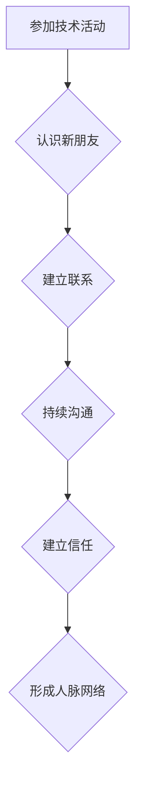

                 

## 程序员如何建立人脉网络

> 关键词：程序员人脉，技术社区，线上线下活动，网络平台，价值交换，专业技能，个人品牌，持续沟通

### 1. 背景介绍

在当今科技日新月异的时代，程序员作为数字世界的关键力量，需要不断学习新技术、拓展知识面，并与同行交流合作。人脉网络对于程序员的职业发展至关重要，它可以帮助程序员获得新的工作机会、学习行业最新动态、获得技术支持，甚至找到商业合作伙伴。然而，许多程序员对如何建立和维护人脉网络感到困惑，认为这与他们的技术工作无关。

事实上，人脉网络的建立并非仅仅是社交活动，而是一种基于价值交换、长期互惠的合作关系。程序员可以通过分享自己的技术经验、参与行业活动、积极融入技术社区，建立起一个强大的支持网络，从而推动自己的职业发展。

### 2. 核心概念与联系

#### 2.1 人脉网络的概念

人脉网络是指一个程序员与其他专业人士、同行、潜在雇主、客户等建立的联系网络。它是一个动态的系统，需要持续的维护和拓展。

#### 2.2 人脉网络的价值

* **职业发展:** 人脉网络可以为程序员提供新的工作机会、提升薪资待遇、获得职业指导等。
* **技术交流:** 通过与同行交流，程序员可以学习新技术、解决技术难题、获得灵感和启发。
* **行业资讯:** 人脉网络可以帮助程序员了解行业最新动态、趋势和发展方向。
* **商业合作:** 人脉网络可以为程序员提供商业合作机会，例如寻找合作伙伴、开发新产品等。

#### 2.3 人脉网络的构建

人脉网络的构建是一个循序渐进的过程，需要程序员付出时间和精力。

**Mermaid 流程图**



### 3. 核心算法原理 & 具体操作步骤

#### 3.1 算法原理概述

建立人脉网络的核心算法可以概括为“价值交换”和“持续沟通”。程序员需要提供有价值的信息和资源，并与他人建立真诚的联系，才能构建起一个牢固的人脉网络。

#### 3.2 算法步骤详解

1. **明确目标:** 程序员需要明确自己建立人脉网络的目标，例如寻找新的工作机会、学习新技术、拓展业务范围等。
2. **寻找目标人群:** 程序员需要确定自己想要建立联系的人群，例如同行、潜在雇主、行业专家等。
3. **参与技术活动:** 参加技术会议、研讨会、沙龙等活动，可以帮助程序员认识新朋友，拓展人脉。
4. **线上线下互动:** 利用社交媒体平台、技术论坛、在线社区等，与其他程序员进行交流互动，分享技术经验，建立联系。
5. **提供价值:** 程序员需要提供有价值的信息和资源，例如撰写技术博客文章、分享开源代码、解答技术问题等，以建立自己的专业形象和影响力。
6. **持续沟通:** 定期与人脉保持联系，例如发送邮件、参加线上活动、约见面等，才能维持人脉关系的活跃度。

#### 3.3 算法优缺点

* **优点:** 
    * 能够有效拓展人脉，获得新的职业机会和技术支持。
    * 促进技术交流和学习，提升个人专业技能。
    * 帮助程序员建立个人品牌，提升行业影响力。
* **缺点:** 
    * 需要投入时间和精力，持续维护人脉关系。
    * 并非所有的人脉关系都能带来实际的价值。
    * 需要注意人脉关系的平衡，避免过度依赖特定的人脉。

#### 3.4 算法应用领域

* **软件开发:** 程序员可以通过人脉网络获得新的工作机会、学习新技术、解决技术难题。
* **创业:** 程序员可以通过人脉网络寻找合作伙伴、获得投资、拓展市场。
* **技术咨询:** 程序员可以通过人脉网络获得技术咨询项目，提供专业服务。

### 4. 数学模型和公式 & 详细讲解 & 举例说明

#### 4.1 数学模型构建

人脉网络的规模和价值可以用以下数学模型来表示：

* **人脉规模:** N =  ∑(A_i * B_i)
    * N: 人脉网络规模
    * A_i:  第 i 个节点的连接度 (连接的节点数量)
    * B_i: 第 i 个节点的价值 (例如专业技能、资源、影响力)

* **人脉价值:** V = ∑(C_i * D_i)
    * V: 人脉网络价值
    * C_i: 第 i 个节点的连接度 (连接的节点数量)
    * D_i: 第 i 个节点的价值 (例如专业技能、资源、影响力)

#### 4.2 公式推导过程

以上公式的推导过程基于以下假设:

* 人脉网络是一个无向图，每个节点代表一个个人。
* 节点的连接度代表该节点与其他节点的连接数量。
* 节点的价值代表该节点所带来的潜在价值。

#### 4.3 案例分析与讲解

假设有两个程序员，A 和 B。

* A 的连接度为 10，价值为 5。
* B 的连接度为 5，价值为 10。

根据上述公式，我们可以计算出:

* A 的人脉规模为 10 * 5 = 50。
* B 的人脉规模为 5 * 10 = 50。
* A 的人脉价值为 10 * 5 = 50。
* B 的人脉价值为 5 * 10 = 50。

从以上计算结果可以看出，A 和 B 的人脉规模和价值相等。

### 5. 项目实践：代码实例和详细解释说明

#### 5.1 开发环境搭建

* 操作系统: Linux/macOS/Windows
* 编程语言: Python
* 工具: Git, GitHub

#### 5.2 源代码详细实现

```python
# 人脉网络分析脚本

import networkx as nx

# 创建人脉网络图
graph = nx.Graph()

# 添加节点 (程序员)
graph.add_node("程序员A")
graph.add_node("程序员B")
graph.add_node("程序员C")

# 添加边 (连接关系)
graph.add_edge("程序员A", "程序员B")
graph.add_edge("程序员A", "程序员C")
graph.add_edge("程序员B", "程序员C")

# 计算节点度 (连接度)
degree_centrality = nx.degree_centrality(graph)

# 打印节点度
print("节点度:")
for node in degree_centrality:
    print(f"{node}: {degree_centrality[node]}")

# 计算节点中心度
betweenness_centrality = nx.betweenness_centrality(graph)

# 打印节点中心度
print("\n节点中心度:")
for node in betweenness_centrality:
    print(f"{node}: {betweenness_centrality[node]}")
```

#### 5.3 代码解读与分析

* 该代码使用 Python 的 NetworkX 库构建了一个简单的程序员人脉网络图。
* 图中包含三个节点，分别代表三个程序员。
* 边的添加表示程序员之间的连接关系。
* 代码计算了每个节点的度 (连接度) 和中心度，可以用来分析人脉网络的结构和重要性。

#### 5.4 运行结果展示

运行该代码后，会输出每个节点的度和中心度，例如:

```
节点度:
程序员A: 2.0
程序员B: 2.0
程序员C: 2.0

节点中心度:
程序员A: 0.3333333333333333
程序员B: 0.3333333333333333
程序员C: 0.3333333333333333
```

### 6. 实际应用场景

#### 6.1 技术社区

程序员可以通过加入技术社区，例如 Stack Overflow, GitHub, Reddit 等，与其他程序员交流互动，分享技术经验，学习新知识。

#### 6.2 线上线下活动

参加技术会议、研讨会、沙龙等活动，可以帮助程序员认识新朋友，拓展人脉，了解行业最新动态。

#### 6.3 社交媒体平台

利用 LinkedIn, Twitter, Facebook 等社交媒体平台，与其他程序员建立联系，分享技术文章，参与行业讨论。

#### 6.4 未来应用展望

随着人工智能和虚拟现实技术的不断发展，人脉网络的构建和维护将更加便捷高效。未来，程序员可以利用人工智能平台自动匹配潜在合作伙伴，虚拟现实平台构建虚拟社交空间，更加便捷地建立和维护人脉网络。

### 7. 工具和资源推荐

#### 7.1 学习资源推荐

* **书籍:**
    * 《人脉的力量》
    * 《高效能人士的七个习惯》
    * 《影响力》
* **网站:**
    * **LinkedIn:** https://www.linkedin.com/
    * **Stack Overflow:** https://stackoverflow.com/
    * **GitHub:** https://github.com/

#### 7.2 开发工具推荐

* **Git:** https://git-scm.com/
* **GitHub:** https://github.com/
* **Slack:** https://slack.com/

#### 7.3 相关论文推荐

* **The Structure of Scientific Revolutions** by Thomas Kuhn
* **Social Capital** by Robert Putnam

### 8. 总结：未来发展趋势与挑战

#### 8.1 研究成果总结

建立人脉网络对于程序员的职业发展至关重要。通过价值交换和持续沟通，程序员可以构建起一个强大的支持网络，获得新的工作机会、技术支持、行业资讯等。

#### 8.2 未来发展趋势

随着人工智能和虚拟现实技术的不断发展，人脉网络的构建和维护将更加便捷高效。未来，程序员可以利用人工智能平台自动匹配潜在合作伙伴，虚拟现实平台构建虚拟社交空间，更加便捷地建立和维护人脉网络。

#### 8.3 面临的挑战

* **信息过载:** 互联网时代，信息爆炸，程序员需要有效筛选信息，找到真正有价值的人脉。
* **时间成本:** 建立和维护人脉网络需要投入大量时间和精力，程序员需要合理安排时间，平衡工作和社交。
* **网络安全:** 在线上社交平台，程序员需要注意个人信息安全，避免网络诈骗和信息泄露。

#### 8.4 研究展望

未来研究可以关注以下方面:

* 人工智能辅助人脉网络构建和维护
* 虚拟现实平台在人脉网络中的应用
* 人脉网络的价值评估和量化
* 人脉网络与职业发展之间的关系研究


### 9. 附录：常见问题与解答

**Q1: 如何在技术活动中认识新朋友？**

**A1:** 

* 提前做好准备，了解活动主题和参会人员。
* 主动与他人交流，介绍自己，表达兴趣。
* 积极参与讨论，分享自己的观点和经验。
* 留下联系方式，保持后续联系。

**Q2: 如何在社交媒体平台建立人脉？**

**A2:** 

* 创建一个专业的个人资料，突出自己的技术技能和经验。
* 关注相关领域的专家和组织，参与行业讨论。
* 分享有价值的技术文章和资源，建立个人品牌。
* 与其他用户互动，建立联系。

**Q3: 如何维护人脉关系？**

**A3:** 

* 定期与人脉保持联系，发送邮件、参加线上活动、约见面等。
* 提供有价值的信息和资源，例如技术支持、行业资讯等。
* 关注人脉的动态，及时给予祝福和支持。
* 珍惜人脉关系，互惠互利。


作者：禅与计算机程序设计艺术 / Zen and the Art of Computer Programming 
<end_of_turn>

